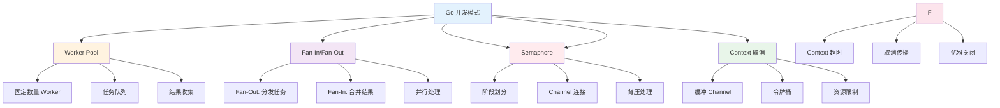
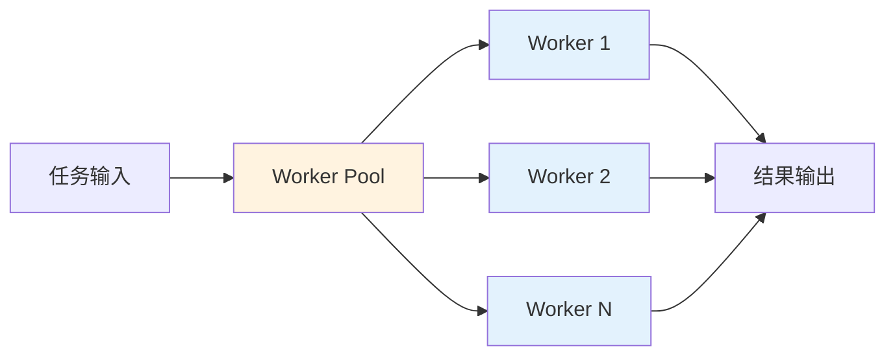
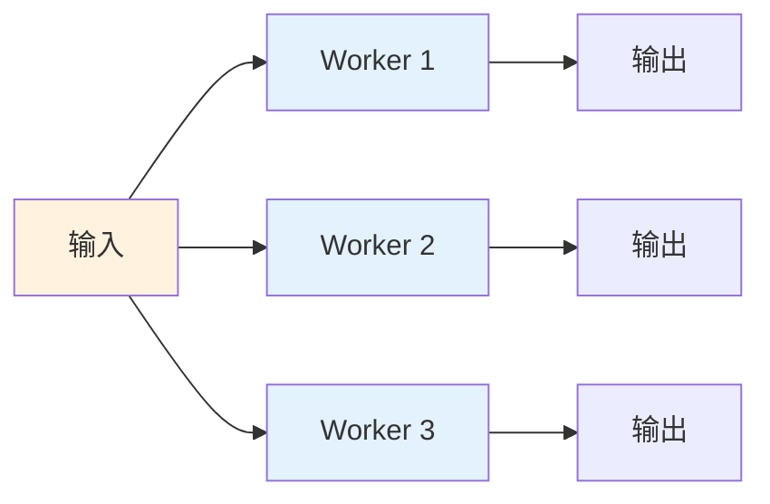
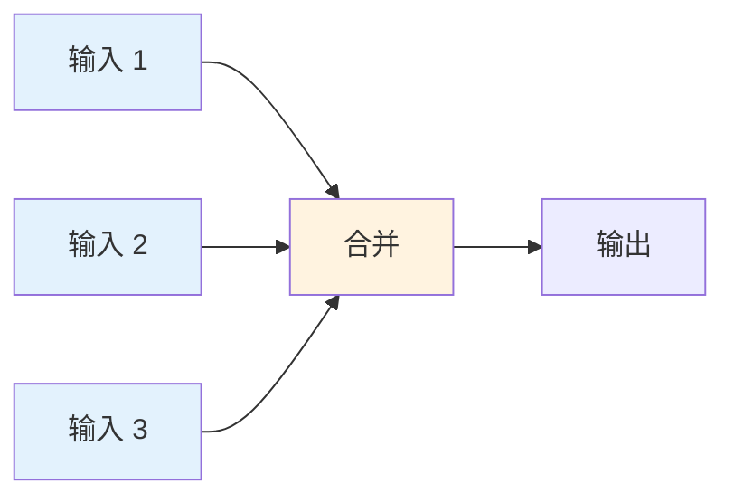
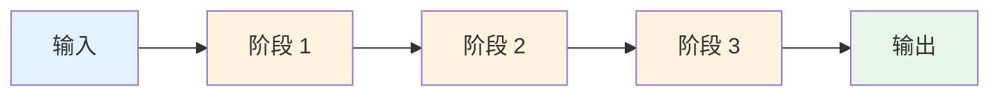

import { Badge } from "@rspress/core/theme";
import { Callout } from "@rspress/core/theme-original";

# Concurrency Patterns

<Badge text="核心内容" type="info" />

Go 语言的并发原语（goroutine 和 channel）简单而强大。掌握常见的并发模式对于编写高效、可靠的后端服务至关重要。

## 概览



## Worker Pool 模式

<Badge text="必掌握" type="danger" />

### 基础 Worker Pool



**基本实现：**

```go
package main

import (
	"fmt"
	"sync"
	"time"
)

// Worker 处理任务
func worker(id int, jobs <-chan int, results chan<- int, wg *sync.WaitGroup) {
	defer wg.Done()
	for job := range jobs {
		fmt.Printf("Worker %d processing job %d\n", id, job)
		// 模拟工作
		time.Sleep(100 * time.Millisecond)
		results <- job * 2
	}
}

func main() {
	// 创建通道
	jobs := make(chan int, 100)
	results := make(chan int, 100)

	// 启动 worker
	var wg sync.WaitGroup
	numWorkers := 3
	for i := 1; i <= numWorkers; i++ {
		wg.Add(1)
		go worker(i, jobs, results, &wg)
	}

	// 发送任务
	numJobs := 9
	for j := 1; j <= numJobs; j++ {
		jobs <- j
	}
	close(jobs)

	// 等待所有 worker 完成
	wg.Wait()
	close(results)

	// 收集结果
	for result := range results {
		fmt.Println("Result:", result)
	}
}
```

### 带 Context 的 Worker Pool

<Badge text="中级开发者" type="warning" />

```go
package main

import (
	"context"
	"fmt"
	"sync"
	"time"
)

type Job struct {
	ID   int
	Data string
}

type Result struct {
	JobID  int
	Output string
	Error  error
}

func workerWithCancel(
	ctx context.Context,
	id int,
	jobs <-chan Job,
	results chan<- Result,
	wg *sync.WaitGroup,
) {
	defer wg.Done()

	for {
		select {
		case <-ctx.Done():
			fmt.Printf("Worker %d: cancelled\n", id)
			return
		case job, ok := <-jobs:
			if !ok {
				fmt.Printf("Worker %d: jobs channel closed\n", id)
				return
			}

			// 处理任务
			output, err := processJob(job)
			results <- Result{
				JobID:  job.ID,
				Output: output,
				Error:  err,
			}
		}
	}
}

func processJob(job Job) (string, error) {
	// 模拟处理
	time.Sleep(100 * time.Millisecond)
	return fmt.Sprintf("Processed: %s", job.Data), nil
}

func main() {
	ctx, cancel := context.WithTimeout(context.Background(), 2*time.Second)
	defer cancel()

	jobs := make(chan Job, 10)
	results := make(chan Result, 10)

	// 启动 worker
	var wg sync.WaitGroup
	for i := 1; i <= 3; i++ {
		wg.Add(1)
		go workerWithCancel(ctx, i, jobs, results, &wg)
	}

	// 发送任务
	go func() {
		for i := 1; i <= 10; i++ {
			jobs <- Job{ID: i, Data: fmt.Sprintf("job-%d", i)}
		}
		close(jobs)
	}()

	// 等待所有 worker 完成
	go func() {
		wg.Wait()
		close(results)
	}()

	// 收集结果
	for result := range results {
		if result.Error != nil {
			fmt.Printf("Job %d failed: %v\n", result.JobID, result.Error)
		} else {
			fmt.Printf("Job %d: %s\n", result.JobID, result.Output)
		}
	}
}
```

### 动态 Worker Pool

```go
package main

import (
	"context"
	"fmt"
	"sync"
	"time"
)

type DynamicWorkerPool struct {
	ctx         context.Context
	cancel      context.CancelFunc
	jobs        chan Job
	results     chan Result
	maxWorkers  int
	activeWorkers atomic.Int32
	wg          sync.WaitGroup
}

func NewDynamicWorkerPool(ctx context.Context, maxWorkers int) *DynamicWorkerPool {
	childCtx, cancel := context.WithCancel(ctx)
	return &DynamicWorkerPool{
		ctx:        childCtx,
		cancel:     cancel,
		jobs:       make(chan Job, 100),
		results:    make(chan Result, 100),
		maxWorkers: maxWorkers,
	}
}

func (p *DynamicWorkerPool) Start() {
	for i := 0; i < p.maxWorkers; i++ {
		p.wg.Add(1)
		go p.worker(i)
	}
}

func (p *DynamicWorkerPool) worker(id int) {
	defer p.wg.Done()
	p.activeWorkers.Add(1)
	defer p.activeWorkers.Add(-1)

	for {
		select {
		case <-p.ctx.Done():
			return
		case job, ok := <-p.jobs:
			if !ok {
				return
			}
			output, err := processJob(job)
			p.results <- Result{
				JobID:  job.ID,
				Output: output,
				Error:  err,
			}
		}
	}
}

func (p *DynamicWorkerPool) Submit(job Job) {
	p.jobs <- job
}

func (p *DynamicWorkerPool) Results() <-chan Result {
	return p.results
}

func (p *DynamicWorkerPool) Stop() {
	close(p.jobs)
	p.wg.Wait()
	close(p.results)
	p.cancel()
}

func (p *DynamicWorkerPool) ActiveWorkers() int {
	return int(p.activeWorkers.Load())
}

func main() {
	ctx := context.Background()
	pool := NewDynamicWorkerPool(ctx, 5)
	pool.Start()

	// 提交任务
	for i := 1; i <= 20; i++ {
		pool.Submit(Job{ID: i, Data: fmt.Sprintf("job-%d", i)})
	}

	// 收集结果
	go func() {
		for result := range pool.Results() {
			fmt.Printf("Job %d: %s\n", result.JobID, result.Output)
		}
	}()

	time.Sleep(2 * time.Second)
	pool.Stop()
}
```

<Callout type="tip">
  <strong>Worker Pool 优势</strong>：
  - 限制并发数量，避免资源耗尽
  - 重用 goroutine，减少创建开销
  - 提供更好的控制和监控
  - 优雅的关闭和错误处理
</Callout>

## Fan-In / Fan-Out 模式

<Badge text="必掌握" type="danger" />

### Fan-Out: 分发任务



**实现：**

```go
package main

import (
	"fmt"
	"sync"
	"time"
)

// fanOut: 将输入分发给多个 worker
func fanOut(input <-chan int, numWorkers int) []<-chan int {
	outputs := make([]<-chan int, numWorkers)

	for i := 0; i < numWorkers; i++ {
		outputs[i] = worker(i, input)
	}

	return outputs
}

func worker(id int, input <-chan int) <-chan int {
	output := make(chan int)
	go func() {
		defer close(output)
		for data := range input {
			fmt.Printf("Worker %d processing %d\n", id, data)
			time.Sleep(100 * time.Millisecond)
			output <- data * 2
		}
	}()
	return output
}

func main() {
	input := make(chan int)

	// 启动生产者
	go func() {
		for i := 1; i <= 10; i++ {
			input <- i
		}
		close(input)
	}()

	// Fan-out 到多个 worker
	outputs := fanOut(input, 3)

	// 收集所有输出
	var wg sync.WaitGroup
	for _, ch := range outputs {
		wg.Add(1)
		go func(c <-chan int) {
			defer wg.Done()
			for result := range c {
				fmt.Println("Result:", result)
			}
		}(ch)
	}

	wg.Wait()
}
```

### Fan-In: 合并结果



**实现：**

```go
package main

import (
	"fmt"
	"sync"
	"time"
)

// fanIn: 合并多个通道到一个通道
func fanIn(inputs ...<-chan int) <-chan int {
	output := make(chan int)

	var wg sync.WaitGroup
	for _, ch := range inputs {
		wg.Add(1)
		go func(c <-chan int) {
			defer wg.Done()
			for data := range c {
				output <- data
			}
		}(ch)
	}

	go func() {
		wg.Wait()
		close(output)
	}()

	return output
}

func producer(id int, count int) <-chan int {
	output := make(chan int)
	go func() {
		defer close(output)
		for i := 1; i <= count; i++ {
			fmt.Printf("Producer %d: sending %d\n", id, i)
			output <- i
			time.Sleep(50 * time.Millisecond)
		}
	}()
	return output
}

func main() {
	// 创建多个生产者
	producer1 := producer(1, 5)
	producer2 := producer(2, 5)
	producer3 := producer(3, 5)

	// Fan-in 合并所有输入
	merged := fanIn(producer1, producer2, producer3)

	// 消费合并的结果
	for result := range merged {
		fmt.Println("Received:", result)
	}
}
```

### 完整的 Fan-Out / Fan-In 示例

<Badge text="高级开发者" type="danger" />

```go
package main

import (
	"context"
	"fmt"
	"sync"
	"time"
)

type Task struct {
	ID   int
	Data string
}

type Result struct {
	TaskID  int
	Output  string
	WorkerID int
}

// FanOutFanIn 实现完整的 fan-out/fan-in 模式
func FanOutFanIn(
	ctx context.Context,
	tasks <-chan Task,
	numWorkers int,
) <-chan Result {
	// Fan-out: 分发任务到多个 worker
	workerChs := make([]chan Task, numWorkers)
	for i := 0; i < numWorkers; i++ {
		workerChs[i] = make(chan Task)
		go worker(ctx, i, workerChs[i])
	}

	// 分发任务
	go func() {
		for task := range tasks {
			// 简单的轮询分发
			for _, ch := range workerChs {
				select {
				case ch <- task:
				case <-ctx.Done():
					return
				}
			}
		}
		// 关闭所有 worker 通道
		for _, ch := range workerChs {
			close(ch)
		}
	}()

	// Fan-in: 合并所有 worker 的结果
	resultCh := make(chan Result)
	var wg sync.WaitGroup
	for _, ch := range workerChs {
		wg.Add(1)
		go func(workerCh <-chan Task) {
			defer wg.Done()
			// 这里简化了，实际应该从 worker 接收结果
			// 可以使用额外的结果通道
		}(ch)
	}

	go func() {
		wg.Wait()
		close(resultCh)
	}()

	return resultCh
}

func worker(ctx context.Context, id int, tasks <-chan Task) {
	for task := range tasks {
		select {
		case <-ctx.Done():
			return
		default:
			// 处理任务
			fmt.Printf("Worker %d processing task %d\n", id, task.ID)
			time.Sleep(100 * time.Millisecond)
		}
	}
}

func main() {
	ctx := context.Background()
	tasks := make(chan Task)

	// 发送任务
	go func() {
		for i := 1; i <= 10; i++ {
			tasks <- Task{ID: i, Data: fmt.Sprintf("task-%d", i)}
		}
		close(tasks)
	}()

	// Fan-out/fan-in 处理
	results := FanOutFanIn(ctx, tasks, 3)

	// 收集结果
	for result := range results {
		fmt.Printf("Task %d completed by worker %d: %s\n",
			result.TaskID, result.WorkerID, result.Output)
	}
}
```

## Pipeline 模式

<Badge text="必掌握" type="danger" />

### 基础 Pipeline



**实现：**

```go
package main

import (
	"fmt"
)

// 阶段 1: 生成数字
func generate(numbers ...int) <-chan int {
	out := make(chan int)
	go func() {
		defer close(out)
		for _, n := range numbers {
			out <- n
		}
	}()
	return out
}

// 阶段 2: 平方
func square(in <-chan int) <-chan int {
	out := make(chan int)
	go func() {
		defer close(out)
		for n := range in {
			out <- n * n
		}
	}()
	return out
}

// 阶段 3: 加倍
func double(in <-chan int) <-chan int {
	out := make(chan int)
	go func() {
		defer close(out)
		for n := range in {
			out <- n * 2
		}
	}()
	return out
}

func main() {
	// 构建管道
	numbers := generate(1, 2, 3, 4, 5)
	squared := square(numbers)
	doubled := double(squared)

	// 消费结果
	for result := range doubled {
		fmt.Println("Result:", result)
	}
}
```

### 带 Context 的 Pipeline

<Badge text="中级开发者" type="warning" />

```go
package main

import (
	"context"
	"fmt"
	"time"
)

func generateWithContext(
	ctx context.Context,
	numbers ...int,
) <-chan int {
	out := make(chan int)
	go func() {
		defer close(out)
		for _, n := range numbers {
			select {
			case out <- n:
			case <-ctx.Done():
				return
			}
		}
	}()
	return out
}

func squareWithContext(
	ctx context.Context,
	in <-chan int,
) <-chan int {
	out := make(chan int)
	go func() {
		defer close(out)
		for n := range in {
			select {
			case out <- n * n:
			case <-ctx.Done():
				return
			}
		}
	}()
	return out
}

func main() {
	ctx, cancel := context.WithTimeout(context.Background(), 1*time.Second)
	defer cancel()

	numbers := generateWithContext(ctx, 1, 2, 3, 4, 5)
	squared := squareWithContext(ctx, numbers)

	for result := range squared {
		fmt.Println("Result:", result)
	}
}
```

### 实际应用：数据处理 Pipeline

<Badge text="高级开发者" type="danger" />

```go
package main

import (
	"context"
	"encoding/csv"
	"fmt"
	"io"
	"log"
	"os"
	"strconv"
	"time"
)

type DataPoint struct {
	Timestamp time.Time
	Value     float64
}

// 阶段 1: 读取 CSV 数据
func readCSV(ctx context.Context, filename string) <-chan []string {
	out := make(chan []string)
	go func() {
		defer close(out)
		file, err := os.Open(filename)
		if err != nil {
			log.Printf("Error opening file: %v", err)
			return
		}
		defer file.Close()

		reader := csv.NewReader(file)
		for {
			record, err := reader.Read()
			if err == io.EOF {
				break
			}
			if err != nil {
				log.Printf("Error reading CSV: %v", err)
				return
			}

			select {
			case out <- record:
			case <-ctx.Done():
				return
			}
		}
	}()
	return out
}

// 阶段 2: 解析数据
func parseData(ctx context.Context, in <-chan []string) <-chan DataPoint {
	out := make(chan DataPoint)
	go func() {
		defer close(out)
		for record := range in {
			if len(record) < 2 {
				continue
			}

			timestamp, err := time.Parse(time.RFC3339, record[0])
			if err != nil {
				log.Printf("Error parsing timestamp: %v", err)
				continue
			}

			value, err := strconv.ParseFloat(record[1], 64)
			if err != nil {
				log.Printf("Error parsing value: %v", err)
				continue
			}

			dataPoint := DataPoint{
				Timestamp: timestamp,
				Value:     value,
			}

			select {
			case out <- dataPoint:
			case <-ctx.Done():
				return
			}
		}
	}()
	return out
}

// 阶段 3: 过滤数据
func filterData(
	ctx context.Context,
	in <-chan DataPoint,
	minValue float64,
) <-chan DataPoint {
	out := make(chan DataPoint)
	go func() {
		defer close(out)
		for data := range in {
			if data.Value >= minValue {
				select {
				case out <- data:
				case <-ctx.Done():
					return
				}
			}
		}
	}()
	return out
}

// 阶段 4: 聚合数据
func aggregateData(
	ctx context.Context,
	in <-chan DataPoint,
	windowSize time.Duration,
) <-chan float64 {
	out := make(chan float64)
	go func() {
		defer close(out)

		var window []DataPoint
		var lastWindowStart time.Time

		for data := range in {
			if lastWindowStart.IsZero() {
				lastWindowStart = data.Timestamp
			}

			window = append(window, data)

			// 检查窗口是否已满
			if data.Timestamp.Sub(lastWindowStart) >= windowSize {
				// 计算平均值
				sum := 0.0
				for _, dp := range window {
					sum += dp.Value
				}
				avg := sum / float64(len(window))

				select {
				case out <- avg:
				case <-ctx.Done():
					return
				}

				// 重置窗口
				window = nil
				lastWindowStart = time.Time{}
			}
		}
	}()
	return out
}

func main() {
	ctx := context.Background()

	// 构建处理管道
	records := readCSV(ctx, "data.csv")
	parsed := parseData(ctx, records)
	filtered := filterData(ctx, parsed, 10.0)
	aggregated := aggregateData(ctx, filtered, time.Minute)

	// 消费结果
	for avg := range aggregated {
		fmt.Printf("Average: %.2f\n", avg)
	}
}
```

<Callout type="info">
  <strong>Pipeline 优势</strong>：
  - 模块化：每个阶段独立可测试
  - 并发：各阶段可以并发执行
  - 背压：自动处理慢速消费者
  - 可扩展：容易添加新阶段
</Callout>

## Semaphore 模式

<Badge text="常用模式" type="warning" />

### 基于 Channel 的 Semaphore

```go
package main

import (
	"context"
	"fmt"
	"sync"
	"time"
)

// Semaphore 使用缓冲 channel 实现
type Semaphore struct {
	ch chan struct{}
}

func NewSemaphore(size int) *Semaphore {
	return &Semaphore{
		ch: make(chan struct{}, size),
	}
}

func (s *Semaphore) Acquire() {
	s.ch <- struct{}{}
}

func (s *Semaphore) Release() {
	<-s.ch
}

func (s *Semaphore) TryAcquire(timeout time.Duration) bool {
	ctx, cancel := context.WithTimeout(context.Background(), timeout)
	defer cancel()

	select {
	case s.ch <- struct{}{}:
		return true
	case <-ctx.Done():
		return false
	}
}

func main() {
	sem := NewSemaphore(3) // 最多 3 个并发

	var wg sync.WaitGroup
	for i := 1; i <= 10; i++ {
		wg.Add(1)
		go func(id int) {
			defer wg.Done()

			sem.Acquire()
			defer sem.Release()

			fmt.Printf("Goroutine %d started\n", id)
			time.Sleep(500 * time.Millisecond)
			fmt.Printf("Goroutine %d completed\n", id)
		}(i)
	}

	wg.Wait()
}
```

### 加权 Semaphore

<Badge text="高级开发者" type="danger" />

```go
package main

import (
	"context"
	"fmt"
	"sync"
	"time"
)

type WeightedSemaphore struct {
	total     int64
	available int64
	waiters   []chan struct{}
	mu        sync.Mutex
}

func NewWeightedSemaphore(total int64) *WeightedSemaphore {
	return &WeightedSemaphore{
		total:     total,
		available: total,
	}
}

func (ws *WeightedSemaphore) Acquire(n int64) bool {
	ws.mu.Lock()

	// 如果当前资源足够
	if ws.available >= n {
		ws.available -= n
		ws.mu.Unlock()
		return true
	}

	// 资源不足，加入等待队列
	ch := make(chan struct{})
	ws.waiters = append(ws.waiters, ch)
	ws.mu.Unlock()

	// 等待资源
	<-ch
	return true
}

func (ws *WeightedSemaphore) Release(n int64) {
	ws.mu.Lock()
	defer ws.mu.Unlock()

	ws.available += n

	// 唤醒等待的 goroutine
	for len(ws.waiters) > 0 && ws.available > 0 {
		next := ws.waiters[0]
		ws.waiters = ws.waiters[1:]

		// 检查是否有足够资源
		// 这里简化处理，实际应该记录每个 waiter 需要的资源
		if ws.available > 0 {
			close(next)
			ws.available--
		} else {
			// 放回队列
			ws.waiters = append([]chan struct{}{next}, ws.waiters...)
			break
		}
	}
}

func main() {
	ws := NewWeightedSemaphore(10)

	// 不同的任务需要不同数量的资源
	tasks := []struct {
		Name   string
		Weight int64
	}{
		{"Small", 2},
		{"Medium", 5},
		{"Large", 8},
		{"Small", 2},
		{"Medium", 5},
	}

	var wg sync.WaitGroup
	for _, task := range tasks {
		wg.Add(1)
		go func(t struct{ Name string; Weight int64 }) {
			defer wg.Done()

			if ws.Acquire(t.Weight) {
				defer ws.Release(t.Weight)

				fmt.Printf("%s started (needs %d)\n", t.Name, t.Weight)
				time.Sleep(time.Second)
				fmt.Printf("%s completed\n", t.Name)
			} else {
				fmt.Printf("%s skipped (not enough resources)\n", t.Name)
			}
		}(task)
	}

	wg.Wait()
}
```

## Context 取消模式

<Badge text="必掌握" type="danger" />

### 基础 Context 取消

```go
package main

import (
	"context"
	"fmt"
	"time"
)

func worker(ctx context.Context, id int) {
	for {
		select {
		case <-ctx.Done():
			fmt.Printf("Worker %d: %s\n", id, ctx.Err())
			return
		default:
			fmt.Printf("Worker %d: working...\n", id)
			time.Sleep(500 * time.Millisecond)
		}
	}
}

func main() {
	ctx, cancel := context.WithCancel(context.Background())

	// 启动多个 worker
	for i := 1; i <= 3; i++ {
		go worker(ctx, i)
	}

	// 运行 2 秒后取消
	time.Sleep(2 * time.Second)
	cancel()

	// 等待所有 worker 退出
	time.Sleep(time.Second)
	fmt.Println("All workers stopped")
}
```

### 超时取消

```go
package main

import (
	"context"
	"fmt"
	"time"
)

func operationWithTimeout(ctx context.Context) error {
	ctx, cancel := context.WithTimeout(ctx, 2*time.Second)
	defer cancel()

	result := make(chan string)

	// 启动耗时操作
	go func() {
		// 模拟耗时操作
		time.Sleep(3 * time.Second)
		result <- "completed"
	}()

	select {
	case res := <-result:
		fmt.Println("Operation:", res)
		return nil
	case <-ctx.Done():
		return fmt.Errorf("operation timed out: %w", ctx.Err())
	}
}

func main() {
	ctx := context.Background()
	err := operationWithTimeout(ctx)
	if err != nil {
		fmt.Println("Error:", err)
	}
}
```

### 级联取消

<Badge text="高级开发者" type="danger" />

```go
package main

import (
	"context"
	"fmt"
	"sync"
	"time"
)

type Service struct {
	ctx    context.Context
	cancel context.CancelFunc
	wg     sync.WaitGroup
}

func NewService(parentCtx context.Context) *Service {
	ctx, cancel := context.WithCancel(parentCtx)
	return &Service{
		ctx:    ctx,
		cancel: cancel,
	}
}

func (s *Service) Start() {
	// 启动多个子服务
	s.wg.Add(3)
	go s.databaseWorker()
	go s.cacheWorker()
	go s.apiWorker()
}

func (s *Service) databaseWorker() {
	defer s.wg.Done()
	ticker := time.NewTicker(time.Second)
	defer ticker.Stop()

	for {
		select {
		case <-s.ctx.Done():
			fmt.Println("Database worker: shutting down")
			return
		case <-ticker.C:
			fmt.Println("Database worker: processing")
		}
	}
}

func (s *Service) cacheWorker() {
	defer s.wg.Done()
	ticker := time.NewTicker(time.Second)
	defer ticker.Stop()

	for {
		select {
		case <-s.ctx.Done():
			fmt.Println("Cache worker: shutting down")
			return
		case <-ticker.C:
			fmt.Println("Cache worker: processing")
		}
	}
}

func (s *Service) apiWorker() {
	defer s.wg.Done()
	ticker := time.NewTicker(time.Second)
	defer ticker.Stop()

	for {
		select {
		case <-s.ctx.Done():
			fmt.Println("API worker: shutting down")
			return
		case <-ticker.C:
			fmt.Println("API worker: processing")
		}
	}
}

func (s *Service) Stop() {
	s.cancel()  // 取消所有子服务
	s.wg.Wait() // 等待所有子服务退出
	fmt.Println("Service: all workers stopped")
}

func main() {
	ctx := context.Background()
	service := NewService(ctx)
	service.Start()

	// 运行 3 秒
	time.Sleep(3 * time.Second)
	service.Stop()
}
```

## 常见陷阱和错误

<Badge text="所有开发者" type="info" />

### 陷阱 1：Goroutine 泄漏

```go
// ❌ 错误：goroutine 泄漏
func leak() {
	ch := make(chan int)
	go func() {
		val := <-ch // 永远阻塞
		fmt.Println("Received:", val)
	}()
	// goroutine 泄漏
}

// ✅ 正确：确保 goroutine 能退出
func noLeak() {
	ch := make(chan int)
	done := make(chan struct{})

	go func() {
		defer close(done)
		select {
		case val := <-ch:
			fmt.Println("Received:", val)
		case <-time.After(time.Second):
			fmt.Println("Timeout")
		}
	}()

	<-done
}
```

### 陷阱 2：忘记关闭 Channel

```go
// ❌ 错误：消费者死锁
func producer(ch chan int) {
	for i := 0; i < 10; i++ {
		ch <- i
	}
	// 忘记关闭
}

// ✅ 正确：使用 defer 确保关闭
func producer(ch chan int) {
	defer close(ch)
	for i := 0; i < 10; i++ {
		ch <- i
	}
}
```

### 陷阱 3：向已关闭的 Channel 发送

```go
// ❌ 错误：panic
func example() {
	ch := make(chan int, 1)
	close(ch)
	ch <- 1 // panic
}

// ✅ 正确：使用 select
func example() {
	ch := make(chan int, 1)
	close(ch)

	select {
	case ch <- 1:
		fmt.Println("Sent")
	default:
		fmt.Println("Channel closed")
	}
}
```

### 陷阱 4：循环中使用 defer

```go
// ❌ 错误：资源累积
func processFiles(files []string) error {
	for _, file := range files {
		f, err := os.Open(file)
		if err != nil {
			return err
		}
		defer f.Close() // 循环结束才关闭
		// 处理文件
	}
	return nil
}

// ✅ 正确：使用匿名函数
func processFiles(files []string) error {
	for _, file := range files {
		err := func() error {
			f, err := os.Open(file)
			if err != nil {
				return err
			}
			defer f.Close() // 函数结束立即关闭
			// 处理文件
			return nil
		}()
		if err != nil {
			return err
		}
	}
	return nil
}
```

## 性能优化技巧

<Badge text="高级开发者" type="danger" />

### 技巧 1：使用 sync.Pool

```go
package main

import (
	"bytes"
	"sync"
)

var bufferPool = sync.Pool{
	New: func() interface{} {
		return new(bytes.Buffer)
	},
}

func processData(data []byte) []byte {
	buf := bufferPool.Get().(*bytes.Buffer)
	defer func() {
		buf.Reset()
		bufferPool.Put(buf)
	}()

	buf.Write(data)
	return buf.Bytes()
}
```

### 技巧 2：减少 Channel 操作

```go
// ❌ 频繁的小批量发送
func processItems(items []Item) {
	ch := make(chan Item, 1)
	go func() {
		for _, item := range items {
			ch <- item // 频繁操作
		}
		close(ch)
	}()
}

// ✅ 批量发送
func processItems(items []Item) {
	ch := make(chan []Item, 1)
	go func() {
		batch := make([]Item, 0, 100)
		for _, item := range items {
			batch = append(batch, item)
			if len(batch) >= 100 {
				ch <- batch
				batch = make([]Item, 0, 100)
			}
		}
		if len(batch) > 0 {
			ch <- batch
		}
		close(ch)
	}()
}
```

### 技巧 3：使用原子操作

```go
// ❌ 使用锁
type Counter struct {
	mu    sync.Mutex
	count int64
}

func (c *Counter) Increment() {
	c.mu.Lock()
	c.count++
	c.mu.Unlock()
}

// ✅ 使用原子操作
type Counter struct {
	count atomic.Int64
}

func (c *Counter) Increment() {
	c.count.Add(1)
}
```

## 检查清单

<Badge text="提交前检查" type="info" />

在提交并发代码前，确保：

- [ ] 使用 `-race` 检测，无数据竞争
- [ ] 所有 goroutine 都能正确退出
- [ ] Channel 正确关闭（生产者）
- [ ] 使用 Context 控制生命周期
- [ ] 限制了并发数量
- [ ] 处理了背压问题
- [ ] 考虑了资源清理
- [ ] 编写了并发测试
- [ ] 使用 pprof 分析了性能

## 总结

### 初级开发者要点

<Badge text="初级" type="success" />

- **使用 Worker Pool** 限制并发
- **正确关闭 Channel**
- **使用 Context** 控制 goroutine 生命周期
- **避免 Goroutine 泄漏**

### 中级开发者要点

<Badge text="中级" type="warning" />

- **实现 Pipeline** 进行数据处理
- **使用 Fan-Out/Fan-In** 提升吞吐量
- **使用 Semaphore** 控制资源访问
- **处理背压**防止资源耗尽

### 高级开发者要点

<Badge text="高级" type="danger" />

- **组合多种模式**解决复杂问题
- **性能优化**（sync.Pool、原子操作）
- **级联取消**管理服务生命周期
- **监控和调试**并发程序

<Callout type="success">
  <strong>核心理念</strong>：Go 并发编程的核心是通过通信共享内存，而非通过共享内存来通信。合理使用 channel 和 goroutine 可以编写出简洁、高效的并发程序。
</Callout>

### 下一步

- [← 错误处理模式](./error-patterns.mdx)
- [← 代码风格](./code-style.mdx)
- [测试策略 →](./testing-strategies.mdx)

### 参考资料

- [Go Concurrency Patterns](https://go.dev/blog/codelab-share)
- [Go by Example: Channels](https://gobyexample.com/channels)
- [Context package documentation](https://pkg.go.dev/context)
- [The Go Blog: Share Memory By Communicating](https://go.dev/blog/codelab-share)
