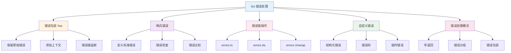
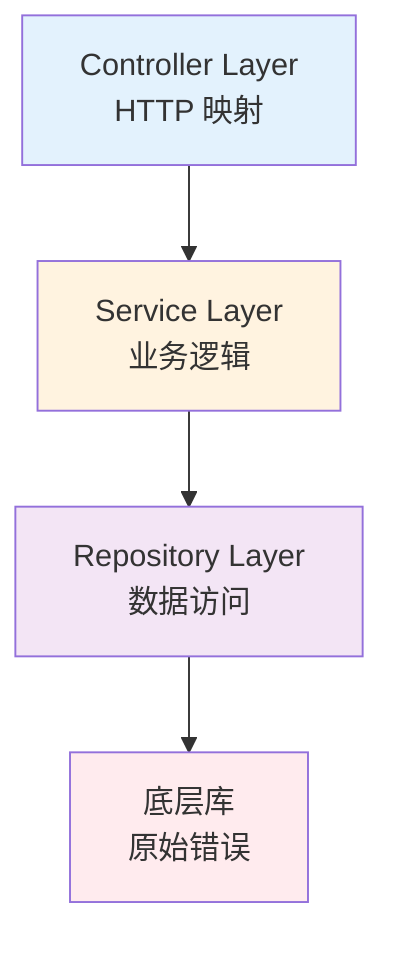

import { Badge } from "@rspress/core/theme";
import { Callout } from "@rspress/core/theme-original";

# Error Handling Patterns

<Badge text="核心内容" type="info" />

Go 1.13+ 引入了强大的错误处理机制，包括错误包装、哨兵错误和错误链操作。掌握这些模式对于编写健壮的 Go 应用程序至关重要。

## 概览



## 错误包装 - Error Wrapping

<Badge text="Go 1.13+" type="success" />

### 使用 %w 包装错误

**基础用法：**

```go
// ✅ 使用 %w 保留原始错误
func readFile(path string) ([]byte, error) {
	data, err := os.ReadFile(path)
	if err != nil {
		return nil, fmt.Errorf("read file %s: %w", path, err)
	}
	return data, nil
}

// ❌ 使用 %v 丢失原始错误类型
func readFile(path string) ([]byte, error) {
	data, err := os.ReadFile(path)
	if err != nil {
		return nil, fmt.Errorf("read file %s: %v", path, err)
	}
	return data, nil
}
```

<Callout type="warning">
  <strong>关键区别</strong>：
  - <code>%w</code>：保留原始错误，可以使用 errors.Is() 和 errors.As()
  - <code>%v</code>：只保留错误信息，丢失原始错误类型
</Callout>

### 多层错误包装

```go
// ✅ 构建错误链
func loadConfig(path string) (*Config, error) {
	data, err := readFile(path)
	if err != nil {
		return nil, fmt.Errorf("load config: %w", err)
	}

	config, err := parseConfig(data)
	if err != nil {
		return nil, fmt.Errorf("parse config: %w", err)
	}

	return config, nil
}

func main() {
	_, err := loadConfig("config.yaml")
	if err != nil {
		// 错误链：load config → read file → *os.PathError
		fmt.Printf("Error: %v\n", err)
	}
}
```

### 错误包装最佳实践

<Badge text="中级开发者" type="warning" />

**添加有意义上下文：**

```go
// ✅ 添加有用的上下文信息
func (s *UserService) GetUser(id int) (*User, error) {
	user, err := s.repo.Find(id)
	if err != nil {
		return nil, fmt.Errorf("find user %d: %w", id, err)
	}
	return user, nil
}

// ❌ 避免冗余的前缀
func (s *UserService) GetUser(id int) (*User, error) {
	user, err := s.repo.Find(id)
	if err != nil {
		return nil, fmt.Errorf("failed to find user: %w", err)
	}
	return user, nil
}
```

**避免重复包装：**

```go
// ✅ 直接传递原始错误
func processFile(path string) error {
	if err := validateFile(path); err != nil {
		return err // 直接返回，不添加冗余上下文
	}
	return nil
}

// ❌ 过度包装
func processFile(path string) error {
	if err := validateFile(path); err != nil {
		return fmt.Errorf("validate failed: %w", err)
	}
	return nil
}
```

## 哨兵错误 - Sentinel Errors

<Badge text="Go 1.13+" type="success" />

### 定义哨兵错误

```go
// ✅ 定义包级哨兵错误
package user

var (
	ErrUserNotFound = errors.New("user not found")
	ErrInvalidInput = errors.New("invalid input")
	ErrDuplicate    = errors.New("user already exists")
)

// 使用哨兵错误
func (r *UserRepository) Find(id int) (*User, error) {
	var user User
	err := r.db.First(&user, id).Error
	if err != nil {
		if errors.Is(err, gorm.ErrRecordNotFound) {
			return nil, ErrUserNotFound
		}
		return nil, err
	}
	return &user, nil
}
```

### 检查哨兵错误

```go
// ✅ 使用 errors.Is() 检查
func (s *UserService) GetUser(id int) (*User, error) {
	user, err := s.repo.Find(id)
	if err != nil {
		if errors.Is(err, user.ErrUserNotFound) {
			// 特定处理：用户不存在
			return nil, fmt.Errorf("get user %d: %w", id, err)
		}
		// 其他错误
		return nil, fmt.Errorf("find user failed: %w", err)
	}
	return user, nil
}
```

<Callout type="tip">
  <strong>哨兵错误 vs. 自定义错误类型</strong>：
  - <strong>哨兵错误</strong>：用于简单的、频繁出现的错误条件
  - <strong>自定义错误类型</strong>：需要携带额外信息时使用
</Callout>

### 哨兵错误最佳实践

```go
// ✅ 使用 Var 定义可比较的错误
package errors

import (
	"errors"
	"fmt"
)

var (
	ErrNotFound     = errors.New("not found")
	ErrUnauthorized = errors.New("unauthorized")
	ErrForbidden    = errors.New("forbidden")
)

// ✅ 在 API 层转换哨兵错误
func (h *Handler) GetUser(w http.ResponseWriter, r *http.Request) {
	user, err := h.service.GetUser(id)
	if err != nil {
		switch {
		case errors.Is(err, user.ErrUserNotFound):
			http.Error(w, "User not found", http.StatusNotFound)
		case errors.Is(err, user.ErrInvalidInput):
			http.Error(w, "Invalid input", http.StatusBadRequest)
		default:
			http.Error(w, "Internal error", http.StatusInternalServerError)
		}
		return
	}

	json.NewEncoder(w).Encode(user)
}
```

## 错误链操作 - Error Chain Operations

<Badge text="Go 1.13+" type="success" />

### errors.Is() - 检查错误链

```go
// ✅ 检查错误链中是否包含特定错误
func processFile(path string) error {
	_, err := os.ReadFile(path)
	if err != nil {
		if errors.Is(err, os.ErrNotExist) {
			return fmt.Errorf("file not found: %s", path)
		}
		return fmt.Errorf("read file: %w", err)
	}
	return nil
}

// ✅ 多重检查
func handleRequest(req *Request) error {
	err := processRequest(req)
	if err != nil {
		switch {
		case errors.Is(err, ErrNotFound):
			return fmt.Errorf("resource not found")
		case errors.Is(err, ErrUnauthorized):
			return fmt.Errorf("unauthorized access")
		case errors.Is(err, context.DeadlineExceeded):
			return fmt.Errorf("request timeout")
		default:
			return err
		}
	}
	return nil
}
```

### errors.As() - 提取错误类型

```go
// ✅ 提取特定错误类型
type ValidationError struct {
	Field   string
	Message string
}

func (e *ValidationError) Error() string {
	return fmt.Sprintf("validation error: %s - %s", e.Field, e.Message)
}

func (e *ValidationError) Unwrap() error {
	return nil
}

// 使用 errors.As() 提取
func createUser(req CreateUserRequest) error {
	if err := validateRequest(req); err != nil {
		var validationErr *ValidationError
		if errors.As(err, &validationErr) {
			return fmt.Errorf("validation failed: %s", validationErr.Field)
		}
		return err
	}
	return nil
}
```

**实际示例：**

```go
// ✅ 处理 PathError
func readConfig(path string) ([]byte, error) {
	data, err := os.ReadFile(path)
	if err != nil {
		var pathErr *os.PathError
		if errors.As(err, &pathErr) {
			return nil, fmt.Errorf("cannot read %s: %s", pathErr.Path, pathErr.Err)
		}
		return nil, err
	}
	return data, nil
}
```

### errors.Unwrap() - 解包错误

```go
// ✅ 手动解包错误
func process() error {
	err := someOperation()
	if err != nil {
		// 获取下一个包装的错误
		unwrapped := errors.Unwrap(err)
		if unwrapped != nil {
			fmt.Printf("Original error: %v\n", unwrapped)
		}
		return err
	}
	return nil
}

// ✅ 遍历整个错误链
func printErrorChain(err error) {
	fmt.Printf("Error chain:\n")
	for err != nil {
		fmt.Printf("  - %v\n", err)
		err = errors.Unwrap(err)
	}
}
```

## 自定义错误类型

<Badge text="高级开发者" type="danger" />

### 基础自定义错误

```go
// ✅ 定义错误类型
type AppError struct {
	Code    int
	Message string
	Err     error
}

func (e *AppError) Error() string {
	if e.Err != nil {
		return fmt.Sprintf("[%d] %s: %v", e.Code, e.Message, e.Err)
	}
	return fmt.Sprintf("[%d] %s", e.Code, e.Message)
}

func (e *AppError) Unwrap() error {
	return e.Err
}

// 使用自定义错误
func (s *UserService) CreateUser(req CreateUserRequest) error {
	if err := validateEmail(req.Email); err != nil {
		return &AppError{
			Code:    40001,
			Message: "invalid email",
			Err:     err,
		}
	}
	return nil
}
```

### 实现错误接口

```go
// ✅ 实现多个错误接口
type TimeoutError struct {
	Operation string
	Timeout   time.Duration
}

func (e *TimeoutError) Error() string {
	return fmt.Sprintf("%s timed out after %v", e.Operation, e.Timeout)
}

func (e *TimeoutError) Unwrap() error {
	return context.DeadlineExceeded
}

func (e *TimeoutError) Timeout() bool {
	return true
}

// 使用接口检查
func isTimeout(err error) bool {
	var timeoutErr interface{ Timeout() bool }
	return errors.As(err, &timeoutErr) && timeoutErr.Timeout()
}
```

### 结构化错误

```go
// ✅ 结构化错误（包含详细信息）
type ValidationError struct {
	Field   string
	Value   interface{}
	Message string
}

func (e *ValidationError) Error() string {
	return fmt.Sprintf("validation failed for field '%s': %s", e.Field, e.Message)
}

// JSON 序列化支持
func (e *ValidationError) MarshalJSON() ([]byte, error) {
	return json.Marshal(map[string]interface{}{
		"field":   e.Field,
		"value":   e.Value,
		"message": e.Message,
	})
}
```

## 错误处理模式

<Badge text="高级开发者" type="danger" />

### 模式 1：早返回（Early Return）

```go
// ✅ 推荐：清晰的线性流程
func processUser(id int, email string) error {
	// 守卫子句：先检查所有错误条件
	if id <= 0 {
		return fmt.Errorf("invalid id: %d", id)
	}

	if email == "" {
		return errors.New("email required")
	}

	if !isValidEmail(email) {
		return errors.New("invalid email format")
	}

	// 主要逻辑：全部检查通过后执行
	return saveUser(id, email)
}

// ❌ 不推荐：嵌套过深
func processUser(id int, email string) error {
	if id > 0 {
		if email != "" {
			if isValidEmail(email) {
				return saveUser(id, email)
			} else {
				return errors.New("invalid email format")
			}
		} else {
			return errors.New("email required")
		}
	} else {
		return fmt.Errorf("invalid id: %d", id)
	}
}
```

### 模式 2：错误分组（Error Groups）

<Badge text="Go 1.20+" type="success" />

```go
// ✅ 使用 errors.Join 组合多个错误
func processFiles(files []string) error {
	var errs []error

	for _, file := range files {
		if err := processFile(file); err != nil {
			errs = append(errs, err)
		}
	}

	if len(errs) > 0 {
		return errors.Join(errs...)
	}
	return nil
}

// ✅ 检查组合错误
func main() {
	err := processFiles([]string{"a.txt", "b.txt", "c.txt"})
	if err != nil {
		// errors.Join 返回的错误支持 Unwrap() []error
		// 可以使用 errors.As() 提取所有错误
		var joinErr interface{ Unwrap() []error }
		if errors.As(err, &joinErr) {
			for _, e := range joinErr.Unwrap() {
				fmt.Printf("Error: %v\n", e)
			}
		}
	}
}
```

### 模式 3：错误上下文（Error Context）

```go
// ✅ 添加操作上下文
func (s *UserService) UpdateUser(id int, req UpdateUserRequest) error {
	user, err := s.repo.Find(id)
	if err != nil {
		return fmt.Errorf("find user %d: %w", id, err)
	}

	if err := user.Update(req); err != nil {
		return fmt.Errorf("update user data: %w", err)
	}

	if err := s.repo.Save(user); err != nil {
		return fmt.Errorf("save user %d: %w", id, err)
	}

	return nil
}
```

### 模式 4：错误恢复（Error Recovery）

```go
// ✅ 使用 defer + recover
func safeOperation() (err error) {
	defer func() {
		if r := recover(); r != nil {
			err = fmt.Errorf("panic recovered: %v", r)
		}
	}()

	// 可能 panic 的操作
	dangerousOperation()
	return nil
}

// ✅ 在 HTTP 处理器中使用
func (h *Handler) ServeHTTP(w http.ResponseWriter, r *http.Request) {
	defer func() {
		if r := recover(); r != nil {
			log.Printf("panic recovered: %v", r)
			http.Error(w, "Internal server error", http.StatusInternalServerError)
		}
	}()

	// 正常处理逻辑
	h.handleRequest(w, r)
}
```

## 分层错误处理

<Badge text="架构师" type="danger" />



### Repository 层：返回原始错误

```go
// ✅ Repository 层
func (r *UserRepository) Find(id int) (*User, error) {
	var user User
	err := r.db.First(&user, id).Error
	if err != nil {
		if errors.Is(err, gorm.ErrRecordNotFound) {
			return nil, user.ErrUserNotFound
		}
		return nil, fmt.Errorf("database query failed: %w", err)
	}
	return &user, nil
}
```

### Service 层：添加业务上下文

```go
// ✅ Service 层
func (s *UserService) GetUser(ctx context.Context, id int) (*User, error) {
	if id <= 0 {
		return nil, fmt.Errorf("%w: invalid user id", user.ErrInvalidInput)
	}

	user, err := s.repo.Find(id)
	if err != nil {
		if errors.Is(err, user.ErrUserNotFound) {
			return nil, err
		}
		return nil, fmt.Errorf("get user %d failed: %w", id, err)
	}

	return user, nil
}
```

### Controller 层：HTTP 状态码映射

```go
// ✅ Controller 层
func (h *Handler) GetUser(w http.ResponseWriter, r *http.Request) {
	id := getID(r)

	user, err := h.service.GetUser(r.Context(), id)
	if err != nil {
		switch {
		case errors.Is(err, user.ErrUserNotFound):
			writeJSON(w, http.StatusNotFound, map[string]string{
				"error": "User not found",
			})
		case errors.Is(err, user.ErrInvalidInput):
			writeJSON(w, http.StatusBadRequest, map[string]string{
				"error": "Invalid user ID",
			})
		default:
			log.Error("get user failed", "error", err)
			writeJSON(w, http.StatusInternalServerError, map[string]string{
				"error": "Internal server error",
			})
		}
		return
	}

	writeJSON(w, http.StatusOK, user)
}
```

## 常见陷阱和错误

<Badge text="所有开发者" type="info" />

### 陷阱 1：错误链断裂

```go
// ❌ 错误：使用 %v 断裂错误链
func readFile(path string) error {
	data, err := os.ReadFile(path)
	if err != nil {
		return fmt.Errorf("read file: %v", err) // 丢失原始错误
	}
	return nil
}

// ✅ 正确：使用 %w 保留错误链
func readFile(path string) error {
	data, err := os.ReadFile(path)
	if err != nil {
		return fmt.Errorf("read file: %w", err)
	}
	return nil
}
```

### 陷阱 2：nil 接口问题

```go
// ❌ 错误：返回 nil 接口但包含非 nil 错误
func returnsError() error {
	var p *MyError = nil
	return p // 返回非 nil 的接口！
}

// ✅ 正确：显式返回 nil
func returnsError() error {
	var p *MyError = nil
	if p == nil {
		return nil
	}
	return p
}
```

### 陷阱 3：忽略错误

```go
// ❌ 错误：忽略错误
file, _ := os.Open("config.json")

// ✅ 正确：总是检查错误
file, err := os.Open("config.json")
if err != nil {
	return fmt.Errorf("open config: %w", err)
}
defer file.Close()
```

### 陷阱 4：循环中的 defer

```go
// ❌ 错误：资源泄漏
func processFiles(files []string) error {
	for _, file := range files {
		f, _ := os.Open(file)
		defer f.Close() // 函数结束时才关闭
		// 处理文件
	}
	return nil
	// 所有文件都在这里才关闭！
}

// ✅ 正确：使用匿名函数
func processFiles(files []string) error {
	for _, file := range files {
		if err := func() error {
			f, err := os.Open(file)
			if err != nil {
				return err
			}
			defer f.Close() // 每次迭代结束关闭
			// 处理文件
			return nil
		}(); err != nil {
			return err
		}
	}
	return nil
}
```

## 错误处理最佳实践清单

<Badge text="提交前检查" type="info" />

在提交代码前，确保：

- [ ] 所有错误都被检查和处理
- [ ] 使用 `%w` 而不是 `%v` 包装错误
- [ ] 添加有意义的上下文信息
- [ ] 使用 `errors.Is()` 检查哨兵错误
- [ ] 使用 `errors.As()` 提取错误类型
- [ ] 避免重复包装错误
- [ ] 在 API 层转换错误为 HTTP 状态码
- [ ] 记录错误日志（包含上下文）
- [ ] 文档化可能的错误

## 测试错误处理

```go
// ✅ 测试错误类型
func TestUserNotFound(t *testing.T) {
	repo := NewMockRepository()
	service := NewService(repo)

	_, err := service.GetUser(999)

	if err == nil {
		t.Fatal("expected error, got nil")
	}

	if !errors.Is(err, ErrUserNotFound) {
		t.Errorf("expected ErrUserNotFound, got %v", err)
	}
}

// ✅ 测试错误链
func TestErrorWrapping(t *testing.T) {
	err := readFile("nonexistent.txt")

	if err == nil {
		t.Fatal("expected error, got nil")
	}

	// 检查错误链是否包含原始错误
	if !errors.Is(err, os.ErrNotExist) {
		t.Errorf("error chain should contain os.ErrNotExist")
	}
}
```

## 总结

### 初级开发者要点

<Badge text="初级" type="success" />

- **总是检查错误**，不要忽略
- **使用 `%w`** 包装错误，保留错误链
- **添加上下文**，不要直接返回原始错误
- **使用 `errors.Is()`** 检查特定错误

### 中级开发者要点

<Badge text="中级" type="warning" />

- **定义哨兵错误**用于常见错误
- **使用 `errors.As()`** 提取错误类型
- **实现自定义错误类型**携带额外信息
- **早返回模式**，避免深层嵌套

### 高级开发者要点

<Badge text="高级" type="danger" />

- **分层错误处理架构**
- **使用 `errors.Join()`** 组合多个错误
- **实现错误接口**提供额外功能
- **错误日志和监控**
- **错误码体系**

<Callout type="success">
  <strong>核心理念</strong>：Go 的错误处理哲学是"错误即值"。通过显式地处理错误，我们可以编写更可靠、更易调试的代码。
</Callout>

### 下一步

- [← 代码风格](./code-style.mdx)
- [并发模式 →](./concurrency-patterns.mdx)
- [测试策略 →](./testing-strategies.mdx)

### 参考资料

- [Go 1.13 Errors](https://go.dev/blog/go1.13-errors)
- [Error handling and Go](https://go.dev/blog/error-handling-and-go)
- [Working with Errors in Go 1.13+](https://go.dev/doc/go1.13#error_wrapping)
- [errors package documentation](https://pkg.go.dev/errors)
