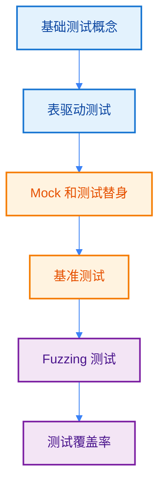
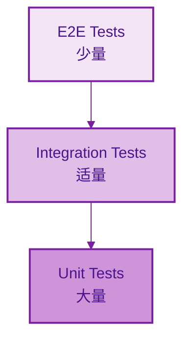

import { Badge } from "@rspress/core/theme";
import { Callout } from "@rspress/core/theme-original";

# Testing Strategies

[← 返回最佳实践](./)

编写高质量的测试是确保 Go 代码质量的关键。本文介绍 Go 测试的最佳实践和策略。

## 学习路径



## <Badge text="基础测试概念" type="tip" />

### 测试文件组织

<Badge text="初级开发者" type="info" /> Go 的测试约定：

```go
// ✅ 正确的测试文件命名
// calculator_test.go - 与被测试文件在同一包中
package calculator

import "testing"

// Test 函数签名
func TestAdd(t *testing.T) {
    result := Add(2, 3)
    if result != 5 {
        t.Errorf("Add(2, 3) = %d; want 5", result)
    }
}

// Benchmark 函数签名
func BenchmarkAdd(b *testing.B) {
    for i := 0; i < b.N; i++ {
        Add(2, 3)
    }
}
```

### AAA 模式

<Badge text="基础" type="tip" /> Arrange-Act-Assert 模式使测试清晰：

```go
func TestDivide(t *testing.T) {
    // Arrange: 准备测试数据
    dividend := 10
    divisor := 2
    expected := 5

    // Act: 执行被测试的函数
    result, err := Divide(dividend, divisor)

    // Assert: 验证结果
    if err != nil {
        t.Fatalf("Divide(%d, %d) unexpected error: %v", dividend, divisor, err)
    }
    if result != expected {
        t.Errorf("Divide(%d, %d) = %d; want %d", dividend, divisor, result, expected)
    }
}
```

## <Badge text="表驱动测试" type="info" />

### 基本模式

<Badge text="中级开发者" type="warning" /> 表驱动测试是 Go 的标准做法：

```go
func TestAdd_TableDriven(t *testing.T) {
    tests := []struct {
        name     string
        a, b     int
        expected int
    }{
        {"positive numbers", 2, 3, 5},
        {"negative numbers", -2, -3, -5},
        {"zero value", 0, 5, 5},
        {"mixed signs", -2, 3, 1},
        {"large numbers", 1000000, 2000000, 3000000},
    }

    for _, tt := range tests {
        t.Run(tt.name, func(t *testing.T) {
            result := Add(tt.a, tt.b)
            if result != tt.expected {
                t.Errorf("Add(%d, %d) = %d; want %d",
                    tt.a, tt.b, result, tt.expected)
            }
        })
    }
}
```

<Badge text="最佳实践" type="success" />
- 使用 `t.Run()` 创建子测试
- 为每个测试用例提供描述性名称
- 测试数据内联在测试函数中
- 避免随机生成的测试数据

### 错误处理的表驱动测试

```go
func TestDivide_Errors(t *testing.T) {
    tests := []struct {
        name        string
        dividend    int
        divisor     int
        expected    int
        expectError bool
    }{
        {"normal division", 10, 2, 5, false},
        {"divide by zero", 10, 0, 0, true},
        {"negative dividend", -10, 2, -5, false},
        {"negative divisor", 10, -2, -5, false},
    }

    for _, tt := range tests {
        t.Run(tt.name, func(t *testing.T) {
            result, err := Divide(tt.dividend, tt.divisor)

            if tt.expectError {
                if err == nil {
                    t.Error("Divide() expected error, got nil")
                }
                return
            }

            if err != nil {
                t.Errorf("Divide() unexpected error: %v", err)
                return
            }

            if result != tt.expected {
                t.Errorf("Divide(%d, %d) = %d; want %d",
                    tt.dividend, tt.divisor, result, tt.expected)
            }
        })
    }
}
```

### 并行测试

<Badge text="高级" type="danger" /> 使用 `t.Parallel()` 加速测试：

```go
func TestParallel(t *testing.T) {
    tests := []struct {
        name string
        input int
    }{
        {"test1", 1},
        {"test2", 2},
        {"test3", 3},
    }

    for _, tt := range tests {
        tt := tt // 捕获循环变量
        t.Run(tt.name, func(t *testing.T) {
            t.Parallel() // 标记为可并行运行

            result := Process(tt.input)
            if result != tt.input*2 {
                t.Errorf("Process(%d) = %d; want %d", tt.input, result, tt.input*2)
            }
        })
    }
}
```

<Badge text="警告" type="warning" />
- 并行测试必须**可独立运行**
- 避免共享状态或全局变量
- 使用 `tt := tt` 捕获循环变量

## <Badge text="Mock 和测试替身" type="warning" />

### 接口依赖注入

<Badge text="中级开发者" type="warning" /> 使用接口实现可测试性：

```go
// 定义接口（在使用者包中）
type Database interface {
    GetUser(id int) (*User, error)
    SaveUser(user *User) error
}

type UserService struct {
    db Database
}

func NewUserService(db Database) *UserService {
    return &UserService{db: db}
}

func (s *UserService) GetUser(id int) (*User, error) {
    if id <= 0 {
        return nil, fmt.Errorf("invalid user id: %d", id)
    }
    return s.db.GetUser(id)
}
```

### 手动 Mock

```go
// Mock Database 实现
type MockDatabase struct {
    users map[int]*User
}

func NewMockDatabase() *MockDatabase {
    return &MockDatabase{
        users: make(map[int]*User),
    }
}

func (m *MockDatabase) GetUser(id int) (*User, error) {
    user, ok := m.users[id]
    if !ok {
        return nil, fmt.Errorf("user not found: %d", id)
    }
    return user, nil
}

func (m *MockDatabase) SaveUser(user *User) error {
    m.users[user.ID] = user
    return nil
}

// 测试代码
func TestUserService_GetUser(t *testing.T) {
    mockDB := NewMockDatabase()
    mockDB.SaveUser(&User{ID: 1, Name: "Alice"})

    service := NewUserService(mockDB)

    user, err := service.GetUser(1)
    if err != nil {
        t.Fatalf("GetUser() error = %v", err)
    }

    if user.Name != "Alice" {
        t.Errorf("GetUser() name = %s; want Alice", user.Name)
    }
}
```

### 使用 Testify Mock

<Badge text="推荐工具" type="success" /> Testify 提供简洁的 Mock 功能：

```go
import (
    "github.com/stretchr/testify/mock"
    "github.com/stretchr/testify/assert"
)

// Mock 对象
type MockDatabase struct {
    mock.Mock
}

func (m *MockDatabase) GetUser(id int) (*User, error) {
    args := m.Called(id)
    if args.Get(0) == nil {
        return nil, args.Error(1)
    }
    return args.Get(0).(*User), args.Error(1)
}

func TestUserService_WithTestify(t *testing.T) {
    mockDB := new(MockDatabase)
    service := NewUserService(mockDB)

    // 设置期望
    expectedUser := &User{ID: 1, Name: "Alice"}
    mockDB.On("GetUser", 1).Return(expectedUser, nil)

    // 执行测试
    user, err := service.GetUser(1)

    // 验证
    assert.NoError(t, err)
    assert.Equal(t, "Alice", user.Name)
    mockDB.AssertExpectations(t)
}
```

### 使用 gomock

<Badge text="高级" type="danger" /> gomock 提供类型安全的 Mock：

```go
//go:generate mockgen -source=user_service.go -destination=mock_user_service.go

func TestUserService_WithGomock(t *testing.T) {
    ctrl := gomock.NewController(t)
    defer ctrl.Finish()

    mockDB := NewMockDatabase(ctrl)
    service := NewUserService(mockDB)

    // 设置期望
    expectedUser := &User{ID: 1, Name: "Alice"}
    mockDB.EXPECT().
        GetUser(1).
        Return(expectedUser, nil)

    // 执行测试
    user, err := service.GetUser(1)

    // 验证
    if err != nil {
        t.Fatalf("GetUser() error = %v", err)
    }
    if user.Name != "Alice" {
        t.Errorf("GetUser() name = %s; want Alice", user.Name)
    }
}
```

<Callout type="info" title={<Badge text="Mock 框架选择" type="info" />}>
  <strong>选择指南：</strong>
  <ul>
    <li><strong>简单场景</strong>：手动 Mock 或 Testify</li>
    <li><strong>复杂接口</strong>：gomock（代码生成）</li>
    <li><strong>混合使用</strong>：gomock 生成 Mock，Testify 做断言</li>
  </ul>
</Callout>

## <Badge text="基准测试" type="warning" />

### 基本基准测试

<Badge text="中级开发者" type="warning" /> 测量性能：

```go
func BenchmarkAdd(b *testing.B) {
    for i := 0; i < b.N; i++ {
        Add(2, 3)
    }
}

// 运行：go test -bench=.
// 输出示例：
// BenchmarkAdd-8    1000000000    0.256 ns/op
```

### 比较不同实现

```go
func BenchmarkStringConcat(b *testing.B) {
    tests := []struct {
        name string
        func func() string
    }{
        {"plus operator", func() string {
            s := ""
            for i := 0; i < 100; i++ {
                s += "x"
            }
            return s
        }},
        {"strings.Builder", func() string {
            var b strings.Builder
            for i := 0; i < 100; i++ {
                b.WriteString("x")
            }
            return b.String()
        }},
    }

    for _, bb := range tests {
        b.Run(bb.name, func(b *testing.B) {
            for i := 0; i < b.N; i++ {
                bb.func()
            }
        })
    }
}
```

### 重置计时器

```go
func BenchmarkExpensiveSetup(b *testing.B) {
    // 昂贵的初始化
    data := setupExpensiveData()

    b.ResetTimer() // 重置计时器，排除初始化时间

    for i := 0; i < b.N; i++ {
        Process(data)
    }
}

func setupExpensiveData() []byte {
    // 模拟昂贵操作
    time.Sleep(100 * time.Millisecond)
    return make([]byte, 1024)
}
```

### 内存分配分析

<Badge text="高级" type="danger" /> 使用 `-benchmem` 分析内存：

```bash
go test -bench=. -benchmem

# 输出示例：
# BenchmarkAdd-8      1000000000    0.256 ns/op    0 B/op    0 allocs/op
# BenchmarkConcat-8     1000000     1250 ns/op    128 B/op    4 allocs/op
```

<Badge text="关键指标" type="tip" />
- `ns/op`：每次操作耗时（越低越好）
- `B/op`：每次操作分配内存（越低越好）
- `allocs/op`：每次操作的分配次数（影响 GC）

### 并行基准测试

```go
func BenchmarkParallel(b *testing.B) {
    b.RunParallel(func(pb *testing.PB) {
        for pb.Next() {
            Process()
        }
    })
}
```

## <Badge text="Fuzzing 测试" type="danger" />

### 基本 Fuzzing

<Badge text="高级" type="danger" /> Go 1.18+ 支持 Fuzzing：

```go
func FuzzReverse(f *testing.F) {
    // 添加种子语料库
    f.Add("hello")
    f.Add("")
    f.Add("123")

    // Fuzz 目标函数
    f.Fuzz(func(t *testing.T, input string) {
        reversed := Reverse(input)
        doubleReversed := Reverse(reversed)

        if input != doubleReversed {
            t.Errorf("Reverse(Reverse(%q)) = %q, want %q",
                input, doubleReversed, input)
        }
    })
}
```

### Fuzzing 自定义类型

```go
func FuzzParseJSON(f *testing.F) {
    // 添加种子语料库
    f.Add([]byte(`{"name":"Alice","age":30}`))
    f.Add([]byte(`{}`))
    f.Add([]byte(`invalid`))

    f.Fuzz(func(t *testing.T, data []byte) {
        var person struct {
            Name string `json:"name"`
            Age  int    `json:"age"`
        }

        err := json.Unmarshal(data, &person)

        // 如果解析成功，验证数据有效性
        if err == nil {
            if person.Name == "" && person.Age == 0 {
                t.Errorf("Empty person should fail validation")
            }
        }
    })
}
```

<Badge text="注意" type="warning" />
- Fuzzing 会发现边界情况和安全问题
- 运行时间可能很长，适合 CI/CD 集成
- 使用 `-fuzz=FuzzReverse` 只运行特定 fuzz 测试

## <Badge text="测试覆盖率" type="info" />

### 生成覆盖率报告

<Badge text="中级开发者" type="warning" />

```bash
# 生成覆盖率报告
go test -coverprofile=coverage.out ./...

# 查看覆盖率
go tool cover -func=coverage.out

# 生成 HTML 报告
go tool cover -html=coverage.out
```

### 设置覆盖率阈值

```go
// +build integration

package calculator_test

func TestIntegration(t *testing.T) {
    // 集成测试
}
```

```bash
# 排除集成测试
go test -coverprofile=coverage.out -short ./...

# 设置覆盖率阈值
go test -coverprofile=coverage.out -covermode=atomic ./...
```

### CI/CD 集成

```yaml
# .github/workflows/test.yml
name: Test
on: [push, pull_request]

jobs:
  test:
    runs-on: ubuntu-latest
    steps:
      - uses: actions/checkout@v3
      - uses: actions/setup-go@v4
        with:
          go-version: '1.21'

      - name: Test with coverage
        run: |
          go test -v -race -coverprofile=coverage.out -covermode=atomic ./...

      - name: Check coverage threshold
        run: |
          coverage=$(go tool cover -func=coverage.out | grep total | awk '{print $3}' | sed 's/%//')
          if (( $(echo "$coverage < 80" | bc -l) )); then
            echo "Coverage $coverage% is below 80%"
            exit 1
          fi
```

## <Badge text="测试架构" type="danger" />

### 测试金字塔

<Badge text="高级" type="danger" />



### 单元测试

```go
// 单元测试：快速、独立、可重复
func TestUnit_Add(t *testing.T) {
    result := Add(2, 3)
    if result != 5 {
        t.Errorf("Add(2, 3) = %d; want 5", result)
    }
}
```

### 集成测试

```go
// +build integration

// 集成测试：测试组件交互
func TestIntegration_Database(t *testing.T) {
    if testing.Short() {
        t.Skip("Skipping integration test in short mode")
    }

    db := setupTestDB()
    defer db.Close()

    service := NewUserService(db)
    // 测试真实数据库交互
}
```

### 端到端测试

```go
// E2E 测试：测试完整流程
func TestE2E_UserFlow(t *testing.T) {
    if testing.Short() {
        t.Skip("Skipping E2E test in short mode")
    }

    // 启动测试服务器
    server := startTestServer()
    defer server.Close()

    // 模拟用户请求
    resp, err := http.Get(server.URL + "/users/1")
    if err != nil {
        t.Fatalf("Failed to make request: %v", err)
    }
    defer resp.Body.Close()

    if resp.StatusCode != http.StatusOK {
        t.Errorf("Expected status 200, got %d", resp.StatusCode)
    }
}
```

## <Badge text="测试工具推荐" type="success" />

### 测试框架

| 工具 | 用途 | 适用场景 |
|------|------|---------|
| `testing` | 标准库 | 所有测试 |
| `testify/assert` | 断言库 | 简化断言 |
| `testify/mock` | Mock 框架 | 简单 Mock |
| `gomock` | Mock 框架 | 复杂 Mock |
| `testify/suite` | 测试套件 | 共享 setup/teardown |

### 覆盖率工具

```bash
# 安装工具
go install github.com/axw/gocov/gocov@latest
go install github.com/matm/gocov-html@latest

# 生成 HTML 报告
gocov test ./... | gocov-html > coverage.html
```

### 基准测试工具

```bash
# 安装 benchstat
go install golang.org/x/perf/cmd/benchstat@latest

# 比较基准测试结果
go test -bench=. -count=5 > old.txt
# 修改代码
go test -bench=. -count=5 > new.txt
benchstat old.txt new.txt
```

## <Badge text="代码审查清单" type="success" />

### 测试设计

- [ ] 测试遵循 AAA 模式
- [ ] 使用表驱动测试处理多场景
- [ ] 测试名称清晰描述被测试函数和场景
- [ ] 错误测试覆盖所有错误路径

### Mock 和依赖

- [ ] 通过接口注入依赖
- [ ] Mock 对象验证调用行为
- [ ] 避免过度 Mock
- [ ] 测试真实错误场景

### 性能测试

- [ ] 关键函数有基准测试
- [ ] 使用 `-benchmem` 分析内存分配
- [ ] 比较优化前后的性能
- [ ] 监控性能回归

### 覆盖率

- [ ] 核心逻辑覆盖率 > 80%
- [ ] 边界条件有测试覆盖
- [ ] 错误路径有测试覆盖
- [ ] 集成测试验证组件交互

## <Badge text="总结" type="success" />

Go 测试最佳实践：

1. **表驱动测试**：处理多个测试场景的标准模式
2. **接口依赖**：使代码可测试和可 Mock
3. **适当 Mock**：隔离外部依赖，但不过度使用
4. **性能测试**：使用基准测试和 pprof 分析性能
5. **Fuzzing**：发现边界情况和安全问题
6. **测试金字塔**：更多单元测试，适量集成测试，少量 E2E 测试
7. **持续集成**：在 CI 中运行测试并检查覆盖率

<Callout type="success" title={<Badge text="测试原则" type="success" />}>
  <strong>测试的核心价值：</strong>
  <ul>
    <li><strong>快速反馈</strong>：测试应该快速运行</li>
    <li><strong>可重复</strong>：相同输入产生相同输出</li>
    <li><strong>独立性</strong>：测试之间不相互依赖</li>
    <li><strong>可读性</strong>：测试代码应该清晰易懂</li>
  </ul>
</Callout>

## 练习

1. 为字符串处理函数编写表驱动测试

<details>
<summary>查看答案</summary>

```go
package stringutil

import "testing"

func TestReverse_TableDriven(t *testing.T) {
    tests := []struct {
        name     string
        input    string
        expected string
    }{
        {"normal string", "hello", "olleh"},
        {"empty string", "", ""},
        {"single char", "a", "a"},
        {"palindrome", "racecar", "racecar"},
        {"with spaces", "hello world", "dlrow olleh"},
        {"unicode", "你好世界", "界世好你"},
    }

    for _, tt := range tests {
        t.Run(tt.name, func(t *testing.T) {
            result := Reverse(tt.input)
            if result != tt.expected {
                t.Errorf("Reverse(%q) = %q; want %q",
                    tt.input, result, tt.expected)
            }
        })
    }
}
```

**解释**：展示了表驱动测试处理多种字符串场景。
</details>

2. 编写一个基准测试比较字符串拼接方法

<details>
<summary>查看答案</summary>

```go
package stringutil

import (
    "strings"
    "testing"
)

func BenchmarkConcat_Plus(b *testing.B) {
    for i := 0; i < b.N; i++ {
        s := ""
        for j := 0; j < 100; j++ {
            s += "x"
        }
    }
}

func BenchmarkConcat_Builder(b *testing.B) {
    for i := 0; i < b.N; i++ {
        var builder strings.Builder
        for j := 0; j < 100; j++ {
            builder.WriteString("x")
        }
        _ = builder.String()
    }
}

func BenchmarkConcat_Join(b *testing.B) {
    parts := make([]string, 100)
    for i := range parts {
        parts[i] = "x"
    }

    b.ResetTimer()
    for i := 0; i < b.N; i++ {
        _ = strings.Join(parts, "")
    }
}
```

**解释**：比较不同字符串拼接方法的性能。
</details>

3. 使用 testify mock 编写服务测试

<details>
<summary>查看答案</summary>

```go
package service

import (
    "github.com/stretchr/testify/assert"
    "github.com/stretchr/testify/mock"
    "testing"
)

type MockDatabase struct {
    mock.Mock
}

func (m *MockDatabase) GetUser(id int) (*User, error) {
    args := m.Called(id)
    if args.Get(0) == nil {
        return nil, args.Error(1)
    }
    return args.Get(0).(*User), args.Error(1)
}

func TestUserService_GetUser_NotFound(t *testing.T) {
    mockDB := new(MockDatabase)
    service := NewUserService(mockDB)

    // 设置期望：用户不存在
    mockDB.On("GetUser", 999).
        Return(nil, ErrUserNotFound)

    // 执行测试
    user, err := service.GetUser(999)

    // 验证
    assert.Error(t, err)
    assert.Nil(t, user)
    assert.Equal(t, ErrUserNotFound, err)
    mockDB.AssertExpectations(t)
}

func TestUserService_GetUser_Success(t *testing.T) {
    mockDB := new(MockDatabase)
    service := NewUserService(mockDB)

    expectedUser := &User{ID: 1, Name: "Alice"}
    mockDB.On("GetUser", 1).
        Return(expectedUser, nil)

    user, err := service.GetUser(1)

    assert.NoError(t, err)
    assert.Equal(t, "Alice", user.Name)
    mockDB.AssertExpectations(t)
}
```

**解释**：展示了使用 testify mock 进行服务测试。
</details>

---

[← 错误处理模式](./error-patterns.mdx) | [常见反模式 →](./anti-patterns.mdx)
