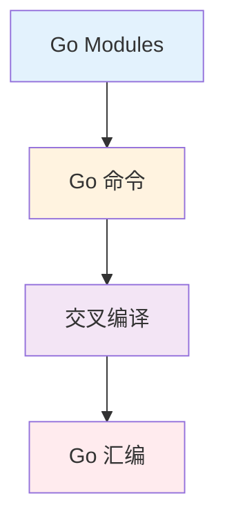

import { Badge } from "@rspress/core/theme";

# Build Tools

<Badge text="开发工具" type="info" />

掌握 Go 的构建工具是高效开发的基础。从模块管理到交叉编译，这些工具帮助你构建、测试和部署 Go 程序。

## 学习路径



## 模块概览

| 模块 | 内容 | 难度 |
|------|------|------|
| [Go Modules](./go-mod.mdx) | go.mod、依赖管理、版本控制 | <Badge text="中级" type="warning" /> |
| [Go 命令](./go-commands.mdx) | build、run、test、install | <Badge text="初级" type="tip" /> |
| [交叉编译](./cross-compile.mdx) | 跨平台编译、CGO | <Badge text="高级" type="danger" /> |
| [Go 汇编](./go-asm.mdx) | Go 汇编基础 | <Badge text="高级" type="danger" /> |

## 核心 Go 命令

### 构建相关

```bash
# 编译程序
go build                    # 编译当前包
go build -o myapp ./cmd     # 指定输出路径

# 运行程序
go run main.go              # 编译并运行
go run ./cmd/myapp          # 运行指定包

# 安装到 GOPATH/bin
go install ./cmd/myapp
```

### 测试相关

```bash
# 运行测试
go test                     # 运行当前包测试
go test ./...               # 运行所有测试
go test -v ./...            # 详细输出
go test -race ./...         # 竞态检测

# 生成覆盖率
go test -cover ./...
go test -coverprofile=coverage.out ./...
go tool cover -html=coverage.out
```

### 依赖管理

```bash
# 初始化模块
go mod init mymodule

# 下载依赖
go mod download

# 整理依赖
go mod tidy

# 查看依赖
go mod graph
go mod why <package>

# 更新依赖
go get -u ./...             # 更新所有依赖
go get -u=patch ./...       # 更新补丁版本
```

## 读者指南

### <Badge text="初级开发者" type="tip" />

1. [Go 命令](./go-commands.mdx) - 掌握基础命令
2. [Go Modules](./go-mod.mdx) - 理解模块系统

### <Badge text="中级开发者" type="warning" />

1. 完整的依赖管理策略
2. 版本控制最佳实践
3. 构建优化

### <Badge text="高级开发者" type="danger" />

1. [交叉编译](./cross-compile.mdx)
2. [Go 汇编](./go-asm.mdx)
3. 性能分析和优化

## Go Modules 基础

### go.mod 文件

```go
module myproject

go 1.21

require (
    github.com/gin-gonic/gin v1.9.1
    gorm.io/gorm v1.25.5
)

require (
    github.com/bytedance/sonic v1.9.1 // indirect
)
```

### 依赖版本

```bash
# 指定版本
go get github.com/pkg/errors@v0.9.1

# 获取最新版本
go get github.com/pkg/errors@latest

# 获取特定提交
go get github.com/pkg/errors@abc123
```

## 常用构建场景

### 场景 1: 本地开发

```bash
# 快速迭代
go run main.go

# 监听文件变化自动重新编译
# (需要安装 air: go install github.com/cosmtrek/air@latest)
air
```

### 场景 2: 生产构建

```bash
# 编译生产版本
go build -ldflags="-s -w" -o myapp ./cmd

# 交叉编译
GOOS=linux GOARCH=amd64 go build -o myapp-linux ./cmd
```

### 场景 3: Docker 构建

```dockerfile
# 多阶段构建
FROM golang:1.21-alpine AS builder
WORKDIR /app
COPY go.mod go.sum ./
RUN go mod download
COPY . .
RUN go build -o myapp ./cmd

FROM alpine:latest
COPY --from=builder /app/myapp /usr/local/bin/
ENTRYPOINT ["/usr/local/bin/myapp"]
```

## 练习

### 练习：创建完整的构建流程

为项目创建：
1. Makefile 简化常用命令
2. GitHub Actions CI 配置
3. Dockerfile 多阶段构建

---

## 总结

### 关键要点

| 读者水平 | 核心要点 |
|---------|---------|
| <Badge text="初级开发者" type="tip" /> | 掌握 `go build`、`go test`、`go run` |
| <Badge text="中级开发者" type="warning" /> | 理解 Go Modules，管理依赖版本 |
| <Badge text="高级开发者" type="danger" /> | 交叉编译、构建优化 |

### 下一步

- [← 返回 Go 首页](/golang/)
- [Go Modules →](./go-mod.mdx)
- [性能优化 →](../optimization/)
