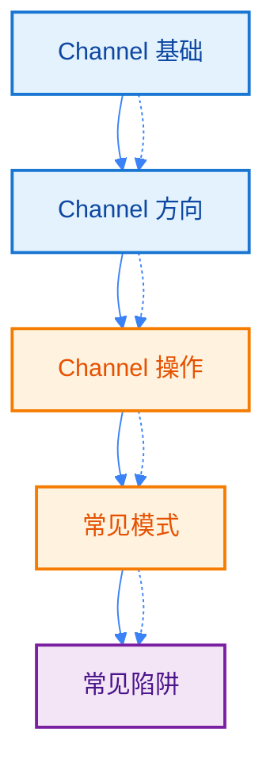
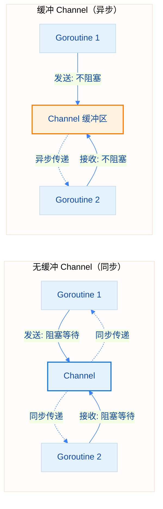
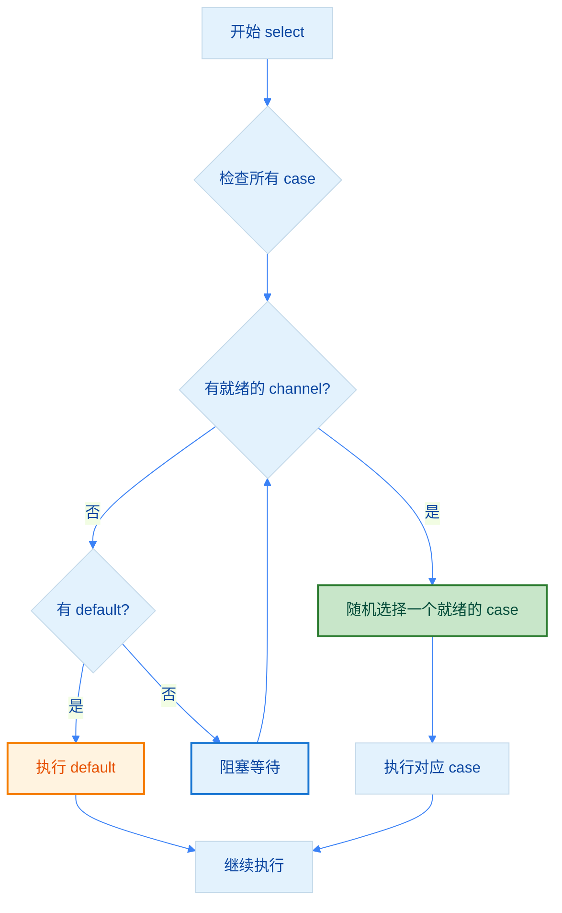
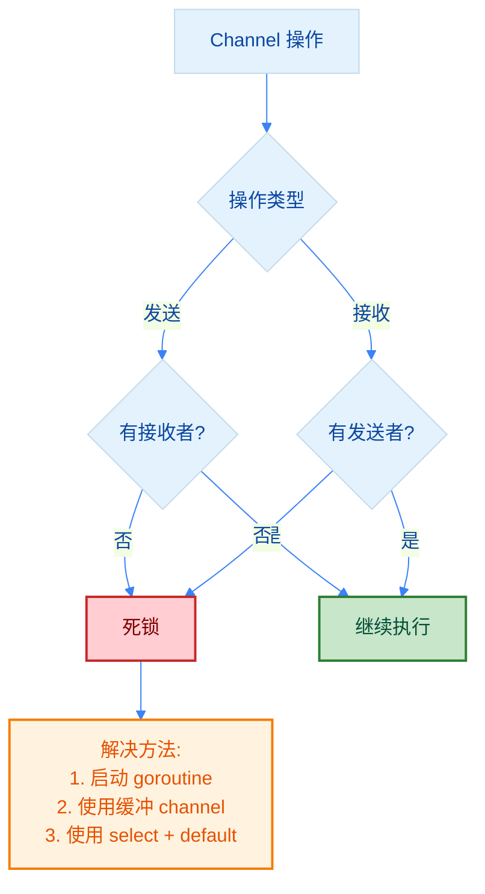

import { Badge } from "@rspress/core/theme";
import { Callout } from "@rspress/core/theme-original";

# Channel - Channel

[← 返回并发](../)

<Badge text="中级开发者" type="warning" />

Channel 是 Go 语言中用于 goroutine 之间通信和同步的核心机制，体现了 Go 的核心理念：**"不要通过共享内存来通信，而要通过通信来共享内存"**。

## 学习路径



## <Badge text="Channel 基础" type="tip" />

### 创建 Channel

```go
// 创建无缓冲 channel
ch1 := make(chan int)       // int 类型的 channel
ch2 := make(chan string)    // string 类型的 channel
ch3 := make(chan bool)      // bool 类型的 channel

// 创建缓冲 channel（容量为 10）
ch4 := make(chan int, 10)

// 创建空结构体 channel（常用于信号传递）
ch5 := make(chan struct{})
```

<Callout type="info" title="Channel 类型">
  Channel 是<strong>类型安全</strong>的通信管道，只能传递指定类型的数据。`chan T` 表示只能传递 T 类型的值。
</Callout>

### 发送和接收操作

```go
package main

import "fmt"

func main() {
    ch := make(chan string)

    // 启动 goroutine 发送数据
    go func() {
        ch <- "Hello"  // 发送操作
        fmt.Println("发送完成")
    }()

    // 接收数据
    msg := <-ch  // 接收操作
    fmt.Println("接收:", msg)

    // 输出：
    // 接收: Hello
    // 发送完成
}
```

### 发送和接收的特点

- **无缓冲 channel**：发送和接收是同步的，必须有接收者准备好才能发送
- **阻塞特性**：发送操作会阻塞直到有接收者，接收操作会阻塞直到有发送者

### 关闭 Channel

```go
package main

import "fmt"

func main() {
    ch := make(chan int, 3)

    go func() {
        for i := 1; i <= 3; i++ {
            ch <- i
        }
        close(ch)  // 关闭 channel
    }()

    // 使用 range 遍历 channel
    for value := range ch {
        fmt.Println("接收:", value)
    }

    // 检测 channel 是否关闭
    value, ok := <-ch
    if !ok {
        fmt.Println("Channel 已关闭, value =", value)
    }

    // 输出：
    // 接收: 1
    // 接收: 2
    // 接收: 3
    // Channel 已关闭, value = 0
}
```

<Callout type="warning" title={<Badge text="重要" type="warning" />}>
  <strong>关闭 Channel 的注意事项</strong>：
  - 只有发送者应该关闭 channel，接收者不应该关闭
  - 向已关闭的 channel 发送数据会 <strong>panic</strong>
  - 关闭已关闭的 channel 会 <strong>panic</strong>
  - 从已关闭的 channel 接收数据会立即返回零值和 false
</Callout>

### 缓冲 vs 无缓冲 Channel

#### 无缓冲 Channel（同步）

```go
// 无缓冲 channel：发送和接收必须同时发生
ch := make(chan int)

// 发送操作会阻塞，直到有接收者
go func() {
    ch <- 42  // 阻塞，等待接收者
}()

value := <-ch  // 接收，解除发送者的阻塞
fmt.Println(value)  // 42
```

#### 缓冲 Channel（异步）

```go
// 缓冲 channel：可以存储指定数量的值
ch := make(chan int, 3)

// 发送操作在缓冲区未满时不会阻塞
ch <- 1  // 不会阻塞
ch <- 2  // 不会阻塞
ch <- 3  // 不会阻塞

// 接收操作在缓冲区不为空时不会阻塞
fmt.Println(<-ch)  // 1
```

#### 对比说明



<Badge text="选择建议" type="info" />
- **无缓冲**：需要强同步保证，确保数据被处理的场景
- **缓冲**：生产者和消费者速度不一致，需要解耦的场景

## <Badge text="Channel 方向" type="info" />

Go 的 channel 可以限制为只发送或只接收，提高代码的类型安全性。

### 双向 Channel

```go
// 双向 channel：可以发送和接收
var ch chan int
ch = make(chan int)

ch <- 42     // 发送
value := <-ch  // 接收
```

### 只发送 Channel

```go
// 只发送 channel：chan<- int
func producer(ch chan<- int) {
    for i := 0; i < 5; i++ {
        ch <- i  // 只能发送
    }
    close(ch)
    // value := <-ch  // 编译错误：不能接收
}
```

### 只接收 Channel

```go
// 只接收 channel：<-chan int
func consumer(ch <-chan int) {
    for value := range ch {
        fmt.Println("接收:", value)  // 只能接收
    }
    // ch <- 42  // 编译错误：不能发送
}
```

### 完整示例

```go
package main

import "fmt"

// producer: 生产者函数，使用只发送 channel
func producer(ch chan<- int) {
    defer close(ch)
    for i := 1; i <= 5; i++ {
        ch <- i * 10
        fmt.Println("生产:", i*10)
    }
}

// consumer: 消费者函数，使用只接收 channel
func consumer(ch <-chan int) {
    for value := range ch {
        fmt.Println("消费:", value)
    }
}

// relay: 中继函数，转换为只接收和只发送
func relay(in <-chan int, out chan<- int) {
    defer close(out)
    for value := range in {
        fmt.Println("中继:", value)
        out <- value + 1
    }
}

func main() {
    ch1 := make(chan int)
    ch2 := make(chan int)

    go producer(ch1)
    go relay(ch1, ch2)
    consumer(ch2)

    // 输出示例：
    // 生产: 10
    // 中继: 10
    // 消费: 11
    // 生产: 20
    // ...
}
```

<Callout type="tip" title="最佳实践">
  <strong>使用方向性 channel 的优势</strong>：
  - <strong>类型安全</strong>：编译时检查，防止误操作
  - <strong>接口清晰</strong>：明确函数的输入输出角色
  - <strong>易于维护</strong>：代码意图更明确，减少 bug
</Callout>

## <Badge text="Channel 操作" type="warning" />

### range 遍历 Channel

```go
package main

import "fmt"

func main() {
    ch := make(chan int)

    go func() {
        for i := 1; i <= 5; i++ {
            ch <- i
        }
        close(ch)  // 必须关闭，否则 range 会永久阻塞
    }()

    // range 会自动检测 channel 关闭并退出
    for value := range ch {
        fmt.Println("接收:", value)
    }

    fmt.Println("遍历完成")
}
```

<Callout type="danger" title={<Badge text="注意" type="danger" />}>
  <strong>range 遍历的重要提示</strong>：
  - range 会一直阻塞，直到 channel 被关闭
  - 如果忘记关闭 channel，会导致<strong>死锁</strong>
  - 对于已关闭的 channel，range 会自动退出
</Callout>

### select 多路复用

select 可以同时等待多个 channel 操作，先完成的先执行。

```go
package main

import (
    "fmt"
    "time"
)

func main() {
    ch1 := make(chan string)
    ch2 := make(chan string)

    go func() {
        time.Sleep(100 * time.Millisecond)
        ch1 <- "数据 1"
    }()

    go func() {
        time.Sleep(200 * time.Millisecond)
        ch2 <- "数据 2"
    }()

    // select 等待多个 channel
    for i := 0; i < 2; i++ {
        select {
        case msg1 := <-ch1:
            fmt.Println("从 ch1 接收:", msg1)
        case msg2 := <-ch2:
            fmt.Println("从 ch2 接收:", msg2)
        }
    }

    // 输出：
    // 从 ch1 接收: 数据 1
    // 从 ch2 接收: 数据 2
}
```

#### select 多路复用流程



### select 的 default 分支（非阻塞操作）

```go
package main

import "fmt"

func main() {
    ch := make(chan int)

    // 非阻塞发送
    select {
    case ch <- 42:
        fmt.Println("发送成功")
    default:
        fmt.Println("发送失败（无接收者）")
    }

    // 非阻塞接收
    select {
    case value := <-ch:
        fmt.Println("接收:", value)
    default:
        fmt.Println("接收失败（无数据）")
    }

    // 输出：
    // 发送失败（无接收者）
    // 接收失败（无数据）
}
```

### 超时控制

```go
package main

import (
    "fmt"
    "time"
)

func main() {
    ch := make(chan string)

    go func() {
        time.Sleep(2 * time.Second)
        ch <- "数据到达"
    }()

    select {
    case msg := <-ch:
        fmt.Println("接收到:", msg)
    case <-time.After(1 * time.Second):
        fmt.Println("超时：1秒内未收到数据")
    }

    // 输出：超时：1秒内未收到数据
}
```

<Callout type="tip" title="超时模式">
  <strong>time.After 的用法</strong>：
  - `time.After(duration)` 返回一个 channel，会在指定时间后发送当前时间
  - 常用于实现超时控制
  - 注意每次调用都会创建新的 timer，对于高频场景建议使用 `time.NewTimer`
</Callout>

## <Badge text="常见模式" type="info" />

### 生产者-消费者模式

```go
package main

import "fmt"

// producer: 生产数据
func producer(id int, ch chan<- int) {
    defer close(ch)
    for i := 1; i <= 3; i++ {
        ch <- id*10 + i
        fmt.Printf("生产者 %d 生产: %d\n", id, id*10+i)
    }
}

// consumer: 消费数据
func consumer(id int, ch <-chan int, done chan<- bool) {
    for value := range ch {
        fmt.Printf("消费者 %d 消费: %d\n", id, value)
    }
    done <- true
}

func main() {
    ch := make(chan int, 10)
    done := make(chan bool)

    // 启动生产者
    go producer(1, ch)

    // 启动两个消费者
    go consumer(1, ch, done)
    go consumer(2, ch, done)

    // 等待消费者完成
    <-done
    <-done

    fmt.Println("所有任务完成")
}
```

### 扇出模式（Fan-out）

```go
package main

import (
    "fmt"
    "sync"
)

func worker(id int, jobs <-chan int, results chan<- int, wg *sync.WaitGroup) {
    defer wg.Done()
    for job := range jobs {
        fmt.Printf("Worker %d 处理任务 %d\n", id, job)
        results <- job * 2
    }
}

func main() {
    jobs := make(chan int, 100)
    results := make(chan int, 100)

    // 启动 3 个 worker
    var wg sync.WaitGroup
    for w := 1; w <= 3; w++ {
        wg.Add(1)
        go worker(w, jobs, results, &wg)
    }

    // 发送 5 个任务
    for j := 1; j <= 5; j++ {
        jobs <- j
    }
    close(jobs)

    // 等待所有 worker 完成
    wg.Wait()
    close(results)

    // 收集结果
    for result := range results {
        fmt.Println("结果:", result)
    }
}
```

### 扇入模式（Fan-in）

```go
package main

import "fmt"

// producer: 生产数据到 channel
func producer(id int, ch chan<- int) {
    defer close(ch)
    for i := 1; i <= 3; i++ {
        ch <- id*100 + i
    }
}

// fanIn: 合并多个 channel
func fanIn(ch1, ch2 <-chan int) <-chan int {
    ch := make(chan int)
    go func() {
        defer close(ch)
        for {
            select {
            case v, ok := <-ch1:
                if !ok {
                    ch1 = nil
                } else {
                    ch <- v
                }
            case v, ok := <-ch2:
                if !ok {
                    ch2 = nil
                } else {
                    ch <- v
                }
            }
            if ch1 == nil && ch2 == nil {
                return
            }
        }
    }()
    return ch
}

func main() {
    ch1 := make(chan int)
    ch2 := make(chan int)

    go producer(1, ch1)
    go producer(2, ch2)

    // 合并两个 channel
    merged := fanIn(ch1, ch2)

    for value := range merged {
        fmt.Println("合并后的值:", value)
    }
}
```

### 停止信号模式

```go
package main

import (
    "fmt"
    "time"
)

func worker(stop <-chan struct{}) {
    for {
        select {
        case <-stop:
            fmt.Println("收到停止信号，退出...")
            return
        default:
            fmt.Println("工作中...")
            time.Sleep(500 * time.Millisecond)
        }
    }
}

func main() {
    stop := make(chan struct{})

    go worker(stop)

    time.Sleep(2 * time.Second)
    close(stop)  // 发送停止信号

    time.Sleep(1 * time.Second)
    fmt.Println("主程序退出")
}
```

<Callout type="tip" title="停止信号最佳实践">
  <strong>使用空结构体 channel 作为信号</strong>：
  - `chan struct{}` 不占用内存（struct{} 大小为 0）
  - 只关注信号的传递，不关心数据内容
  - 关闭 channel 作为广播信号，所有接收者都能收到
</Callout>

## <Badge text="常见陷阱" type="danger" />

### 陷阱 1：向已关闭的 Channel 发送

```go
// 错误示例：向已关闭的 channel 发送会导致 panic
ch := make(chan int, 1)
ch <- 1
close(ch)
ch <- 2  // panic: send on closed channel

// 正确做法：发送前检查或只由发送者负责关闭
func safeSend(ch chan<- int, value int) {
    defer func() {
        if r := recover(); r != nil {
            fmt.Println("恢复:", r)
        }
    }()
    ch <- value
}
```

### 陷阱 2：关闭已关闭的 Channel

```go
// 错误示例：重复关闭 channel 会导致 panic
ch := make(chan int)
close(ch)
close(ch)  // panic: close of closed channel

// 正确做法：使用 sync.Once 确保只关闭一次
type SafeChannel struct {
    ch   chan int
    once sync.Once
}

func (sc *SafeChannel) Close() {
    sc.once.Do(func() {
        close(sc.ch)
    })
}
```

### 陷阱 3：nil Channel 的阻塞特性

```go
package main

import "fmt"

func main() {
    var ch chan int  // nil channel

    // 从 nil channel 接收会永久阻塞
    // value := <-ch  // 死锁

    // 向 nil channel 发送会永久阻塞
    // ch <- 42  // 死锁

    // 正确做法：使用 make 初始化
    ch = make(chan int)
    ch <- 42
    fmt.Println(<-ch)
}
```

<Callout type="warning" title="nil Channel 的妙用">
  <strong>利用 nil channel 实现 disable case</strong>：

  ```go
  select {
  case <-ch1:
      // 处理 ch1
  case v, ok := <-ch2:
      if !ok {
          ch2 = nil  // 关闭后设置为 nil，禁用该 case
          continue
      }
      // 处理 ch2
  }
  ```

  nil channel 在 select 中永远不会被选中，可用于动态控制 select 的分支。
</Callout>

### 陷阱 4：死锁场景

```go
// 场景 1：无缓冲 channel 死锁
func deadlock1() {
    ch := make(chan int)
    ch <- 42  // 死锁：没有接收者
    fmt.Println(<-ch)
}

// 场景 2：等待自己发送的数据
func deadlock2() {
    ch := make(chan int)
    ch <- <-ch  // 死锁：等待自己接收
}

// 场景 3：所有 goroutine 都在等待
func deadlock3() {
    ch := make(chan int)
    <-ch  // 死锁：没有发送者
}

// 正确做法：确保有对应的发送/接收操作
func noDeadlock() {
    ch := make(chan int)
    go func() {
        ch <- 42
    }()
    fmt.Println(<-ch)
}
```

### 死锁检测流程



## 练习

<Badge text="初级" type="tip" />
1. **实现超时控制**：编写一个函数，在指定时间内从 channel 接收数据，超时返回错误

<details>
<summary>查看答案</summary>

```go
package main

import (
    "errors"
    "fmt"
    "time"
)

func receiveWithTimeout(ch <-chan int, timeout time.Duration) (int, error) {
    select {
    case value := <-ch:
        return value, nil
    case <-time.After(timeout):
        return 0, errors.New("接收超时")
    }
}

func main() {
    ch := make(chan int)

    go func() {
        time.Sleep(2 * time.Second)
        ch <- 42
    }()

    // 测试超时
    value, err := receiveWithTimeout(ch, 1*time.Second)
    if err != nil {
        fmt.Println("错误:", err)
    } else {
        fmt.Println("接收到:", value)
    }

    // 测试成功接收
    value, err = receiveWithTimeout(ch, 2*time.Second)
    if err != nil {
        fmt.Println("错误:", err)
    } else {
        fmt.Println("接收到:", value)
    }

    // 输出：
    // 错误: 接收超时
    // 接收到: 42
}
```

**解释**：使用 select + time.After 实现超时控制，先完成的 case 会先执行。

</details>

2. **实现生产者-消费者**：一个生产者 goroutine 生成数字，两个消费者 goroutine 处理数字

<details>
<summary>查看答案</summary>

```go
package main

import (
    "fmt"
    "sync"
)

func producer(id int, out chan<- int, wg *sync.WaitGroup) {
    defer wg.Done()
    for i := 1; i <= 5; i++ {
        value := id*100 + i
        out <- value
        fmt.Printf("生产者 %d: 生产 %d\n", id, value)
    }
}

func consumer(id int, in <-chan int, wg *sync.WaitGroup) {
    defer wg.Done()
    for value := range in {
        fmt.Printf("消费者 %d: 消费 %d\n", id, value)
        // 模拟处理时间
        time.Sleep(100 * time.Millisecond)
    }
}

func main() {
    jobs := make(chan int, 10)

    var wg sync.WaitGroup

    // 启动生产者
    wg.Add(1)
    go producer(1, jobs, &wg)

    // 启动消费者
    wg.Add(2)
    go consumer(1, jobs, &wg)
    go consumer(2, jobs, &wg)

    // 等待生产者完成
    wg.Wait()

    // 关闭 channel，通知消费者退出
    close(jobs)

    // 等待消费者完成
    time.Sleep(1 * time.Second)
    fmt.Println("所有任务完成")
}
```

**解释**：生产者生成数据到 jobs channel，两个消费者从 jobs channel 接收并处理数据。

</details>

<Badge text="中级" type="info" />
3. **实现扇入模式**：合并多个 channel 的数据到一个 channel

<details>
<summary>查看答案</summary>

```go
package main

import "fmt"

func producer(id int, out chan<- int) {
    defer close(out)
    for i := 1; i <= 3; i++ {
        out <- id*10 + i
    }
}

func fanIn(inputs ...<-chan int) <-chan int {
    output := make(chan int)

    go func() {
        defer close(output)

        // 使用 select 监听所有输入 channel
        cases := make([]reflect.SelectCase, len(inputs))
        for i, ch := range inputs {
            cases[i] = reflect.SelectCase{
                Dir:  reflect.SelectRecv,
                Chan: reflect.ValueOf(ch),
            }
        }

        // 持续处理直到所有 channel 都关闭
        for {
            chosen, value, ok := reflect.Select(cases)
            if !ok {
                // 移除已关闭的 channel
                cases = append(cases[:chosen], cases[chosen+1:]...)
                if len(cases) == 0 {
                    return
                }
                continue
            }
            output <- int(value.Int())
        }
    }()

    return output
}

// 简化版本的 fanIn（固定 2 个输入）
func fanInSimple(ch1, ch2 <-chan int) <-chan int {
    output := make(chan int)

    go func() {
        defer close(output)
        for ch1 != nil || ch2 != nil {
            select {
            case v, ok := <-ch1:
                if !ok {
                    ch1 = nil
                } else {
                    output <- v
                }
            case v, ok := <-ch2:
                if !ok {
                    ch2 = nil
                } else {
                    output <- v
                }
            }
        }
    }()

    return output
}

func main() {
    ch1 := make(chan int)
    ch2 := make(chan int)

    go producer(1, ch1)
    go producer(2, ch2)

    // 使用简化版本
    merged := fanInSimple(ch1, ch2)

    for value := range merged {
        fmt.Println("合并:", value)
    }

    fmt.Println("完成")
}
```

**解释**：fanIn 模式将多个输入 channel 合并为一个输出 channel。简化版本处理 2 个输入，将已关闭的 channel 设置为 nil 来禁用对应的 case。

</details>

4. **实现带超时的 worker**：worker 处理任务，但每个任务都有超时限制

<details>
<summary>查看答案</summary>

```go
package main

import (
    "fmt"
    "time"
)

func worker(id int, jobs <-chan int, results chan<- int, timeout time.Duration) {
    for job := range jobs {
        fmt.Printf("Worker %d: 开始任务 %d\n", id, job)

        // 模拟任务处理（带超时）
        select {
        case <-time.After(timeout):
            fmt.Printf("Worker %d: 任务 %d 超时\n", id, job)
            results <- -1  // -1 表示超时
        case <-func() chan struct{} {
            ch := make(chan struct{})
            go func() {
                // 模拟任务处理时间
                time.Sleep(time.Duration(job%3) * 100 * time.Millisecond)
                close(ch)
            }()
            return ch
        }():
            fmt.Printf("Worker %d: 完成任务 %d\n", id, job)
            results <- job * 2
        }
    }
}

func main() {
    jobs := make(chan int, 10)
    results := make(chan int, 10)

    // 启动 2 个 worker，超时时间 150ms
    for w := 1; w <= 2; w++ {
        go worker(w, jobs, results, 150*time.Millisecond)
    }

    // 发送任务
    for j := 1; j <= 5; j++ {
        jobs <- j
    }
    close(jobs)

    // 收集结果
    for i := 0; i < 5; i++ {
        result := <-results
        if result == -1 {
            fmt.Println("任务超时")
        } else {
            fmt.Println("任务结果:", result)
        }
    }
}
```

**解释**：每个任务都有超时限制，使用 select 在任务完成和超时之间选择，先发生的会先执行。

</details>

<Badge text="高级" type="warning" />
5. **实现 channel 池**：动态管理多个 worker，根据任务量自动扩缩容

<details>
<summary>查看答案</summary>

```go
package main

import (
    "fmt"
    "sync"
    "time"
)

type Pool struct {
    tasks   chan Task
    wg      sync.WaitGroup
    quit    chan struct{}
    timeout time.Duration
}

type Task struct {
    ID   int
    Data string
}

func NewPool(maxWorkers int, timeout time.Duration) *Pool {
    p := &Pool{
        tasks:   make(chan Task, 100),
        quit:    make(chan struct{}),
        timeout: timeout,
    }

    // 启动初始 workers
    for i := 0; i < maxWorkers; i++ {
        p.wg.Add(1)
        go p.worker(i + 1)
    }

    return p
}

func (p *Pool) worker(id int) {
    defer p.wg.Done()

    for {
        select {
        case task, ok := <-p.tasks:
            if !ok {
                fmt.Printf("Worker %d: 退出\n", id)
                return
            }
            fmt.Printf("Worker %d: 处理任务 %d\n", id, task.ID)
            // 模拟处理
            time.Sleep(p.timeout)
        case <-p.quit:
            fmt.Printf("Worker %d: 收到退出信号\n", id)
            return
        }
    }
}

func (p *Pool) AddTask(task Task) {
    p.tasks <- task
}

func (p *Pool) Stop() {
    close(p.tasks)
    close(p.quit)
    p.wg.Wait()
}

func main() {
    // 创建 worker 池：3 个 worker，每个任务处理时间 200ms
    pool := NewPool(3, 200*time.Millisecond)

    // 发送任务
    var wg sync.WaitGroup
    for i := 1; i <= 10; i++ {
        wg.Add(1)
        go func(taskID int) {
            defer wg.Done()
            pool.AddTask(Task{ID: taskID, Data: fmt.Sprintf("任务%d", taskID)})
        }(i)
    }

    // 等待所有任务发送完成
    wg.Wait()

    // 停止 worker 池
    time.Sleep(1 * time.Second)
    pool.Stop()

    fmt.Println("所有任务完成")
}
```

**解释**：实现了动态的 worker 池，可以处理大量任务。worker 池在启动时创建固定数量的 worker，通过 channel 分发任务，支持优雅关闭。

</details>

6. **实现 ticker 和 timer 的正确使用**：对比 time.Ticker 和 time.Timer 的使用场景

<details>
<summary>查看答案</summary>

```go
package main

import (
    "fmt"
    "time"
)

// 使用 Timer 实现一次性超时
func withTimer() {
    fmt.Println("=== Timer 示例 ===")

    timer := time.NewTimer(2 * time.Second)

    select {
    case <-timer.C:
        fmt.Println("Timer 触发：2 秒后")
    }

    // 停止 Timer（如果还未触发）
    if !timer.Stop() {
        <-timer.C  // 消耗可能已经发送的值
    }

    // 重置 Timer
    timer.Reset(1 * time.Second)
    <-timer.C
    fmt.Println("Timer 重置后触发：1 秒后")
}

// 使用 Ticker 实现周期性执行
func withTicker() {
    fmt.Println("\n=== Ticker 示例 ===")

    ticker := time.NewTicker(500 * time.Millisecond)
    defer ticker.Stop()

    // 执行 3 次后停止
    count := 0
    for {
        select {
        case t := <-ticker.C:
            count++
            fmt.Printf("Ticker 触发 %d: %s\n", count, t.Format("15:04:05.000"))
            if count >= 3 {
                return
            }
        }
    }
}

// 使用 time.After 实现简单超时
func withTimeAfter() {
    fmt.Println("\n=== time.After 示例 ===")

    ch := make(chan string)

    go func() {
        time.Sleep(3 * time.Second)
        ch <- "数据到达"
    }()

    select {
    case msg := <-ch:
        fmt.Println("接收到:", msg)
    case <-time.After(1 * time.Second):
        fmt.Println("1 秒超时：未收到数据")
    }
}

// 使用 time.Tick 实现简单周期性任务
func withTimeTick() {
    fmt.Println("\n=== time.Tick 示例 ===")

    // 注意：time.Tick 创建的 Ticker 无法停止，会一直运行
    // 只适合在长期运行的场景使用

    count := 0
    for range time.Tick(300 * time.Millisecond) {
        count++
        fmt.Printf("Tick %d\n", count)
        if count >= 3 {
            break
        }
    }
}

// 错误示例：内存泄漏
func memoryLeakExample() {
    fmt.Println("\n=== 内存泄漏示例 ===")

    // 错误：在循环中创建 ticker 但不停止
    for i := 0; i < 5; i++ {
        ticker := time.NewTicker(100 * time.Millisecond)
        // 忘记调用 ticker.Stop()
        // 这会导致 ticker 继续 goroutine，造成内存泄漏

        // 正确做法：
        // defer ticker.Stop()
    }

    fmt.Println("如果这些 ticker 没有停止，会造成内存泄漏")
}

func main() {
    withTimer()
    withTicker()
    withTimeAfter()
    withTimeTick()

    // 不运行 memoryLeakExample，因为它会泄漏内存
    // memoryLeakExample()

    fmt.Println("\n=== 使用建议 ===")
    fmt.Println("1. 需要一次性超时：使用 time.NewTimer() 或 time.After()")
    fmt.Println("2. 需要周期性执行：使用 time.NewTicker() 并记得 Stop()")
    fmt.Println("3. 简单场景可用：time.Tick()（但无法停止）")
    fmt.Println("4. 循环中创建 ticker/timer 时，务必清理资源")
}
```

**解释**：对比了 Timer 和 Ticker 的使用场景和区别：
- **Timer**：一次性定时器，可以停止和重置
- **Ticker**：周期性定时器，使用后必须停止
- **time.After**：简单的一次性超时（内部创建 Timer，无需手动管理）
- **time.Tick**：简单的周期性任务（无法停止，需谨慎使用）

</details>

## 总结

### 核心要点

<Badge text="核心概念" type="tip" />

1. **Channel 类型**：无缓冲（同步）vs 缓冲（异步）
2. **Channel 方向**：双向、只发送、只接收
3. **Channel 操作**：range 遍历、select 多路复用、超时控制
4. **常见模式**：生产者-消费者、扇入/扇出、停止信号
5. **常见陷阱**：死锁、向关闭的 channel 发送、nil channel 阻塞

### 使用场景

| 场景 | 推荐使用 | 注意事项 |
|-----|---------|---------|
| 数据传递 | ✅ channel | 优先使用 channel 而非共享内存 |
| 同步控制 | ✅ 无缓冲 channel | 确保有对应的发送/接收 |
| 解耦生产消费 | ✅ 缓冲 channel | 合理设置缓冲区大小 |
| 超时控制 | ✅ select + time.After | 避免资源泄漏 |
| 信号通知 | ✅ chan struct{} | 空结构体不占内存 |
| 高频操作 | ⚠️ | 考虑性能开销 |

### 最佳实践清单

- [ ] 优先使用 channel 而非共享内存
- [ ] 只由发送者关闭 channel
- [ ] 使用 range 遍历 channel 时确保关闭
- [ ] 合理使用 select 实现多路复用
- [ ] 超时控制使用 time.After 或 time.NewTimer
- [ ] 信号传递使用 chan struct{}
- [ ] 避免向已关闭的 channel 发送
- [ ] 注意 nil channel 的阻塞特性
- [ ] 谨慎使用 time.Tick（无法停止）
- [ ] 使用方向性 channel 提高类型安全

[← Goroutine](./goroutine.mdx) | [继续：Channel 模式 →](./channel-patterns.mdx)
