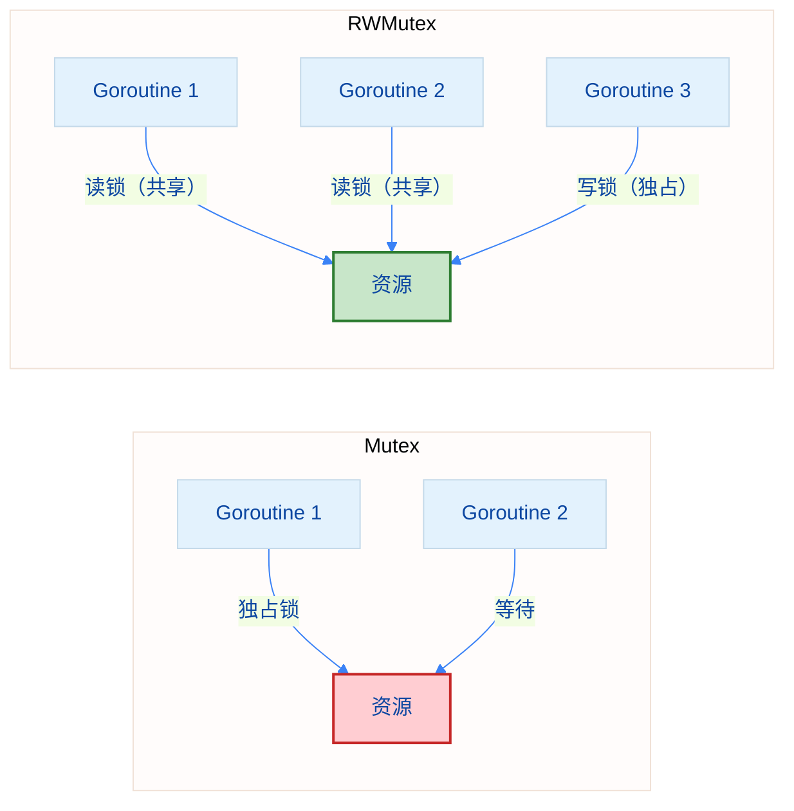

import { Badge } from "@rspress/core/theme";
import { Callout } from "@rspress/core/theme-original";

# sync.RWMutex - 读写锁

<Badge text="基础" type="tip" /> <Badge text="Go 1.0+" type="info" />

RWMutex 是读写分离的锁，允许多个读操作同时进行，写操作独占。

## 定义

```go
type RWMutex struct {
    // 包含非导出字段
}
```

## 主要方法

```go
// 写锁（独占）
func (rw *RWMutex) Lock()      // 获取写锁
func (rw *RWMutex) Unlock()    // 释放写锁

// 读锁（共享）
func (rw *RWMutex) RLock()     // 获取读锁
func (rw *RWMutex) RUnlock()   // 释放读锁

// 尝试获取锁（Go 1.18+）
func (rw *RWMutex) TryLock() bool
func (rw *RWMutex) TryRLock() bool
```

## 使用场景

- 读多写少的场景
- 缓存系统
- 配置中心
- 数据库连接池

## 基础示例

```go
package main

import (
    "fmt"
    "sync"
    "time"
)

type Cache struct {
    mu   sync.RWMutex
    data map[string]string
}

func NewCache() *Cache {
    return &Cache{
        data: make(map[string]string),
    }
}

func (c *Cache) Get(key string) (string, bool) {
    c.mu.RLock()         // 读锁
    defer c.mu.RUnlock()
    value, ok := c.data[key]
    return value, ok
}

func (c *Cache) Set(key, value string) {
    c.mu.Lock()          // 写锁
    defer c.mu.Unlock()
    c.data[key] = value
}

func main() {
    cache := NewCache()

    // 写入数据
    cache.Set("name", "Alice")
    cache.Set("age", "30")

    var wg sync.WaitGroup

    // 启动多个读操作
    for i := 0; i < 5; i++ {
        wg.Add(1)
        go func(id int) {
            defer wg.Done()
            if val, ok := cache.Get("name"); ok {
                fmt.Printf("Reader %d: name = %s\n", id, val)
            }
        }(i)
    }

    // 启动写操作
    wg.Add(1)
    go func() {
        defer wg.Done()
        cache.Set("name", "Bob")
        fmt.Println("Writer: Updated name to Bob")
    }()

    wg.Wait()
}
```

## RWMutex vs Mutex 对比



<Callout type="info" title="选择建议">
  <strong>Mutex vs RWMutex</strong>：
  - <strong>Mutex</strong>：适合写操作频繁或读写均衡的场景
  - <strong>RWMutex</strong>：适合读多写少的场景
  - RWMutex 在读多写少时性能更好，但内存占用更高
  - 如果不确定，优先使用 Mutex
</Callout>

## 练习

1. **实现配置管理器**：使用 RWMutex 实现读写分离的配置缓存

<details>
<summary>查看答案</summary>

```go
package main

import (
    "fmt"
    "sync"
    "time"
)

type Config struct {
    mu   sync.RWMutex
    data map[string]string
}

func NewConfig() *Config {
    return &Config{
        data: make(map[string]string),
    }
}

func (c *Config) Get(key string) (string, bool) {
    c.mu.RLock()
    defer c.mu.RUnlock()
    val, ok := c.data[key]
    return val, ok
}

func (c *Config) Set(key, value string) {
    c.mu.Lock()
    defer c.mu.Unlock()
    c.data[key] = value
}

func (c *Config) GetAll() map[string]string {
    c.mu.RLock()
    defer c.mu.RUnlock()

    result := make(map[string]string, len(c.data))
    for k, v := range c.data {
        result[k] = v
    }
    return result
}

func main() {
    config := NewConfig()

    // 写入配置
    config.Set("host", "localhost")
    config.Set("port", "8080")

    var wg sync.WaitGroup

    // 启动多个读操作
    for i := 0; i < 5; i++ {
        wg.Add(1)
        go func(id int) {
            defer wg.Done()
            if host, ok := config.Get("host"); ok {
                fmt.Printf("Reader %d: host = %s\n", id, host)
            }
        }(i)
    }

    // 启动写操作
    wg.Add(1)
    go func() {
        defer wg.Done()
        time.Sleep(50 * time.Millisecond)
        config.Set("host", "example.com")
        fmt.Println("Writer: Updated host")
    }()

    wg.Wait()

    // 打印所有配置
    fmt.Println("\n所有配置:")
    for k, v := range config.GetAll() {
        fmt.Printf("  %s = %s\n", k, v)
    }
}
```

**解释**：使用 RWMutex 实现读写分离，多个读操作可以并发执行，写操作独占访问。

</details>

---

[← Mutex](./mutex.mdx) | [WaitGroup →](./waitgroup.mdx)
