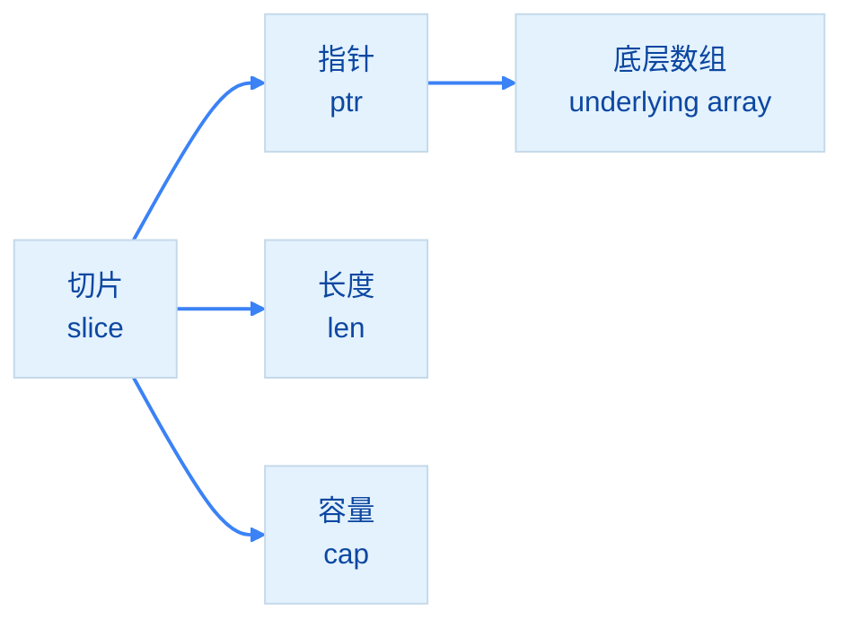
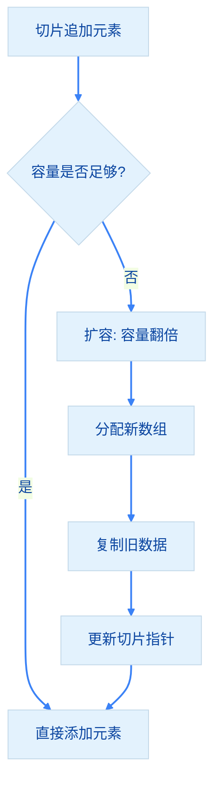

import { Badge } from "@rspress/core/theme";
import { Callout } from "@rspress/core/theme-original";

# Slice Type

[← 返回数据类型](../)

切片是<strong>动态长度</strong>的相同类型元素序列，是对数组的抽象。

## <Badge text="切片基础" type="tip" />

### 切片声明

```go
// 声明切片（nil 切片）
var s1 []int
fmt.Println(s1 == nil)  // true
fmt.Println(len(s1))    // 0

// 使用字面量创建
s2 := []int{1, 2, 3}
fmt.Println(len(s2))  // 3

// 使用 make 创建
s3 := make([]int, 3)        // 长度为3，容量为3
s4 := make([]int, 3, 5)     // 长度为3，容量为5
```

### 切片操作

```go
s := []int{1, 2, 3, 4, 5}

// 切片操作 [开始:结束]（不包括结束）
fmt.Println(s[1:3])  // [2 3]
fmt.Println(s[1:])   // [2 3 4 5]
fmt.Println(s[:3])   // [1 2 3]
fmt.Println(s[:])    // [1 2 3 4 5]

// 追加元素
s = append(s, 6)
fmt.Println(s)  // [1 2 3 4 5 6]

// 追加多个元素
s = append(s, 7, 8, 9)
```

<Callout type="warning" title={<Badge text="重要" type="warning" />}>
  切片的长度<strong>不能通过 `nil` 判断</strong>，必须使用 `len(s)` 来判断切片是否为空。

  ```go
  // ✅ 正确：使用 len() 判断
  if len(s) == 0 {
      // 切片为空
  }
  ```
</Callout>

## <Badge text="切片内部结构" type="info" />

切片由三部分组成：

```go
type slice struct {
    ptr unsafe.Pointer  // 指向底层数组的指针
    len int              // 切片长度
    cap int              // 切片容量
}
```



## <Badge text="切片扩容机制" type="warning" />

### 扩容策略

```go
s := make([]int, 0, 3)
s = append(s, 1, 2, 3)
fmt.Printf("len=%d cap=%d\n", len(s), cap(s))  // len=3 cap=3

s = append(s, 4)  // 触发扩容
fmt.Printf("len=%d cap=%d\n", len(s), cap(s))  // len=4 cap=6
```

### 扩容流程



<Badge text="扩容规则" type="info" />
- 容量 < 1024：新容量 = 旧容量 × 2
- 容量 ≥ 1024：新容量 = 旧容量 × 1.25

## <Badge text="切片陷阱" type="danger" />

### 陷阱1：切片共享底层数组

```go
s1 := []int{1, 2, 3, 4, 5}
s2 := s1[1:3]  // [2 3]

s2[0] = 99
fmt.Println(s1)  // [1 99 3 4 5] - s1 也被修改了！
fmt.Println(s2)  // [99 3]
```

### 陷阱2：append 可能不影响原切片

```go
s1 := []int{1, 2, 3}
s2 := s1[0:2]  // [1 2]

s2 = append(s2, 99)
fmt.Println(s1)  // [1 2 99] - 共享底层数组，被修改

// 但如果触发扩容...
s3 := s1[0:2]
s3 = append(s3, 100, 200)  // 触发扩容
fmt.Println(s1)  // [1 2 99] - 不受影响，s3 使用新数组
```

### 解决方案

```go
// 使用 copy() 创建独立副本
s1 := []int{1, 2, 3, 4, 5}
s2 := make([]int, len(s1[1:3]))
copy(s2, s1[1:3])

s2[0] = 99
fmt.Println(s1)  // [1 2 3 4 5] - s1 不受影响
fmt.Println(s2)  // [99 3]
```

## <Badge text="切片操作技巧" type="info" />

### 复制切片

```go
s1 := []int{1, 2, 3}

// 方式1：使用 copy
s2 := make([]int, len(s1))
copy(s2, s1)

// 方式2：使用 append
s3 := append([]int(nil), s1...)

// 方式3：直接追加到空切片
s4 := append([]int{}, s1...)
```

### 删除元素

```go
s := []int{1, 2, 3, 4, 5}

// 删除索引 i 的元素
i := 2
s = append(s[:i], s[i+1:]...)
fmt.Println(s)  // [1 2 4 5]

// 删除多个元素
s = append(s[:1], s[3:]...)
fmt.Println(s)  // [1 5]
```

### 插入元素

```go
s := []int{1, 2, 4, 5}

// 在索引 i 处插入元素
i := 2
s = append(s[:i], append([]int{3}, s[i:]...)...)
fmt.Println(s)  // [1 2 3 4 5]
```

## <Badge text="多维切片" type="info" />

```go
// 声明二维切片
matrix := [][]int{
    {1, 2, 3},
    {4, 5, 6},
}

// 动态添加行
matrix = append(matrix, []int{7, 8, 9})

// 访问元素
fmt.Println(matrix[0][1])  // 2
```

## 练习

1. 实现切片去重函数

<details>
<summary>查看答案</summary>

```go
package main

import "fmt"

// RemoveDuplicates 去除切片中的重复元素（保留顺序）
func RemoveDuplicates(slice []int) []int {
    seen := make(map[int]bool)
    result := []int{}

    for _, v := range slice {
        if !seen[v] {
            seen[v] = true
            result = append(result, v)
        }
    }

    return result
}

// RemoveDuplicatesInPlace 原地去重（修改原切片）
func RemoveDuplicatesInPlace(slice []int) []int {
    if len(slice) == 0 {
        return slice
    }

    // 先排序
    for i := 0; i < len(slice)-1; i++ {
        for j := i + 1; j < len(slice); j++ {
            if slice[i] > slice[j] {
                slice[i], slice[j] = slice[j], slice[i]
            }
        }
    }

    // 去重
    unique := 0
    for i := 1; i < len(slice); i++ {
        if slice[i] != slice[unique] {
            unique++
            slice[unique] = slice[i]
        }
    }

    return slice[:unique+1]
}

func main() {
    // 方法1：保留顺序的去重
    slice1 := []int{1, 2, 3, 2, 4, 1, 5, 3}
    fmt.Println("原切片:", slice1)
    fmt.Println("去重后:", RemoveDuplicates(slice1))

    // 方法2：排序后去重
    slice2 := []int{3, 1, 4, 1, 5, 9, 2, 6}
    fmt.Println("\n原切片:", slice2)
    result := RemoveDuplicatesInPlace(append([]int{}, slice2...))
    fmt.Println("去重后:", result)
}
```

**解释**：展示了两种去重方法，一种保留顺序，一种排序后去重。
</details>

2. 编写函数过滤切片中的偶数

<details>
<summary>查看答案</summary>

```go
package main

import "fmt"

// FilterEven 过滤出偶数
func FilterEven(numbers []int) []int {
    result := []int{}
    for _, num := range numbers {
        if num%2 == 0 {
            result = append(result, num)
        }
    }
    return result
}

// FilterOdd 过滤出奇数
func FilterOdd(numbers []int) []int {
    result := []int{}
    for _, num := range numbers {
        if num%2 != 0 {
            result = append(result, num)
        }
    }
    return result
}

// Filter 通用过滤函数
func Filter(numbers []int, predicate func(int) bool) []int {
    result := []int{}
    for _, num := range numbers {
        if predicate(num) {
            result = append(result, num)
        }
    }
    return result
}

func main() {
    numbers := []int{1, 2, 3, 4, 5, 6, 7, 8, 9, 10}

    fmt.Println("原切片:", numbers)
    fmt.Println("偶数:", FilterEven(numbers))
    fmt.Println("奇数:", FilterOdd(numbers))

    // 使用通用过滤函数
    evens := Filter(numbers, func(n int) bool {
        return n%2 == 0
    })
    fmt.Println("偶数（通用）:", evens)

    // 过滤大于5的数
    greaterThanFive := Filter(numbers, func(n int) bool {
        return n > 5
    })
    fmt.Println("大于5的数:", greaterThanFive)
}
```

**解释**：展示了如何使用函数作为参数实现通用过滤。
</details>

3. 实现切片旋转（将前k个元素移到末尾）

<details>
<summary>查看答案</summary>

```go
package main

import "fmt"

// Rotate 将切片的前 k 个元素移到末尾
func Rotate(slice []int, k int) []int {
    n := len(slice)
    if n == 0 || k == 0 {
        return slice
    }

    k = k % n // 处理 k > n 的情况

    // 方法：三次反转
    // 1. 反转前 k 个元素
    reverse(slice, 0, k-1)
    // 2. 反转剩余元素
    reverse(slice, k, n-1)
    // 3. 反转整个切片
    reverse(slice, 0, n-1)

    return slice
}

// reverse 反转切片的一部分（从 left 到 right）
func reverse(slice []int, left, right int) {
    for left < right {
        slice[left], slice[right] = slice[right], slice[left]
        left++
        right--
    }
}

// RotateSimple 简单的旋转实现
func RotateSimple(slice []int, k int) []int {
    n := len(slice)
    if n == 0 || k == 0 {
        return slice
    }

    k = k % n
    return append(slice[k:], slice[:k]...)
}

func main() {
    slice := []int{1, 2, 3, 4, 5, 6, 7}

    fmt.Println("原切片:", slice)
    fmt.Println("旋转3位（三次反转）:", Rotate(append([]int{}, slice...), 3))
    fmt.Println("旋转3位（简单方法）:", RotateSimple(append([]int{}, slice...), 3))

    // 旋转位数大于长度
    fmt.Println("旋转10位:", Rotate(append([]int{}, slice...), 10))
}
```

**解释**：展示了三次反转法和简单拼接法两种实现旋转的方式。
</details>


[← 数组](./array.mdx) | [映射 →](./map.mdx)
