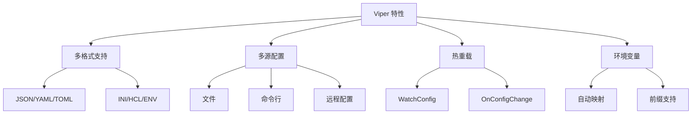
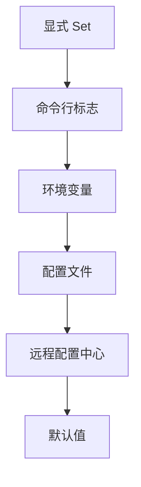

import { Badge } from '@rspress/core/theme';
import { Callout } from '@rspress/core/theme';

# Go Configuration Management Practical Guide

本文全面介绍 **Viper** 配置管理库的使用方法和最佳实践，帮助你构建灵活、可维护的配置系统。

## 📊 Viper 简介

<Badge text="推荐" type="success" /> <Badge text="20K+ Stars" type="info" />

Viper 是 Go 语言中最流行的配置管理库，被广泛应用于各类项目中：

- **Hugo** (静态网站生成器)
- **Docker** (部分组件)
- **Kubernetes** (相关工具)
- **Ember** (CLI 工具)

### 核心特性



## 🚀 快速开始

### 安装

```bash
go get github.com/spf13/viper
```

### 基础用法

```go
package main

import (
    "fmt"
    "github.com/spf13/viper"
)

type Config struct {
    Server struct {
        Host string `mapstructure:"host"`
        Port int    `mapstructure:"port"`
    } `mapstructure:"server"`
    Database struct {
        Driver   string `mapstructure:"driver"`
        Host     string `mapstructure:"host"`
        Port     int    `mapstructure:"port"`
        Username string `mapstructure:"username"`
        Password string `mapstructure:"password"`
        Name     string `mapstructure:"name"`
    } `mapstructure:"database"`
    Log struct {
        Level  string `mapstructure:"level"`
        Format string `mapstructure:"format"`
    } `mapstructure:"log"`
}

func main() {
    // 创建 Viper 实例
    v := viper.New()

    // 设置配置文件名和路径
    v.SetConfigName("config")
    v.SetConfigType("yaml")
    v.AddConfigPath(".")
    v.AddConfigPath("/etc/myapp/")
    v.AddConfigPath("$HOME/.myapp/")

    // 读取配置文件
    if err := v.ReadInConfig(); err != nil {
        if _, ok := err.(viper.ConfigFileNotFoundError); ok {
            fmt.Println("配置文件未找到，使用默认值")
        } else {
            panic(fmt.Errorf("读取配置文件失败: %w", err))
        }
    }

    // 设置默认值
    setDefaults(v)

    // 解析到结构体
    var config Config
    if err := v.Unmarshal(&config); err != nil {
        panic(fmt.Errorf("解析配置失败: %w", err))
    }

    // 使用配置
    fmt.Printf("服务器地址: %s:%d\n", config.Server.Host, config.Server.Port)
}

func setDefaults(v *viper.Viper) {
    v.SetDefault("server.host", "0.0.0.0")
    v.SetDefault("server.port", 8080)
    v.SetDefault("log.level", "info")
    v.SetDefault("log.format", "json")
}
```

## 📝 配置文件格式

### YAML 配置

```yaml
# config.yaml
server:
  host: "0.0.0.0"
  port: 8080
  timeout: 30s

database:
  driver: "mysql"
  host: "localhost"
  port: 3306
  username: "root"
  password: "password"
  name: "myapp"
  max_open_conns: 100
  max_idle_conns: 10

log:
  level: "info"
  format: "json"
  output: "stdout"

features:
  cache:
    enabled: true
    ttl: 3600
  rate_limit:
    enabled: true
    requests_per_second: 100
```

### JSON 配置

```json
{
  "server": {
    "host": "0.0.0.0",
    "port": 8080,
    "timeout": "30s"
  },
  "database": {
    "driver": "mysql",
    "host": "localhost",
    "port": 3306,
    "username": "root",
    "password": "password",
    "name": "myapp"
  },
  "log": {
    "level": "info",
    "format": "json"
  }
}
```

### TOML 配置

```toml
# config.toml
[server]
host = "0.0.0.0"
port = 8080
timeout = "30s"

[database]
driver = "mysql"
host = "localhost"
port = 3306
username = "root"
password = "password"
name = "myapp"

[log]
level = "info"
format = "json"
```

## 🎯 配置优先级

### 优先级顺序（从高到低）



### 代码示例

```go
package main

import (
    "fmt"
    "github.com/spf13/viper"
)

func main() {
    v := viper.New()

    // 1. 设置默认值（最低优先级）
    v.SetDefault("server.port", 8080)
    v.SetDefault("log.level", "info")

    // 2. 读取配置文件
    v.SetConfigFile("config.yaml")
    v.ReadInConfig()

    // 3. 环境变量
    v.SetEnvPrefix("MYAPP")
    v.AutomaticEnv()
    v.BindEnv("server.port", "MYAPP_SERVER_PORT")
    v.BindEnv("database.password", "MYAPP_DB_PASSWORD")

    // 4. 命令行标志（需要 pflag）
    // pflag.String("port", "", "Server port")
    // v.BindPFlag("server.port", pflag.Lookup("port"))

    // 获取配置
    port := v.GetInt("server.port")
    fmt.Printf("实际使用的端口: %d\n", port)
}
```

## 🔧 高级功能

### 环境变量映射

```go
// 基本用法
v.SetEnvPrefix("APP")
v.AutomaticEnv()

// APP_PORT -> port
// APP_DATABASE_HOST -> database.host

// 自定义映射
v.BindEnv("server.port", "SERVER_PORT")
v.BindEnv("database.password", "DB_PASSWORD")

// 使用环境变量
port := v.GetInt("server.port")
password := v.GetString("database.password")
```

### 热重载

```go
package main

import (
    "fmt"
    "log"
    "github.com/fsnotify/fsnotify"
    "github.com/spf13/viper"
)

func main() {
    v := viper.New()
    v.SetConfigFile("config.yaml")

    if err := v.ReadInConfig(); err != nil {
        log.Fatal(err)
    }

    // 监听配置文件变化
    v.WatchConfig()
    v.OnConfigChange(func(e fsnotify.Event) {
        fmt.Printf("配置文件已更改: %s\n", e.Name)
        fmt.Printf("新的配置: %+v\n", v.AllSettings())

        // 重新加载配置
        if err := v.Unmarshal(&config); err != nil {
            log.Printf("重新加载配置失败: %v\n", err)
        }
    })

    // 应用运行...
    select {}
}
```

### 多环境配置

```go
package main

import (
    "flag"
    "os"
    "github.com/spf13/viper"
)

func LoadConfig(env string) (*Config, error) {
    v := viper.New()

    // 根据环境选择配置文件
    v.SetConfigName(fmt.Sprintf("config.%s", env))
    v.AddConfigPath(".")
    v.AddConfigPath("./configs")

    if err := v.ReadInConfig(); err != nil {
        return nil, err
    }

    var config Config
    if err := v.Unmarshal(&config); err != nil {
        return nil, err
    }

    return &config, nil
}

func main() {
    // 从命令行获取环境
    env := flag.String("env", "development", "运行环境")
    flag.Parse()

    // 也可以从环境变量获取
    if e := os.Getenv("APP_ENV"); e != "" {
        env = &e
    }

    config, err := LoadConfig(*env)
    if err != nil {
        panic(err)
    }

    fmt.Printf("加载 %s 环境配置\n", *env)
    fmt.Printf("服务器地址: %s:%d\n", config.Server.Host, config.Server.Port)
}
```

目录结构：

```
configs/
├── config.development.yaml
├── config.staging.yaml
├── config.production.yaml
└── config.test.yaml
```

### 远程配置中心

```go
import (
    "github.com/spf13/viper"
    "github.com/spf13/viper/remote"
)

func main() {
    // Etcd
    viper.AddRemoteProvider("etcd", "http://127.0.0.1:4001", "/config/myapp.yaml")

    // Consul
    viper.AddRemoteProvider("consul", "http://127.0.0.1:8500", "/config/myapp.yaml")

    // Firestore
    viper.AddRemoteProvider("firestore", "google-cloud-project-id", "collection/document")

    // 读取远程配置
    viper.SetConfigType("yaml")
    if err := viper.ReadRemoteConfig(); err != nil {
        panic(err)
    }

    // 监听远程配置变化
    viper.WatchRemoteConfig()
    viper.OnConfigChange(func(e fsnotify.Event) {
        fmt.Println("远程配置已更改")
        // 重新加载配置...
    })
}
```

### 配置加密

```go
import (
    "crypto/aes"
    "crypto/cipher"
    "encoding/base64"
)

// 加密配置值
func encrypt(key, plaintext string) (string, error) {
    block, err := aes.NewCipher([]byte(key))
    if err != nil {
        return "", err
    }

    gcm, err := cipher.NewGCM(block)
    if err != nil {
        return "", err
    }

    nonce := make([]byte, gcm.NonceSize())
    ciphertext := gcm.Seal(nonce, nonce, []byte(plaintext), nil)

    return base64.StdEncoding.EncodeToString(ciphertext), nil
}

// 解密配置值
func decrypt(key, ciphertext string) (string, error) {
    data, err := base64.StdEncoding.DecodeString(ciphertext)
    if err != nil {
        return "", err
    }

    block, err := aes.NewCipher([]byte(key))
    if err != nil {
        return "", err
    }

    gcm, err := cipher.NewGCM(block)
    if err != nil {
        return "", err
    }

    nonceSize := gcm.NonceSize()
    nonce, cipherData := data[:nonceSize], data[nonceSize:]

    plaintext, err := gcm.Open(nil, nonce, cipherData, nil)
    if err != nil {
        return "", err
    }

    return string(plaintext), nil
}

// 使用加密配置
func loadConfigWithEncryption() {
    v := viper.New()
    v.SetConfigFile("config.yaml")
    v.ReadInConfig()

    // 解密敏感信息
    encrypted := v.GetString("database.password")
    decrypted, err := decrypt("encryption-key", encrypted)
    if err != nil {
        panic(err)
    }

    fmt.Printf("解密后的密码: %s\n", decrypted)
}
```

## 🎨 配置验证

### 结构体验证

```go
import (
    "github.com/go-playground/validator/v10"
)

type Config struct {
    Server struct {
        Host string `mapstructure:"host" validate:"required,hostname"`
        Port int    `mapstructure:"port" validate:"required,min=1,max=65535"`
    } `mapstructure:"server"`
    Database struct {
        Driver   string `mapstructure:"driver" validate:"required,oneof=mysql postgres sqlite"`
        Host     string `mapstructure:"host" validate:"required"`
        Port     int    `mapstructure:"port" validate:"required,min=1,max=65535"`
        Username string `mapstructure:"username" validate:"required"`
        Password string `mapstructure:"password" validate:"required"`
        Name     string `mapstructure:"name" validate:"required"`
    } `mapstructure:"database"`
    Log struct {
        Level  string `mapstructure:"level" validate:"required,oneof=debug info warn error"`
        Format string `mapstructure:"format" validate:"required,oneof=json text"`
    } `mapstructure:"log"`
}

func validateConfig(config *Config) error {
    validate := validator.New()
    return validate.Struct(config)
}

func main() {
    v := viper.New()
    v.SetConfigFile("config.yaml")
    v.ReadInConfig()

    var config Config
    if err := v.Unmarshal(&config); err != nil {
        panic(err)
    }

    // 验证配置
    if err := validateConfig(&config); err != nil {
        panic(fmt.Errorf("配置验证失败: %w", err))
    }

    fmt.Println("配置验证通过")
}
```

### 自定义验证

```go
func validateDatabaseConnection(config *Config) error {
    // 尝试连接数据库
    dsn := fmt.Sprintf("%s:%s@tcp(%s:%d)/%s",
        config.Database.Username,
        config.Database.Password,
        config.Database.Host,
        config.Database.Port,
        config.Database.Name,
    )

    db, err := sql.Open(config.Database.Driver, dsn)
    if err != nil {
        return fmt.Errorf("数据库连接失败: %w", err)
    }
    defer db.Close()

    if err := db.Ping(); err != nil {
        return fmt.Errorf("数据库 Ping 失败: %w", err)
    }

    return nil
}

func main() {
    config := loadConfig()

    // 执行验证
    if err := validateConfig(&config); err != nil {
        panic(err)
    }

    if err := validateDatabaseConnection(&config); err != nil {
        panic(err)
    }

    fmt.Println("所有验证通过")
}
```

## 📦 配置管理最佳实践

### 项目结构

```
myapp/
├── cmd/
│   └── server/
│       └── main.go
├── internal/
│   └── config/
│       ├── config.go
│       └── validator.go
├── configs/
│   ├── config.development.yaml
│   ├── config.staging.yaml
│   └── config.production.yaml
└── go.mod
```

### 配置管理模块

```go
// internal/config/config.go
package config

import (
    "fmt"
    "os"
    "github.com/spf13/viper"
)

type Config struct {
    Server   ServerConfig   `mapstructure:"server"`
    Database DatabaseConfig `mapstructure:"database"`
    Log      LogConfig      `mapstructure:"log"`
}

type ServerConfig struct {
    Host    string `mapstructure:"host"`
    Port    int    `mapstructure:"port"`
    Timeout int    `mapstructure:"timeout"`
}

type DatabaseConfig struct {
    Driver     string `mapstructure:"driver"`
    Host       string `mapstructure:"host"`
    Port       int    `mapstructure:"port"`
    Username   string `mapstructure:"username"`
    Password   string `mapstructure:"password"`
    Name       string `mapstructure:"name"`
    MaxOpenConns int  `mapstructure:"max_open_conns"`
    MaxIdleConns int  `mapstructure:"max_idle_conns"`
}

type LogConfig struct {
    Level  string `mapstructure:"level"`
    Format string `mapstructure:"format"`
    Output string `mapstructure:"output"`
}

func Load(env string) (*Config, error) {
    v := viper.New()

    // 设置配置文件路径
    v.SetConfigName(fmt.Sprintf("config.%s", env))
    v.AddConfigPath("./configs")
    v.AddConfigPath(".")

    // 读取配置文件
    if err := v.ReadInConfig(); err != nil {
        return nil, fmt.Errorf("读取配置文件失败: %w", err)
    }

    // 环境变量支持
    v.SetEnvPrefix("MYAPP")
    v.AutomaticEnv()

    // 解析配置
    var config Config
    if err := v.Unmarshal(&config); err != nil {
        return nil, fmt.Errorf("解析配置失败: %w", err)
    }

    return &config, nil
}

func LoadFromDefault() (*Config, error) {
    env := os.Getenv("APP_ENV")
    if env == "" {
        env = "development"
    }
    return Load(env)
}
```

### 配置导出

```go
func ExportConfig(config *Config, format string) error {
    v := viper.New()
    if err := v.Unmarshal(&config); err != nil {
        return err
    }

    var filename string
    switch format {
    case "yaml":
        filename = "config.exported.yaml"
    case "json":
        filename = "config.exported.json"
    case "toml":
        filename = "config.exported.toml"
    default:
        return fmt.Errorf("不支持的格式: %s", format)
    }

    v.SetConfigFile(filename)
    if err := v.WriteConfig(); err != nil {
        return err
    }

    fmt.Printf("配置已导出到: %s\n", filename)
    return nil
}

func main() {
    config := loadConfig()

    // 导出为不同格式
    ExportConfig(&config, "yaml")
    ExportConfig(&config, "json")
    ExportConfig(&config, "toml")
}
```

## 🧪 配置测试

### 单元测试

```go
// internal/config/config_test.go
package config

import (
    "testing"
)

func TestLoadConfig(t *testing.T) {
    tests := []struct {
        name    string
        env     string
        wantErr bool
    }{
        {
            name:    "开发环境",
            env:     "development",
            wantErr: false,
        },
        {
            name:    "生产环境",
            env:     "production",
            wantErr: false,
        },
        {
            name:    "不存在环境",
            env:     "nonexistent",
            wantErr: true,
        },
    }

    for _, tt := range tests {
        t.Run(tt.name, func(t *testing.T) {
            config, err := Load(tt.env)
            if (err != nil) != tt.wantErr {
                t.Errorf("Load() error = %v, wantErr %v", err, tt.wantErr)
                return
            }

            if !tt.wantErr {
                if config.Server.Port == 0 {
                    t.Error("服务器端口不应为 0")
                }
            }
        })
    }
}

func TestConfigValidation(t *testing.T) {
    config := &Config{
        Server: ServerConfig{
            Host: "localhost",
            Port: 8080,
        },
        Database: DatabaseConfig{
            Driver:   "mysql",
            Host:     "localhost",
            Port:     3306,
            Username: "root",
            Password: "password",
            Name:     "testdb",
        },
        Log: LogConfig{
            Level:  "info",
            Format: "json",
        },
    }

    if err := validateConfig(config); err != nil {
        t.Errorf("配置验证失败: %v", err)
    }
}
```

## 🎓 最佳实践

### 1. 配置文件组织

```yaml
# 开发环境 - config.development.yaml
server:
  host: "localhost"
  port: 8080
log:
  level: "debug"

# 生产环境 - config.production.yaml
server:
  host: "0.0.0.0"
  port: 80
log:
  level: "info"
```

### 2. 敏感信息处理

```go
// ❌ 不好：硬编码敏感信息
database:
  password: "plaintext_password"

// ✅ 好：使用环境变量
database:
  password: ${DB_PASSWORD}

// ✅ 更好：使用加密
database:
  password: "encrypted_password"
```

### 3. 配置验证

```go
// 始终验证配置
config := loadConfig()
if err := validateConfig(&config); err != nil {
    panic(fmt.Errorf("配置验证失败: %w", err))
}
```

### 4. 配置文档

```go
// 使用注释说明配置项
type Config struct {
    // Server 服务器配置
    Server struct {
        // Host 监听地址
        Host string `mapstructure:"host"`
        // Port 监听端口 (1-65535)
        Port int `mapstructure:"port"`
    } `mapstructure:"server"`
}
```

## 🔗 参考资源

- [Viper 官方文档](https://github.com/spf13/viper)
- [Go 配置管理最佳实践](https://go.dev/doc/effective_go#initialization)
- [12-Factor App 配置](https://12factor.net/config)

---

**关键要点**：Viper 是 Go 配置管理的首选库。记住 <Badge text="配置优先级" type="info" />、<Badge text="环境变量映射" type="info" /> 和 <Badge text="配置验证" type="info" /> 是三大核心概念。
