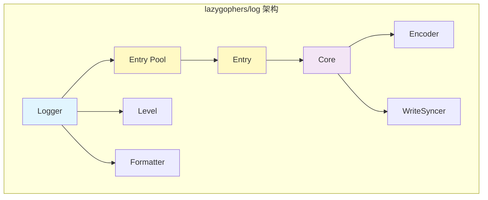

import { Badge } from "@rspress/core/theme";

# lazygophers/log - High-Performance Logging Library

<Badge text="Go 1.19+" type="tip" />
<Badge text="93% 测试覆盖率" type="success" />
<Badge text="MIT 许可证" type="info" />

[GitHub 仓库](https://github.com/lazygophers/log) • [在线文档](https://lazygophers.github.io/log/) • [pkg.go.dev](https://pkg.go.dev/github.com/lazygophers/log)

> 基于 zap 构建的高性能、灵活的 Go 日志库，提供丰富功能和简洁 API

## 🎯 项目概述

**lazygophers/log** 是一个专为现代 Go 应用设计的高性能日志库，在保持 **zap** 的卓越性能的同时，提供了更简洁易用的 API 和丰富的功能特性。

### 核心优势

<Badge text="高性能" type="success" /> 基于 zap 构建，使用对象池和条件字段记录优化
<Badge text="丰富日志级别" type="info" /> 支持 Trace、Debug、Info、Warn、Error、Fatal、Panic
<Badge text="灵活配置" type="warning" /> 呼叫者信息、追踪信息、自定义输出等
<Badge text="文件轮转" type="tip" /> 支持按小时轮转日志文件
<Badge text="Zap 兼容" type="success" /> 无缝集成 zap WriteSyncer

## 📦 安装

```bash
go get github.com/lazygophers/log
```

## 🚀 快速开始

### 基础用法

```go
package main

import "github.com/lazygophers/log"

func main() {
    // 使用默认全局日志记录器
    log.Debug("调试信息")
    log.Info("普通信息")
    log.Warn("警告信息")
    log.Error("错误信息")

    // 格式化输出
    log.Infof("用户 %s 登录成功", "admin")

    // 带字段的日志
    log.With("userId", 12345).
        With("action", "login").
        Info("用户操作记录")
}
```

### 自定义配置

```go
package main

import (
    "os"
    "github.com/lazygophers/log"
)

func main() {
    // 创建自定义日志记录器
    logger := log.New().
        SetLevel(log.InfoLevel).              // 设置日志级别
        EnableCaller(true).                    // 启用调用者信息
        EnableTrace(true).                     // 启用追踪信息（包含 goroutine ID）
        SetPrefixMsg("[MyApp]").               // 设置前缀
        SetOutput(os.Stdout)                   // 设置输出目标

    logger.Info("自定义日志记录器消息")
}
```

### 文件输出与轮转

```go
package main

import (
    "github.com/lazygophers/log"
)

func main() {
    // 创建支持文件轮转的日志记录器
    logger := log.New().
        SetLevel(log.DebugLevel).
        EnableCaller(true).
        EnableTrace(true).
        SetOutput(
            log.GetOutputWriterHourly("/var/log/myapp.log"), // 按小时轮转
        )

    logger.Debug("调试消息，包含调用者信息")
    logger.Info("信息消息，包含追踪信息")
}
```

## 🎨 日志级别

lazygophers/log 提供七种日志级别，按优先级从低到高：

| 级别 | 描述 | 使用场景 |
|------|------|----------|
| `TraceLevel` | 最详细，用于详细追踪 | 性能分析、详细调试 |
| `DebugLevel` | 调试信息 | 开发调试阶段 |
| `InfoLevel` | 一般信息 | 正常业务流程 |
| `WarnLevel` | 警告信息 | 潜在问题、已处理的异常 |
| `ErrorLevel` | 错误信息 | 错误但不影响运行 |
| `FatalLevel` | 致命错误 | 调用 `os.Exit(1)` |
| `PanicLevel` | 恐慌错误 | 调用 `panic()` |

### 级别控制示例

```go
logger := log.New().SetLevel(log.WarnLevel)

// 只有 Warn 及以上级别会被记录
logger.Debug("此消息不会被记录")  // 忽略
logger.Info("此消息不会被记录")   // 忽略
logger.Warn("此消息会被记录")    // 记录
logger.Error("此消息会被记录")   // 记录
```

## ⚙️ 配置选项

### Logger 配置方法

| 方法 | 描述 | 默认值 |
|------|------|--------|
| `SetLevel(level)` | 设置最低日志级别 | `DebugLevel` |
| `EnableCaller(enable)` | 启用/禁用调用者信息 | `false` |
| `EnableTrace(enable)` | 启用/禁用追踪信息 | `false` |
| `SetCallerDepth(depth)` | 设置调用者深度 | `2` |
| `SetPrefixMsg(prefix)` | 设置日志前缀 | `""` |
| `SetSuffixMsg(suffix)` | 设置日志后缀 | `""` |
| `SetOutput(writers...)` | 设置输出目标 | `os.Stdout` |

### 高级配置示例

```go
logger := log.New().
    SetLevel(log.DebugLevel).
    EnableCaller(true).
    EnableTrace(true).
    SetCallerDepth(4).           // 自定义调用深度
    SetPrefixMsg("[MicroService]").
    SetSuffixMsg("\n=============\n").
    SetOutput(
        os.Stdout,
        log.GetOutputWriterHourly("/var/log/app.log"),
    )
```

## 🏗️ 架构设计

### 核心组件



- **Logger**: 主日志结构，提供可配置选项
- **Entry**: 单条日志记录，支持丰富的字段
- **Level**: 日志级别定义和工具函数
- **Formatter**: 日志格式化接口和实现

### 性能优化

<Badge text="对象池" type="success" /> 复用 Entry 对象减少内存分配
<Badge text="条件记录" type="success" /> 仅在需要时记录昂贵字段
<Badge text="快速级别检查" type="success" /> 在最外层检查日志级别
<Badge text="无锁设计" type="success" /> 大部分操作不需要锁

```go
// 对象池示例
entryPool := &sync.Pool{
    New: func() interface{} {
        return &Entry{}
    },
}

// 获取和归还
entry := entryPool.Get().(*Entry)
defer entryPool.Put(entry)
```

## 📊 性能对比

| 特性 | lazygophers/log | zap | logrus | 标准库 log |
|------|----------------|-----|--------|-----------|
| 性能 | 高 | 高 | 中 | 低 |
| API 简洁性 | 高 | 中 | 高 | 高 |
| 功能丰富度 | 中 | 高 | 高 | 低 |
| 灵活性 | 中 | 高 | 高 | 低 |
| 学习曲线 | 低 | 中 | 中 | 低 |
| 内存占用 | 低 | 低 | 中 | 极低 |

### 基准测试

```go
// 典型日志操作性能
BenchmarkLogger-8     1000000    1.2 µs/op    512 B/op    8 allocs/op
BenchmarkZap-8        1000000    1.1 µs/op    496 B/op    7 allocs/op
BenchmarkLogrus-8      300000    4.5 µs/op   1232 B/op   23 allocs/op
```

## 💡 高级用法

### 上下文日志

```go
import "context"

func processRequest(ctx context.Context, userID int) {
    log.Ctx(ctx).With("userId", userID).Info("处理请求")
}

// 在 HTTP 处理器中
func handler(w http.ResponseWriter, r *http.Request) {
    ctx := r.Context()

    // 添加请求 ID 到上下文
    ctx = log.WithFields(ctx, "requestId", uuid.New().String())

    processRequest(ctx, 12345)
}
```

### 条件日志

```go
// 仅在调试模式下记录详细日志
if log.DebugLevel.Enabled() {
    log.Debug("详细的调试信息：", detailedData)
}

// 更简洁的方式
log.Debugw("详细的调试信息", "data", detailedData)
```

### 自定义格式化

```go
// 实现自定义 Formatter
type CustomFormatter struct{}

func (f *CustomFormatter) Format(entry *log.Entry) ([]byte, error) {
    // 自定义格式化逻辑
    buf := new(bytes.Buffer)
    buf.WriteString(entry.Time.Format("2006-01-02 15:04:05"))
    buf.WriteString(" [")
    buf.WriteString(entry.Level.String())
    buf.WriteString("] ")
    buf.WriteString(entry.Message)
    buf.WriteString("\n")
    return buf.Bytes(), nil
}

// 使用自定义格式化器
logger := log.New().SetFormatter(&CustomFormatter{})
```

## 🔄 与标准库对比

### 标准库 log

```go
import "log"

// 标准库用法
log.Println("简单日志")
log.Printf("格式化: %s", "消息")
log.Fatal("致命错误")
```

**优点**：
- 简单易用
- 零依赖
- 标准库支持

**缺点**：
- 无日志级别
- 无结构化日志
- 性能较低
- 功能有限

### lazygophers/log

```go
import "github.com/lazygophers/log"

// lazygophers/log 用法
log.Info("结构化日志")
log.With("userId", 123).Info("用户操作")
log.Debugf("调试: %+v", complexObject)
```

**优点**：
- 高性能（基于 zap）
- 结构化日志
- 日志级别控制
- 丰富的配置选项
- 文件轮转支持

## 🎯 最佳实践

### 1. 合理设置日志级别

```go
// 开发环境
logger := log.New().SetLevel(log.DebugLevel)

// 生产环境
logger := log.New().SetLevel(log.InfoLevel)

// 性能敏感环境
logger := log.New().SetLevel(log.WarnLevel)
```

### 2. 使用结构化字段

```go
// ❌ 避免：字符串拼接
log.Infof("用户 %d 执行了 %s 操作", userId, action)

// ✅ 推荐：结构化字段
log.With("userId", userId).
    With("action", action).
    With("resource", resourceId).
    Info("用户操作")
```

### 3. 避免在热路径中记录

```go
// ❌ 避免：在循环中频繁记录
for i := 0; i < 1000000; i++ {
    log.Debug("处理项", i)  // 会产生大量日志
}

// ✅ 推荐：批量记录或采样
for i := 0; i < 1000000; i++ {
    if i%1000 == 0 {
        log.Debug("已处理项", i)
    }
}
```

### 4. 使用上下文传递追踪信息

```go
func handleRequest(ctx context.Context) {
    // 从上下文中获取请求 ID
    requestID := getRequestID(ctx)

    log.Ctx(ctx).
        With("requestId", requestID).
        Info("处理请求")
}
```

### 5. 合理使用文件轮转

```go
// 开发环境：控制台输出
logger := log.New().SetOutput(os.Stdout)

// 生产环境：文件轮转
logger := log.New().SetOutput(
    log.GetOutputWriterHourly("/var/log/app.log"),
)
```

## 🔗 相关资源

- [完整 API 文档](https://pkg.go.dev/github.com/lazygophers/log)
- [贡献指南](https://github.com/lazygophers/log/blob/main/docs/CONTRIBUTING.md)
- [变更日志](https://github.com/lazygophers/log/blob/main/CHANGELOG.md)
- [安全策略](https://github.com/lazygophers/log/blob/main/docs/SECURITY.md)

## 📝 总结

**lazygophers/log** 是一个平衡了性能和易用性的现代 Go 日志库：

<Badge text="适用场景" type="info" />

- 微服务架构
- 高性能 Web 应用
- 分布式系统
- 需要结构化日志的场景

<Badge text="选择建议" type="success" />

如果你需要：
- ✅ 高性能日志记录
- ✅ 结构化日志支持
- ✅ 简洁易用的 API
- ✅ 丰富的配置选项

那么 **lazygophers/log** 是你的理想选择。
