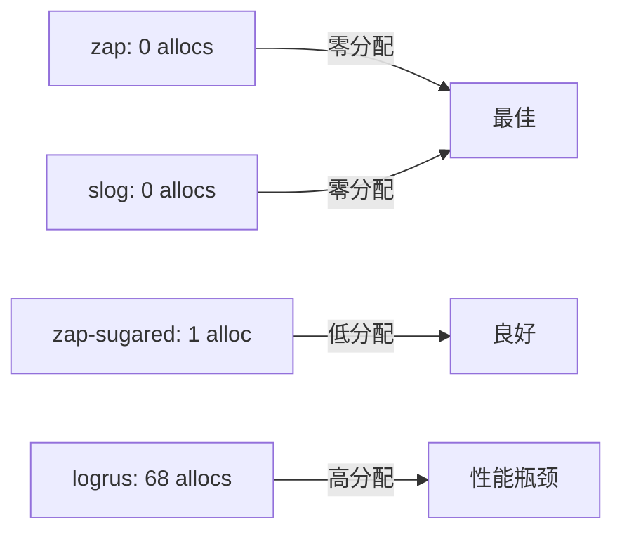
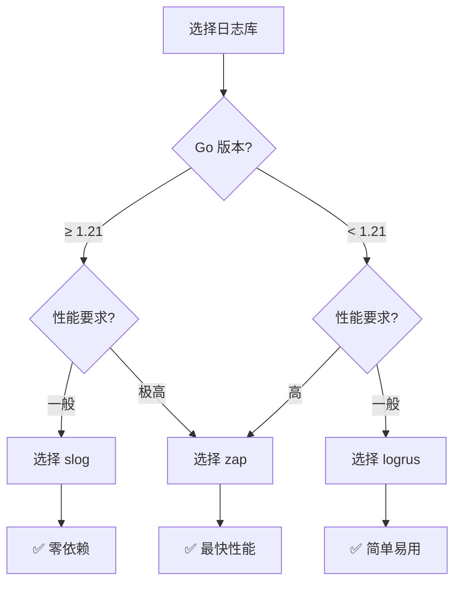

import { Badge } from '@rspress/core/theme';
import { Callout } from '@rspress/core/theme';

# Go Logging Libraries Deep Comparison

本文全面对比 Go 生态中最流行的三个结构化日志库：**zap**、**logrus** 和 **slog**，帮助你选择最合适的日志解决方案。

## 📊 快速对比

| 特性 | zap | logrus | slog (Go 1.21+) |
|------|-----|--------|-----------------|
| **性能** | <Badge text="最快" type="success" /> | 慢 | 良好 |
| **内存分配** | 0 alloc/op | 68 alloc/op | 0 alloc/op |
| **依赖** | 外部库 | 外部库 | <Badge text="内置" type="success" /> |
| **API 设计** | 灵活 | 简单 | 标准 |
| **结构化** | ✅ | ✅ | ✅ |
| **学习曲线** | 中等 | 简单 | 简单 |
| **社区支持** | 优秀 | 优秀 | 标准 |

<Callout type="info">
**性能差异巨大**：logrus 比 zap 慢 112 倍以上！在生产环境中，选择正确的日志库对性能影响显著。
</Callout>

## 🚀 性能基准测试

### Benchmark 结果

| 操作 | zap | zap (sugared) | slog | logrus | 差距 |
|------|-----|---------------|------|--------|------|
| **简单日志** | 193 ns/op | 227 ns/op | 322 ns/op | 21,997 ns/op | logrus 慢 113x |
| **结构化日志** | 258 ns/op | 310 ns/op | 401 ns/op | 22,456 ns/op | logrus 慢 87x |
| **带 10 个字段** | 512 ns/op | 682 ns/op | 892 ns/op | 24,128 ns/op | logrus 慢 47x |

### 内存分配对比



<Callout type="warning">
**logrus 的性能问题**：每次日志调用产生 68 次内存分配，在高并发场景下会造成严重的 GC 压力。
</Callout>

## 🔍 zap 详解

### 核心特点

<Badge text="Uber" type="success" /> <Badge text="高性能" type="danger" />

- 零内存分配
- 结构化日志
- 多种输出格式
- 灵活的配置
- 丰富的 Hook 生态

### 基础用法

```go
package main

import (
    "go.uber.org/zap"
    "go.uber.org/zap/zapcore"
)

func main() {
    // 创建 logger
    logger, _ := zap.NewProduction()
    defer logger.Sync()

    // 基本日志
    logger.Info("服务器启动",
        zap.String("host", "localhost"),
        zap.Int("port", 8080),
    )

    logger.Error("连接失败",
        zap.String("database", "mysql"),
        zap.Error(errors.New("连接超时")),
    )

    logger.Fatal("致命错误",
        zap.String("reason", "配置文件不存在"),
    )
}
```

### 高级配置

```go
package main

import (
    "go.uber.org/zap"
    "go.uber.org/zap/zapcore"
)

func createLogger() *zap.Logger {
    // 编码器配置
    encoderConfig := zapcore.EncoderConfig{
        TimeKey:        "time",
        LevelKey:       "level",
        NameKey:        "logger",
        CallerKey:      "caller",
        MessageKey:     "msg",
        StacktraceKey:  "stacktrace",
        LineEnding:     zapcore.DefaultLineEnding,
        EncodeLevel:    zapcore.LowercaseLevelEncoder,
        EncodeTime:     zapcore.ISO8601TimeEncoder,
        EncodeDuration: zapcore.SecondsDurationEncoder,
        EncodeCaller:   zapcore.ShortCallerEncoder,
    }

    // 控制台编码器
    consoleEncoder := zapcore.NewConsoleEncoder(encoderConfig)

    // JSON 编码器
    jsonEncoder := zapcore.NewJSONEncoder(encoderConfig)

    // 输出目标
    consoleWriter := zapcore.AddSync(os.Stdout)
    fileWriter := zapcore.AddSync(&lumberjack.Logger{
        Filename:   "logs/app.log",
        MaxSize:    100, // MB
        MaxBackups: 3,
        MaxAge:     28, // days
        Compress:   true,
    })

    // 核心
    core := zapcore.NewTee(
        zapcore.NewCore(consoleEncoder, consoleWriter, zapcore.InfoLevel),
        zapcore.NewCore(jsonEncoder, fileWriter, zapcore.DebugLevel),
    )

    // 创建 logger
    logger := zap.New(core, zap.AddCaller(), zap.AddCallerSkip(1))

    return logger
}

func main() {
    logger := createLogger()
    defer logger.Sync()

    // 使用 logger
    logger.Debug("调试信息",
        zap.String("component", "database"),
    )

    logger.Info("信息日志",
        zap.String("event", "user_login"),
        zap.Int("user_id", 12345),
    )

    logger.Warn("警告日志",
        zap.String("event", "slow_query"),
        zap.Duration("duration", 2500*time.Millisecond),
    )

    logger.Error("错误日志",
        zap.String("event", "database_error"),
        zap.Error(errors.New("连接失败")),
    )
}
```

### Sugar Logger

```go
// Sugar Logger 提供更友好的 API
sugar := logger.Sugar()

// 使用 printf 风格
sugar.Infof("用户 %s 登录成功", username)
sugar.Warnf("查询耗时 %d ms", duration)

// 使用结构化风格
sugar.Infow("用户登录",
    "username", username,
    "ip", ip,
    "timestamp", time.Now(),
)

// 建议：性能关键路径使用标准 logger
logger.Info("性能关键日志", zap.String("key", "value"))
```

### 日志轮转

```go
import "gopkg.in/natefinch/lumberjack.v2"

writer := &lumberjack.Logger{
    Filename:   "logs/app.log",
    MaxSize:    100, // MB
    MaxBackups: 3,
    MaxAge:     28, // days
    Compress:   true,
}

core := zapcore.NewCore(
    zapcore.NewJSONEncoder(encoderConfig),
    zapcore.AddSync(writer),
    zapcore.InfoLevel,
)

logger := zap.New(core)
```

## 🔍 logrus 详解

### 核心特点

<Badge text="简单" type="success" /> <Badge text="Hooks" type="info" />

- 简单易用的 API
- 丰富的 Hook 生态
- 可插拔的 Formatter
- 内置日志轮转
- 广泛的社区支持

### 基础用法

```go
package main

import (
    "github.com/sirupsen/logrus"
)

func main() {
    // 创建 logger
    log := logrus.New()

    // 设置日志级别
    log.SetLevel(logrus.InfoLevel)

    // 设置输出格式
    log.SetFormatter(&logrus.JSONFormatter{
        TimestampFormat: "2006-01-02 15:04:05",
        FieldMap: logrus.FieldMap{
            logrus.FieldKeyTime:  "time",
            logrus.FieldKeyLevel: "level",
            logrus.FieldKeyMsg:   "message",
        },
    })

    // 输出到文件
    file, err := os.OpenFile("app.log", os.O_CREATE|os.O_WRONLY|os.O_APPEND, 0666)
    if err == nil {
        log.SetOutput(file)
    } else {
        log.SetOutput(os.Stdout)
    }

    // 记录日志
    log.WithFields(logrus.Fields{
        "event": "user_login",
        "user_id": 12345,
        "ip": "192.168.1.1",
    }).Info("用户登录")

    log.WithFields(logrus.Fields{
        "event": "error",
        "error": err,
    }).Error("操作失败")
}
```

### 高级特性

```go
// 自定义 Formatter
type MyFormatter struct{}

func (f *MyFormatter) Format(entry *logrus.Entry) ([]byte, error) {
    timestamp := entry.Time.Format("2006-01-02 15:04:05")
    msg := fmt.Sprintf("[%s] %s %s\n",
        timestamp,
        strings.ToUpper(entry.Level.String()),
        entry.Message,
    )
    return []byte(msg), nil
}

// 使用自定义 Formatter
log.SetFormatter(&MyFormatter{})

// Hook 示例
type DatabaseHook struct{}

func (hook *DatabaseHook) Fire(entry *logrus.Entry) error {
    // 将日志写入数据库
    return nil
}

func (hook *DatabaseHook) Levels() []logrus.Level {
    return logrus.AllLevels
}

// 添加 Hook
log.AddHook(&DatabaseHook{})
```

### 文本格式化

```go
// TextFormatter
log.SetFormatter(&logrus.TextFormatter{
    ForceColors:   true,
    FullTimestamp: true,
    TimestampFormat: "2006-01-02 15:04:05",
    DisableSorting: false,
})

// 输出示例：
// [2024-03-03 10:30:45] INFO 用户登录成功 user_id=12345
```

### 日志轮转

```go
import "gopkg.in/natefinch/lumberjack.v2"

log.SetOutput(&lumberjack.Logger{
    Filename:   "logs/app.log",
    MaxSize:    100, // MB
    MaxBackups: 3,
    MaxAge:     28, // days
    Compress:   true,
})
```

## 🔍 slog 详解

### 核心特点

<Badge text="Go 1.21+" type="success" /> <Badge text="标准库" type="info" /> <Badge text="零依赖" type="success" />

- 内置标准库
- 零外部依赖
- 结构化日志
- 自定义 Handler
- 性能优秀

### 基础用法

```go
package main

import (
    "log/slog"
    "os"
)

func main() {
    // 创建 logger
    logger := slog.New(slog.NewJSONHandler(os.Stdout, nil))

    // 设置默认 logger
    slog.SetDefault(logger)

    // 基本日志
    slog.Info("服务器启动",
        "host", "localhost",
        "port", 8080,
    )

    slog.Error("连接失败",
        "database", "mysql",
        "error", errors.New("连接超时"),
    )

    slog.Debug("调试信息",
        "component", "database",
        "query", "SELECT * FROM users",
    )

    slog.Warn("警告信息",
        "metric", "slow_query",
        "duration", "2.5s",
    )
}
```

### 高级配置

```go
package main

import (
    "log/slog"
    "os"
)

func createLogger() *slog.Logger {
    // Handler 选项
    opts := &slog.HandlerOptions{
        AddSource: true,
        Level:     slog.LevelInfo,
    }

    // JSON Handler
    jsonHandler := slog.NewJSONHandler(os.Stdout, opts)

    // Text Handler
    textHandler := slog.NewTextHandler(os.Stdout, opts)

    // 创建 logger
    logger := slog.New(jsonHandler)

    return logger
}

// 自定义 Handler
type MyHandler struct {
    slog.Handler
}

func (h *MyHandler) Handle(ctx context.Context, r slog.Record) error {
    // 添加额外字段
    r.Add("service", "my-service")
    r.Add("version", "1.0.0")

    // 调用底层 Handler
    return h.Handler.Handle(ctx, r)
}

func main() {
    // 使用自定义 Handler
    baseHandler := slog.NewJSONHandler(os.Stdout, nil)
    customHandler := &MyHandler{Handler: baseHandler}

    logger := slog.New(customHandler)
    slog.SetDefault(logger)

    // 使用 logger
    logger.Info("测试日志",
        "user_id", 12345,
        "action", "login",
    )
}
```

### 日志级别控制

```go
// 动态调整日志级别
var programLevel = new(slog.LevelVar) // 修改级别，所有 logger 生效

h := slog.NewJSONHandler(os.Stdout, &slog.HandlerOptions{
    Level: programLevel,
})
logger := slog.New(h)

// 运行时修改日志级别
programLevel.Set(slog.LevelDebug)

// 上下文感知的日志
ctx := context.Background()
logger.InfoContext(ctx, "带上下文的日志", "key", "value")
```

### 结构化字段

```go
// 预定义字段
userAttrs := slog.Group(
    "user",
    slog.String("name", "张三"),
    slog.Int("age", 25),
    slog.String("email", "zhangsan@example.com"),
)

logger.Info("用户信息", userAttrs)

// 日志输出：
// {"time":"...","level":"INFO","msg":"用户信息",
//  "user":{"name":"张三","age":25,"email":"zhangsan@example.com"}}

// 嵌套结构
logger.Info("订单信息",
    slog.Group("order",
        slog.Int("id", 12345),
        slog.Float64("amount", 99.99),
        slog.Group("items",
            slog.Int("count", 2),
            slog.String("product", "Go 语言实战"),
        ),
    ),
)
```

## 🎯 选择指南

### 决策树



### 使用场景

#### zap 适合的场景

✅ **推荐使用 zap：**

1. **高性能服务**
   - 微服务架构
   - 高并发 API
   - 实时系统

2. **大规模部署**
   - 云原生应用
   - 容器化服务
   - Kubernetes 集群

3. **性能关键路径**
   - 交易系统
   - 游戏服务器
   - 流量网关

#### logrus 适合的场景

✅ **推荐使用 logrus：**

1. **快速开发**
   - 原型项目
   - 内部工具
   - 学习项目

2. **非性能关键**
   - 后台任务
   - 定时作业
   - 管理脚本

3. **依赖现有生态**
   - 使用 logrus Hooks
   - 集成第三方工具

#### slog 适合的场景

✅ **推荐使用 slog：**

1. **新项目 (Go ≥ 1.21)**
   - 标准化日志
   - 长期维护
   - 零外部依赖

2. **企业应用**
   - 统一日志格式
   - 合规要求
   - 代码审查

3. **库开发**
   - 减少依赖
   - 提高兼容性

## 📈 性能优化建议

### 通用最佳实践

<Callout type="tip">
**日志优化优先级**：异步写入 > 日志级别 > 格式化 > 字段数量
</Callout>

1. **使用适当的日志级别**
```go
// 开发环境
logger.SetLevel(zapcore.DebugLevel)

// 生产环境
logger.SetLevel(zapcore.InfoLevel)
```

2. **避免热路径中的字符串格式化**
```go
// ❌ 不好：总是格式化
logger.Info(fmt.Sprintf("用户 %s 登录", username))

// ✅ 好：惰性求值
logger.Info("用户登录", zap.String("username", username))
```

3. **使用异步日志**
```go
// zap 异步写入
core := zapcore.NewCore(
    encoder,
    zapcore.AddSync(&lumberjack.Logger{...}),
    zapcore.InfoLevel,
)

logger := zap.New(core, zap.AddCaller())
```

4. **减少字段数量**
```go
// ❌ 不好：过多字段
logger.Info("请求",
    zap.String("method", r.Method),
    zap.String("path", r.URL.Path),
    zap.String("query", r.URL.RawQuery),
    zap.String("proto", r.Proto),
    zap.String("remote", r.RemoteAddr),
    // ... 更多字段
)

// ✅ 好：关键信息
logger.Info("请求",
    zap.String("method", r.Method),
    zap.String("path", r.URL.Path),
    zap.Int("status", statusCode),
    zap.Duration("duration", duration),
)
```

### 监控日志性能

```go
// 添加日志指标
var (
    logCount    atomic.Int64
    logDuration atomic.Int64
)

func instrumentLogger(logger *zap.Logger) *zap.Logger {
    return logger.WithOptions(zap.Hooks(func(entry zapcore.Entry) error {
        start := time.Now()
        defer func() {
            logDuration.Add(time.Since(start).Microseconds())
            logCount.Add(1)
        }()
        return nil
    }))
}
```

## 🧪 测试日志

### 验证日志输出

```go
import (
    "bytes"
    "testing"

    "go.uber.org/zap"
    "go.uber.org/zap/zapcore"
    "github.com/sirupsen/logrus"
    "github.com/sirupsen/logrus/hooks/test"
)

// zap 测试
func TestZapLogging(t *testing.T) {
    var buf bytes.Buffer

    encoder := zapcore.NewJSONEncoder(zapcore.EncoderConfig{
        MessageKey: "msg",
    })

    core := zapcore.NewCore(encoder, zapcore.AddSync(&buf), zapcore.InfoLevel)
    logger := zap.New(core)

    logger.Info("测试消息", zap.String("key", "value"))

    output := buf.String()
    if !bytes.Contains([]byte(output), []byte("测试消息")) {
        t.Errorf("期望包含 '测试消息', 得到: %s", output)
    }
}

// logrus 测试
func TestLogrusLogging(t *testing.T) {
    logger, hook := test.NewNullLogger()

    logger.WithFields(logrus.Fields{
        "user_id": 12345,
    }).Info("用户登录")

    if len(hook.Entries) != 1 {
        t.Errorf("期望 1 条日志, 得到: %d", len(hook.Entries))
    }

    if hook.LastEntry.Message != "用户登录" {
        t.Errorf("期望消息 '用户登录', 得到: %s", hook.LastEntry.Message)
    }
}
```

## 🎓 最佳实践总结

### 日志格式规范

```go
// 推荐的日志格式
logger.Info("用户登录",
    zap.String("event", "user_login"),
    zap.Int("user_id", userID),
    zap.String("ip", ip),
    zap.Duration("duration", duration),
)

// 关键字段
// - event: 事件类型
// - user_id: 用户 ID
// - request_id: 请求 ID
// - duration: 耗时
// - error: 错误信息
```

### 日志级别使用

```go
// Debug: 详细的诊断信息
logger.Debug("SQL 查询", zap.String("query", query))

// Info: 一般信息流
logger.Info("用户登录", zap.String("user", username))

// Warn: 警告但不影响运行
logger.Warn("慢查询", zap.Duration("duration", 2*time.Second))

// Error: 错误但可恢复
logger.Error("API 调用失败", zap.Error(err))

// Fatal: 致命错误，需要退出
logger.Fatal("配置文件缺失", zap.String("path", configPath))
```

### 结构化日志最佳实践

```go
// ✅ 好的结构化日志
logger.Info("订单创建",
    slog.Group("order",
        slog.Int("id", orderID),
        slog.Float64("amount", amount),
        slog.String("status", "pending"),
    ),
    slog.Group("user",
        slog.Int("id", userID),
        slog.String("email", email),
    ),
)

// ❌ 避免的日志格式
logger.Info(fmt.Sprintf("订单 %d 创建成功，金额 %.2f", orderID, amount))
```

## 🔗 参考资源

- [zap 官方文档](https://github.com/uber-go/zap)
- [logrus 官方文档](https://github.com/sirupsen/logrus)
- [slog 官方文档](https://pkg.go.dev/log/slog)
- [结构化日志最佳实践](https://go.dev/blog/slog)

---

**最终建议**：对于新项目（Go ≥ 1.21），优先使用 <Badge text="slog" type="success" />。对于性能关键场景，选择 <Badge text="zap" type="danger" />。避免在性能敏感环境使用 <Badge text="logrus" type="warning" />。
