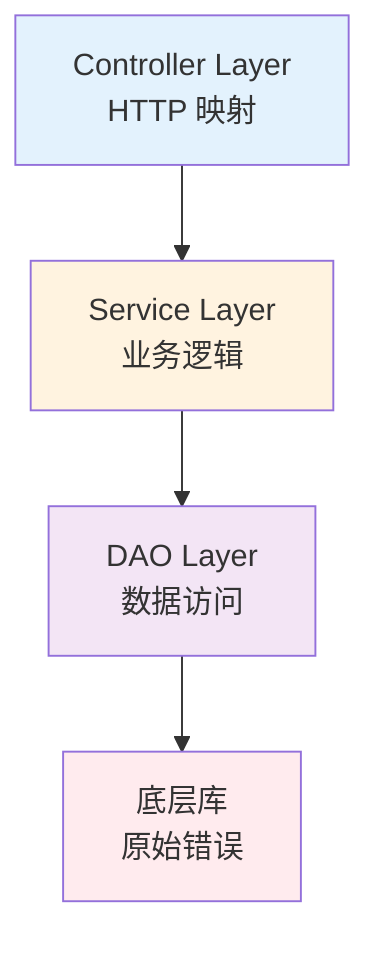

import { Badge } from "@rspress/core/theme";
import { Callout } from "@rspress/core/theme-original";

# Error Handling Best Practices

<Badge text="高级内容" type="danger" />

掌握 Go 错误处理的基本语法后，如何在实际项目中优雅地处理错误？本文总结企业级项目的最佳实践。

## 分层错误处理架构

<Badge text="架构师" type="danger" />



### DAO 层：返回原始错误

```go
package dao

func (d *UserDAO) FindByID(id int) (*User, error) {
    var user User
    err := d.db.WithContext(ctx).
        Where("id = ?", id).
        First(&user).Error

    if err != nil {
        if errors.Is(err, gorm.ErrRecordNotFound) {
            return nil, fmt.Errorf("user %d not found: %w", id, ErrUserNotFound)
        }
        return nil, fmt.Errorf("database query failed: %w", err)
    }

    return &user, nil
}
```

### Service 层：添加业务上下文

```go
package service

func (s *UserService) GetUser(ctx context.Context, id int) (*User, error) {
    // 参数验证
    if id <= 0 {
        return nil, fmt.Errorf("%w: invalid user id", ErrInvalidInput)
    }

    // 调用 DAO
    user, err := s.dao.FindByID(ctx, id)
    if err != nil {
        // 业务处理
        if errors.Is(err, ErrUserNotFound) {
            // 可以添加缓存检查等
            return nil, err
        }
        return nil, fmt.Errorf("get user %d failed: %w", id, err)
    }

    return user, nil
}
```

### Controller 层：HTTP 状态码映射

```go
package controller

func (h *Handler) GetUser(w http.ResponseWriter, r *http.Request) {
    id := getID(r)

    user, err := h.service.GetUser(r.Context(), id)
    if err != nil {
        // 映射到 HTTP 状态码
        switch {
        case errors.Is(err, ErrUserNotFound):
            writeJSON(w, http.StatusNotFound, map[string]string{
                "error": "User not found",
            })
        case errors.Is(err, ErrInvalidInput):
            writeJSON(w, http.StatusBadRequest, map[string]string{
                "error": "Invalid user ID",
            })
        default:
            // 记录未知错误
            log.Error("get user failed", "error", err)
            writeJSON(w, http.StatusInternalServerError, map[string]string{
                "error": "Internal server error",
            })
        }
        return
    }

    writeJSON(w, http.StatusOK, user)
}
```

## 错误处理模式

<Badge text="高级开发者" type="danger" />

### 模式 1: Early Return（早返回）

```go
// ✅ 推荐：清晰的线性流程
func ProcessUser(id int, email string) error {
    // 守卫子句：先检查所有错误条件
    if id <= 0 {
        return fmt.Errorf("invalid id: %d", id)
    }

    if email == "" {
        return errors.New("email required")
    }

    if !isValidEmail(email) {
        return errors.New("invalid email format")
    }

    // 主要逻辑：全部检查通过后执行
    return saveUser(id, email)
}
```

### 模式 2: Error Wrapping（错误包装）

```go
// ✅ 使用 %w 保留原始错误
func LoadConfig(path string) (*Config, error) {
    data, err := os.ReadFile(path)
    if err != nil {
        return nil, fmt.Errorf("read config: %w", err)
    }

    var config Config
    if err := json.Unmarshal(data, &config); err != nil {
        return nil, fmt.Errorf("parse config: %w", err)
    }

    return &config, nil
}
```

### 模式 3: Sentinel Errors（哨兵错误）

```go
package errors

var (
    ErrUserNotFound    = errors.New("user not found")
    ErrInvalidToken    = errors.New("invalid token")
    ErrRateLimitExceeded = errors.New("rate limit exceeded")
)

// 使用
user, err := GetUser(id)
if errors.Is(err, ErrUserNotFound) {
    // 特定处理
}
```

### 模式 4: Error Groups（错误组，Go 1.20+）

```go
func ProcessFiles(files []string) error {
    var errs []error

    for _, file := range files {
        if err := processFile(file); err != nil {
            errs = append(errs, err)
        }
    }

    if len(errs) > 0 {
        return errors.Join(errs...)
    }
    return nil
}
```

## 错误处理反模式

<Badge text="中级开发者" type="warning" />

### ❌ 反模式 1: 忽略错误

```go
// ❌ 危险
file, _ := os.Open("config.json")

// ✅ 正确
file, err := os.Open("config.json")
if err != nil {
    return fmt.Errorf("open config: %w", err)
}
```

### ❌ 反模式 2: 只记录不处理

```go
// ❌ 错误：记录后继续执行
if err := process(); err != nil {
    log.Println(err)
}
// 继续执行可能依赖之前失败的步骤

// ✅ 正确：要么处理，要么返回
if err := process(); err != nil {
    return fmt.Errorf("process failed: %w", err)
}
```

### ❌ 反模式 3: 返回多个 error

```go
// ❌ 违反 Go 惯例
func SomeFunc() (Result, error, error)

// ✅ 使用 errors.Join
func SomeFunc() (Result, error) {
    // ...
    return result, errors.Join(err1, err2)
}
```

### ❌ 反模式 4: 循环中使用 defer

```go
// ❌ 性能问题
func ProcessFiles(files []string) error {
    for _, file := range files {
        f, _ := os.Open(file)
        defer f.Close()  // 等函数结束才关闭
    }
    return nil
}

// ✅ 使用匿名函数
func ProcessFiles(files []string) error {
    for _, file := range files {
        if err := func() error {
            f, err := os.Open(file)
            if err != nil {
                return err
            }
            defer f.Close()  // 每次迭代结束关闭
            return processFile(f)
        }(); err != nil {
            return err
        }
    }
    return nil
}
```

## 错误处理性能优化

<Badge text="高级开发者" type="danger" />

### 策略 1: 预分配错误

```go
// ✅ 零分配
var (
    ErrInvalidInput = errors.New("invalid input")
    ErrNotFound     = errors.New("not found")
)

func validate(data string) error {
    if data == "" {
        return ErrInvalidInput
    }
    return nil
}
```

### 策略 2: 条件性错误上下文

```go
var debugMode = false

func ProcessData(data []byte) error {
    if len(data) < 4 {
        if debugMode {
            return fmt.Errorf("data too short: got %d bytes", len(data))
        }
        return ErrDataTooShort
    }
    return nil
}
```

### 策略 3: 减少错误链深度

```go
// ❌ 每层都包装
func layer1() error {
    if err := layer2(); err != nil {
        return fmt.Errorf("layer1: %w", err)
    }
    return nil
}

// ✅ 只在必要时包装
func layer1() error {
    return layer2()  // 直接传递
}

// 在顶层添加上下文
func topLayer() error {
    if err := layer1(); err != nil {
        return fmt.Errorf("operation failed: %w", err)
    }
    return nil
}
```

## 企业级错误处理框架

<Badge text="架构师" type="danger" />

### 完整的错误处理实现

```go
package errors

// AppError 应用错误
type AppError struct {
    Code       int         `json:"code"`
    Message    string      `json:"message"`
    Internal   error       `json:"-"`
    StackTrace []string    `json:"-"`
    RequestID  string      `json:"request_id"`
}

func (e *AppError) Error() string {
    if e.Internal != nil {
        return fmt.Sprintf("[%d] %s: %v", e.Code, e.Message, e.Internal)
    }
    return fmt.Sprintf("[%d] %s", e.Code, e.Message)
}

func (e *AppError) Unwrap() error {
    return e.Internal
}

// HTTPStatus 返回 HTTP 状态码
func (e *AppError) HTTPStatus() int {
    if status, ok := errorCodeToStatus[e.Code]; ok {
        return status
    }
    return http.StatusInternalServerError
}

// 错误码定义
const (
    ErrCodeUserNotFound     = 10000101
    ErrCodeUserInvalid      = 10000102
    ErrCodeProductNotFound  = 10000201
    ErrCodeOrderInvalid     = 10000301
)

// HTTP 状态码映射
var errorCodeToStatus = map[int]int{
    ErrCodeUserNotFound:    http.StatusNotFound,
    ErrCodeUserInvalid:     http.StatusBadRequest,
    ErrCodeProductNotFound: http.StatusNotFound,
    ErrCodeOrderInvalid:    http.StatusBadRequest,
}
```

## 常见陷阱清单

<Badge text="所有开发者" type="info" />

| # | 陷阱 | 解决方案 |
|---|------|---------|
| 1 | 错误链断裂（使用 %v） | 使用 %w 包装 |
| 2 | nil 接口问题 | 显式返回 nil |
| 3 | 循环中的资源泄漏 | 使用匿名函数限制 defer |
| 4 | 忽略 Close 错误 | 检查并记录 |
| 5 | 过度使用 panic | 返回 error |
| 6 | 库中使用 log.Fatal | 返回 error |
| 7 | 丢失错误上下文 | 添加上下文信息 |
| 8 | 硬编码错误信息 | 使用错误码 |

## 练习

<Badge text="实战练习" type="success" />

### 练习：重构错误处理

将以下代码重构为更好的错误处理模式：

```go
// TODO: 重构此函数
func ProcessUser(id int) (*User, error) {
    user := &User{}
    rows := db.QueryRow("SELECT * FROM users WHERE id = ?", id)
    if rows == nil {
        return nil, errors.New("error")
    }
    err := rows.Scan(&user.ID, &user.Name)
    if err != nil {
        return nil, err
    }
    return user, nil
}
```

<details>
<summary>查看答案</summary>

```go
func ProcessUser(id int) (*User, error) {
    // 验证输入
    if id <= 0 {
        return nil, fmt.Errorf("%w: invalid user id", ErrInvalidInput)
    }

    // 查询数据库
    user := &User{}
    err := db.QueryRow("SELECT id, name FROM users WHERE id = ?", id).
        Scan(&user.ID, &user.Name)

    if err != nil {
        if errors.Is(err, sql.ErrNoRows) {
            return nil, fmt.Errorf("%w: user %d", ErrUserNotFound, id)
        }
        return nil, fmt.Errorf("query user %d: %w", id, err)
    }

    return user, nil
}
```

</details>

---

## 总结

### 关键要点

| 读者水平 | 核心要点 |
|---------|---------|
| <Badge text="中级开发者" type="warning" /> | 使用 Early Return 模式。总是检查错误。 |
| <Badge text="高级开发者" type="danger" /> | 分层错误处理架构。避免反模式。优化性能。 |
| <Badge text="架构师" type="danger" /> | 建立企业级错误处理框架。错误码体系。监控告警。 |

### 最佳实践清单

- [ ] 定义清晰的错误类型
- [ ] 使用 %w 保留错误链
- [ ] Early Return 模式
- [ ] 添加有意义的上下文
- [ ] 记录错误日志
- [ ] 监控错误率
- [ ] 文档化可能的错误

### 下一步

- [← Panic vs Error](./panic-vs-error.mdx)
- [Go I/O 操作 →](../io/)
- [标准库 →](../stdlib/)
