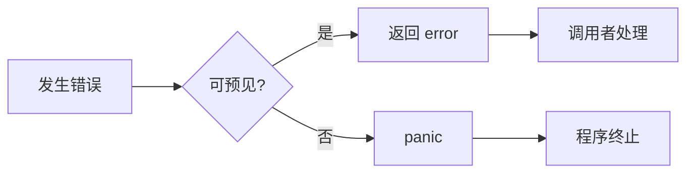
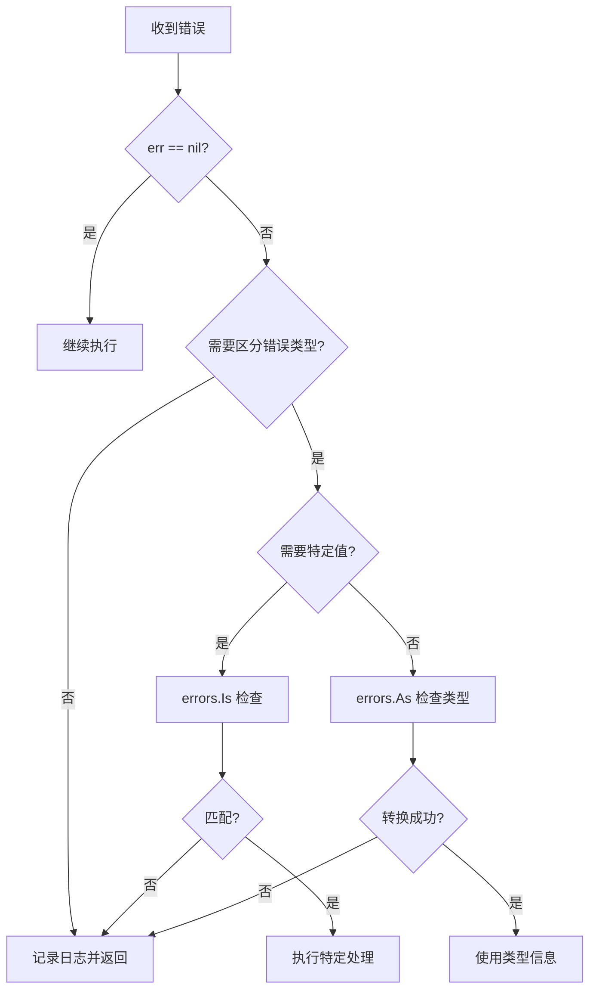

import { Badge } from "@rspress/core/theme";
import { Callout } from "@rspress/core/theme-original";

# Error Basics

<Badge text="Go 1.13+" type="tip" />
<Badge text="核心概念" type="danger" />

Go 语言中的错误处理是其最独特的设计之一。与许多使用异常机制的语言不同，Go 将错误视为普通的返回值，这使得错误处理更加显式和可控。

## 为什么 Go 不使用异常？

<Badge text="无技术背景读者" type="info" />

想象你在餐厅点餐：
- **异常模式**：服务员把菜单扔给你就走，如果厨房出问题，整个餐厅关门
- **Go 错误处理**：服务员告诉你"这道菜暂时没有"，你可以选择点别的或等待

Go 的设计哲学：**错误是预期的，不是异常的**。



## error 接口

<Badge text="初级开发者" type="tip" />

Go 的 `error` 是一个内置接口，只有一个方法：

```go
// builtin 包中定义
type error interface {
    Error() string
}
```

### 创建错误的三种方式

```go
package main

import (
    "errors"
    "fmt"
)

// 方式1: errors.New() - 预分配错误，性能最优
var ErrNotFound = errors.New("user not found")

// 方式2: fmt.Errorf() - 动态错误信息
func getUser(id int) error {
    if id <= 0 {
        return fmt.Errorf("invalid user id: %d", id)
    }
    return nil
}

// 方式3: 自定义错误类型
type ValidationError struct {
    Field   string
    Message string
}

func (e *ValidationError) Error() string {
    return fmt.Sprintf("validation failed for %s: %s", e.Field, e.Message)
}
```

<Callout type="tip">
**性能对比**（每百万次操作）：

| 方式 | 时间 | 内存分配 |
|------|------|---------|
| `errors.New()` | ~5ns | 0 B |
| 自定义错误 | ~8ns | 0 B |
| `fmt.Errorf()` | ~50ns | 16 B |

**建议**：在热路径中使用预分配错误。
</Callout>

## 基础错误处理模式

<Badge text="初级开发者" type="tip" />

### 模式 1: Early Return（早返回）

```go
// ✅ 推荐：清晰的线性流程
func ProcessUser(id int, name string) error {
    // 守卫子句：先检查错误条件
    if id <= 0 {
        return errors.New("invalid id")
    }

    if name == "" {
        return errors.New("name cannot be empty")
    }

    // 主要逻辑
    return saveUser(id, name)
}

// ❌ 避免：深层嵌套
func ProcessUserBad(id int, name string) error {
    if id > 0 {
        if name != "" {
            return saveUser(id, name)
        } else {
            return errors.New("name cannot be empty")
        }
    } else {
        return errors.New("invalid id")
    }
}
```

### 模式 2: 错误传递

```go
// 向上传递错误，让调用者决定如何处理
func loadData() error {
    data, err := readConfig()
    if err != nil {
        return err  // 直接传递
    }

    return processData(data)
}

// 添加上下文后传递
func loadDataWithContext() error {
    data, err := readConfig()
    if err != nil {
        return fmt.Errorf("loadData: %w", err)  // 注意 %w
    }

    return processData(data)
}
```

<Badge text="中级开发者" type="warning" />

### 模式 3: 错误检查决策树



## 错误处理最佳实践

<Badge text="高级开发者" type="danger" />

### 1. 总是检查错误

```go
// ❌ 危险：忽略错误
file, _ := os.Open("config.json")
// 如果文件不存在，file 为 nil，后续使用会 panic

// ✅ 正确：检查并处理
file, err := os.Open("config.json")
if err != nil {
    return fmt.Errorf("open config: %w", err)
}
defer file.Close()
```

### 2. 提供有意义的错误信息

```go
// ❌ 模糊的错误
return errors.New("error")

// ✅ 清晰的错误
return fmt.Errorf("failed to create user %s: %w", username, err)
```

### 3. 定义预定义错误

```go
package errors

var (
    // 用户相关错误
    ErrUserNotFound    = errors.New("user not found")
    ErrUserInvalid     = errors.New("invalid user data")
    ErrUserDuplicate   = errors.New("user already exists")

    // 认证相关错误
    ErrUnauthorized    = errors.New("unauthorized")
    ErrTokenExpired    = errors.New("token expired")
)
```

### 4. 文档化可能的错误

```go
// GetUser 通过 ID 查找用户。
//
// 可能返回的错误：
//   - ErrUserNotFound: 用户不存在
//   - ErrDatabase: 数据库查询失败
func GetUser(id int) (*User, error) {
    // ...
}
```

## 常见错误处理场景

<Badge text="中级开发者" type="warning" />

### 场景 1: 文件操作

```go
func ReadConfig(path string) ([]byte, error) {
    // 检查文件是否存在
    if _, err := os.Stat(path); os.IsNotExist(err) {
        return nil, fmt.Errorf("config file not found: %s", path)
    }

    // 读取文件
    data, err := os.ReadFile(path)
    if err != nil {
        return nil, fmt.Errorf("read config: %w", err)
    }

    return data, nil
}
```

### 场景 2: HTTP 请求

```go
func FetchData(url string) ([]byte, error) {
    resp, err := http.Get(url)
    if err != nil {
        return nil, fmt.Errorf("HTTP request failed: %w", err)
    }
    defer resp.Body.Close()

    // 检查 HTTP 状态码
    if resp.StatusCode != http.StatusOK {
        return nil, fmt.Errorf("unexpected status: %d", resp.StatusCode)
    }

    data, err := io.ReadAll(resp.Body)
    if err != nil {
        return nil, fmt.Errorf("read response: %w", err)
    }

    return data, nil
}
```

### 场景 3: 数据库操作

```go
func CreateUser(user *User) error {
    result := db.Create(user)
    if result.Error != nil {
        // 检查是否是唯一约束冲突
        if errors.Is(result.Error, gorm.ErrDuplicatedKey) {
            return fmt.Errorf("user %s already exists: %w", user.Email, ErrUserDuplicate)
        }
        return fmt.Errorf("database error: %w", result.Error)
    }
    return nil
}
```

## 错误处理的性能考虑

<Badge text="高级开发者" type="danger" />

### 热路径优化

```go
// ❌ 在高频调用中每次创建新错误
func validateID(id int) error {
    if id <= 0 {
        return fmt.Errorf("invalid id: %d", id)  // 每次都分配内存
    }
    return nil
}

// ✅ 使用预分配错误
var ErrInvalidID = errors.New("invalid id")

func validateID(id int) error {
    if id <= 0 {
        return ErrInvalidID  // 零分配
    }
    return nil
}
```

### 错误处理开销

```go
// 单次错误检查开销：~1-2ns
if err != nil {
    return err
}

// errors.Is 开销：~50ns（10 层错误链）
if errors.Is(err, ErrNotFound) {
    // ...
}

// 结论：错误处理本身开销很小，无需过度优化
```

## 练习

<Badge text="实战练习" type="success" />

### 练习 1: 实现配置加载器

创建一个配置加载函数，处理文件不存在、解析失败等错误：

```go
// TODO: 实现此函数
func LoadConfig(path string) (*Config, error) {
    // 1. 检查文件是否存在
    // 2. 读取文件内容
    // 3. 解析 JSON
    // 4. 验证配置
    // 提示：使用 fmt.Errorf 添加上下文
}
```

<details>
<summary>查看答案</summary>

```go
import (
    "encoding/json"
    "errors"
    "fmt"
    "os"
)

var (
    ErrConfigNotFound   = errors.New("config file not found")
    ErrConfigInvalid    = errors.New("config is invalid")
    ErrConfigMissingKey = errors.New("required config key missing")
)

func LoadConfig(path string) (*Config, error) {
    // 1. 检查文件是否存在
    if _, err := os.Stat(path); os.IsNotExist(err) {
        return nil, fmt.Errorf("%w: %s", ErrConfigNotFound, path)
    }

    // 2. 读取文件内容
    data, err := os.ReadFile(path)
    if err != nil {
        return nil, fmt.Errorf("read config: %w", err)
    }

    // 3. 解析 JSON
    var config Config
    if err := json.Unmarshal(data, &config); err != nil {
        return nil, fmt.Errorf("parse config: %w", err)
    }

    // 4. 验证配置
    if err := validateConfig(&config); err != nil {
        return nil, fmt.Errorf("%w: %v", ErrConfigInvalid, err)
    }

    return &config, nil
}

func validateConfig(c *Config) error {
    if c.Database.Host == "" {
        return fmt.Errorf("%w: database.host", ErrConfigMissingKey)
    }
    if c.Database.Port == 0 {
        return fmt.Errorf("%w: database.port", ErrConfigMissingKey)
    }
    return nil
}
```

</details>

---

## 总结

### 关键要点

| 读者水平 | 核心要点 |
|---------|---------|
| <Badge text="无技术背景" type="info" /> | Go 的错误是返回值，不是异常。总是检查错误。 |
| <Badge text="初级开发者" type="tip" /> | 使用 `errors.New()` 和 `fmt.Errorf()` 创建错误。早返回模式使代码更清晰。 |
| <Badge text="中级开发者" type="warning" /> | 使用预定义错误，添加错误上下文，文档化可能返回的错误。 |
| <Badge text="高级开发者" type="danger" /> | 在热路径中使用预分配错误优化性能，理解错误处理的开销。 |

### 下一步

- [错误包装机制 →](./error-wrapping.mdx)
- [自定义错误类型 →](./custom-errors.mdx)
- [错误处理最佳实践 →](./best-practices.mdx)
