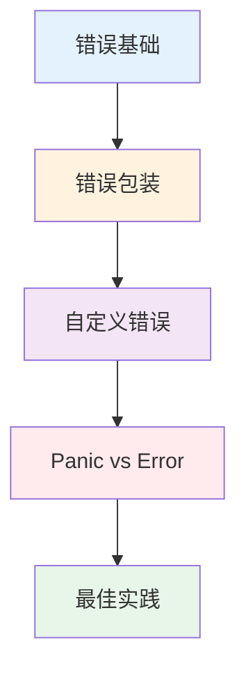

import { Badge } from "@rspress/core/theme";

# Error Handling

<Badge text="Go 核心特性" type="danger" />

Go 语言的错误处理是其最独特的设计之一。与使用异常机制的语言不同，Go 将错误视为普通的返回值，这使得错误处理更加显式和可控。

## 学习路径



## 模块概览

| 模块 | 内容 | 难度 |
|------|------|------|
| [错误基础](./error-basics.mdx) | error 接口、创建错误、基础处理模式 | <Badge text="初级" type="tip" /> |
| [错误包装](./error-wrapping.mdx) | %w vs %v、errors.Is、errors.As | <Badge text="中级" type="warning" /> |
| [自定义错误](./custom-errors.mdx) | 实现自定义错误类型、Unwrap 方法 | <Badge text="中级" type="warning" /> |
| [Panic vs Error](./panic-vs-error.mdx) | 使用场景、defer + recover | <Badge text="高级" type="danger" /> |
| [最佳实践](./best-practices.mdx) | 企业级错误处理架构、常见陷阱 | <Badge text="高级" type="danger" /> |

## 核心原则

### 1. Errors are values

错误是普通的值，不是异常：

```go
// 将错误像其他值一样处理
result, err := someFunction()
if err != nil {
    // 处理错误
}
// 使用 result
```

### 2. Explicit is better than implicit

显式处理优于隐式处理：

```go
// ✅ 显式：错误清晰可见
data, err := readFile()
if err != nil {
    return err
}

// ❌ 隐式：错误被隐藏（使用异常的语言）
try {
    data = readFile()
} catch (Exception e) {
    // 处理
}
```

### 3. Fail fast

尽早失败并返回错误：

```go
func Process(id int, name string) error {
    // 早返回：先检查错误条件
    if id <= 0 {
        return errors.New("invalid id")
    }
    if name == "" {
        return errors.New("name required")
    }

    // 主要逻辑：全部检查通过后执行
    return doProcess(id, name)
}
```

## 读者指南

### <Badge text="无技术背景读者" type="info" />

从 [错误基础](./error-basics.mdx) 开始，理解为什么 Go 不使用异常。

### <Badge text="初级开发者" type="tip" />

1. [错误基础](./error-basics.mdx) - 学习 error 接口和基础模式
2. [错误包装](./error-wrapping.mdx) - 掌握 %w 和 errors.Is
3. [自定义错误](./custom-errors.mdx) - 创建自己的错误类型

### <Badge text="中级开发者" type="warning" />

1. 完成 [错误包装](./error-wrapping.mdx) 的所有内容
2. [Panic vs Error](./panic-vs-error.mdx) - 理解何时使用哪个
3. [最佳实践](./best-practices.mdx) - 学习常见模式

### <Badge text="高级开发者" type="danger" />

1. [最佳实践](./best-practices.mdx) - 企业级错误处理架构
2. 性能优化和常见陷阱
3. 实战案例分析

## 快速参考

### 创建错误

```go
// 预分配错误（推荐）
var ErrNotFound = errors.New("not found")

// 动态错误
err := fmt.Errorf("invalid input: %s", value)

// 包装错误
return fmt.Errorf("operation failed: %w", err)
```

### 检查错误

```go
// 简单检查
if err != nil {
    return err
}

// 检查特定错误
if errors.Is(err, ErrNotFound) {
    // 处理 not found
}

// 检查错误类型
var pathErr *os.PathError
if errors.As(err, &pathErr) {
    fmt.Println("Path:", pathErr.Path)
}
```

### Panic vs Error

```go
// ✅ 默认使用 error
func doSomething() error {
    if badCondition {
        return errors.New("something went wrong")
    }
    return nil
}

// ⚠️ 极少使用 panic
func init() {
    if criticalFailure {
        panic("cannot start")
    }
}
```

## 相关资源

- [Go 官方错误处理指南](https://go.dev/blog/error-handling-and-go)
- [Go 1.13 错误处理](https://go.dev/blog/go1.13-errors)
- [常见 Go 错误](https://github.com/golang/go/wiki/CommonMistakes)

---

[← 返回 Go 首页](/golang/) | [开始学习：错误基础 →](./error-basics.mdx)
