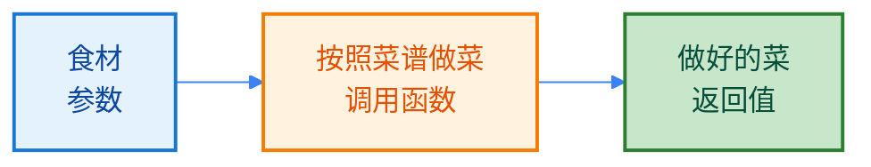
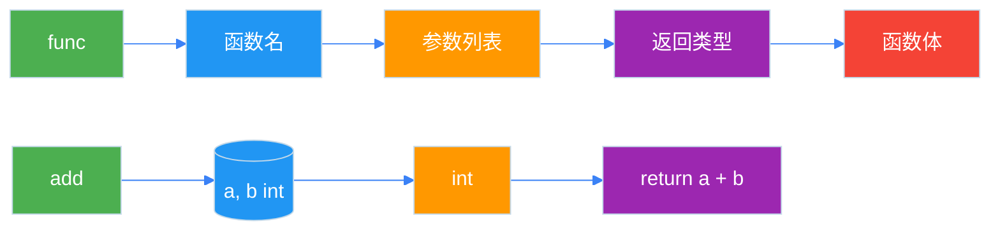
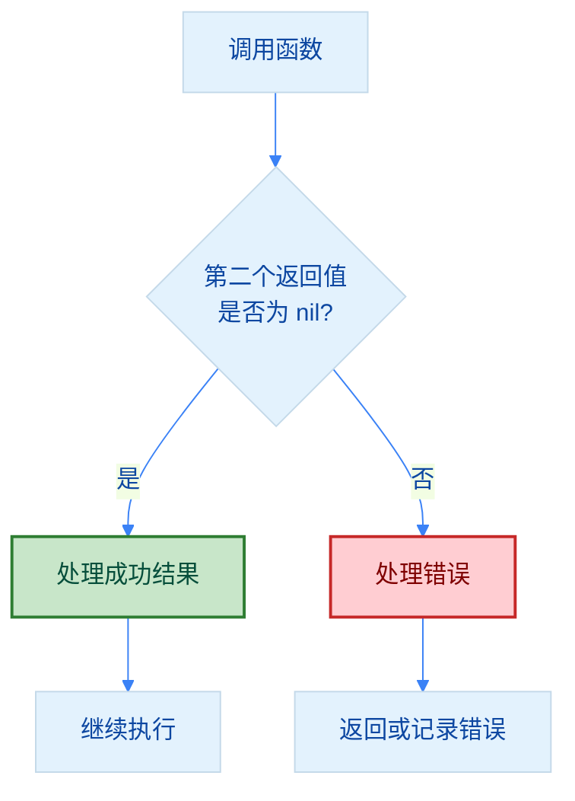
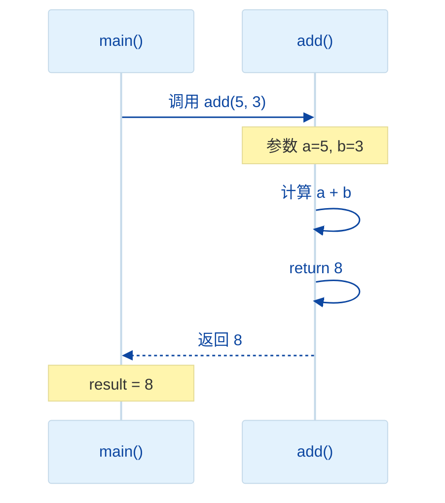

import { Badge } from "@rspress/core/theme";
import { Callout } from "@rspress/core/theme-original";

# Function Basics

[← 返回 Go 语言](../index.mdx)

函数是一段可重复使用的代码块，用于执行特定任务。理解函数是学习 Go 语言的第一步。

<Badge text="入门级" type="tip" />

## 什么是函数？

<Badge text="无技术背景" type="tip" />

想象你在做菜：
- **函数**就像一张**菜谱**——它告诉你一步步做什么
- **参数**就像**食材**——你提供给函数的输入
- **返回值**就像**做好的菜**——函数的输出结果
- **调用函数**就像**按照菜谱做菜**——执行函数中的代码



## 函数声明

### 基本语法

```go
func 函数名(参数列表) 返回类型 {
    函数体
}
```

### 最简单的函数

```go
package main

import "fmt"

// 无参数无返回值
func greet() {
    fmt.Println("Hello, World!")
}

func main() {
    greet()  // 输出: Hello, World!
}
```

### 带参数的函数

```go
package main

import "fmt"

// 单个参数
func greetUser(name string) {
    fmt.Printf("Hello, %s!\n", name)
}

// 多个参数
func introduce(name string, age int) {
    fmt.Printf("I'm %s, %d years old.\n", name, age)
}

func main() {
    greetUser("Alice")           // Hello, Alice!
    introduce("Bob", 25)         // I'm Bob, 25 years old.
}
```

### 带返回值的函数

```go
package main

import "fmt"

// 单个返回值
func add(a int, b int) int {
    return a + b
}

// 参数类型相同时可简写
func subtract(a, b int) int {
    return a - b
}

func main() {
    fmt.Println(add(5, 3))      // 8
    fmt.Println(subtract(10, 3)) // 7
}
```

<Callout type="tip" title="参数简写">
  当多个连续参数类型相同时，可以只在最后一个参数后写类型：

  ```go
  // 完整写法
  func add(a int, b int) int

  // 简写（推荐）
  func add(a, b int) int
  ```
</Callout>

## 函数结构图解



## 多返回值

<Badge text="初级" type="info" />

Go 的特色功能：一个函数可以返回多个值。这在错误处理中非常常见。

### 基本用法

```go
package main

import "fmt"

// 返回两个值
func divide(a, b int) (int, int) {
    quotient := a / b
    remainder := a % b
    return quotient, remainder
}

func main() {
    q, r := divide(10, 3)
    fmt.Printf("10 / 3 = %d ... %d\n", q, r)
    // 输出: 10 / 3 = 3 ... 1
}
```

### 错误处理模式

```go
package main

import (
    "errors"
    "fmt"
)

// Go 的惯用错误处理
func divideSafe(a, b int) (int, error) {
    if b == 0 {
        return 0, errors.New("division by zero")
    }
    return a / b, nil
}

func main() {
    result, err := divideSafe(10, 0)
    if err != nil {
        fmt.Println("错误:", err)
        return
    }
    fmt.Println("结果:", result)
}
```

### 错误处理流程



### 忽略返回值

使用 `_` 忽略不需要的返回值：

```go
func getValues() (int, string, bool) {
    return 42, "hello", true
}

func main() {
    // 只需要第一个值
    num, _, _ := getValues()
    fmt.Println("数字:", num)
}
```

<Callout type="danger" title="重要！">
  <strong>不要忽略错误返回值</strong>

  ```go
  // ❌ 错误：忽略错误
  file, _ := os.Open("data.txt")

  // ✅ 正确：始终检查错误
  file, err := os.Open("data.txt")
  if err != nil {
      return err
  }
  ```
</Callout>

## 命名返回值

```go
package main

import "fmt"

// 命名返回值
func divideWithNamed(a, b int) (quotient int, remainder int) {
    quotient = a / b
    remainder = a % b
    return  // 隐式返回
}

func main() {
    q, r := divideWithNamed(10, 3)
    fmt.Printf("10 / 3 = %d ... %d\n", q, r)
}
```

<Callout type="danger" title={<Badge text="不推荐" type="danger" />}>
  <strong>谨慎使用命名返回值</strong>

  虽然命名返回值可以提高代码可读性，但也会带来问题：

  • <strong>遮蔽风险</strong>：函数内部使用同名变量时容易产生遮蔽
  • <strong>可读性下降</strong>：`return` 不带返回值时，不清楚返回了什么
  • <strong>调试困难</strong>：难以追踪返回值的来源

  除非有特殊需求（如 defer 修改返回值），否则应使用<strong>显式返回</strong>。
</Callout>

## 函数调用流程



## 函数命名规范

<Badge text="初级" type="info" />

| 规则 | 说明 | 示例 |
|-----|------|------|
| 公开函数 | 首字母大写（PascalCase） | `func GetUser()` |
| 私有函数 | 首字母小写（camelCase） | `func getUser()` |
| 使用动词 | 表示动作 | `func Calculate()` |
| 语义清晰 | 见名知意 | `func GetUserById()` |

```go
// ✅ 好的命名
func getUserById(id int64) (*User, error)
func validateEmail(email string) bool
func calculateTotal(items []Item) float64

// ❌ 不好的命名
func get(id int64) interface{}
func check(s string) bool
func do(items []interface{}) float64
```

## 常见错误

### 1. 忘记返回值

```go
// ❌ 错误
func add(a, b int) int {
    // 忘记 return
}

// ✅ 正确
func add(a, b int) int {
    return a + b
}
```

### 2. 参数类型错误

```go
// ❌ 错误
func add(a, b int) int {
    return a + b
}
add(5, "3")  // 类型不匹配

// ✅ 正确
func add(a, b int) int {
    return a + b
}
add(5, 3)  // 类型匹配
```

### 3. 忽略错误

```go
// ❌ 错误
file, _ := os.Open("data.txt")

// ✅ 正确
file, err := os.Open("data.txt")
if err != nil {
    return err
}
```

## 类型提示

函数的参数类型需要与数据类型匹配：

> 详见 [数据类型模块](/golang/data-types/numeric.mdx) 了解各种类型的详细信息。

| 参数类型 | 说明 | 示例 |
|---------|------|------|
| `int` | 整数 | `func add(a, b int) int` |
| `string` | 字符串 | `func greet(name string)` |
| `bool` | 布尔值 | `func isValid(flag bool) bool` |
| `float64` | 浮点数 | `func divide(a, b float64) float64` |

## 练习

<Badge text="入门级" type="tip" />

1. **编写函数**：创建一个函数 `square(n int) int`，返回一个数的平方

<details>
<summary>查看答案</summary>

```go
func square(n int) int {
    return n * n
}
```
</details>

2. **带两个参数的函数**：创建函数 `greet(name string, age int)`，打印问候语

<details>
<summary>查看答案</summary>

```go
func greet(name string, age int) {
    fmt.Printf("Hello, I'm %s, %d years old.\n", name, age)
}
```
</details>

3. **返回两个值的函数**：创建函数 `minMax(numbers []int) (int, int)`，返回最小值和最大值

<details>
<summary>查看答案</summary>

```go
func minMax(numbers []int) (int, int) {
    if len(numbers) == 0 {
        return 0, 0
    }
    min := numbers[0]
    max := numbers[0]
    for _, n := range numbers {
        if n < min {
            min = n
        }
        if n > max {
            max = n
        }
    }
    return min, max
}
```
</details>

## 下一步

- [高级参数](./advanced-parameters.mdx) - 学习可变参数和命名返回值
- [方法系统](./methods.mdx) - 学习如何为类型定义方法
- [函数类型](./function-types.mdx) - 了解函数作为值的用法

---

[← 返回 Go 语言](../index.mdx) | [函数基础](./function-basics.mdx) | [高级参数 →](./advanced-parameters.mdx)
