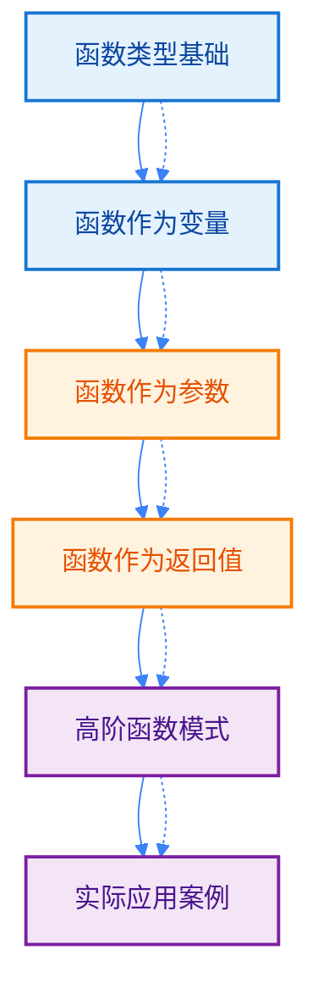
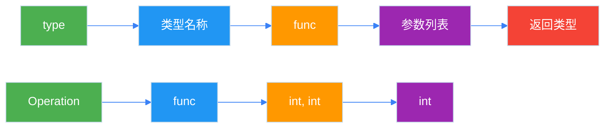
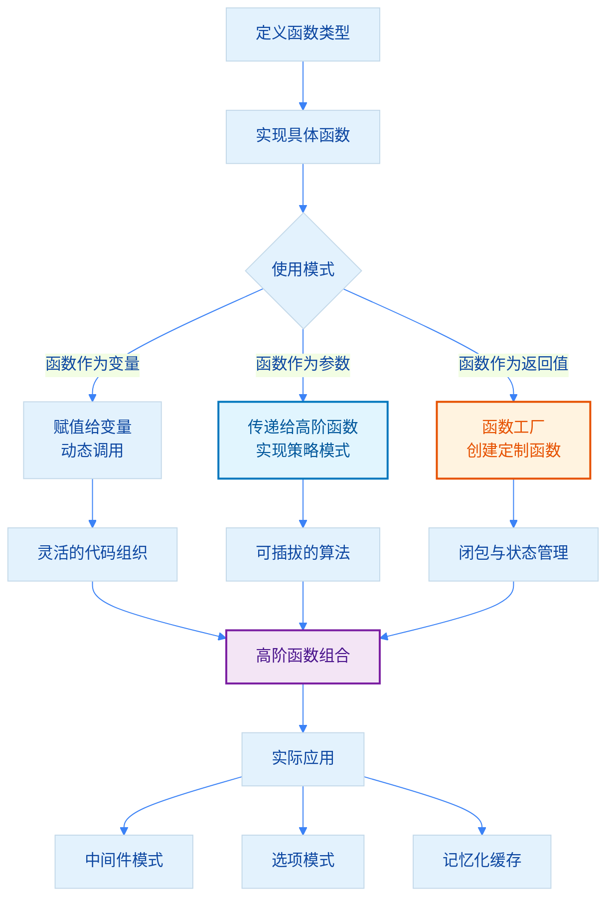

import { Badge } from "@rspress/core/theme";
import { Callout } from "@rspress/core/theme-original";

# Function Type

[← 返回函数与方法](./function-basics.mdx)

函数类型是 Go 语言中一等公民特性的核心体现，理解函数类型对于编写灵活、可复用的代码至关重要。

## 学习路径



## <Badge text="一等公民" type="warning" />

<Badge text="中级开发者" type="warning" /> 在 Go 中，函数是**一等公民**（First-Class Citizen），这意味着：

- 函数可以赋值给变量
- 函数可以作为参数传递给其他函数
- 函数可以作为返回值从函数中返回
- 函数可以存储在数据结构中

这种特性使 Go 支持函数式编程范式，能够编写更加灵活和模块化的代码。

## <Badge text="函数类型定义" type="info" />

### 基本语法

函数类型定义使用 `func` 关键字，后跟参数列表和返回类型。

```go
package main

import "fmt"

// 定义函数类型
type Operation func(int, int) int
type Predicate func(int) bool
type Processor func(string) (string, error)

// 实现符合 Operation 类型的函数
func add(a, b int) int {
    return a + b
}

func multiply(a, b int) int {
    return a * b
}

func subtract(a, b int) int {
    return a - b
}

// 使用函数类型作为参数
func calculate(a, b int, op Operation) int {
    return op(a, b)
}

func main() {
    // 直接传递函数
    result1 := calculate(5, 3, add)
    fmt.Println("5 + 3 =", result1) // 8

    result2 := calculate(5, 3, multiply)
    fmt.Println("5 * 3 =", result2) // 15

    result3 := calculate(5, 3, subtract)
    fmt.Println("5 - 3 =", result3) // 2
}
```

### 函数类型结构图解



## <Badge text="函数作为变量" type="info" />

### 赋值与传递

函数可以像其他值一样赋值给变量，并在需要时调用。

```go
package main

import "fmt"

type Operation func(int, int) int

func add(a, b int) int {
    return a + b
}

func multiply(a, b int) int {
    return a * b
}

func main() {
    // 声明函数类型的变量
    var op Operation

    // 将函数赋值给变量
    op = add
    fmt.Printf("函数: %v, 结果: %d\n", op, op(5, 3)) // 8

    // 重新赋值
    op = multiply
    fmt.Printf("函数: %v, 结果: %d\n", op, op(5, 3)) // 15

    // 短变量声明
    op2 := subtract
    fmt.Println("5 - 3 =", op2(5, 3)) // 2

    // 函数变量可以进行比较（仅限于 nil）
    var op3 Operation
    if op3 == nil {
        fmt.Println("op3 是 nil")
    }
}

func subtract(a, b int) int {
    return a - b
}
```

### 函数集合

可以将函数存储在切片或映射中，实现函数的动态调用。

```go
package main

import "fmt"

type Operation func(int, int) int

func add(a, b int) int      { return a + b }
func subtract(a, b int) int { return a - b }
func multiply(a, b int) int { return a * b }
func divide(a, b int) int   { return a / b }

func main() {
    // 函数映射
    operations := map[string]Operation{
        "add":      add,
        "subtract": subtract,
        "multiply": multiply,
        "divide":   divide,
    }

    // 动态调用函数
    op := "multiply"
    if fn, ok := operations[op]; ok {
        result := fn(6, 7)
        fmt.Printf("6 %s 7 = %d\n", op, result) // 6 multiply 7 = 42
    }

    // 函数切片
    funcs := []Operation{add, multiply, subtract}
    for i, fn := range funcs {
        fmt.Printf("funcs[%d](10, 5) = %d\n", i, fn(10, 5))
    }
}
```

## <Badge text="函数作为参数" type="warning" />

### 策略模式

将函数作为参数传递可以实现策略模式，使算法可以独立于使用它的客户端变化。

```go
package main

import "fmt"

// 定义策略类型
type FilterStrategy func(int) bool
type MapStrategy func(int) int
type ReduceStrategy func(int, int) int

// 高阶函数：过滤切片
func filter(numbers []int, strategy FilterStrategy) []int {
    result := []int{}
    for _, num := range numbers {
        if strategy(num) {
            result = append(result, num)
        }
    }
    return result
}

// 高阶函数：映射切片
func mapSlice(numbers []int, strategy MapStrategy) []int {
    result := make([]int, len(numbers))
    for i, num := range numbers {
        result[i] = strategy(num)
    }
    return result
}

// 高阶函数：归约切片
func reduce(numbers []int, initial int, strategy ReduceStrategy) int {
    result := initial
    for _, num := range numbers {
        result = strategy(result, num)
    }
    return result
}

// 具体策略
func isEven(n int) bool {
    return n%2 == 0
}

func isPositive(n int) bool {
    return n > 0
}

func double(n int) int {
    return n * 2
}

func square(n int) int {
    return n * n
}

func sum(a, b int) int {
    return a + b
}

func multiply(a, b int) int {
    return a * b
}

func main() {
    numbers := []int{1, -2, 3, -4, 5, 6, -7, 8, 9, 10}

    // 过滤示例
    evens := filter(numbers, isEven)
    fmt.Println("偶数:", evens) // [2 4 6 8 10]

    positives := filter(numbers, isPositive)
    fmt.Println("正数:", positives) // [1 3 5 6 8 9 10]

    // 映射示例
    doubled := mapSlice([]int{1, 2, 3, 4, 5}, double)
    fmt.Println("翻倍:", doubled) // [2 4 6 8 10]

    squared := mapSlice([]int{1, 2, 3, 4, 5}, square)
    fmt.Println("平方:", squared) // [1 4 9 16 25]

    // 归约示例
    total := reduce([]int{1, 2, 3, 4, 5}, 0, sum)
    fmt.Println("求和:", total) // 15

    product := reduce([]int{1, 2, 3, 4, 5}, 1, multiply)
    fmt.Println("求积:", product) // 120
}
```

### 回调函数

函数作为参数常用于异步操作和事件处理。

```go
package main

import (
    "fmt"
    "time"
)

// 定义回调类型
type Callback func(result string, err error)

// 异步操作函数
func fetchData(url string, callback Callback) {
    go func() {
        // 模拟网络请求
        time.Sleep(100 * time.Millisecond)
        callback(fmt.Sprintf("Data from %s", url), nil)
    }()
}

// 带超时的异步操作
func fetchWithTimeout(url string, timeout time.Duration, callback Callback) {
    done := make(chan string)
    errChan := make(chan error)

    go func() {
        time.Sleep(50 * time.Millisecond)
        done <- fmt.Sprintf("Data from %s", url)
    }()

    go func() {
        select {
        case result := <-done:
            callback(result, nil)
        case <-time.After(timeout):
            callback("", fmt.Errorf("timeout fetching %s", url))
        }
    }()
}

func main() {
    fmt.Println("开始获取数据...")

    fetchWithTimeout("https://api.example.com", 200*time.Millisecond,
        func(result string, err error) {
            if err != nil {
                fmt.Println("错误:", err)
                return
            }
            fmt.Println("成功:", result)
        })

    // 等待异步操作完成
    time.Sleep(300 * time.Millisecond)
}
```

## <Badge text="函数作为返回值" type="warning" />

### 工厂模式

返回函数的函数可以创建配置好的函数实例，实现函数工厂模式。

```go
package main

import "fmt"

// 函数工厂：创建加法器
func makeAdder(addend int) func(int) int {
    return func(x int) int {
        return x + addend
    }
}

// 函数工厂：创建乘法器
func makeMultiplier(factor int) func(int) int {
    return func(x int) int {
        return x * factor
    }
}

// 比较器工厂
type Comparator func(int, int) bool

func getComparator(operator string) Comparator {
    switch operator {
    case ">":
        return func(a, b int) bool { return a > b }
    case "<":
        return func(a, b int) bool { return a < b }
    case "==":
        return func(a, b int) bool { return a == b }
    case ">=":
        return func(a, b int) bool { return a >= b }
    case "<=":
        return func(a, b int) bool { return a <= b }
    default:
        return func(a, b int) bool { return false }
    }
}

// 验证器工厂
type Validator func(string) bool

func makeValidator(minLen, maxLen int) Validator {
    return func(s string) bool {
        length := len(s)
        return length >= minLen && length <= maxLen
    }
}

func main() {
    // 加法器工厂
    add5 := makeAdder(5)
    add10 := makeAdder(10)
    add100 := makeAdder(100)

    fmt.Println("3 + 5 =", add5(3))    // 8
    fmt.Println("3 + 10 =", add10(3))   // 13
    fmt.Println("3 + 100 =", add100(3)) // 103

    // 乘法器工厂
    double := makeMultiplier(2)
    triple := makeMultiplier(3)

    fmt.Println("5 * 2 =", double(5)) // 10
    fmt.Println("5 * 3 =", triple(5)) // 15

    // 比较器工厂
    greaterThan := getComparator(">")
    lessThan := getComparator("<")

    fmt.Println("5 > 3 ?", greaterThan(5, 3)) // true
    fmt.Println("5 < 3 ?", lessThan(5, 3))     // false

    // 验证器工厂
    usernameValidator := makeValidator(3, 20)
    passwordValidator := makeValidator(8, 32)

    fmt.Println("用户名 'bob' 有效?", usernameValidator("bob"))     // true
    fmt.Println("用户名 'ab' 有效?", usernameValidator("ab"))        // false
    fmt.Println("密码 'pass123' 有效?", passwordValidator("pass123")) // false
    fmt.Println("密码 'password123' 有效?", passwordValidator("password123")) // true
}
```

### 闭包与状态

返回的函数可以捕获外部变量，创建带有状态的函数。

```go
package main

import "fmt"

// 计数器工厂
func makeCounter() func() int {
    count := 0
    return func() int {
        count++
        return count
    }
}

// 累加器工厂
func makeAccumulator() func(int) int {
    total := 0
    return func(x int) int {
        total += x
        return total
    }
}

// 阶乘生成器（使用闭包缓存）
func makeFactorial() func(int) int {
    cache := map[int]int{0: 1, 1: 1}

    return func(n int) int {
        if result, ok := cache[n]; ok {
            return result
        }

        result := n * makeFactorial()(n-1)
        cache[n] = result
        return result
    }
}

// 斐波那契生成器
func makeFibonacci() func() int {
    a, b := 0, 1
    return func() int {
        result := a
        a, b = b, a+b
        return result
    }
}

func main() {
    // 计数器示例
    counter1 := makeCounter()
    counter2 := makeCounter()

    fmt.Println("Counter 1:", counter1()) // 1
    fmt.Println("Counter 1:", counter1()) // 2
    fmt.Println("Counter 2:", counter2()) // 1 (独立状态)
    fmt.Println("Counter 1:", counter1()) // 3

    // 累加器示例
    acc := makeAccumulator()
    fmt.Println("累加:", acc(10)) // 10
    fmt.Println("累加:", acc(20)) // 30
    fmt.Println("累加:", acc(30)) // 60

    // 斐波那契示例
    fib := makeFibonacci()
    fmt.Print("斐波那契: ")
    for i := 0; i < 10; i++ {
        fmt.Print(fib(), " ") // 0 1 1 2 3 5 8 13 21 34
    }
    fmt.Println()
}
```

## <Badge text="高阶函数模式" type="danger" />

### 组合函数

高阶函数可以组合多个函数，创建新的功能。

```go
package main

import "fmt"

// 函数组合
type Func func(int) int

// 组合两个函数：f(g(x))
func compose(f, g Func) Func {
    return func(x int) int {
        return f(g(x))
    }
}

// 组合多个函数
func pipe(funcs ...Func) Func {
    return func(x int) int {
        result := x
        for _, fn := range funcs {
            result = fn(result)
        }
        return result
    }
}

// 具体函数
func add1(x int) int     { return x + 1 }
func multiply2(x int) int { return x * 2 }
func subtract3(x int) int { return x - 3 }

func main() {
    // 组合示例
    addThenMultiply := compose(multiply2, add1)
    fmt.Println("(5 + 1) * 2 =", addThenMultiply(5)) // 12

    // 管道示例
    pipeline := pipe(add1, multiply2, subtract3)
    fmt.Println("((5 + 1) * 2) - 3 =", pipeline(5)) // 9
}
```

### 柯里化

柯里化将多参数函数转换为单参数函数序列。

```go
package main

import "fmt"

// 柯里化：将多参数函数转换为单参数函数链
func curryAdd(a int) func(int) int {
    return func(b int) int {
        return a + b
    }
}

// 三参数柯里化
func curryOp(a int) func(int) func(int) int {
    return func(b int) func(int) int {
        return func(c int) int {
            return (a + b) * c
        }
    }
}

// 通用柯里化辅助函数
func partialApply[T any](f func(T, T) T, x T) func(T) T {
    return func(y T) T {
        return f(x, y)
    }
}

func main() {
    // 两参数柯里化
    add5 := curryAdd(5)
    fmt.Println("5 + 3 =", add5(3)) // 8

    add10 := curryAdd(10)
    fmt.Println("10 + 20 =", add10(20)) // 30

    // 三参数柯里化
    step1 := curryOp(2)
    step2 := step1(3)
    result := step2(4)
    fmt.Println("(2 + 3) * 4 =", result) // 20

    // 部分应用
    multiply := func(a, b int) int { return a * b }
    double := partialApply(multiply, 2)
    triple := partialApply(multiply, 3)

    fmt.Println("2 * 5 =", double(5)) // 10
    fmt.Println("3 * 5 =", triple(5)) // 15
}
```

### 记忆化

使用闭包缓存函数结果，避免重复计算。

```go
package main

import (
    "fmt"
    "sync"
)

// 记忆化包装器
func memoize(fn func(int) int) func(int) int {
    cache := make(map[int]int)
    var mu sync.Mutex

    return func(x int) int {
        mu.Lock()
        defer mu.Unlock()

        if result, ok := cache[x]; ok {
            return result
        }

        result := fn(x)
        cache[x] = result
        return result
    }
}

// 昂贵的计算函数
func expensiveCalculation(n int) int {
    fmt.Printf("计算 %d...\n", n)
    // 模拟耗时计算
    result := 0
    for i := 0; i <= n; i++ {
        result += i
    }
    return result
}

// 递归函数的记忆化（斐波那契）
func memoFibonacci() func(int) int {
    cache := map[int]int{0: 0, 1: 1}
    var fn func(int) int

    fn = func(n int) int {
        if result, ok := cache[n]; ok {
            return result
        }

        result := fn(n-1) + fn(n-2)
        cache[n] = result
        return result
    }

    return fn
}

func main() {
    // 基本记忆化
    memoCalc := memoize(expensiveCalculation)

    fmt.Println("第一次调用 memoCalc(100):")
    result1 := memoCalc(100)
    fmt.Printf("结果: %d\n", result1)

    fmt.Println("\n第二次调用 memoCalc(100) (使用缓存):")
    result2 := memoCalc(100)
    fmt.Printf("结果: %d\n\n", result2)

    // 斐波那契记忆化
    fib := memoFibonacci()

    fmt.Println("计算斐波那契数:")
    for i := 0; i <= 10; i++ {
        fmt.Printf("fib(%d) = %d\n", i, fib(i))
    }
}
```

## <Badge text="实际应用案例" type="success" />

### 中间件模式

函数类型在 Web 框架中广泛用于实现中间件模式。

```go
package main

import (
    "fmt"
    "strings"
)

// 定义处理函数类型
type Handler func(string)

// 中间件类型
type Middleware func(Handler) Handler

// 日志中间件
func loggingMiddleware(next Handler) Handler {
    return func(input string) {
        fmt.Printf("[LOG] 处理请求: %s\n", input)
        next(input)
        fmt.Printf("[LOG] 处理完成\n")
    }
}

// 认证中间件
func authMiddleware(next Handler) Handler {
    return func(input string) {
        if strings.HasPrefix(input, "token:") {
            fmt.Println("[AUTH] 认证成功")
            next(input)
        } else {
            fmt.Println("[AUTH] 认证失败，缺少 token")
        }
    }
}

// 验证中间件
func validationMiddleware(next Handler) Handler {
    return func(input string) {
        if len(input) > 0 {
            fmt.Println("[VALIDATE] 验证通过")
            next(input)
        } else {
            fmt.Println("[VALIDATE] 验证失败，输入为空")
        }
    }
}

// 组合中间件
func chain(h Handler, middlewares ...Middleware) Handler {
    for i := len(middlewares) - 1; i >= 0; i-- {
        h = middlewares[i](h)
    }
    return h
}

// 最终处理函数
func finalHandler(input string) {
    fmt.Printf("[HANDLER] 处理数据: %s\n", input)
}

func main() {
    // 构建中间件链
    handler := chain(finalHandler,
        loggingMiddleware,
        authMiddleware,
        validationMiddleware,
    )

    fmt.Println("=== 请求 1: 有效请求 ===")
    handler("token:valid-data")

    fmt.Println("\n=== 请求 2: 无 token ===")
    handler("valid-data")

    fmt.Println("\n=== 请求 3: 空输入 ===")
    handler("")
}
```

### 选项模式

使用函数类型实现灵活的配置选项。

```go
package main

import "fmt"

// 服务器配置
type Server struct {
    host     string
    port     int
    timeout  int
    maxConns int
}

// 选项函数类型
type Option func(*Server)

// 选项实现
func WithHost(host string) Option {
    return func(s *Server) {
        s.host = host
    }
}

func WithPort(port int) Option {
    return func(s *Server) {
        s.port = port
    }
}

func WithTimeout(timeout int) Option {
    return func(s *Server) {
        s.timeout = timeout
    }
}

func WithMaxConns(max int) Option {
    return func(s *Server) {
        s.maxConns = max
    }
}

// 创建服务器
func NewServer(opts ...Option) *Server {
    // 默认配置
    s := &Server{
        host:     "localhost",
        port:     8080,
        timeout:  30,
        maxConns: 100,
    }

    // 应用选项
    for _, opt := range opts {
        opt(s)
    }

    return s
}

func main() {
    // 使用默认配置
    s1 := NewServer()
    fmt.Printf("服务器1: %+v\n", s1)

    // 使用自定义配置
    s2 := NewServer(
        WithHost("0.0.0.0"),
        WithPort(9000),
        WithTimeout(60),
        WithMaxConns(200),
    )
    fmt.Printf("服务器2: %+v\n", s2)

    // 部分配置
    s3 := NewServer(
        WithHost("192.168.1.1"),
        WithPort(80),
    )
    fmt.Printf("服务器3: %+v\n", s3)
}
```

## 高阶函数工作流程



## <Badge text="最佳实践" type="success" />

### 命名约定

<Callout type="tip" title="命名建议">
  函数类型应该使用清晰的命名，反映其用途：

  • 操作函数：`Operation`, `Operator`, `Func`
  • 谓词函数：`Predicate`, `Condition`, `Validator`
  • 转换函数：`Mapper`, `Transformer`, `Converter`
  • 处理函数：`Handler`, `Processor`, `Callback`
</Callout>

```go
// ✅ 好的命名
type FilterFunc func(T) bool
type MapFunc func(T) R
type ReduceFunc func(R, T) R
type Handler func(Context) error
type Validator func(T) error

// ❌ 不好的命名
type F func(T) bool
type Fn func(T) R
type Func func(T) T
type Callback func()
type FuncType func(int, int) int
```

### 性能考虑

<Callout type="warning" title="性能提示">
  函数调用涉及一定的开销：

  • 避免在热循环中创建大量闭包
  • 对于性能关键路径，考虑使用内联或代码生成
  • 使用 `sync.Pool` 复用函数对象
  • 记忆化可以显著提升重复计算的性能
</Callout>

### 错误处理

```go
// ✅ 返回错误的函数类型
type SafeOperation func(int, int) (int, error)

func safeDivide(a, b int) (int, error) {
    if b == 0 {
        return 0, errors.New("division by zero")
    }
    return a / b, nil
}

// ✅ 带错误处理的中间件
func withRecovery(next Handler) Handler {
    return func(ctx Context) (err error) {
        defer func() {
            if r := recover(); r != nil {
                log.Printf("panic recovered: %v", r)
            }
        }()
        return next(ctx)
    }
}
```

## 函数类型速查表

| 类型 | 语法 | 用途 |
|-----|------|-----|
| 基本函数类型 | `type Name func(T1, T2) R` | 定义可复用的函数签名 |
| 函数作为变量 | `var fn FunctionType` | 动态选择和调用函数 |
| 函数作为参数 | `func(fn FunctionType)` | 实现策略模式、回调 |
| 函数作为返回值 | `func() FunctionType` | 函数工厂、闭包 |
| 高阶函数 | 组合多个函数 | 函数式编程模式 |

## 练习

<Badge text="初级" type="tip" />
1. **定义一个 `Comparator` 函数类型**，用于比较两个整数

<details>
<summary>查看答案</summary>

```go
package main

import "fmt"

// 定义比较器函数类型
type Comparator func(a, b int) bool

// 实现具体的比较器
func lessThan(a, b int) bool {
    return a < b
}

func greaterThan(a, b int) bool {
    return a > b
}

func equalTo(a, b int) bool {
    return a == b
}

// 使用比较器查找极值
func findExtremum(numbers []int, comp Comparator) int {
    if len(numbers) == 0 {
        return 0
    }

    result := numbers[0]
    for _, num := range numbers[1:] {
        if comp(num, result) {
            result = num
        }
    }
    return result
}

func main() {
    numbers := []int{3, 1, 4, 1, 5, 9, 2, 6}

    min := findExtremum(numbers, lessThan)
    max := findExtremum(numbers, greaterThan)

    fmt.Printf("数字: %v\n", numbers)
    fmt.Printf("最小值: %d\n", min)
    fmt.Printf("最大值: %d\n", max)
}
```

**解释**：定义 `Comparator` 函数类型用于比较两个整数。通过传递不同的比较器函数，可以灵活地改变比较逻辑。

</details>

2. **实现 `sortSlice` 函数**，接受 Comparator 和切片，返回排序后的切片

<details>
<summary>查看答案</summary>

```go
package main

import "fmt"

// 比较器类型
type Comparator func(a, b int) bool

// 冒泡排序（使用比较器）
func sortSlice(numbers []int, comp Comparator) []int {
    result := make([]int, len(numbers))
    copy(result, numbers)

    n := len(result)
    for i := 0; i < n-1; i++ {
        for j := 0; j < n-i-1; j++ {
            if comp(result[j+1], result[j]) {
                result[j], result[j+1] = result[j+1], result[j]
            }
        }
    }
    return result
}

// 不同的比较器
func ascending(a, b int) bool {
    return a < b
}

func descending(a, b int) bool {
    return a > b
}

func main() {
    numbers := []int{64, 34, 25, 12, 22, 11, 90}

    fmt.Println("原始:", numbers)

    sortedAsc := sortSlice(numbers, ascending)
    fmt.Println("升序:", sortedAsc)

    sortedDesc := sortSlice(numbers, descending)
    fmt.Println("降序:", sortedDesc)
}
```

**解释**：`sortSlice` 接受比较器函数，根据比较器的逻辑决定排序顺序。同一套排序代码可以实现升序、降序等不同排序方式。

</details>

<Badge text="中级" type="info" />
3. **实现函数管道 `pipe`**，将多个函数串联执行

<details>
<summary>查看答案</summary>

```go
package main

import "fmt"

// 函数类型
type Func func(int) int

// 函数管道：将多个函数串联执行
func pipe(funcs ...Func) Func {
    return func(x int) int {
        result := x
        for _, fn := range funcs {
            result = fn(result)
        }
        return result
    }
}

// 具体函数
func add1(x int) int     { return x + 1 }
func multiply2(x int) int { return x * 2 }
func subtract3(x int) int { return x - 3 }
func square(x int) int    { return x * x }

func main() {
    // 创建管道: (x + 1) * 2 - 3
    pipeline := pipe(add1, multiply2, subtract3)

    result := pipeline(5)
    fmt.Printf("((5 + 1) * 2) - 3 = %d\n", result) // 9

    // 复杂管道: (x^2 + 1) * 2
    complexPipeline := pipe(square, add1, multiply2)
    result2 := complexPipeline(4)
    fmt.Printf("((4^2) + 1) * 2 = %d\n", result2) // 34
}
```

**解释**：`pipe` 函数接受多个函数作为参数，返回一个新的函数。执行时按顺序将上一步的结果传递给下一个函数。

</details>

4. **创建 `retry` 高阶函数**，支持重试失败的函数调用

<details>
<summary>查看答案</summary>

```go
package main

import (
    "errors"
    "fmt"
    "log"
    "time"
)

// 可能失败的操作类型
type Operation func() error

// 重试配置
type RetryConfig struct {
    MaxAttempts int           // 最大尝试次数
    Delay       time.Duration // 重试间隔
    Backoff     bool          // 是否使用指数退避
}

// 重试函数
func retry(op Operation, config RetryConfig) error {
    var err error
    delay := config.Delay

    for attempt := 1; attempt <= config.MaxAttempts; attempt++ {
        err = op()
        if err == nil {
            fmt.Printf("✓ 第 %d 次尝试成功\n", attempt)
            return nil
        }

        if attempt < config.MaxAttempts {
            log.Errorf("err:%s", err)
            fmt.Printf("✗ 第 %d 次尝试失败: %v", attempt, err)
            if delay > 0 {
                fmt.Printf(", 等待 %v 后重试...\n", delay)
                time.Sleep(delay)
                if config.Backoff {
                    delay *= 2 // 指数退避
                }
            } else {
                fmt.Println()
            }
        }
    }

    log.Errorf("在 %d 次尝试后失败 err:%s", config.MaxAttempts, err)
    return err
}

// 模拟不稳定的操作
var attemptCount = 0

func unstableOperation() error {
    attemptCount++
    if attemptCount < 3 {
        return errors.New("临时错误")
    }
    return nil
}

func main() {
    // 示例1：固定间隔重试
    fmt.Println("=== 固定间隔重试 ===")
    attemptCount = 0
    err := retry(unstableOperation, RetryConfig{
        MaxAttempts: 5,
        Delay:       100 * time.Millisecond,
        Backoff:     false,
    })
    if err != nil {
        fmt.Println("最终失败:", err)
    }

    // 示例2：指数退避重试
    fmt.Println("\n=== 指数退避重试 ===")
    attemptCount = 0
    err = retry(unstableOperation, RetryConfig{
        MaxAttempts: 5,
        Delay:       100 * time.Millisecond,
        Backoff:     true,
    })
    if err != nil {
        fmt.Println("最终失败:", err)
    }
}
```

**解释**：`retry` 是一个高阶函数，接受操作函数和重试配置。支持固定间隔和指数退避策略，直到操作成功或达到最大重试次数。

</details>

<Badge text="高级" type="warning" />
5. **实现通用的记忆化包装器**，支持任意参数的函数

<details>
<summary>查看答案</summary>

```go
package main

import (
    "fmt"
    "sync"
)

// 通用记忆化（使用 interface{} 和 map）
func memoize(fn func(int) int) func(int) int {
    cache := make(map[int]int)
    var mu sync.Mutex

    return func(x int) int {
        mu.Lock()
        defer mu.Unlock()

        if result, ok := cache[x]; ok {
            return result
        }

        result := fn(x)
        cache[x] = result
        return result
    }
}

// 斐波那契数列（递归版本，性能差）
func fibonacci(n int) int {
    if n <= 1 {
        return n
    }
    return fibonacci(n-1) + fibonacci(n-2)
}

// 记忆化的斐波那契
func memoFibonacci() func(int) int {
    cache := map[int]int{0: 0, 1: 1}
    var mu sync.Mutex
    var fn func(int) int

    fn = func(n int) int {
        mu.Lock()
        defer mu.Unlock()

        if result, ok := cache[n]; ok {
            return result
        }

        result := fn(n-1) + fn(n-2)
        cache[n] = result
        return result
    }

    return fn
}

func main() {
    // 示例1：简单函数记忆化
    expensiveCalc := func(n int) int {
        fmt.Printf("  计算 %d...\n", n)
        result := 0
        for i := 1; i <= n; i++ {
            result += i
        }
        return result
    }

    memoCalc := memoize(expensiveCalc)

    fmt.Println("第一次调用 memoCalc(100):")
    result1 := memoCalc(100)
    fmt.Printf("结果: %d\n\n", result1)

    fmt.Println("第二次调用 memoCalc(100) (使用缓存):")
    result2 := memoCalc(100)
    fmt.Printf("结果: %d\n\n", result2)

    // 示例2：递归斐波那契记忆化
    fmt.Println("=== 斐波那契数列 ===")
    fib := memoFibonacci()

    for i := 0; i <= 10; i++ {
        fmt.Printf("fib(%d) = %d\n", i, fib(i))
    }
}
```

**解释**：记忆化通过闭包和缓存避免重复计算。对于递归函数（如斐波那契），记忆化可以显著提升性能。

</details>

6. **使用函数类型实现一个事件系统**，支持订阅和发布模式

<details>
<summary>查看答案</summary>

```go
package main

import (
    "fmt"
    "sync"
)

// 事件处理器类型
type EventHandler func(data interface{})

// 事件总线
type EventBus struct {
    mu       sync.RWMutex
    handlers map[string][]EventHandler
}

// 创建新的事件总线
func NewEventBus() *EventBus {
    return &EventBus{
        handlers: make(map[string][]EventHandler),
    }
}

// 订阅事件
func (p *EventBus) Subscribe(event string, handler EventHandler) {
    p.mu.Lock()
    defer p.mu.Unlock()

    p.handlers[event] = append(p.handlers[event], handler)
    fmt.Printf("[订阅] %s\n", event)
}

// 发布事件
func (p *EventBus) Publish(event string, data interface{}) {
    p.mu.RLock()
    handlers := p.handlers[event]
    p.mu.RUnlock()

    fmt.Printf("[发布] %s -> %+v\n", event, data)

    for _, handler := range handlers {
        handler(data) // 调用所有订阅者
    }
}

// 取消订阅（简化版）
func (p *EventBus) Unsubscribe(event string, handler EventHandler) {
    p.mu.Lock()
    defer p.mu.Unlock()

    handlers := p.handlers[event]
    for i, h := range handlers {
        // 简单比较函数地址（实际项目中需要更复杂的机制）
        if &h == &handler {
            p.handlers[event] = append(handlers[:i], handlers[i+1:]...)
            fmt.Printf("[取消订阅] %s\n", event)
            return
        }
    }
}

func main() {
    bus := NewEventBus()

    // 订阅者1
    userHandler := func(data interface{}) {
        if user, ok := data.(map[string]string); ok {
            fmt.Printf("  [用户订阅者] 用户 %s 登录\n", user["name"])
        }
    }

    // 订阅者2
    logHandler := func(data interface{}) {
        fmt.Printf("  [日志订阅者] 记录事件: %+v\n", data)
    }

    // 订阅者3
    emailHandler := func(data interface{}) {
        fmt.Printf("  [邮件订阅者] 发送通知邮件\n")
    }

    // 订阅事件
    bus.Subscribe("user.login", userHandler)
    bus.Subscribe("user.login", logHandler)
    bus.Subscribe("user.login", emailHandler)

    fmt.Println("\n=== 触发事件 ===")

    // 发布事件
    bus.Publish("user.login", map[string]string{
        "name": "张三",
        "id":   "12345",
    })

    fmt.Println("\n=== 不同事件 ===")

    // 订阅其他事件
    orderHandler := func(data interface{}) {
        fmt.Printf("  [订单订阅者] 订单 %s 创建\n", data)
    }
    bus.Subscribe("order.created", orderHandler)

    // 发布不同事件
    bus.Publish("order.created", "ORDER-001")

    fmt.Println("\n=== 完成执行 ===")
}
```

**解释**：事件系统使用函数类型实现发布-订阅模式。`EventHandler` 函数类型允许任意函数作为事件处理器。`EventBus` 管理事件和处理器的映射关系，支持多个订阅者。

**运行结果示例**：
```
[订阅] user.login
[订阅] user.login
[订阅] user.login

=== 触发事件 ===
[发布] user.login -> map[id:12345 name:张三]
  [用户订阅者] 用户 张三 登录
  [日志订阅者] 记录事件: map[id:12345 name:张三]
  [邮件订阅者] 发送通知邮件

=== 不同事件 ===
[订阅] order.created
[发布] order.created -> ORDER-001
  [订单订阅者] 订单 ORDER-001 创建

=== 完成执行 ===
```

</details>

[← 返回函数与方法](./function-basics.mdx)
