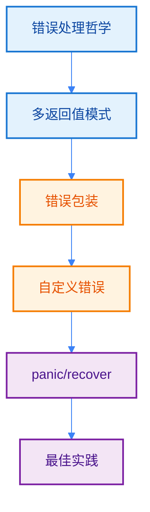
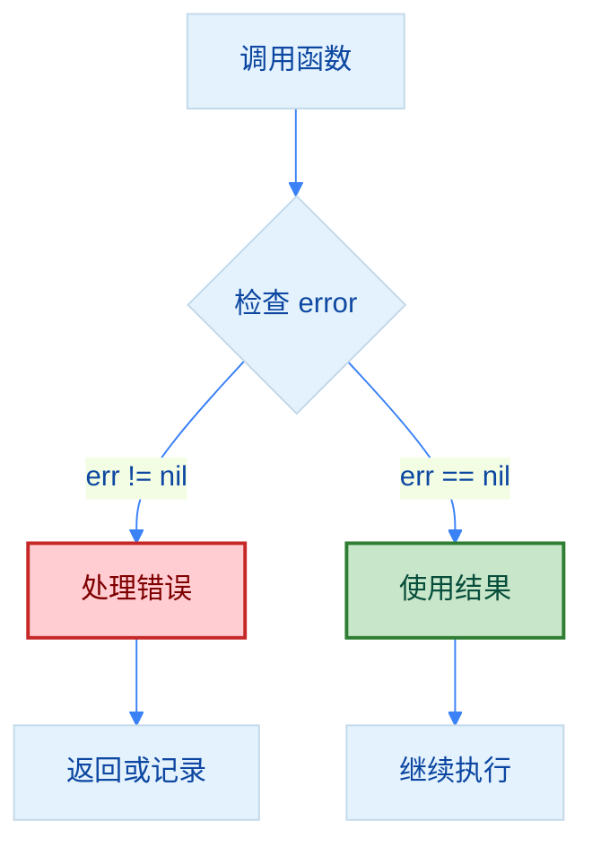
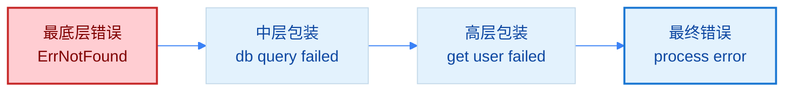
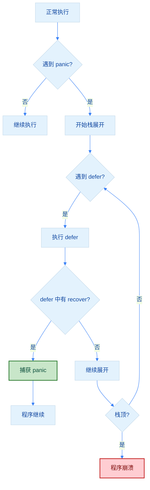
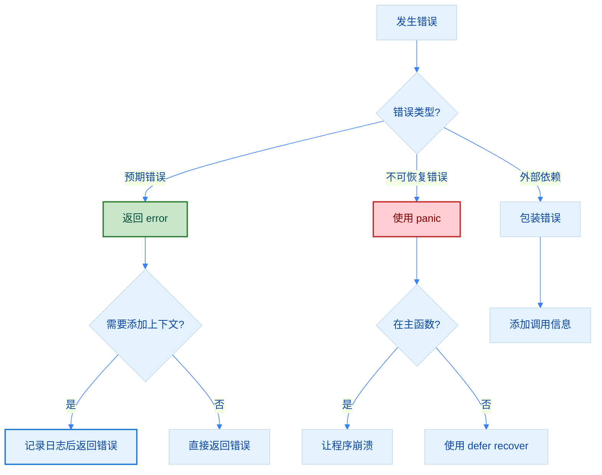

import { Badge } from "@rspress/core/theme";
import { Callout } from "@rspress/core/theme-original";

# Error Handling

[← 返回函数与方法](./function-basics.mdx)

Go 语言的错误处理是其最具特色的设计之一，通过明确的错误返回值而非异常机制，让错误处理更加显式和可控。

## 学习路径



## <Badge text="错误处理哲学" type="tip" />

### 设计原则

<Badge text="无技术背景" type="tip" /> Go 认为**错误是预期的**，应该显式处理，而不是通过异常机制隐式传播。

```go
// Go 的错误处理哲学：
// 1. 错误是值，可以像其他值一样传递
// 2. 错误应该是显式的，不要隐藏
// 3. 尽早处理错误，不要让它传播
```

### 为什么不用异常？

```go
// ❌ 传统异常处理（Java/C# 风格）
try {
    result := divide(10, 0)
} catch (Exception e) {
    // 处理错误
}

// ✅ Go 风格：错误是返回值
result, err := divide(10, 0)
if err != nil {
    // 处理错误
}
```

<Callout type="info" title={<Badge text="优势" type="info" />}>
  Go 的错误处理机制具有以下优势：

  • **显式性**：错误处理代码清晰可见，不会隐藏
  • **可控性**：调用者必须明确处理错误
  • **可读性**：代码流程更清晰，易于理解
  • **性能**：无需异常栈展开，性能更好
</Callout>

## <Badge text="多返回值错误模式" type="info" />

### 基本错误处理

<Badge text="初级开发者" type="info" /> Go 的惯例是最后一个返回值是 `error` 类型。

```go
package main

import (
    "errors"
    "fmt"
)

// 标准错误处理模式
func divide(a, b float64) (float64, error) {
    if b == 0 {
        return 0, errors.New("division by zero")
    }
    return a / b, nil
}

func main() {
    result, err := divide(10, 0)
    if err != nil {
        fmt.Println("错误:", err)
        return
    }
    fmt.Println("结果:", result)
}
```

### 错误处理流程



### 错误处理的黄金法则

```go
package main

import (
    "errors"
    "fmt"
    "log"
)

// ✅ 法则1：不要忽略错误
func readFile(filename string) ([]byte, error) {
    data, err := readFileHelper(filename)
    if err != nil {
        log.Errorf("err:%s", err)
        return nil, err  // 必须处理错误
    }
    return data, nil
}

// ❌ 错误：忽略错误
func readFileBad(filename string) []byte {
    data, _ := readFileHelper(filename)  // 永远不要这样做！
    return data
}

// ✅ 法则2：尽早返回
func processUser(id int) (*User, error) {
    user, err := getUser(id)
    if err != nil {
        log.Errorf("err:%s", err)
        return nil, err
    }

    if !user.Active {
        return nil, errors.New("user is not active")
    }

    return user, nil
}

// ✅ 法则3：记录日志后返回原始错误
func processData(id int) error {
    data, err := fetchFromDB(id)
    if err != nil {
        log.Errorf("fetch data for ID %d err:%s", id, err)
        return err
    }
    // 处理数据...
    return nil
}

func main() {
    err := processData(123)
    if err != nil {
        fmt.Println("错误:", err)
    }
}
```

## <Badge text="错误包装与解包" type="warning" />

### Go 1.13+ 错误包装

<Badge text="中级开发者" type="warning" /> 使用 `%w` 动词包装错误，保留错误链。

```go
package main

import (
    "errors"
    "fmt"
)

// 底层错误
var ErrNotFound = errors.New("not found")
var ErrPermission = errors.New("permission denied")

// 返回错误
func getUser(id int) (*User, error) {
    // 模拟数据库查询失败
    return nil, ErrNotFound
}

func main() {
    _, err := getUser(123)
    if err != nil {
        // 检查特定错误
        if errors.Is(err, ErrNotFound) {
            fmt.Println("用户不存在")
        }

        // 解包错误
        var notFoundErr error = ErrNotFound
        if errors.As(err, &notFoundErr) {
            fmt.Println("这是一个 not found 错误")
        }

        // 打印错误链
        fmt.Println(err)  // db query failed: not found
    }
}
```

### 错误链结构



### 错误包装最佳实践

```go
package main

import (
    "errors"
    "fmt"
)

// ✅ 好的做法：记录日志后返回原始错误
func validateUser(id int) error {
    user, err := getUser(id)
    if err != nil {
        log.Printf("validate user %d", id)
        return err
    }
    if user.Age < 18 {
        return errors.New("user is underage")
    }
    return nil
}

// ❌ 不好的包装：隐藏原始错误
func validateUserBad(id int) error {
    user, err := getUser(id)
    if err != nil {
        return errors.New("validation failed")  // 丢失了原始错误信息
    }
    return nil
}

// ✅ 使用自定义错误类型
type ValidationError struct {
    Field   string
    Message string
    Err     error
}

func (e *ValidationError) Error() string {
    return fmt.Sprintf("validation failed for field %s: %s", e.Field, e.Message)
}

func (e *ValidationError) Unwrap() error {
    return e.Err
}

func validateEmail(email string) error {
    if email == "" {
        return &ValidationError{
            Field:   "email",
            Message: "cannot be empty",
        }
    }
    return nil
}
```

## <Badge text="自定义错误类型" type="warning" />

### 实现错误接口

<Badge text="中级开发者" type="warning" /> 自定义错误可以携带更多信息。

```go
package main

import (
    "fmt"
)

// 自定义错误类型
type AppError struct {
    Code    int
    Message string
    Err     error
}

// 实现 error 接口
func (e *AppError) Error() string {
    if e.Err != nil {
        return fmt.Sprintf("[%d] %s: %v", e.Code, e.Message, e.Err)
    }
    return fmt.Sprintf("[%d] %s", e.Code, e.Message)
}

// 实现 Unwrap() 方法支持错误解包
func (e *AppError) Unwrap() error {
    return e.Err
}

// 定义常见错误
var (
    ErrInvalidInput = &AppError{Code: 400, Message: "Invalid input"}
    ErrNotFound    = &AppError{Code: 404, Message: "Resource not found"}
)

func main() {
    err := processUserData("")
    if err != nil {
        fmt.Println(err)
    }
}

func processUserData(data string) error {
    if data == "" {
        return ErrInvalidInput
    }
    return nil
}
```

### 错误类型判断

```go
package main

import (
    "fmt"
)

type NetworkError struct {
    Hostname string
    Err      error
}

func (e *NetworkError) Error() string {
    return fmt.Sprintf("network error connecting to %s: %v", e.Hostname, e.Err)
}

func (e *NetworkError) Unwrap() error {
    return e.Err
}

func main() {
    err := connectToServer("example.com")
    if err != nil {
        // 类型断言检查错误类型
        var netErr *NetworkError
        if errors.As(err, &netErr) {
            fmt.Printf("网络错误: 无法连接到 %s\n", netErr.Hostname)
        }
    }
}

func connectToServer(hostname string) error {
    return &NetworkError{
        Hostname: hostname,
        Err:      fmt.Errorf("connection timeout"),
    }
}
```

## <Badge text="Panic 与 Recover" type="danger" />

### Panic 的使用场景

<Badge text="高级开发者" type="danger" /> `panic` 只用于**不可恢复的错误**，如程序初始化失败。

```go
package main

import (
    "fmt"
    "os"
)

// ✅ 合理使用 panic：程序初始化
func initConfig() {
    config := os.Getenv("CONFIG_FILE")
    if config == "" {
        panic("CONFIG_FILE environment variable is required")
    }
    // 加载配置...
}

// ❌ 不合理使用 panic：处理业务错误
func divide(a, b int) int {
    if b == 0 {
        panic("division by zero")  // 应该返回 error！
    }
    return a / b
}

// ✅ 正确做法：返回错误
func divideSafe(a, b int) (int, error) {
    if b == 0 {
        return 0, fmt.Errorf("division by zero")
    }
    return a / b, nil
}

func main() {
    // 在 init 中使用 panic 是合理的
    // initConfig()

    // 业务逻辑应该返回错误
    result, err := divideSafe(10, 0)
    if err != nil {
        fmt.Println("错误:", err)
        return
    }
    fmt.Println("结果:", result)
}
```

### Recover 使用时机

<Callout type="danger" title={<Badge text="重要" type="danger" />}>
  <strong>recover 只能在 defer 函数中有效</strong>，且通常只在**顶层**或**库边界**使用。

  • 不要在普通函数中 recover
  • recover 后应该重新 panic 或记录日志
  • 不要隐藏 panic，应该妥善处理
</Callout>

```go
package main

import (
    "fmt"
    "log"
)

// ✅ 在顶层恢复 panic
func main() {
    defer func() {
        if r := recover(); r != nil {
            log.Printf("程序 panic: %v", r)
            // 可以选择退出程序或清理资源
        }
    }()

    // 运行可能 panic 的代码
    riskyOperation()
    fmt.Println("这行不会执行")
}

func riskyOperation() {
    // 模拟 panic
    panic("something went wrong!")
}

// ✅ 在库边界恢复 panic，转换为 error
func safeOperation() (err error) {
    defer func() {
        if r := recover(); r != nil {
            err = fmt.Errorf("panic recovered: %v", r)
        }
    }()

    // 可能 panic 的代码
    dangerousFunction()
    return nil
}

func dangerousFunction() {
    panic("internal error")
}

// ❌ 不好的做法：隐藏 panic
func badRecover() {
    defer func() {
        recover()  // 静默恢复，不记录任何日志
    }()
    panic("error")
}
```

### Panic/Recover 流程



## <Badge text="最佳实践" type="success" />

### 错误处理清单

<Badge text="专业开发者" type="danger" />

```go
package main

import (
    "errors"
    "fmt"
    "log"
)

// ✅ 1. 定义明确的错误变量
var (
    ErrUserNotFound    = errors.New("user not found")
    ErrInvalidArgument = errors.New("invalid argument")
    ErrPermission      = errors.New("permission denied")
)

// ✅ 2. 记录日志后返回原始错误
func getUser(id int) (*User, error) {
    user, err := db.QueryUser(id)
    if err != nil {
        log.Errorf("query user %d err:%s", id, err)
        return nil, err
    }
    if user == nil {
        return nil, ErrUserNotFound
    }
    return user, nil
}

// ✅ 3. 错误处理要完整
func processData(id int) error {
    user, err := getUser(id)
    if err != nil {
        // 记录日志并返回错误
        log.Errorf("Failed to get user %d err:%s", id, err)
        return err
    }

    if err := validateUser(user); err != nil {
        log.Errorf("err:%s", err)
        return err
    }

    return nil
}

// ✅ 4. 尽早返回错误
func validateUser(user *User) error {
    if user == nil {
        return ErrInvalidArgument
    }
    if user.Name == "" {
        return errors.New("user name is required")
    }
    if user.Age < 0 || user.Age > 150 {
        return errors.New("invalid user age")
    }
    return nil
}

// ✅ 5. 记录日志后返回原始错误
func processFile(filename string) error {
    file, err := os.Open(filename)
    if err != nil {
        log.Errorf("open file %s err:%s", filename, err)
        return err
    }
    defer file.Close()

    // 处理文件...
    return nil
}

// ❌ 常见错误
func badExample() {
    // 1. 忽略错误
    data, _ := readFile("config.json")

    // 2. 用 panic 处理可预期的错误
    if data == nil {
        panic("no data")  // 应该返回 error
    }

    // 3. 错误信息不明确
    return errors.New("error")  // 应该说明是什么错误
}

// ✅ 好的示例
func goodExample() error {
    data, err := readFile("config.json")
    if err != nil {
        log.Errorf("err:%s", err)
        return err
    }

    if data == nil {
        return errors.New("config file is empty")
    }

    return nil
}
```

### 错误处理决策树



## 错误处理速查表

| 场景 | 推荐做法 | 示例 |
|-----|---------|-----|
| 简单错误 | `errors.New()` | `errors.New("invalid input")` |
| 格式化错误 | `fmt.Errorf()` | `fmt.Errorf("user %d not found", id)` |
| 错误处理 | 记录日志后返回原始错误 | `log.Printf("query failed"); return err` |
| 错误判断 | `errors.Is()` | `errors.Is(err, ErrNotFound)` |
| 错误提取 | `errors.As()` | `errors.As(err, &netErr)` |
| 自定义错误 | 实现 `error` 接口 | `type AppError struct {...}` |
| 不可恢复错误 | 使用 `panic` | `panic("config required")` |
| 恢复 panic | `defer` + `recover` | 在顶层或库边界 |

## 练习

<Badge text="初级" type="tip" />
1. **实现一个除法函数**，处理除零错误

<details>
<summary>查看答案</summary>

```go
package main

import (
    "errors"
    "fmt"
)

func divide(a, b float64) (float64, error) {
    if b == 0 {
        return 0, errors.New("division by zero")
    }
    return a / b, nil
}

func main() {
    result, err := divide(10, 0)
    if err != nil {
        fmt.Println("错误:", err)
        return
    }
    fmt.Println("结果:", result)
}
```

**解释**：使用 Go 标准的多返回值模式，最后一个返回值是 `error` 类型。除零时返回错误信息和零值。

</details>

2. **编写一个文件读取函数**，返回详细的错误信息

<details>
<summary>查看答案</summary>

```go
package main

import (
    "fmt"
    "io"
    "log"
    "os"
)

func readFile(filename string) ([]byte, error) {
    file, err := os.Open(filename)
    if err != nil {
        log.Errorf("err:%s", err)
        return nil, err
    }
    defer file.Close()

    data, err := io.ReadAll(file)
    if err != nil {
        log.Errorf("err:%s", err)
        return nil, err
    }

    return data, nil
}

func main() {
    data, err := readFile("example.txt")
    if err != nil {
        fmt.Println("错误:", err)
        return
    }
    fmt.Println("内容:", string(data))
}
```

**解释**：直接返回原始错误，不进行包裹。如果需要记录上下文信息，应使用日志记录。

</details>

<Badge text="中级" type="info" />
3. **创建自定义错误类型** `ValidationError`，包含字段名和错误信息

<details>
<summary>查看答案</summary>

```go
package main

import (
    "fmt"
)

// 自定义验证错误
type ValidationError struct {
    Field   string
    Message string
}

func (e *ValidationError) Error() string {
    return fmt.Sprintf("验证失败: 字段 '%s' %s", e.Field, e.Message)
}

func validateUser(name, email string) error {
    if name == "" {
        return &ValidationError{
            Field:   "name",
            Message: "不能为空",
        }
    }
    if email == "" {
        return &ValidationError{
            Field:   "email",
            Message: "不能为空",
        }
    }
    return nil
}

func main() {
    err := validateUser("", "test@example.com")
    if err != nil {
        fmt.Println("错误:", err)
    }
}
```

**解释**：实现 `error` 接口的 `Error()` 方法，可以携带结构化的错误信息，便于调用方处理特定错误。

</details>

4. **实现错误包装**，在不同层次添加上下文信息

<details>
<summary>查看答案</summary>

```go
package main

import (
    "errors"
    "fmt"
    "log"
)

var ErrUserNotFound = errors.New("user not found")

// 数据库层
func getUserFromDB(id int) (*User, error) {
    return nil, ErrUserNotFound
}

// 服务层
func getUserService(id int) (*User, error) {
    user, err := getUserFromDB(id)
    if err != nil {
        log.Errorf("获取用户 %d err:%s", id, err)
        return nil, err
    }
    return user, nil
}

// 处理器层
func handleUser(id int) error {
    user, err := getUserService(id)
    if err != nil {
        log.Errorf("err:%s", err)
        return err
    }
    fmt.Printf("用户: %+v\n", user)
    return nil
}

type User struct {
    Id   int
    Name string
}

func main() {
    err := handleUser(123)
    if err != nil {
        // 检查是否是特定错误
        if errors.Is(err, ErrUserNotFound) {
            fmt.Println("用户不存在")
        } else {
            fmt.Println("其他错误:", err)
        }
    }
}
```

**解释**：使用 `%w` 动词包装错误，保留错误链。每层添加自己的上下文信息，使用 `errors.Is()` 判断底层错误。

</details>

<Badge text="高级" type="warning" />
5. **实现一个安全的 HTTP 处理器**，使用 recover 捕获 panic

<details>
<summary>查看答案</summary>

```go
package main

import (
    "fmt"
    "log"
)

// 安全的 HTTP 处理器包装器
func safeHandler(handler func() error) (err error) {
    defer func() {
        if r := recover(); r != nil {
            log.Errorf("捕获 panic err:%s", r)
            err = fmt.Errorf("内部错误: %v", r)
        }
    }()
    return handler()
}

func processRequest() error {
    // 模拟 panic
    panic("意外的错误!")
    return nil
}

func main() {
    err := safeHandler(processRequest)
    if err != nil {
        fmt.Println("处理错误:", err)
    }
    fmt.Println("程序继续运行")
}
```

**解释**：使用 `defer + recover` 模式捕获 panic，转换为 error 返回。只在顶层或边界处使用 recover，避免滥用。

</details>

6. **编写一个错误处理中间件**，统一处理和记录错误

<details>
<summary>查看答案</summary>

```go
package main

import (
    "fmt"
    "log"
)

// 处理器类型
type Handler func(string) error

// 错误处理中间件
func errorHandler(next Handler) Handler {
    return func(input string) error {
        defer func() {
            if r := recover(); r != nil {
                log.Errorf("[PANIC] 恢复 err:%s", r)
            }
        }()

        err := next(input)
        if err != nil {
            log.Errorf("[ERROR] 处理 '%s' 失败 err:%s", input, err)
            return err
        }
        log.Printf("[INFO] 成功处理: %s", input)
        return nil
    }
}

// 业务处理器
func processOrder(orderId string) error {
    if orderId == "" {
        return fmt.Errorf("订单 ID 不能为空")
    }
    if orderId == "invalid" {
        panic("数据格式错误")
    }
    fmt.Printf("处理订单: %s\n", orderId)
    return nil
}

func main() {
    // 包装处理器
    safeProcess := errorHandler(processOrder)

    // 测试
    safeProcess("ORDER-001")
    safeProcess("")
    safeProcess("invalid")
}
```

**解释**：中间件模式包装处理器，统一处理 panic 和 error，添加日志记录。这是 Web 框架中常见的错误处理模式。

</details>


[← 返回函数与方法](./function-basics.mdx) | [Defer 详解](./defer.mdx)
