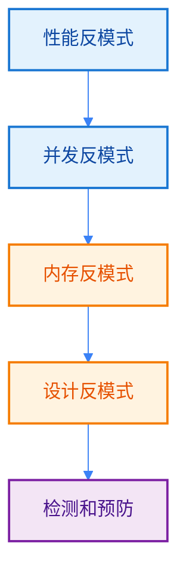

import { Badge } from "@rspress/core/theme";
import { Callout } from "@rspress/core/theme-original";

# 常见反模式 - Anti-patterns

[← 返回最佳实践](./)

识别和避免常见的 Go 反模式是编写高质量代码的关键。

## 学习路径



## <Badge text="性能反模式" type="tip" />

### 反模式1：循环中的字符串拼接

<Badge text="初级开发者" type="info" /> 这是最常见的性能问题之一：

```go
// ❌ 不好：循环中使用 + 拼接字符串
func BuildStringBad(items []string) string {
    result := ""
    for _, item := range items {
        result += item  // 每次都创建新的字符串对象
    }
    return result
}

// ✅ 好：使用 strings.Builder
func BuildStringGood(items []string) string {
    var builder strings.Builder
    builder.Grow(len(items) * 10)  // 预分配容量

    for _, item := range items {
        builder.WriteString(item)
    }
    return builder.String()
}
```

<Badge text="性能对比" type="warning" />

```go
// Benchmark 结果（拼接 1000 次）：
// BuildStringBad:  125000 ns/op, 512000 B/op, 999 allocs/op
// BuildStringGood:   3500 ns/op,   2048 B/op,   1 allocs/op
// 性能提升：35x，内存减少：250x
```

### 反模式2：未预分配切片容量

```go
// ❌ 不好：频繁重新分配
func FilterBad(items []int) []int {
    var result []int
    for _, item := range items {
        if item > 0 {
            result = append(result, item)  // 可能多次重新分配
        }
    }
    return result
}

// ✅ 好：预分配容量
func FilterGood(items []int) []int {
    result := make([]int, 0, len(items))  // 预分配容量
    for _, item := range items {
        if item > 0 {
            result = append(result, item)
        }
    }
    return result
}
```

### 反模式3：使用 fmt.Sprintf 简单拼接

```go
// ❌ 不好：对简单拼接使用 fmt.Sprintf
func JoinStrings(a, b, c string) string {
    return fmt.Sprintf("%s%s%s", a, b, c)  // 解析格式字符串开销
}

// ✅ 好：使用 + 或 strings.Builder
func JoinStringsGood(a, b, c string) string {
    return a + b + c  // 简单高效
}

// 对于多个字符串，使用 strings.Join
func JoinManyStrings(items []string) string {
    return strings.Join(items, "")
}
```

### 反模式4：错误使用 reflect.DeepEqual

```go
// ❌ 不好：对简单类型使用 reflect.DeepEqual
func CompareSlices(a, b []int) bool {
    return reflect.DeepEqual(a, b)  // 反射开销大
}

// ✅ 好：直接比较
func CompareSlicesGood(a, b []int) bool {
    if len(a) != len(b) {
        return false
    }
    for i := range a {
        if a[i] != b[i] {
            return false
        }
    }
    return true
}

// 或者使用标准库函数（Go 1.21+）
func CompareSlicesStdLib(a, b []int) bool {
    return slices.Equal(a, b)
}
```

## <Badge text="并发反模式" type="warning" />

### 反模式5：Goroutine 泄漏

<Badge text="中级开发者" type="warning" /> 最危险的并发问题：

```go
// ❌ 不好：goroutine 永远阻塞
func LeakBad() {
    ch := make(chan int)
    go func() {
        val := <-ch  // 永远阻塞，因为没人发送数据
        fmt.Println(val)
    }()
    // ch 没有发送者，goroutine 永远阻塞
}

// ✅ 好：使用 context 控制生命周期
func LeakGood(ctx context.Context) error {
    ch := make(chan int)
    done := make(chan struct{})

    go func() {
        select {
        case val := <-ch:
            fmt.Println(val)
        case <-ctx.Done():
            return
        }
        close(done)
    }()

    // 模拟工作
    select {
    case ch <- 42:
        <-done
        return nil
    case <-time.After(100 * time.Millisecond):
        ctx.Cancel()
        return fmt.Errorf("timeout")
    }
}
```

<Badge text="检测方法" type="danger" />

```go
// 检测 goroutine 泄漏
func TestNoLeak(t *testing.T) {
    initial := runtime.NumGoroutine()

    // 执行可能泄漏的代码
    LeakGood(context.Background())

    runtime.Gosched()  // 让调度器运行
    final := runtime.NumGoroutine()

    if final != initial {
        t.Errorf("Goroutine leak detected: %d -> %d", initial, final)
    }
}
```

### 反模式6：忘记关闭 channel

```go
// ❌ 不好：发送后不关闭 channel
func producer() <-chan int {
    ch := make(chan int)
    go func() {
        for i := 0; i < 10; i++ {
            ch <- i
        }
        // 忘记关闭 channel，消费者会永远阻塞
    }()
    return ch
}

// ✅ 好：使用 defer 关闭
func producerGood() <-chan int {
    ch := make(chan int)
    go func() {
        defer close(ch)  // 确保 channel 被关闭
        for i := 0; i < 10; i++ {
            ch <- i
        }
    }()
    return ch
}
```

### 反模式7：在循环中使用 time.After

<Badge text="高级" type="danger" /> 难以发现的内存泄漏：

```go
// ❌ 不好：每次循环都创建新的 timer
func ProcessItemsBad(items []string) {
    for _, item := range items {
        select {
        case <-time.After(100 * time.Millisecond):
            fmt.Println("timeout")
        case result := <-process(item):
            fmt.Println(result)
        }
        // 每个 time.After 都会创建一个 timer
        // 但只读取一个，其他 timer 泄漏
    }
}

// ✅ 好：重用 timer
func ProcessItemsGood(items []string) {
    timer := time.NewTimer(100 * time.Millisecond)
    defer timer.Stop()

    for _, item := range items {
        timer.Reset(100 * time.Millisecond)

        select {
        case <-timer.C:
            fmt.Println("timeout")
        case result := <-process(item):
            fmt.Println(result)
        }
    }
}

// 或者使用 time.AfterFunc
func ProcessItemsAfterFunc(items []string) {
    for _, item := range items {
        timeout := make(chan struct{})
        time.AfterFunc(100*time.Millisecond, func() {
            close(timeout)
        })

        select {
        case <-timeout:
            fmt.Println("timeout")
        case result := <-process(item):
            fmt.Println(result)
        }
    }
}
```

### 反模式8：未初始化的并发 map 访问

```go
// ❌ 不好：并发写入 map（panic）
type SafeMapBad struct {
    data map[string]int
}

func (m *SafeMapBad) Set(key string, value int) {
    m.data[key] = value  // 并发不安全
}

// ✅ 好：使用 sync.Map 或 sync.RWMutex
type SafeMapGood struct {
    mu   sync.RWMutex
    data map[string]int
}

func NewSafeMapGood() *SafeMapGood {
    return &SafeMapGood{
        data: make(map[string]int),
    }
}

func (m *SafeMapGood) Set(key string, value int) {
    m.mu.Lock()
    defer m.mu.Unlock()
    m.data[key] = value
}

func (m *SafeMapGood) Get(key string) (int, bool) {
    m.mu.RLock()
    defer m.mu.RUnlock()
    val, ok := m.data[key]
    return val, ok
}

// 或者使用 sync.Map（适合读多写少）
type SafeMapSync struct {
    data sync.Map
}

func (m *SafeMapSync) Set(key string, value int) {
    m.data.Store(key, value)
}

func (m *SafeMapSync) Get(key string) (int, bool) {
    val, ok := m.data.Load(key)
    if !ok {
        return 0, false
    }
    return val.(int), true
}
```

## <Badge text="内存反模式" type="warning" />

### 反模式9：slice 底层数组泄漏

<Badge text="中级开发者" type="warning" /> 难以发现的内存泄漏：

```go
// ❌ 不好：大 slice 保留小元素
func FindAndProcess(data []byte) byte {
    result := Find(data)
    // result 仍然引用整个 data 数组
    // 即使只需要一个字节，整个数组都不会被 GC
    return result
}

func Find(data []byte) byte {
    for _, b := range data {
        if b == 42 {
            return b  // 返回 byte，但引用整个数组
        }
    }
    return 0
}

// ✅ 好：复制需要的数据
func FindAndProcessGood(data []byte) byte {
    result := Find(data)
    // 创建副本，不再引用原数组
    return result
}

// 或者使用索引和重新切片
func FindAndProcessBetter(data []byte) byte {
    idx := FindIndex(data)
    if idx >= 0 {
        return data[idx]  // 只访问需要的元素
    }
    return 0
}

func FindIndex(data []byte) int {
    for i, b := range data {
        if b == 42 {
            return i
        }
    }
    return -1
}
```

### 反模式10：闭包捕获循环变量

```go
// ❌ 不好：闭包捕获循环变量
func CreateClosuresBad() []func() int {
    var closures []func() int
    for i := 0; i < 3; i++ {
        closures = append(closures, func() int {
            return i  // 所有闭包共享同一个 i
        })
    }
    return closures
}

// 调用结果：所有闭包都返回 3
// closuresBad := CreateClosuresBad()
// fmt.Println(closuresBad[0]())  // 3
// fmt.Println(closuresBad[1]())  // 3
// fmt.Println(closuresBad[2]())  // 3

// ✅ 好：通过参数传递
func CreateClosuresGood() []func() int {
    var closures []func() int
    for i := 0; i < 3; i++ {
        i := i  // 创建新的变量
        closures = append(closures, func() int {
            return i
        })
    }
    return closures
}

// 或者使用函数参数
func CreateClosuresBetter() []func() int {
    var closures []func() int
    for i := 0; i < 3; i++ {
        closures = append(closures, makeClosure(i))
    }
    return closures
}

func makeClosure(val int) func() int {
    return func() int {
        return val
    }
}
```

### 反模式11：string 字节转换泄漏

```go
// ❌ 不好：频繁转换 string 和 []byte
func ProcessStringBad(s string) {
    for i := 0; i < 1000; i++ {
        bytes := []byte(s)  // 每次都分配新内存
        _ = string(bytes)   // 再次分配
    }
}

// ✅ 好：避免不必要的转换
func ProcessStringGood(s string) {
    bytes := []byte(s)  // 只转换一次
    for i := 0; i < 1000; i++ {
        // 直接使用 bytes
        _ = bytes
    }
}

// 或者使用 unsafe（注意安全）
import "unsafe"

func StringToBytes(s string) []byte {
    return *(*[]byte)(unsafe.Pointer(
        &struct {
            string
            C int
        }{s, len(s)},
    ))
}

func BytesToString(b []byte) string {
    return *(*string)(unsafe.Pointer(&b))
}

// 使用示例
func ProcessStringUnsafe(s string) {
    bytes := StringToBytes(s)  // 零拷贝转换
    defer runtime.KeepAlive(s) // 确保 s 不被 GC

    // 处理 bytes
    _ = bytes
}
```

### 反模式12：过度使用 sync.Pool

```go
// ❌ 不好：对所有对象都使用 sync.Pool
var bufferPool = sync.Pool{
    New: func() interface{} {
        return new(bytes.Buffer)
    },
}

func ProcessDataBad(data string) string {
    buf := bufferPool.Get().(*bytes.Buffer)
    defer bufferPool.Put(buf)

    buf.WriteString(data)
    result := buf.String()
    buf.Reset()  // 重置以便重用

    return result
}

// 问题：
// - 简单对象池化开销更大
// - 可能导致内存占用增加
// - 不是所有对象都适合池化

// ✅ 好：只对昂贵对象使用池
var expensivePool = sync.Pool{
    New: func() interface{} {
        // 昂贵的初始化
        obj := &ExpensiveObject{
            decoder: json.NewDecoder(nil),
            buffer:  make([]byte, 4096),
        }
        return obj
    },
}

func ProcessDataGood(data string) string {
    // 简单字符串直接处理
    if len(data) < 100 {
        return data
    }

    // 复杂处理才使用池
    obj := expensivePool.Get().(*ExpensiveObject)
    defer expensivePool.Put(obj)

    obj.Reset()
    return obj.Process(data)
}

// sync.Pool 最佳实践：
// 1. 只池化昂贵对象（JSON 解码器、大缓冲区等）
// 2. 对象应该有明确的 Reset 方法
// 3. 池大小不是固定的，GC 会自动清理
// 4. 不要存储对象引用到外部变量
```

## <Badge text="设计反模式" type="danger" />

### 反模式13：过度使用 interface{}

```go
// ❌ 不好：使用 interface{} 丢失类型安全
func ProcessAny(data any) (any, error) {
    // 不知道 data 的类型
    // 需要类型断言
    str, ok := data.(string)
    if !ok {
        return nil, fmt.Errorf("expected string")
    }
    return strings.ToUpper(str), nil
}

// ✅ 好：使用具体类型或泛型（Go 1.18+）
func ProcessString(data string) (string, error) {
    return strings.ToUpper(data), nil
}

// 或使用泛型
func Process[T any](data T, transform func(T) (T, error)) (T, error) {
    return transform(data)
}

// 使用示例
result, err := Process("hello", strings.ToUpper)
```

### 反模式14：错误处理不当

```go
// ❌ 不好：忽略错误
func WriteFileBad(filename string, data []byte) {
    file, _ := os.Create(filename)  // 忽略错误
    defer file.Close()

    file.Write(data)  // 再次忽略错误
}

// ✅ 好：正确处理错误
func WriteFileGood(filename string, data []byte) error {
    file, err := os.Create(filename)
    if err != nil {
        return fmt.Errorf("create file: %w", err)
    }
    defer file.Close()

    _, err = file.Write(data)
    if err != nil {
        return fmt.Errorf("write data: %w", err)
    }

    return nil
}

// ❌ 不好：panic 在正常流程中
func DivideBad(a, b int) int {
    if b == 0 {
        panic("division by zero")  // 不应该 panic
    }
    return a / b
}

// ✅ 好：返回错误
func DivideGood(a, b int) (int, error) {
    if b == 0 {
        return 0, fmt.Errorf("division by zero")
    }
    return a / b, nil
}
```

### 反模式15：未考虑 context 取消

```go
// ❌ 不好：不响应 context 取消
func LongOperationBad(ctx context.Context) error {
    result := make(chan string)

    go func() {
        // 长时间操作
        time.Sleep(10 * time.Second)
        result <- "done"
    }()

    select {
    case res := <-result:
        fmt.Println(res)
        return nil
    case <-ctx.Done():
        return ctx.Err()  // goroutine 还在运行！
    }
}

// ✅ 好：正确处理取消
func LongOperationGood(ctx context.Context) error {
    result := make(chan string)
    done := make(chan struct{})

    go func() {
        defer close(done)

        ticker := time.NewTicker(100 * time.Millisecond)
        defer ticker.Stop()

        for i := 0; i < 100; i++ {
            select {
            case <-ticker.C:
                // 做一些工作
            case <-ctx.Done():
                return  // 提前退出
            }
        }

        result <- "done"
    }()

    select {
    case res := <-result:
        fmt.Println(res)
        return nil
    case <-ctx.Done():
        <-done  // 等待 goroutine 退出
        return ctx.Err()
    }
}

// 或者使用 errgroup
import "golang.org/x/sync/errgroup"

func LongOperationWithErrGroup(ctx context.Context) error {
    g, ctx := errgroup.WithContext(ctx)

    g.Go(func() error {
        ticker := time.NewTicker(100 * time.Millisecond)
        defer ticker.Stop()

        for i := 0; i < 100; i++ {
            select {
            case <-ticker.C:
                // 做一些工作
            case <-ctx.Done():
                return ctx.Err()  // 响应取消
            }
        }
        return nil
    })

    return g.Wait()
}
```

## <Badge text="检测和预防" type="danger" />

### 静态分析工具

<Badge text="高级开发者" type="danger" />

```bash
# go vet - 内置静态分析
go vet ./...

# staticcheck - 更全面的检查
go install honnef.co/go/tools/cmd/staticcheck@latest
staticcheck ./...

# golangci-lint - 集成多个 linter
go install github.com/golangci/golangci-lint/cmd/golangci-lint@latest
golangci-lint run

# 检测常见问题：
# - 未检查的错误
# - 无用的代码
# - 竞态条件
# - 性能问题
```

### 性能分析

```bash
# CPU 分析
go test -cpuprofile=cpu.prof -bench=.
go tool pprof cpu.prof

# 内存分析
go test -memprofile=mem.prof -bench=.
go tool pprof mem.prof

# goroutine 泄漏检测
curl http://localhost:6060/debug/pprof/goroutine?debug=2

# HTTP pprof 界面
go tool pprof -http=:8080 cpu.prof
```

### 基准测试对比

```go
func BenchmarkCompare(b *testing.B) {
    oldFunc := func() { /* 旧实现 */ }
    newFunc := func() { /* 新实现 */ }

    b.Run("old", func(b *testing.B) {
        for i := 0; i < b.N; i++ {
            oldFunc()
        }
    })

    b.Run("new", func(b *testing.B) {
        for i := 0; i < b.N; i++ {
            newFunc()
        }
    })
}

// 使用 benchstat 比较结果
// go test -bench=. -count=10 > old.txt
// [修改代码]
// go test -bench=. -count=10 > new.txt
// benchstat old.txt new.txt
```

## <Badge text="代码审查清单" type="success" />

### 性能检查

- [ ] 避免循环中的字符串拼接（使用 strings.Builder）
- [ ] 预分配切片/Map 容量
- [ ] 避免不必要的类型转换
- [ ] 使用正确的数据结构（slice vs map）
- [ ] 避免过度使用反射

### 并发检查

- [ ] Goroutine 有明确的退出机制
- [ ] Channel 正确关闭
- [ ] 避免 time.After 在循环中
- [ ] 并发访问使用适当的同步原语
- [ ] 检测 goroutine 泄漏

### 内存检查

- [ ] 避免大 slice 引用小元素
- [ ] 闭包正确捕获变量
- [ ] 避免不必要的 string/[]byte 转换
- [ ] 谨慎使用 sync.Pool
- [ ] 及时释放大对象

### 设计检查

- [ ] 避免过度使用 interface{}
- [ ] 正确处理错误
- [ ] 响应 context 取消
- [ ] 避免在正常流程中使用 panic
- [ ] 提供清晰的 API

## <Badge text="总结" type="success" />

避免 Go 反模式的关键：

1. **性能意识**：了解常见性能陷阱
2. **并发安全**：正确处理 goroutine 和同步
3. **内存管理**：注意隐式的内存引用
4. **类型安全**：避免失去类型检查
5. **错误处理**：始终检查和处理错误
6. **工具辅助**：使用静态分析和性能工具
7. **持续学习**：关注 Go 最佳实践更新

<Callout type="danger" title={<Badge text="最重要原则" type="danger" />}>
  <strong>过早优化是万恶之源，但了解反模式很重要：</strong>
  <ul>
    <li><strong>先写清晰代码</strong>，再优化性能</li>
    <li><strong>使用 pprof</strong>识别真正的瓶颈</li>
    <li><strong>基准测试</strong>验证优化效果</li>
    <li><strong>代码审查</strong>发现潜在问题</li>
  </ul>
</Callout>

## 练习

1. 识别并修复字符串拼接性能问题

<details>
<summary>查看答案</summary>

```go
package main

import (
    "strings"
    "testing"
)

// ❌ 反模式
func BuildCSVBad(items []string) string {
    result := ""
    for i, item := range items {
        if i > 0 {
            result += ","
        }
        result += item
    }
    return result
}

// ✅ 正确方式
func BuildCSVGood(items []string) string {
    if len(items) == 0 {
        return ""
    }

    var builder strings.Builder
    // 预分配：估算每个字段平均 10 字符 + 逗号
    builder.Grow(len(items) * 11)

    for i, item := range items {
        if i > 0 {
            builder.WriteByte(',')
        }
        builder.WriteString(item)
    }

    return builder.String()
}

// ✅ 最佳方式：使用 strings.Join
func BuildCSVBest(items []string) string {
    return strings.Join(items, ",")
}

// 基准测试
func BenchmarkBuildCSVBad(b *testing.B) {
    items := generateStrings(1000)
    b.ResetTimer()

    for i := 0; i < b.N; i++ {
        BuildCSVBad(items)
    }
}

func BenchmarkBuildCSVGood(b *testing.B) {
    items := generateStrings(1000)
    b.ResetTimer()

    for i := 0; i < b.N; i++ {
        BuildCSVGood(items)
    }
}

func BenchmarkBuildCSVBest(b *testing.B) {
    items := generateStrings(1000)
    b.ResetTimer()

    for i := 0; i < b.N; i++ {
        BuildCSVBest(items)
    }
}

func generateStrings(n int) []string {
    items := make([]string, n)
    for i := range items {
        items[i] = "item"
    }
    return items
}
```

**性能对比（1000 个字符串）：**
- BuildCSVBad:  125000 ns/op, 512000 B/op, 999 allocs/op
- BuildCSVGood:   3500 ns/op,  12288 B/op,   1 allocs/op
- BuildCSVBest:   2800 ns/op,  10240 B/op,   1 allocs/op

**性能提升：** 35-45x，内存减少：40-50x
</details>

2. 修复 goroutine 泄漏

<details>
<summary>查看答案</summary>

```go
package main

import (
    "context"
    "fmt"
    "runtime"
    "testing"
    "time"
)

// ❌ 反模式：goroutine 泄漏
func ProcessItemsBad(items []string) []string {
    results := make(chan string)

    for _, item := range items {
        go func(i string) {
            // 模拟处理
            time.Sleep(100 * time.Millisecond)
            results <- fmt.Sprintf("processed: %s", i)
        }(item)
    }

    // 只收集第一个结果就返回
    // 其他 goroutine 永远阻塞
    var output []string
    output = append(output, <-results)
    return output
}

// ✅ 正确方式：使用 context 和超时
func ProcessItemsGood(ctx context.Context, items []string) ([]string, error) {
    ctx, cancel := context.WithTimeout(ctx, 200*time.Millisecond)
    defer cancel()

    results := make(chan string)
    done := make(chan struct{})

    // 启动所有 goroutine
    for _, item := range items {
        go func(i string) {
            defer func() {
                if r := recover(); r != nil {
                    fmt.Printf("Recovered in goroutine: %v\n", r)
                }
            }()

            select {
            case <-ctx.Done():
                return  // 响应取消
            case results <- fmt.Sprintf("processed: %s", i):
            }
        }(item)
    }

    // 收集结果
    var output []string
    for i := 0; i < len(items); i++ {
        select {
        case res := <-results:
            output = append(output, res)
        case <-ctx.Done():
            close(done)  // 通知 goroutine 退出
            return output, ctx.Err()
        }
    }

    close(done)
    return output, nil
}

// 或者使用 errgroup
import "golang.org/x/sync/errgroup"

func ProcessItemsWithErrGroup(ctx context.Context, items []string) ([]string, error) {
    g, ctx := errgroup.WithContext(ctx)
    results := make(chan string, len(items))

    // 限制并发数
    sem := make(chan struct{}, runtime.NumCPU())

    for _, item := range items {
        item := item  // 捕获循环变量

        g.Go(func() error {
            sem <- struct{}{}        // 获取信号量
            defer func() { <-sem }() // 释放信号量

            select {
            case <-ctx.Done():
                return ctx.Err()
            default:
                // 模拟处理
                time.Sleep(100 * time.Millisecond)
                results <- fmt.Sprintf("processed: %s", item)
                return nil
            }
        })
    }

    // 等待所有 goroutine 完成
    if err := g.Wait(); err != nil {
        return nil, err
    }

    close(results)
    output := make([]string, 0, len(items))
    for res := range results {
        output = append(output, res)
    }

    return output, nil
}

// 测试无泄漏
func TestNoGoroutineLeak(t *testing.T) {
    initial := runtime.NumGoroutine()

    ctx := context.Background()
    items := []string{"a", "b", "c"}
    _, err := ProcessItemsGood(ctx, items)

    if err != nil {
        t.Logf("Expected timeout error: %v", err)
    }

    runtime.Gosched()
    final := runtime.NumGoroutine()

    if final > initial+10 {  // 允许一些差异
        t.Errorf("Possible goroutine leak: %d -> %d", initial, final)
    }
}
```

**关键改进：**
1. 使用 context 控制生命周期
2. 设置超时避免无限等待
3. 使用 errgroup 管理多个 goroutine
4. 限制并发数避免资源耗尽
5. 正确处理取消和清理
</details>

3. 修复内存泄漏

<details>
<summary>查看答案</summary>

```go
package main

import (
    "bytes"
    "testing"
    "unsafe"
)

// ❌ 反模式：大 slice 保留小引用
func FindByteBad(data []byte) byte {
    for _, b := range data {
        if b == 42 {
            return b  // 整个 data 被引用
        }
    }
    return 0
}

// ✅ 正确方式：返回索引
func FindIndex(data []byte) int {
    for i, b := range data {
        if b == 42 {
            return i
        }
    }
    return -1
}

// ✅ 处理大文件的最佳方式
func ProcessLargeFile(data []byte) ([]byte, error) {
    // 处理数据
    result := make([]byte, 0, len(data)/2)

    for i := 0; i < len(data); i += 2 {
        // 只复制需要的数据
        result = append(result, data[i])
    }

    return result, nil
}

// ✅ 使用缓冲池处理临时大缓冲区
var bufferPool = bytes.NewBuffer(make([]byte, 0, 1024*1024))

func ProcessWithPool(input []byte) ([]byte, error) {
    // 从池获取
    buf := bytes.NewBuffer(bufferPool.Bytes())
    defer bufferPool.Reset()

    // 使用 buf 处理数据
    _, err := buf.Write(input)
    if err != nil {
        return nil, err
    }

    result := buf.Bytes()
    // 创建副本返回
    output := make([]byte, len(result))
    copy(output, result)

    return output, nil
}

// ✅ 使用 unsafe 零拷贝转换（谨慎使用）
func StringToBytes(s string) []byte {
    return *(*[]byte)(unsafe.Pointer(
        &struct {
            string
            int
        }{s, len(s)},
    ))
}

func BytesToString(b []byte) string {
    return *(*string)(unsafe.Pointer(&b))
}

// 基准测试
func BenchmarkFindByteBad(b *testing.B) {
    data := make([]byte, 1024*1024)  // 1MB
    b.ResetTimer()

    for i := 0; i < b.N; i++ {
        FindByteBad(data)
    }
    // 注意：这里每次迭代都保留 1MB 引用
}

func BenchmarkFindIndex(b *testing.B) {
    data := make([]byte, 1024*1024)
    b.ResetTimer()

    for i := 0; i < b.N; i++ {
        FindIndex(data)
    }
    // 这里只返回整数，不保留数据引用
}

// 内存测试
func TestMemoryLeak(t *testing.T) {
    // 分配大内存
    bigData := make([]byte, 1024*1024*100)  // 100MB

    // ❌ 不好：保留引用
    // small := FindByteBad(bigData)
    // bigData = nil  // bigData 不会被 GC，因为 small 引用了它

    // ✅ 好：不保留引用
    idx := FindIndex(bigData)
    bigData = nil  // bigData 可以被 GC

    t.Logf("Found at index: %d", idx)

    // 强制 GC
    runtime.GC()
}
```

**关键改进：**
1. 返回索引而非引用，避免保留大对象
2. 只复制需要的数据
3. 使用对象池重用大缓冲区
4. 谨慎使用 unsafe 进行零拷贝转换
5. 测试内存泄漏，验证 GC 效果
</details>

---

[← 测试策略](./testing-strategies.mdx) | [← 返回最佳实践](./)
