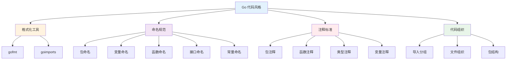

import { Badge } from "@rspress/core/theme";
import { Callout } from "@rspress/core/theme-original";

# 代码风格 - Code Style Conventions

<Badge text="必读" type="info" />

Go 语言的代码风格约定是其最独特的特性之一。通过统一的格式化工具和命名规范，Go 代码具有高度的一致性和可读性。

## 概览



## 格式化工具

<Badge text="初级开发者" type="success" />

### gofmt - 标准格式化工具

**gofmt** 是 Go 官方提供的代码格式化工具，它是一个**强制性的标准**，而非可选工具。

```bash
# 格式化单个文件
gofmt -w main.go

# 格式化整个包
gofmt -w ./...

# 查看哪些文件需要格式化（不实际修改）
gofmt -l .

# 打印格式化差异（不实际修改）
gofmt -d main.go
```

<Callout type="info">
  <strong>重要</strong>：所有 Go 代码在提交前都应该经过 gofmt 格式化。这是 Go 社区的铁律，没有例外。
</Callout>

### goimports - 增强的导入管理

**goimports** 是 gofmt 的增强版本，额外提供了导入管理功能：

```bash
# 安装 goimports
go install golang.org/x/tools/cmd/goimports@latest

# 使用 goimports（与 gofmt 相同的参数）
goimports -w main.go
```

**goimports 的额外功能：**

1. **自动删除未使用的导入**
2. **自动添加缺失的导入**
3. **自动分组导入**（标准库、第三方、本地）

<Callout type="tip">
  <strong>配置编辑器</strong>：在 VS Code 中配置保存时自动运行 goimports：

```json
{
  "go.formatTool": "goimports"
}
```
</Callout>

### 格式化规范

**基本规则：**

```go
// ✅ 使用 TAB 缩进（而非空格）
func example() {
	const x = 1 // TAB 缩进
	if x > 0 {
		println(x) // TAB 缩进
	}
}

// ✅ 左花括号不换行
func example() { // 左花括号在同一行
	// ...
}

// ❌ 错误：左花括号换行
func example()
{ // 不要这样做！
	// ...
}
```

**行长度建议：**

```go
// 虽然没有严格限制，但建议每行不超过 80-100 字符
// 如果行太长，gofmt 会尝试自动换行

// ✅ 推荐：合理长度
result := someFunction(param1, param2, param3)

// ✅ gofmt 自动格式化的长行
result := someVeryLongFunctionName(
	firstParameter,
	secondParameter,
	thirdParameter,
)
```

## 命名规范

<Badge text="初级开发者" type="success" />

### 包命名

**规则：**

```go
// ✅ 推荐：小写、单字、无下划线
package http
package fmt
package strings

// ❌ 避免：大写、下划线、连字符
package httpServer  // 使用 httpserver
package http_server // 使用 httpserver
package http-server // 使用 httpserver
```

**最佳实践：**

```go
// ✅ 包名应该是简短、有意义的小写单词
package user      // 处理用户相关功能
package auth      // 处理认证相关功能
package api       // 处理 API 相关功能

// ❌ 避免使用过于通用的名称
package util      // 太通用
package common    // 太通用
package data      // 太通用

// ✅ 如果必须使用通用名称，添加前缀
package strutil   // 字符串工具
package timutil   // 时间工具
```

**包与目录名的关系：**

```bash
# 目录结构
myproject/
├── user/
│   └── user.go      // package user
├── auth/
│   └── auth.go      // package auth
└── api/
    └── api.go       // package api
```

### 变量命名

**规则：**

```go
// ✅ 使用驼峰命名法（camelCase）
var userName string
var userID int
var isActive bool

// ❌ 避免使用下划线
var user_name string  // 使用 userName
var user_id int       // 使用 userID
```

**导出与非导出：**

```go
// ✅ 大写字母开头 = 导出（公开）
var UserName string
var UserID int
var IsActive bool

// ✅ 小写字母开头 = 非导出（私有）
var userName string
var userID int
var isActive bool
```

**简短 vs. 描述性：**

```go
// ✅ 局部变量可以简短（作用域小）
func process() {
	u := getUser()    // u = user
	id := u.ID        // id = user ID
}

// ✅ 公共 API 应该描述性强
func GetUserNameByID(userID int) string {
	// ...
}

// ❌ 避免过度缩写
func GetUserNmByID(uid int) string {
	// 太难理解
}
```

**常见缩写：**

```go
// ✅ 首字母缩略词应保持一致
var httpServer HTTPServer  // HTTP 全大写
var xmlParser XMLParser    // XML 全大写
var id int                 // ID 全大写
var url string             // URL 全大写

// ❌ 不一致
var httpServer HttpServer  // 使用 HTTPServer
var xmlParser xmlParser    // 使用 XMLParser
```

### 函数命名

**规则：**

```go
// ✅ 使用驼峰命名法
func getUserByID(id int) *User {
	// ...
}

// ✅ 导出函数大写开头
func GetUserByID(id int) *User {
	// ...
}

// ✅ 非导出函数小写开头
func parseUserData(data []byte) (*User, error) {
	// ...
}
```

**命名模式：**

```go
// ✅ 构造函数通常使用 New + 类型名
func NewUser(name string) *User {
	return &User{Name: name}
}

// ✅ 获取器使用 Get + 属性名
func (u *User) GetName() string {
	return u.Name
}

// ✅ 设置器使用 Set + 属性名
func (u *User) SetName(name string) {
	u.Name = name
}

// ✅ 布尔检查器使用 Is + 形容词
func (u *User) IsActive() bool {
	return u.Active
}

// ✅ Has + 名词
func (u *User) HasPermission(perm string) bool {
	return u.Permissions[perm]
}
```

<Callout type="warning">
  <strong>避免</strong>：在函数名中重复包名或类型名

```go
// ❌ 不推荐
func (u *User) GetUserName() string { // User 重复
    return u.Name
}

// ✅ 推荐
func (u *User) Name() string {
    return u.Name
}
```
</Callout>

### 接口命名

<Badge text="中级开发者" type="warning" />

**单方法接口：**

```go
// ✅ 单方法接口使用 -er 后缀
type Reader interface {
	Read(p []byte) (n int, err error)
}

type Writer interface {
	Write(p []byte) (n int, err error)
}

type Closer interface {
	Close() error
}

type Stringer interface {
	String() string
}
```

**多方法接口：**

```go
// ✅ 多方法接口使用描述性名称
type UserStore interface {
	GetUser(id int) (*User, error)
	SaveUser(user *User) error
	DeleteUser(id int) error
}

// ❌ 避免：使用 -er 后缀
type UserStorer interface { // 不是单方法
	GetUser(id int) (*User, error)
	SaveUser(user *User) error
}
```

**接口 vs. 实现命名：**

```go
// ✅ 接口：简洁、描述行为
type UserStore interface {
	GetUser(id int) (*User, error)
}

// ✅ 实现：具体、描述实现
type MySQLUserStore struct {
	db *sql.DB
}

type PostgreSQLUserStore struct {
	db *sql.DB
}
```

### 常量命名

**规则：**

```go
// ✅ 常量使用驼峰命名法（大写开头）
const MaxConnections = 100
const DefaultTimeout = 30 * time.Second
const APIVersion = "v1"

// ✅ 非导出常量小写开头
const defaultPort = 8080
const maxRetries = 3

// ✅ 相关常量可以使用 iota
const (
	StatusPending = iota
	StatusActive
	StatusInactive
	StatusDeleted
)
```

**枚举模式：**

```go
// ✅ 使用 iota 定义枚举
type UserRole int

const (
	UserRoleGuest UserRole = iota
	UserRoleUser
	UserRoleAdmin
	UserRoleSuperAdmin
)

// ✅ 添加 String() 方法
func (r UserRole) String() string {
	switch r {
	case UserRoleGuest:
		return "guest"
	case UserRoleUser:
		return "user"
	case UserRoleAdmin:
		return "admin"
	case UserRoleSuperAdmin:
		return "super_admin"
	default:
		return "unknown"
	}
}
```

## 注释标准

<Badge text="中级开发者" type="warning" />

### 包注释

**规则：**

```go
// ✅ 包注释：在 package 声明之前
// Package http 提供了 HTTP 客户端和服务端实现。
//
// 这个包包含了 HTTP 协议的核心功能，包括：
//   - 客户端请求发送
//   - 服务端请求处理
//   - HTTP/2 支持
//   - 连接管理
package http
```

<Callout type="tip">
  <strong>格式要求</strong>：
  - 第一行以 "Package" 开头
  - 后续行提供详细说明
  - 使用完整句子（以句号结尾）
  - 可以包含列表（使用缩进）
</Callout>

### 函数注释

**规则：**

```go
// ✅ 函数注释：以函数名开头
// GetUser 根据 ID 获取用户信息。
//
// 如果用户不存在，返回 ErrUserNotFound 错误。
//
// 参数：
//   - id: 用户 ID
//
// 返回：
//   - *User: 用户对象
//   - error: 错误信息（可能为 nil）
func (s *UserService) GetUser(id int) (*User, error) {
	// ...
}

// ✅ 简单函数可以简化注释
// IsActive 返回用户是否处于活跃状态。
func (u *User) IsActive() bool {
	return u.Status == StatusActive
}
```

<Callout type="info">
  <strong>godoc 约定</strong>：注释会自动生成文档，确保注释清晰、准确。
</Callout>

### 类型注释

**规则：**

```go
// ✅ 类型注释：以类型名开头
// User 表示系统中的用户实体。
type User struct {
	ID        int       `json:"id"`
	Name      string    `json:"name"`
	Email     string    `json:"email"`
	CreatedAt time.Time `json:"created_at"`
}

// ✅ 接口注释
// UserStore 定义了用户存储的接口。
type UserStore interface {
	GetUser(id int) (*User, error)
}
```

### 变量注释

**规则：**

```go
// ✅ 导出变量需要注释
// MaxConnections 定义了数据库连接池的最大连接数。
var MaxConnections = 100

// ✅ 导出常量需要注释
// APIVersion 定义了当前 API 的版本。
const APIVersion = "v1"

// ✅ 结构体字段注释
type Config struct {
	// Host 定义了数据库主机地址。
	Host string
	// Port 定义了数据库端口。
	Port int
	// Database 定义了数据库名称。
	Database string
}
```

<Callout type="warning">
  <strong>重要</strong>：只有导出的标识符（大写开头）才需要 godoc 注释。
</Callout>

## 代码组织

<Badge text="高级开发者" type="danger" />

### 导入分组

**规则：**

```go
// ✅ 标准导入分组：标准库 → 第三方 → 本地
import (
	// 标准库
	"context"
	"fmt"
	"net/http"
	"time"

	// 第三方库
	"github.com/gin-gonic/gin"
	"go.uber.org/zap"

	// 本地包
	"myproject/internal/user"
	"myproject/internal/auth"
)
```

**导入别名：**

```go
// ✅ 解决包名冲突
import (
	"crypto/rand"
	mrand "math/rand" // 使用别名避免冲突
)

// ✅ 改善可读性
import (
	v1 "myproject/api/v1"
	v2 "myproject/api/v2"
)

// ✅ 避免循环导入
import (
	storagev1 "myproject/storage/v1"
	myappv1 "myproject/app/v1"
)
```

### 文件组织

**文件命名：**

```go
// ✅ 单一职责：每个文件只包含一个主要类型
user.go        // User 类型和基本方法
user_store.go  // UserStore 接口和实现
user_test.go   // 测试文件
user_example_test.go  // 示例代码

// ✅ 按功能分组
models.go      // 数据模型
handlers.go    // HTTP 处理器
services.go    // 业务逻辑
repository.go  // 数据访问
```

**文件大小建议：**

```go
// ✅ 推荐：每个文件不超过 500 行
// 如果文件过大，考虑拆分

// ✅ 拆分示例
// user.go - 核心类型
type User struct {
	// ...
}

// user_validation.go - 验证逻辑
func (u *User) Validate() error {
	// ...
}

// user_repository.go - 数据访问
func (r *UserRepository) Find(id int) (*User, error) {
	// ...
}
```

### 包结构

<Badge text="架构师" type="danger" />

**标准项目布局：**

```go
// ✅ 推荐的项目结构
myproject/
├── cmd/
│   └── myapp/
│       └── main.go          // 入口点
├── internal/
│   ├── user/
│   │   ├── user.go
│   │   ├── user_store.go
│   │   └── user_test.go
│   └── auth/
│       ├── auth.go
│       └── auth_test.go
├── pkg/
│   └── utils/
│       └── strings.go       // 可重用的工具
├── api/
│   ├── http/
│   │   └── handlers.go
│   └── grpc/
│       └── service.go
├── go.mod
└── go.sum
```

**包的职责：**

```go
// ✅ internal/ - 内部包（不能被外部导入）
package user

// ✅ pkg/ - 可重用的公共包
package utils

// ✅ cmd/ - 应用入口
package main

// ✅ api/ - API 定义
package http
```

## 常见错误和陷阱

<Badge text="所有开发者" type="info" />

### 错误 1：未格式化的代码

```go
// ❌ 错误：不一致的格式化
func example(){
x:=1
if x>0{
println(x)
}
}

// ✅ 正确：使用 gofmt
func example() {
	x := 1
	if x > 0 {
		println(x)
	}
}
```

### 错误 2：错误的命名风格

```go
// ❌ 错误：使用下划线
var user_name string

// ✅ 正确：使用驼峰命名
var userName string
```

### 错误 3：缺少导出标识符的注释

```go
// ❌ 错误：导出函数没有注释
func GetUser(id int) *User {
	// ...
}

// ✅ 正确：添加 godoc 注释
// GetUser 根据 ID 获取用户信息。
func GetUser(id int) *User {
	// ...
}
```

### 错误 4：过度缩写

```go
// ❌ 错误：难以理解的缩写
func GetUsrNmByID(uid int) string {
	// ...
}

// ✅ 正确：使用完整的描述性名称
func GetUserNameByID(userID int) string {
	// ...
}
```

### 错误 5：不一致的缩略词大小写

```go
// ❌ 错误：不一致
type httpServer struct{}
type XMLparser struct{}

// ✅ 正确：保持一致
type HTTPServer struct{}
type XMLParser struct{}
```

## 工具和配置

<Badge text="开发者工具" type="info" />

### 编辑器配置

**VS Code 设置：**

```json
{
  "go.formatTool": "goimports",
  "go.lintTool": "golangci-lint",
  "go.lintOnSave": "package",
  "go.formatOnSave": true,
  "[go]": {
    "editor.formatOnSave": true,
    "editor.codeActionsOnSave": {
      "source.organizeImports": "explicit"
    }
  }
}
```

### Git 钩子

**pre-commit 钩子：**

```bash
#!/bin/sh
# .git/hooks/pre-commit

# 运行 gofmt
gofmt -l . | grep -v vendor | grep -v '.git' && {
  echo "请运行 'gofmt -w .' 格式化代码"
  exit 1
}

# 运行 go vet
go vet ./... || {
  echo "govet 检查失败"
  exit 1
}

exit 0
```

### Makefile 目标

```makefile
# Makefile
.PHONY: fmt lint vet

fmt:
	gofmt -w .
	goimports -w .

lint:
	golangci-lint run

vet:
	go vet ./...

test:
	go test -race ./...
```

## 检查清单

<Badge text="提交前检查" type="info" />

在提交代码前，确保：

- [ ] 代码已经通过 `gofmt` 格式化
- [ ] 导入已经通过 `goimports` 整理
- [ ] 所有导出标识符都有 godoc 注释
- [ ] 包名使用小写、单字命名
- [ ] 变量和函数使用驼峰命名法
- [ ] 常量使用驼峰命名法（大写开头）
- [ ] 接口命名清晰（单方法使用 -er 后缀）
- [ ] 文件大小合理（< 500 行）
- [ ] 导入按标准库、第三方、本地分组

## 最佳实践总结

### 初级开发者

<Badge text="初级" type="success" />

- **必须使用 `gofmt`** 格式化所有代码
- **使用驼峰命名法**（不要使用下划线）
- **导出标识符大写开头**，非导出小写开头
- **为导出标识符添加注释**

### 中级开发者

<Badge text="中级" type="warning" />

- **使用 `goimports`** 自动管理导入
- **保持函数简短**（< 50 行）
- **使用有意义的名称**，避免过度缩写
- **保持缩略词大小写一致**（HTTP, ID, URL）

### 高级开发者

<Badge text="高级" type="danger" />

- **组织清晰的包结构**
- **遵循标准项目布局**
- **使用 `internal/`** 隔离内部实现
- **配置自动化工具**（编辑器、Git 钩子）
- **建立团队规范**（linting rules, CI/CD）

---

## 总结

Go 的代码风格约定是其成功的关键之一。通过遵循这些约定：

1. **提高代码可读性**：统一的风格使代码更容易理解
2. **减少认知负担**：不需要学习每个项目的不同风格
3. **提升协作效率**：自动格式化消除风格争议
4. **保证代码质量**：命名规范使代码更清晰

<Callout type="success">
  <strong>核心理念</strong>：Go 的哲学是"约定优于配置"。通过遵循社区约定，我们可以专注于解决问题，而不是争论代码风格。
</Callout>

### 下一步

- [错误处理模式 →](./error-patterns.mdx)
- [并发模式 →](./concurrency-patterns.mdx)
- [测试策略 →](./testing-strategies.mdx)

### 参考资料

- [Effective Go](https://go.dev/doc/effective_go)
- [Go Code Review Comments](https://github.com/golang/go/wiki/CodeReviewComments)
- [gofmt Command Documentation](https://pkg.go.dev/cmd/gofmt)
- [goimports Tool](https://pkg.go.dev/golang.org/x/tools/cmd/goimports)
