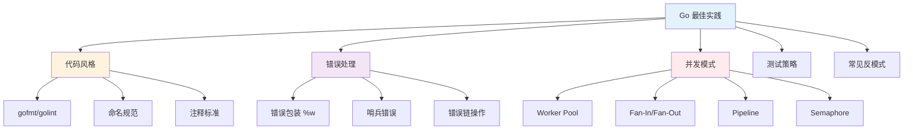

import { Badge } from "@rspress/core/theme";
import { Callout } from "@rspress/core/theme-original";

# 最佳实践概览 - Best Practices Overview

<Badge text="核心内容" type="info" />

掌握 Go 的最佳实践是编写高质量、可维护代码的关键。本系列文档涵盖了 Go 开发中的核心概念和模式。

## 为什么需要最佳实践？

Go 语言的设计哲学是"简单胜于复杂"，这种哲学体现在：

- **明确的约定**：通过 `gofmt` 等工具强制统一代码风格
- **显式优于隐式**：错误处理、并发控制都要求显式表达
- **组合优于继承**：通过接口组合实现灵活性
- **并发原生支持**：goroutine 和 channel 是语言级别的特性

## 文档结构



## 核心主题

### 1. 代码风格约定

<Badge text="基础" type="success" />

**目标读者**：初级开发者

学习内容：
- 使用 `gofmt` 和 `goimports` 格式化代码
- 遵循 Go 的命名规范（包、变量、函数、接口）
- 编写符合 `godoc` 标准的注释
- 组织清晰的代码结构

**为什么重要**：
- 统一的代码风格提高可读性
- 减少团队协作中的认知负担
- 自动格式化消除风格争议

→ [详细内容 →](./code-style.mdx)

### 2. 错误处理模式

<Badge text="核心" type="danger" />

**目标读者**：中级开发者

学习内容：
- 使用 `%w` 包装错误，保留错误链
- 定义和使用哨兵错误
- 使用 `errors.Is()` 和 `errors.As()` 检查错误
- 实现自定义错误类型
- 分层错误处理架构

**为什么重要**：
- Go 的错误处理是其独特之处
- 正确的错误处理使程序更可靠
- 错误链提供了完整的调用栈信息

→ [详细内容 →](./error-patterns.mdx)

### 3. 并发模式

<Badge text="高级" type="danger" />

**目标读者**：高级开发者

学习内容：
- 实现 Worker Pool 控制并发数量
- 使用 Fan-In/Fan-Out 提升吞吐量
- 构建 Pipeline 进行数据处理
- 使用 Semaphore 控制资源访问
- 通过 Context 管理 goroutine 生命周期

**为什么重要**：
- 并发是 Go 的核心优势
- 正确的并发模式避免常见陷阱
- 高效的并发设计提升系统性能

→ [详细内容 →](./concurrency-patterns.mdx)

### 4. 测试策略

<Badge text="重要" type="warning" />

**目标读者**：所有开发者

学习内容：
- 表驱动测试
- 并发测试
- 基准测试
- Mock 和 Stub
- 测试覆盖率

**为什么重要**：
- 测试是代码质量的保障
- Go 的 testing 包简单而强大
- 良好的测试使重构更安全

→ [详细内容 →](./testing-strategies.mdx)

### 5. 常见反模式

<Badge text="警示" type="warning" />

**目标读者**：所有开发者

学习内容：
- 识别和避免常见错误
- 理解反模式的危害
- 学习正确的替代方案

**为什么重要**：
- 避免重复他人的错误
- 编写更健壮的代码
- 提升代码审查能力

→ [详细内容 →](./anti-patterns.mdx)

## 按角色学习路径

### 初级开发者

<Badge text="初级" type="success" />

**学习目标**：掌握 Go 基础约定和模式

**推荐路径**：

1. **代码风格**（1-2 天）
   - 配置编辑器自动格式化
   - 学习命名规范
   - 编写标准注释

2. **错误处理基础**（2-3 天）
   - 理解 Go 的错误处理哲学
   - 学习使用 `%w` 包装错误
   - 掌握基本的错误检查

3. **并发基础**（3-5 天）
   - 理解 goroutine 和 channel
   - 实现简单的 Worker Pool
   - 学习使用 Context

**实践项目**：
- 实现一个简单的 HTTP 服务
- 添加错误处理和日志
- 使用 goroutine 处理并发请求

### 中级开发者

<Badge text="中级" type="warning" />

**学习目标**：掌握企业级 Go 开发技能

**推荐路径**：

1. **错误处理模式**（3-5 天）
   - 实现自定义错误类型
   - 构建分层错误处理
   - 使用哨兵错误

2. **并发模式**（5-7 天）
   - 实现 Pipeline
   - 使用 Fan-In/Fan-Out
   - 构建 Semaphore

3. **测试策略**（3-5 天）
   - 编写表驱动测试
   - 实现并发测试
   - 使用 Mock 框架

**实践项目**：
- 实现一个微服务
- 添加完整的错误处理
- 编写全面的测试
- 使用并发模式优化性能

### 高级开发者

<Badge text="高级" type="danger" />

**学习目标**：设计高性能、可扩展的系统

**推荐路径**：

1. **高级并发模式**（7-10 天）
   - 组合多种并发模式
   - 性能优化技巧
   - 监控和调试

2. **架构设计**（5-7 天）
   - 分层架构
   - 错误处理架构
   - 并发控制架构

3. **性能优化**（5-7 天）
   - Profiling 和分析
   - 内存优化
   - 并发优化

**实践项目**：
- 设计一个高性能系统
- 实现完整的监控
- 优化性能瓶颈
- 编写最佳实践文档

## 核心原则

### 1. 简单胜于复杂

<Badge text="哲学" type="info" />

```go
// ✅ 简单：直接明了
func getUser(id int) (*User, error) {
	return db.FindUser(id)
}

// ❌ 复杂：过度抽象
func getUser(id int) (*User, error) {
	executor := NewUserQueryExecutor(
		NewUserRepository(
			NewDatabaseConnection(
				NewConnectionPool(),
			),
		),
	)
	return executor.Execute(NewFindUserQuery(id))
}
```

### 2. 显式优于隐式

```go
// ✅ 显式：错误明确处理
file, err := os.Open("config.json")
if err != nil {
	return fmt.Errorf("open config: %w", err)
}
defer file.Close()

// ❌ 隐式：忽略错误
file, _ := os.Open("config.json")
```

### 3. 组合优于继承

```go
// ✅ 组合：灵活
type ReadWriter struct {
	Reader
	Writer
}

// ❌ 继承：不适用（Go 不支持）
```

### 4. 并发原生支持

```go
// ✅ 使用 channel 通信
func producer() <-chan int {
	ch := make(chan int)
	go func() {
		for i := 0; i < 10; i++ {
			ch <- i
		}
		close(ch)
	}()
	return ch
}

// ❌ 避免共享内存 + 锁
```

## 工具推荐

<Badge text="开发工具" type="info" />

### 代码质量工具

| 工具 | 用途 | 安装 |
|------|------|------|
| `gofmt` | 代码格式化 | 内置 |
| `goimports` | 导入管理 | `go install golang.org/x/tools/cmd/goimports@latest` |
| `golint` | 代码风格检查 | `go install golang.org/x/lint/golint@latest` |
| `staticcheck` | 静态分析 | `go install honnef.co/go/tools/cmd/staticcheck@latest` |
| `golangci-lint` | 综合检查 | `go install github.com/golangci/golangci-lint/cmd/golangci-lint@latest` |

### 性能分析工具

| 工具 | 用途 | 说明 |
|------|------|------|
| `-race` | 竞态检测 | `go run -race main.go` |
| `pprof` | 性能分析 | `net/http/pprof` 或 `runtime/pprof` |
| `trace` | 执行追踪 | `runtime/trace` |

### 编辑器配置

**VS Code 推荐**：

```json
{
  "go.formatTool": "goimports",
  "go.lintTool": "golangci-lint",
  "go.lintOnSave": "package",
  "go.formatOnSave": true,
  "go.buildOnSave": "package",
  "go.vetOnSave": "package",
  "go.testFlags": ["-race"],
  "go.coverOnSave": true
}
```

## 常见问题

### Q1: 什么时候使用错误 vs. panic？

<Badge text="FAQ" type="warning" />

**A**:
- **错误（Error）**：预期的、可恢复的问题（如文件不存在、网络超时）
- **Panic**：不可恢复的异常（如数组越界、空指针解引用）

**示例**：

```go
// ✅ 使用错误
func readFile(path string) ([]byte, error) {
	data, err := os.ReadFile(path)
	if err != nil {
		return nil, fmt.Errorf("read file: %w", err)
	}
	return data, nil
}

// ✅ 使用 panic（仅在包内部）
func (p *Processor) process(data []byte) {
	if len(data) < 4 {
		panic("data too short") // 包内断言失败
	}
	// 处理逻辑
}

// 调用者应该 recover
func SafeProcess(p *Processor, data []byte) (err error) {
	defer func() {
		if r := recover(); r != nil {
			err = fmt.Errorf("panic: %v", r)
		}
	}()
	p.process(data)
	return nil
}
```

### Q2: 什么时候使用 channel vs. mutex？

<Badge text="FAQ" type="warning" />

**A**:
- **Channel**：数据所有权明确、需要同步、流水线处理
- **Mutex**：需要保护共享状态、性能关键路径

**示例**：

```go
// ✅ 使用 channel：数据所有权明确
func worker(jobs <-chan Task, results chan<- Result) {
	for task := range jobs {
		results <- process(task)
	}
}

// ✅ 使用 mutex：保护共享状态
type Counter struct {
	mu    sync.Mutex
	count int
}

func (c *Counter) Increment() {
	c.mu.Lock()
	c.count++
	c.mu.Unlock()
}
```

### Q3: 如何避免 goroutine 泄漏？

<Badge text="FAQ" type="warning" />

**A**: 使用 Context 控制 goroutine 生命周期

```go
// ✅ 使用 Context
func worker(ctx context.Context) {
	for {
		select {
		case <-ctx.Done():
			return // goroutine 退出
		default:
			// 处理逻辑
		}
	}
}

func main() {
	ctx, cancel := context.WithCancel(context.Background())
	go worker(ctx)

	// 需要取消时
	cancel()
}
```

## 检查清单

<Badge text="代码审查" type="info" />

### 代码风格

- [ ] 代码已通过 `gofmt` 格式化
- [ ] 导入已通过 `goimports` 整理
- [ ] 所有导出标识符都有文档注释
- [ ] 包名使用小写、单字命名
- [ ] 变量和函数使用驼峰命名法

### 错误处理

- [ ] 所有错误都被检查和处理
- [ ] 使用 `%w` 包装错误
- [ ] 添加有意义的上下文
- [ ] 使用 `errors.Is()` 检查哨兵错误
- [ ] 使用 `errors.As()` 提取错误类型

### 并发

- [ ] 使用 `-race` 检测，无数据竞争
- [ ] 所有 goroutine 都能正确退出
- [ ] Channel 正确关闭
- [ ] 使用 Context 控制生命周期
- [ ] 限制了并发数量

### 测试

- [ ] 编写了单元测试
- [ ] 测试覆盖率 > 80%
- [ ] 包含边界测试
- [ ] 包含并发测试（使用 `-race`）
- [ ] 包含基准测试

## 学习资源

### 官方资源

- [Effective Go](https://go.dev/doc/effective_go) - 编写有效 Go 代码的指南
- [Go Code Review Comments](https://github.com/golang/go/wiki/CodeReviewComments) - 代码审查建议
- [Go Blog](https://go.dev/blog/) - 官方博客，包含深入文章

### 书籍推荐

- **《Go 程序设计语言》** - Alan A. A. Donovan, Brian W. Kernighan
- **《Go 语言实战》** - William Kennedy, Brian Ketelsen, Erik St. Martin
- **《100 Go Mistakes and How to Avoid Them》** - Teiva Harsanyi

### 在线资源

- [Go by Example](https://gobyexample.com/) - 示例驱动的学习
- [A Tour of Go](https://tour.go.dev/) - 交互式教程
- [Go Proverbs](https://go-proverbs.github.io/) - Go 语言谚语

<Callout type="success">
  <strong>建议</strong>：不要试图一次性掌握所有内容。从基础开始，逐步深入。最重要的是**实践**——编写代码、阅读代码、参与代码审查。
</Callout>

## 总结

Go 的最佳实践不仅仅是规则，更是一种思维方式：

1. **简单性**：保持代码简单明了
2. **可读性**：代码应该易于理解
3. **可维护性**：为未来维护者着想
4. **性能**：在简单和高效之间找到平衡

遵循这些最佳实践，你将能够编写出高质量、可维护的 Go 代码。

---

## 导航

- **[代码风格 →](./code-style.mdx)** - 学习 Go 的代码规范和格式化
- **[错误处理模式 →](./error-patterns.mdx)** - 掌握 Go 1.13+ 的错误处理机制
- **[并发模式 →](./concurrency-patterns.mdx)** - 学习高级并发模式
- **[测试策略 →](./testing-strategies.mdx)** - 编写全面的测试
- **[常见反模式 →](./anti-patterns.mdx)** - 避免常见的错误
