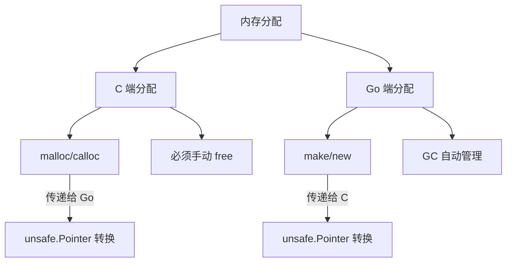

import { Badge } from "@rspress/core/theme";
import {Callout } from "@rspress/core/theme-original";

# 内存管理

<Badge text="专业" type="danger" /> <Badge text="Go 1.0+" type="info" />

CGO 涉及两套内存管理系统（Go 和 C），正确处理内存分配和释放是避免内存泄漏和崩溃的关键。

## 内存分配

### C 端分配

```go
package main

/*
#include <stdlib.h>
#include <string.h>

int* allocateArray(int size) {
    return (int*)malloc(size * sizeof(int));
}

void freeArray(int* arr) {
    free(arr);
}
*/
import "C"
import (
    "fmt"
    "unsafe"
)

func main() {
    size := 5

    // C 分配内存
    cArr := C.allocateArray(C.int(size))
    defer C.freeArray(cArr)

    // 转换为 Go 切片操作
    goSlice := (*[1 << 28]int)(unsafe.Pointer(cArr))[:size:size]

    for i := range goSlice {
        goSlice[i] = (i + 1) * 10
    }

    fmt.Println("Array:", goSlice)  // [10 20 30 40 50]
}
```

### Go 端分配

```go
package main

/*
#include <stdlib.h>

void processArray(int* arr, int size) {
    for (int i = 0; i < size; i++) {
        arr[i] *= 2;
    }
}
*/
import "C"
import (
    "fmt"
    "unsafe"
)

func main() {
    // Go 端分配
    arr := make([]int, 5)

    // 初始化
    for i := range arr {
        arr[i] = i + 1
    }

    // 传给 C 处理
    C.processArray(
        (*C.int)(unsafe.Pointer(&arr[0])),
        C.int(len(arr)),
    )

    fmt.Println("Processed:", arr)  // [2 4 6 8 10]

    // Go 端自动管理内存，无需手动释放
}
```



## 字符串内存

### C 字符串生命周期

```go
package main

/*
#include <stdlib.h>
#include <string.h>

char* duplicateString(const char* s) {
    char* dup = (char*)malloc(strlen(s) + 1);
    strcpy(dup, s);
    return dup;
}

void freeString(char* s) {
    free(s);
}
*/
import "C"
import (
    "fmt"
    "unsafe"
)

func main() {
    // Go 字符串
    goStr := "Hello, CGO!"

    // 复制到 C 端
    cStr := C.duplicateString(C.CString(goStr))
    defer C.freeString(cStr)

    // 使用 C 字符串
    fmt.Println("C string:", C.GoString(cStr))
}
```

### 临时 C 字符串

```go
package main

/*
#include <stdio.h>
*/
import "C"
import (
    "unsafe"
)

func main() {
    s := "Hello"

    // 方法1: C.CString（需要释放）
    cs1 := C.CString(s)
    defer C.free(unsafe.Pointer(cs1))
    C.puts(cs1)

    // 方法2: 临时使用（函数调用期间有效）
    C.puts((*C.char)(unsafe.Pointer(&[]byte(s)[0])))

    // 方法3: GoString 转 C 字符串（只读）
    cs2 := (*C.char)(C.CString(s))
    defer C.free(unsafe.Pointer(cs2))
}
```

<Callout type="warning" title="字符串内存警告">
  <strong>C.CString 必须手动释放</strong>：
  <ul>
    <li>使用 C.free 释放</li>
    <li>或使用 defer 确保释放</li>
    <li>忘记释放会内存泄漏</li>
  </ul>

  <strong>临时指针限制</strong>：
  <ul>
    <li>函数调用期间有效</li>
    <li>不要保存临时指针</li>
    <li>GC 可能移动 Go 内存</li>
  </ul>
</Callout>

## 引用传递

### 避免 C 保存 Go 指针

```go
package main

/*
#include <stdlib.h>

typedef struct {
    int* data;
    int size;
} Container;

Container* createContainer(int* data, int size) {
    Container* c = (Container*)malloc(sizeof(Container));
    c->data = data;
    c->size = size;
    return c;
}

void freeContainer(Container* c) {
    free(c);
}

int getData(Container* c, int index) {
    if (index >= 0 && index < c->size) {
        return c->data[index];
    }
    return -1;
}
*/
import "C"
import (
    "unsafe"
)

func main() {
    // ❌ 危险：Go 数据可能被 GC 移动
    arr := []int{1, 2, 3, 4, 5}

    c := C.createContainer(
        (*C.int)(unsafe.Pointer(&arr[0])),
        C.int(len(arr)),
    )
    defer C.freeContainer(c)

    // 危险：arr 可能已被 GC 移动
    val := C.getData(c, 2)
    println(val)
}
```

### 正确的做法

```go
package main

/*
#include <stdlib.h>
#include <string.h>

typedef struct {
    int* data;
    int size;
} Container;

Container* createContainer(int size) {
    Container* c = (Container*)malloc(sizeof(Container));
    c->data = (int*)malloc(size * sizeof(int));
    c->size = size;
    return c;
}

void freeContainer(Container* c) {
    if (c) {
        if (c->data) {
            free(c->data);
        }
        free(c);
    }
}

void setContainerData(Container* c, int index, int value) {
    if (index >= 0 && index < c->size) {
        c->data[index] = value;
    }
}

int getContainerData(Container* c, int index) {
    if (index >= 0 && index < c->size) {
        return c->data[index];
    }
    return -1;
}
*/
import "C"
import (
    "unsafe"
)

func main() {
    // ✅ 安全：C 端管理内存
    c := C.createContainer(5)
    defer C.freeContainer(c)

    // 设置数据
    for i := 0; i < 5; i++ {
        C.setContainerData(c, C.int(i), C.int((i+1)*10))
    }

    // 获取数据
    val := C.getContainerData(c, 2)
    println(val)  // 30
}
```

## 内存泄漏检测

### 常见泄漏场景

```go
package main

/*
#include <stdlib.h>

char* createString() {
    return (char*)malloc(100);
}

void processString(char* s) {
    // 处理字符串
}

void freeString(char* s) {
    free(s);
}
*/
import "C"
import (
    "runtime"
    "unsafe"
)

// ❌ 泄漏：忘记释放
func leak1() {
    s := C.createString()
    // 忘记调用 C.freeString(s)
}

// ❌ 泄漏：panic 导致 defer 未执行
func leak2() {
    s := C.createString()
    defer C.freeString(unsafe.Pointer(s))

    panic("something went wrong")
    // defer 不会执行
}

// ❌ 泄漏：循环引用
func leak3() {
    type Data struct {
        cPtr *C.char
    }

    d := &Data{
        cPtr: C.createString(),
    }
    // 如果 d 被全局引用，cPtr 永远不会被释放
    _ = d
}

// ✅ 正确：确保释放
func correct() {
    s := C.createString()
    C.freeString(unsafe.Pointer(s))

    // 或使用 defer
    s2 := C.createString()
    defer C.freeString(unsafe.Pointer(s2))
}

func main() {
    // 使用 runtime.GC 帮助检测泄漏
    leak1()
    runtime.GC()
    runtime.KeepAlive(nil)
}
```

### Finalizer 清理

```go
package main

/*
#include <stdlib.h>

char* allocateMemory() {
    return (char*)malloc(1024);
}

void freeMemory(char* p) {
    free(p);
}
*/
import "C"
import (
    "runtime"
    "unsafe"
)

type CBuffer struct {
    ptr *C.char
}

func NewCBuffer() *CBuffer {
    return &CBuffer{
        ptr: C.allocateMemory(),
    }
}

func (b *CBuffer) Free() {
    if b.ptr != nil {
        C.freeMemory(unsafe.Pointer(b.ptr))
        b.ptr = nil
    }
}

func main() {
    // 使用 finalizer
    buf := NewCBuffer()
    runtime.SetFinalizer(buf, func(b *CBuffer) {
        b.Free()
    })

    // buf 使用完毕后，GC 会自动清理
    buf = nil
    runtime.GC()
}
```

## 跨边界内存规则

<Callout type="danger" title="内存边界规则">
  <strong>Go 指针传给 C 的限制</strong>：
  <ol>
    <li>只能在 C 函数调用期间使用</li>
    <li>C 不能保存 Go 指针</li>
    <li>Go 指针指向的内存不能被移动</li>
    <li>禁止在 C 代码中创建 Go 对象</li>
  </ol>

  <strong>C 指针传给 Go 的规则</strong>：
  <ol>
    <li>必须明确内存所有权</li>
    <li>谁分配谁释放</li>
    <li>避免重复释放</li>
    <li>注意生命周期管理</li>
  </ol>
</Callout>

### Go 指针在 C 中的使用

```go
package main

/*
#include <stdio.h>

// ✅ 正确：只在函数调用期间使用
void processGoData(int* data, int size) {
    for (int i = 0; i < size; i++) {
        printf("data[%d] = %d\n", i, data[i]);
    }
}

// ❌ 错误：保存 Go 指针
int* savedPointer = NULL;

void saveGoPointer(int* ptr) {
    savedPointer = ptr;  // 危险！
}

int useSavedPointer() {
    return *savedPointer;  // 可能已失效
}
*/
import "C"
import (
    "unsafe"
)

func main() {
    data := []int{10, 20, 30, 40, 50}

    // ✅ 安全：临时传递
    C.processGoData(
        (*C.int)(unsafe.Pointer(&data[0])),
        C.int(len(data)),
    )

    // ❌ 危险：保存 Go 指针
    // C.saveGoPointer((*C.int)(unsafe.Pointer(&data[0])))
}
```

### 内存所有权

```go
package main

/*
#include <stdlib.h>
#include <string.h>

// C 分配，C 释放
char* cAllocate() {
    return (char*)malloc(100);
}

void cFree(char* p) {
    free(p);
}

// 使用 Go 分配的内存
void useGoMemory(void* ptr, int size) {
    // 只读操作
    printf("Got %d bytes from Go\n", size);
}
*/
import "C"
import (
    "unsafe"
)

// Go 分配，Go 释放
func goAllocate() []byte {
    return make([]byte, 100)
}

func main() {
    // C 分配，需要 C 释放
    cPtr := C.cAllocate()
    defer C.cFree(cPtr)

    // Go 分配，Go 管理
    goPtr := goAllocate()
    _ = goPtr

    // Go 内存传给 C（只读）
    C.useGoMemory(
        unsafe.Pointer(&goPtr[0]),
        C.int(len(goPtr)),
    )
}
```

## 内存池模式

### 复用 C 内存

```go
package main

/*
#include <stdlib.h>

typedef struct {
    void* memory;
    int size;
    int inUse;
} MemoryPool;

MemoryPool* createPool(int size) {
    MemoryPool* pool = (MemoryPool*)malloc(sizeof(MemoryPool));
    pool->memory = malloc(size);
    pool->size = size;
    pool->inUse = 0;
    return pool;
}

void* acquire(MemoryPool* pool) {
    if (!pool->inUse) {
        pool->inUse = 1;
        return pool->memory;
    }
    return NULL;
}

void release(MemoryPool* pool) {
    pool->inUse = 0;
}

void destroyPool(MemoryPool* pool) {
    if (pool) {
        if (pool->memory) {
            free(pool->memory);
        }
        free(pool);
    }
}
*/
import "C"
import (
    "fmt"
    "unsafe"
)

type Pool struct {
    pool *C.struct_MemoryPool
}

func NewPool(size int) *Pool {
    return &Pool{
        pool: C.createPool(C.int(size)),
    }
}

func (p *Pool) Acquire() unsafe.Pointer {
    return C.acquire(p.pool)
}

func (p *Pool) Release() {
    C.release(p.pool)
}

func (p *Pool) Destroy() {
    C.destroyPool(p.pool)
}

func main() {
    pool := NewPool(1024)
    defer pool.Destroy()

    // 获取内存
    mem := pool.Acquire()
    fmt.Printf("Acquired: %p\n", mem)

    // 使用内存
    slice := (*[1024]byte)(mem)[:1024:1024]
    slice[0] = 42

    // 释放回池
    pool.Release()

    // 再次获取
    mem2 := pool.Acquire()
    fmt.Printf("Re-acquired: %p\n", mem2)
}
```

## 练习

1. **实现安全的字符串传递**：实现 Go 和 C 之间的字符串传递，确保内存安全

<details>
<summary>查看答案</summary>

```go
package main

/*
#include <stdlib.h>
#include <string.h>

// C 端分配字符串
char* copyString(const char* src) {
    size_t len = strlen(src);
    char* dst = (char*)malloc(len + 1);
    strcpy(dst, src);
    return dst;
}

void freeCString(char* s) {
    free(s);
}

// 处理 Go 字符串（只读）
void processGoString(const char* s, int len) {
    printf("Got string of length %d: ", len);
    for (int i = 0; i < len; i++) {
        putchar(s[i]);
    }
    putchar('\n');
}
*/
import "C"
import (
    "fmt"
    "unsafe"
)

// Go 字符串 -> C 字符串（C 分配）
func GoToCString(goStr string) *C.char {
    cStr := C.copyString(C.CString(goStr))
    // 注意：这里有一个临时 CString，需要优化
    C.free(unsafe.Pointer(C.CString(goStr)))
    return cStr
}

// 更高效的版本
func GoToCStringEfficient(goStr string) *C.char {
    cStr := C.CString(goStr)
    return cStr
}

// C 字符串 -> Go 字符串（需要 C 释放原始）
func CToGoString(cStr *C.char, free bool) string {
    goStr := C.GoString(cStr)
    if free {
        C.free(unsafe.Pointer(cStr))
    }
    return goStr
}

// 只读传递 Go 字符串给 C
func PassGoStringToC(goStr string) {
    // 创建 C 字符串副本
    cStr := C.CString(goStr)
    defer C.free(unsafe.Pointer(cStr))

    C.processGoString(cStr, C.int(len(goStr)))
}

func main() {
    // 场景1: Go -> C（C 分配）
    goStr := "Hello from Go"
    cStr := GoToCStringEfficient(goStr)
    defer C.free(unsafe.Pointer(cStr))

    fmt.Println("C string:", C.GoString(cStr))

    // 场景2: C -> Go（C 分配，Go 释放）
    cStr2 := C.copyString(C.CString("Hello from C"))
    goStr2 := CToGoString(cStr2, true)
    fmt.Println("Go string:", goStr2)

    // 场景3: Go 只读传递
    PassGoStringToC("Temporary string")
}
```

**解释**：展示了多种安全的字符串传递模式，包括内存所有权管理和释放策略。

</details>

---

[← 类型转换](./type-conversions.mdx) | [最佳实践 →](./best-practices.mdx)
