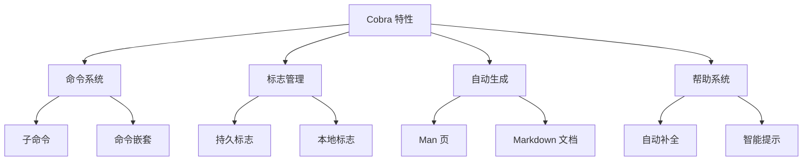

import { Badge } from '@rspress/core/theme';
import { Callout } from '@rspress/core/theme';

# Go CLI 工具开发指南

本文全面介绍如何使用 **Cobra** 框架构建强大的命令行工具，涵盖从基础到高级的所有功能。

## 📊 Cobra 简介

<Badge text="推荐" type="success" /> <Badge text="Kubernetes" type="info" /> <Badge text="Docker" type="info" />

Cobra 是 Go 语言中最流行的 CLI 框架，被以下知名项目使用：

- **Kubernetes** (`kubectl`)
- **Docker** (`docker`)
- **GitHub CLI** (`gh`)
- **Hugo** (静态网站生成器)
- **Istio** (`istioctl`)

### 核心特性



## 🚀 快速开始

### 安装

```bash
# 安装 Cobra 库
go get -u github.com/spf13/cobra@latest

# 安装 Cobra CLI 生成器
go install github.com/spf13/cobra-cli@latest

# 验证安装
cobra-cli --version
```

### 创建项目

```bash
# 初始化项目
mkdir mycli
cd mycli
go mod init mycli

# 使用 Cobra 初始化
cobra-cli init
```

生成的项目结构：

```
mycli/
├── cmd/
│   └── root.go
├── main.go
└── go.mod
```

### 基础示例

```go
// cmd/root.go
package cmd

import (
    "os"
    "github.com/spf13/cobra"
)

var rootCmd = &cobra.Command{
    Use:   "mycli",
    Short: "我的 CLI 工具",
    Long:  `这是一个功能强大的 CLI 工具示例`,
    Run: func(cmd *cobra.Command, args []string) {
        cmd.Println("欢迎使用 MyCLI!")
    },
}

func Execute() {
    if err := rootCmd.Execute(); err != nil {
        os.Exit(1)
    }
}

func init() {
    // 根命令的标志
    rootCmd.Flags().BoolP("verbose", "v", false, "详细输出")
}
```

```go
// main.go
package main

import "mycli/cmd"

func main() {
    cmd.Execute()
}
```

## 📝 命令系统

### 添加子命令

```bash
# 添加子命令
cobra-cli add serve
cobra-cli add config
cobra-cli add create
```

### 命令示例

```go
// cmd/serve.go
package cmd

import (
    "fmt"
    "github.com/spf13/cobra"
)

var (
    port int
    host string
)

var serveCmd = &cobra.Command{
    Use:   "serve",
    Short: "启动服务器",
    Long:  `启动一个 HTTP 服务器，监听指定端口`,
    Run: func(cmd *cobra.Command, args []string) {
        fmt.Printf("服务器启动在 %s:%d\n", host, port)
        // 启动服务器逻辑...
    },
}

func init() {
    rootCmd.AddCommand(serveCmd)

    // 本地标志（仅对此命令有效）
    serveCmd.Flags().IntVarP(&port, "port", "p", 8080, "服务器端口")
    serveCmd.Flags().StringVarP(&host, "host", "H", "0.0.0.0", "服务器地址")
}
```

### 复杂命令结构

```go
// cmd/create.go
package cmd

import (
    "fmt"
    "github.com/spf13/cobra"
)

var createCmd = &cobra.Command{
    Use:   "create [资源类型]",
    Short: "创建资源",
    Long:  `创建各种类型的资源，如用户、配置等`,
    Args:  cobra.MinimumNArgs(1),
    Run: func(cmd *cobra.Command, args []string) {
        resourceType := args[0]
        fmt.Printf("创建资源: %s\n", resourceType)
    },
}

var createUserCmd = &cobra.Command{
    Use:   "user",
    Short: "创建用户",
    Long:  `创建一个新用户`,
    Run: func(cmd *cobra.Command, args []string) {
        name, _ := cmd.Flags().GetString("name")
        email, _ := cmd.Flags().GetString("email")
        fmt.Printf("创建用户: %s <%s>\n", name, email)
    },
}

func init() {
    rootCmd.AddCommand(createCmd)
    createCmd.AddCommand(createUserCmd)

    // 用户创建命令的标志
    createUserCmd.Flags().StringP("name", "n", "", "用户名")
    createUserCmd.Flags().StringP("email", "e", "", "邮箱")
    createUserCmd.MarkFlagRequired("name")
    createUserCmd.MarkFlagRequired("email")
}
```

使用示例：

```bash
# 基本用法
./mycli create user --name 张三 --email zhangsan@example.com
./mycli create user -n 张三 -e zhangsan@example.com

# 嵌套命令
./mycli create
./mycli create user
```

## 🎯 标志管理

### 标志类型

```go
// cmd/flags.go
package cmd

import (
    "github.com/spf13/cobra"
)

var (
    // 字符串标志
    configPath string

    // 整数标志
    port int

    // 布尔标志
    verbose bool

    // 字符串切片
    servers []string

    // 持久标志（对所有子命令有效）
    debug bool
)

func init() {
    // 字符串标志
    rootCmd.Flags().StringVarP(&configPath, "config", "c", "", "配置文件路径")

    // 整数标志
    rootCmd.Flags().IntVarP(&port, "port", "p", 8080, "服务器端口")

    // 布尔标志
    rootCmd.Flags().BoolVarP(&verbose, "verbose", "v", false, "详细输出")

    // 字符串切片
    rootCmd.Flags().StringSliceVar(&servers, "server", []string{}, "服务器列表")

    // 持久标志（子命令也会继承）
    rootCmd.PersistentFlags().BoolVarP(&debug, "debug", "d", false, "调试模式")
}
```

### 标志验证

```go
// cmd/validate.go
package cmd

import (
    "errors"
    "github.com/spf13/cobra"
)

var validateCmd = &cobra.Command{
    Use:   "validate",
    Short: "验证输入",
    PreRunE: func(cmd *cobra.Command, args []string) error {
        // 前置验证
        port, _ := cmd.Flags().GetInt("port")
        if port < 1 || port > 65535 {
            return errors.New("端口必须在 1-65535 之间")
        }
        return nil
    },
    Run: func(cmd *cobra.Command, args []string) {
        cmd.Println("验证通过!")
    },
}

func init() {
    rootCmd.AddCommand(validateCmd)

    // 必需标志
    validateCmd.Flags().StringP("name", "n", "", "名称")
    validateCmd.MarkFlagRequired("name")

    // 标志互斥
    validateCmd.Flags().BoolP("force", "f", false, "强制执行")
    validateCmd.Flags().BoolP("interactive", "i", false, "交互模式")
    validateCmd.MarkFlagsMutuallyExclusive("force", "interactive")

    // 标志依赖
    validateCmd.Flags().String("cert-file", "", "证书文件")
    validateCmd.Flags().String("key-file", "", "密钥文件")
    validateCmd.MarkFlagsRequiredTogether("cert-file", "key-file")
}
```

## 🎨 输出格式化

### 颜色输出

```go
// cmd/output.go
package cmd

import (
    "fmt"

    "github.com/fatih/color"
    "github.com/spf13/cobra"
)

// 定义颜色
var (
    success = color.New(color.FgGreen).SprintFunc()
    warning = color.New(color.FgYellow).SprintFunc()
    error   = color.New(color.FgRed).SprintFunc()
    info    = color.New(color.FgBlue).SprintFunc()
)

var outputCmd = &cobra.Command{
    Use:   "output",
    Short: "输出示例",
    Run: func(cmd *cobra.Command, args []string) {
        fmt.Println(success("✓ 操作成功"))
        fmt.Println(warning("⚠ 警告信息"))
        fmt.Println(error("✗ 错误信息"))
        fmt.Println(info("ℹ 信息提示"))

        // 加粗输出
        color.New(color.Bold).Println("加粗文本")

        // 混合样式
        color.New(color.FgCyan, color.Bold).Println("青色加粗")
    },
}

func init() {
    rootCmd.AddCommand(outputCmd)
}
```

### 表格输出

```go
import (
    "os"
    "github.com/olekukonko/tablewriter"
)

var tableCmd = &cobra.Command{
    Use:   "table",
    Short: "表格输出",
    Run: func(cmd *cobra.Command, args []string) {
        table := tablewriter.NewWriter(os.Stdout)
        table.SetHeader([]string{"ID", "Name", "Email", "Age"})

        data := [][]string{
            {"1", "张三", "zhangsan@example.com", "25"},
            {"2", "李四", "lisi@example.com", "30"},
            {"3", "王五", "wangwu@example.com", "28"},
        }

        for _, v := range data {
            table.Append(v)
        }

        table.SetAutoWrapText(false)
        table.SetAutoFormatHeaders(true)
        table.SetHeaderAlignment(tablewriter.ALIGN_LEFT)
        table.SetAlignment(tablewriter.ALIGN_LEFT)
        table.SetCenterSeparator("")
        table.SetColumnSeparator("")
        table.SetRowSeparator("")
        table.SetHeaderLine(false)
        table.SetBorder(false)
        table.SetTablePadding("\t")
        table.SetNoWhiteSpace(true)

        table.Render()
    },
}
```

### JSON 输出

```go
import (
    "encoding/json"

    "github.com/spf13/cobra"
)

type User struct {
    ID    int    `json:"id"`
    Name  string `json:"name"`
    Email string `json:"email"`
    Age   int    `json:"age"`
}

var jsonCmd = &cobra.Command{
    Use:   "json",
    Short: "JSON 输出",
    Run: func(cmd *cobra.Command, args []string) {
        users := []User{
            {ID: 1, Name: "张三", Email: "zhangsan@example.com", Age: 25},
            {ID: 2, Name: "李四", Email: "lisi@example.com", Age: 30},
        }

        output, _ := json.MarshalIndent(users, "", "  ")
        cmd.Println(string(output))
    },
}

func init() {
    rootCmd.AddCommand(jsonCmd)

    // 添加输出格式标志
    jsonCmd.Flags().StringP("output", "o", "json", "输出格式 (json, yaml, table)")
}
```

## 🔧 高级功能

### 配置文件集成

```go
// cmd/config.go
package cmd

import (
    "github.com/spf13/cobra"
    "github.com/spf13/viper"
)

var cfgFile string

func init() {
    cobra.OnInitialize(initConfig)

    rootCmd.PersistentFlags().StringVar(&cfgFile, "config", "", "配置文件 (默认 $HOME/.mycli.yaml)")
}

func initConfig() {
    if cfgFile != "" {
        viper.SetConfigFile(cfgFile)
    } else {
        home, err := os.UserHomeDir()
        cobra.CheckErr(err)

        viper.AddConfigPath(home)
        viper.SetConfigType("yaml")
        viper.SetConfigName(".mycli")
    }

    viper.AutomaticEnv()

    if err := viper.ReadInConfig(); err == nil {
        cmd.Println("使用配置文件:", viper.ConfigFileUsed())
    }
}
```

### Shell 自动补全

```go
// 生成补全脚本
go run main.go completion bash > /etc/bash_completion.d/mycli
go run main.go completion zsh > /usr/local/share/zsh/site-functions/_mycli
go run main.completion fish > ~/.config/fish/completions/mycli.fish

// PowerShell
go run main.go completion powershell | Out-String | Invoke-Expression

// 添加补全函数
var completionCmd = &cobra.Command{
    Use:   "completion [bash|zsh|fish|powershell]",
    Short: "生成补全脚本",
    Long:  `为指定的 shell 生成自动补全脚本`,
    Args:  cobra.ExactValidArgs(1),
    ValidArgs: []string{"bash", "zsh", "fish", "powershell"},
    Run: func(cmd *cobra.Command, args []string) {
        switch args[0] {
        case "bash":
            cmd.Root().GenBashCompletion(os.Stdout)
        case "zsh":
            cmd.Root().GenZshCompletion(os.Stdout)
        case "fish":
            cmd.Root().GenFishCompletion(os.Stdout, true)
        case "powershell":
            cmd.Root().GenPowerShellCompletionWithDesc(os.Stdout)
        }
    },
}

func init() {
    rootCmd.AddCommand(completionCmd)
}
```

### 自定义验证

```go
var customValidateCmd = &cobra.Command{
    Use:   "custom-validate",
    Short: "自定义验证",
    Args: func(cmd *cobra.Command, args []string) error {
        if len(args) < 1 {
            return errors.New("至少需要一个参数")
        }

        if len(args) > 3 {
            return errors.New("最多接受 3 个参数")
        }

        for _, arg := range args {
            if len(arg) < 3 {
                return fmt.Errorf("参数 '%s' 长度不能小于 3", arg)
            }
        }

        return nil
    },
    Run: func(cmd *cobra.Command, args []string) {
        cmd.Println("验证通过:", args)
    },
}
```

## 📋 实战示例

### 文件管理工具

```go
// cmd/file.go
package cmd

import (
    "fmt"
    "os"
    "path/filepath"

    "github.com/spf13/cobra"
)

var fileCmd = &cobra.Command{
    Use:   "file",
    Short: "文件管理",
    Long:  `文件管理工具，支持创建、删除、移动等操作`,
}

var touchCmd = &cobra.Command{
    Use:   "touch [文件名]",
    Short: "创建文件",
    Args:  cobra.ExactArgs(1),
    Run: func(cmd *cobra.Command, args []string) {
        filename := args[0]
        file, err := os.Create(filename)
        if err != nil {
            cmd.Printf("创建文件失败: %v\n", err)
            return
        }
        defer file.Close()
        cmd.Printf("文件创建成功: %s\n", filename)
    },
}

var removeCmd = &cobra.Command{
    Use:   "remove [文件名]",
    Short: "删除文件",
    Args:  cobra.ExactArgs(1),
    Run: func(cmd *cobra.Command, args []string) {
        filename := args[0]
        force, _ := cmd.Flags().GetBool("force")

        if !force {
            cmd.Printf("确认删除 %s? [y/N]: ", filename)
            var confirm string
            fmt.Scanln(&confirm)
            if confirm != "y" && confirm != "Y" {
                cmd.Println("取消删除")
                return
            }
        }

        if err := os.Remove(filename); err != nil {
            cmd.Printf("删除失败: %v\n", err)
            return
        }
        cmd.Printf("文件删除成功: %s\n", filename)
    },
}

var listCmd = &cobra.Command{
    Use:   "list [目录]",
    Short: "列出文件",
    Args:  cobra.MaximumNArgs(1),
    Run: func(cmd *cobra.Command, args []string) {
        dir := "."
        if len(args) > 0 {
            dir = args[0]
        }

        all, _ := cmd.Flags().GetBool("all")

        filepath.Walk(dir, func(path string, info os.FileInfo, err error) error {
            if err != nil {
                return err
            }

            if !all && info.Name()[0] == '.' {
                if info.IsDir() && info.Name() != "." {
                    return filepath.SkipDir
                }
                return nil
            }

            if info.Name() != "." {
                cmd.Printf("%s\n", path)
            }
            return nil
        })
    },
}

func init() {
    rootCmd.AddCommand(fileCmd)
    fileCmd.AddCommand(touchCmd)
    fileCmd.AddCommand(removeCmd)
    fileCmd.AddCommand(listCmd)

    removeCmd.Flags().BoolP("force", "f", false, "强制删除")
    listCmd.Flags().BoolP("all", "a", false, "显示所有文件")
}
```

### API 客户端

```go
// cmd/api.go
package cmd

import (
    "bytes"
    "encoding/json"
    "fmt"
    "io"
    "net/http"

    "github.com/spf13/cobra"
)

var apiCmd = &cobra.Command{
    Use:   "api",
    Short: "API 客户端",
}

var getCmd = &cobra.Command{
    Use:   "get [endpoint]",
    Short: "GET 请求",
    Args:  cobra.ExactArgs(1),
    Run: func(cmd *cobra.Command, args []string) {
        endpoint := args[0]
        baseURL, _ := cmd.Flags().GetString("base-url")
        url := baseURL + endpoint

        resp, err := http.Get(url)
        if err != nil {
            cmd.Printf("请求失败: %v\n", err)
            return
        }
        defer resp.Body.Close()

        body, _ := io.ReadAll(resp.Body)
        cmd.Printf("状态码: %d\n", resp.StatusCode)
        cmd.Printf("响应: %s\n", string(body))
    },
}

var postCmd = &cobra.Command{
    Use:   "post [endpoint]",
    Short: "POST 请求",
    Args:  cobra.ExactArgs(1),
    Run: func(cmd *cobra.Command, args []string) {
        endpoint := args[0]
        baseURL, _ := cmd.Flags().GetString("base-url")
        url := baseURL + endpoint

        data, _ := cmd.Flags().GetString("data")
        jsonData := []byte(data)

        resp, err := http.Post(url, "application/json", bytes.NewBuffer(jsonData))
        if err != nil {
            cmd.Printf("请求失败: %v\n", err)
            return
        }
        defer resp.Body.Close()

        body, _ := io.ReadAll(resp.Body)
        cmd.Printf("状态码: %d\n", resp.StatusCode)
        cmd.Printf("响应: %s\n", string(body))
    },
}

func init() {
    rootCmd.AddCommand(apiCmd)
    apiCmd.AddCommand(getCmd)
    apiCmd.AddCommand(postCmd)

    apiCmd.PersistentFlags().String("base-url", "https://api.example.com", "API 基础 URL")
    postCmd.Flags().StringP("data", "d", "{}", "JSON 数据")
}
```

## 🎨 项目结构建议

### 推荐结构

```
mycli/
├── cmd/
│   ├── root.go
│   ├── serve.go
│   ├── config.go
│   └── create.go
├── pkg/
│   ├── api/
│   ├── config/
│   └── utils/
├── configs/
│   └── config.yaml
├── go.mod
├── go.sum
├── main.go
└── README.md
```

### 模块化命令

```go
// pkg/users/cmd.go
package users

import (
    "github.com/spf13/cobra"
)

func NewCommand() *cobra.Command {
    cmd := &cobra.Command{
        Use:   "users",
        Short: "用户管理",
    }

    // 添加子命令
    cmd.AddCommand(newListCommand())
    cmd.AddCommand(newCreateCommand())
    cmd.AddCommand(newDeleteCommand())

    return cmd
}

// 在主命令中注册
// cmd/root.go
import "mycli/pkg/users"

func init() {
    rootCmd.AddCommand(users.NewCommand())
}
```

## 🧪 测试 CLI 工具

### 单元测试

```go
// cmd/root_test.go
package cmd

import (
    "testing"
    "github.com/spf13/cobra"
)

func TestRootCommand(t *testing.T) {
    tests := []struct {
        name     string
        args     []string
        expected string
    }{
        {
            name:     "基本用法",
            args:     []string{},
            expected: "欢迎使用 MyCLI!",
        },
        {
            name:     "详细输出",
            args:     []string{"--verbose"},
            expected: "详细输出",
        },
    }

    for _, tt := range tests {
        t.Run(tt.name, func(t *testing.T) {
            // 执行命令
            output, err := executeCommand(rootCmd, tt.args...)
            if err != nil {
                t.Errorf("执行失败: %v", err)
            }

            // 验证输出
            if !contains(output, tt.expected) {
                t.Errorf("期望输出包含 %q，实际为 %q", tt.expected, output)
            }
        })
    }
}

// 辅助函数
func executeCommand(cmd *cobra.Command, args ...string) (string, error) {
    buf := new(bytes.Buffer)
    cmd.SetOut(buf)
    cmd.SetErr(buf)
    cmd.SetArgs(args)

    err := cmd.Execute()
    return buf.String(), err
}

func contains(s, substr string) bool {
    return bytes.Contains([]byte(s), []byte(substr))
}
```

## 📚 最佳实践

### 1. 命令命名

```go
// ✅ 好的命名
createUser, deletePod, listServices

// ❌ 不好的命名
userCreate, podDelete, serviceList
```

### 2. 帮助文档

```go
var goodCmd = &cobra.Command{
    Use:     "create [资源类型] [名称]",
    Short:   "创建资源",
    Long:    `创建指定类型的资源，支持 Pod、Service、Deployment 等`,
    Example: `  mycli create pod my-pod\n  mycli create service my-service`,
    Args:    cobra.MinimumNArgs(2),
    Run:     func(cmd *cobra.Command, args []string) {},
}
```

### 3. 错误处理

```go
// 使用 cobra.CheckErr
cmd := &cobra.Command{
    Run: func(cmd *cobra.Command, args []string) {
        result, err := doSomething()
        cobra.CheckErr(err)
    },
}

// 自定义错误处理
cmd := &cobra.Command{
    RunE: func(cmd *cobra.Command, args []string) error {
        return doSomething()
    },
}
```

### 4. 配置管理

```go
// 优先级：命令行标志 > 环境变量 > 配置文件 > 默认值
viper.BindPFlag("port", cmd.Flags().Lookup("port"))
viper.BindEnv("port", "MY_PORT")
viper.SetDefault("port", 8080)
```

## 🔗 参考资源

- [Cobra 官方文档](https://github.com/spf13/cobra)
- [Cobra 生成器](https://github.com/spf13/cobra-cli)
- [Viper 配置管理](https://github.com/spf13/viper)
- [kubectl 源码](https://github.com/kubernetes/kubectl)

---

**关键要点**：使用 Cobra 可以快速构建专业的 CLI 工具。记住 <Badge text="命令结构" type="info" />、<Badge text="标志管理" type="info" /> 和 <Badge text="帮助系统" type="info" /> 是三大核心功能。
