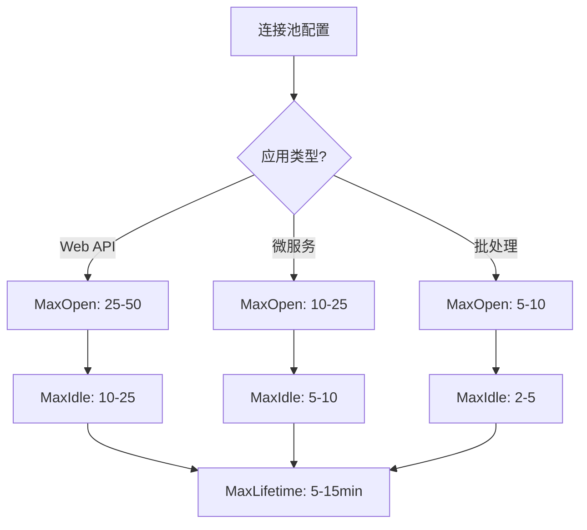

import { Badge } from '@rspress/core/theme';
import { Callout } from '@rspress/core/theme';

# Go 数据库编程

本文介绍 Go 语言数据库编程的最佳实践，包括数据库驱动、连接管理、事务处理和性能优化。

## 📊 数据库驱动概览

### 主流数据库驱动

| 数据库 | 标准库驱动 | 高级驱动 | 推荐选择 |
|--------|-----------|---------|---------|
| **MySQL** | <Badge text="go-sql-driver" type="info" /> | <Badge text="pgx" type="success" /> | go-sql-driver |
| **PostgreSQL** | <Badge text="lib/pq" type="info" /> | <Badge text="pgx" type="success" /> | pgx |
| **SQLite** | <Badge text="mattn/go-sqlite3" type="success" /> | - | mattn/go-sqlite3 |
| **SQL Server** | <Badge text="denisenkom" type="info" /> | - | denisenkom |
| **Oracle** | <Badge text="sijms" type="warning" /> | - | sijms/go-ora |

<Callout type="info">
**驱动选择原则**：对于生产环境，推荐使用支持连接池、预编译语句和上下文取消的高级驱动。PostgreSQL 推荐使用 pgx，性能更好。
</Callout>

## 🔌 标准库 database/sql

### 基础用法

```go
package main

import (
    "database/sql"
    "fmt"
    "log"

    _ "github.com/go-sql-driver/mysql" // MySQL 驱动
)

type User struct {
    ID    int
    Name  string
    Email string
    Age   int
}

func main() {
    // 连接数据库
    dsn := "user:password@tcp(127.0.0.1:3306)/dbname?parseTime=true"
    db, err := sql.Open("mysql", dsn)
    if err != nil {
        log.Fatal(err)
    }
    defer db.Close()

    // 验证连接
    if err := db.Ping(); err != nil {
        log.Fatal(err)
    }

    // 配置连接池
    db.SetMaxOpenConns(25)
    db.SetMaxIdleConns(25)
    db.SetConnMaxLifetime(5 * time.Minute)

    // CRUD 操作
    createUser(db)
    queryUser(db)
    updateUser(db)
    deleteUser(db)
}

// 创建用户
func createUser(db *sql.DB) {
    result, err := db.Exec(
        "INSERT INTO users (name, email, age) VALUES (?, ?, ?)",
        "张三", "zhangsan@example.com", 25,
    )
    if err != nil {
        log.Fatal(err)
    }

    id, err := result.LastInsertId()
    if err != nil {
        log.Fatal(err)
    }
    fmt.Printf("创建用户，ID: %d\n", id)
}

// 查询用户
func queryUser(db *sql.DB) {
    // 单行查询
    var user User
    err := db.QueryRow(
        "SELECT id, name, email, age FROM users WHERE id = ?",
        1,
    ).Scan(&user.ID, &user.Name, &user.Email, &user.Age)

    if err != nil {
        if err == sql.ErrNoRows {
            fmt.Println("用户不存在")
        } else {
            log.Fatal(err)
        }
        return
    }
    fmt.Printf("查询结果: %+v\n", user)

    // 多行查询
    rows, err := db.Query("SELECT id, name, email, age FROM users WHERE age > ?", 18)
    if err != nil {
        log.Fatal(err)
    }
    defer rows.Close()

    var users []User
    for rows.Next() {
        var u User
        if err := rows.Scan(&u.ID, &u.Name, &u.Email, &u.Age); err != nil {
            log.Fatal(err)
        }
        users = append(users, u)
    }

    if err := rows.Err(); err != nil {
        log.Fatal(err)
    }
    fmt.Printf("成年用户: %d\n", len(users))
}

// 更新用户
func updateUser(db *sql.DB) {
    result, err := db.Exec(
        "UPDATE users SET name = ?, age = ? WHERE id = ?",
        "李四", 30, 1,
    )
    if err != nil {
        log.Fatal(err)
    }

    affected, err := result.RowsAffected()
    if err != nil {
        log.Fatal(err)
    }
    fmt.Printf("更新了 %d 行\n", affected)
}

// 删除用户
func deleteUser(db *sql.DB) {
    result, err := db.Exec("DELETE FROM users WHERE id = ?", 1)
    if err != nil {
        log.Fatal(err)
    }

    affected, err := result.RowsAffected()
    if err != nil {
        log.Fatal(err)
    }
    fmt.Printf("删除了 %d 行\n", affected)
}
```

### 使用上下文

```go
import (
    "context"
    "time"
)

// 带超时的查询
func queryUserWithTimeout(db *sql.DB) {
    ctx, cancel := context.WithTimeout(context.Background(), 5*time.Second)
    defer cancel()

    var user User
    err := db.QueryRowContext(ctx,
        "SELECT id, name, email, age FROM users WHERE id = ?",
        1,
    ).Scan(&user.ID, &user.Name, &user.Email, &user.Age)

    if err != nil {
        if err == context.DeadlineExceeded {
            fmt.Println("查询超时")
        } else {
            log.Fatal(err)
        }
        return
    }
    fmt.Printf("查询结果: %+v\n", user)
}

// 可取消的查询
func queryUserWithCancel(db *sql.DB) {
    ctx, cancel := context.WithCancel(context.Background())
    defer cancel()

    go func() {
        time.Sleep(2 * time.Second)
        cancel() // 取消查询
    }()

    rows, err := db.QueryContext(ctx,
        "SELECT id, name FROM users",
    )
    if err != nil {
        if err == context.Canceled {
            fmt.Println("查询被取消")
        }
        return
    }
    defer rows.Close()

    // 处理结果...
}
```

## 🚀 高级特性

### 事务处理

```go
func transferMoney(db *sql.DB) error {
    // 开始事务
    tx, err := db.Begin()
    if err != nil {
        return err
    }

    // 确保事务被处理
    defer func() {
        if p := recover(); p != nil {
            tx.Rollback()
            panic(p) // 重新抛出 panic
        }
    }()

    // 执行多个操作
    // 从账户 A 扣款
    _, err = tx.Exec(
        "UPDATE accounts SET balance = balance - ? WHERE id = ?",
        100, 1,
    )
    if err != nil {
        tx.Rollback()
        return fmt.Errorf("扣款失败: %w", err)
    }

    // 向账户 B 加款
    _, err = tx.Exec(
        "UPDATE accounts SET balance = balance + ? WHERE id = ?",
        100, 2,
    )
    if err != nil {
        tx.Rollback()
        return fmt.Errorf("加款失败: %w", err)
    }

    // 提交事务
    if err := tx.Commit(); err != nil {
        return fmt.Errorf("提交失败: %w", err)
    }

    return nil
}
```

### 预编译语句

```go
func batchInsert(db *sql.DB, users []User) error {
    // 准备语句
    stmt, err := db.Prepare(
        "INSERT INTO users (name, email, age) VALUES (?, ?, ?)",
    )
    if err != nil {
        return err
    }
    defer stmt.Close()

    // 批量插入
    for _, user := range users {
        _, err := stmt.Exec(user.Name, user.Email, user.Age)
        if err != nil {
            return fmt.Errorf("插入失败: %w", err)
        }
    }

    return nil
}

// 使用事务批处理
func batchInsertWithTx(db *sql.DB, users []User) error {
    tx, err := db.Begin()
    if err != nil {
        return err
    }
    defer tx.Rollback()

    stmt, err := tx.Prepare(
        "INSERT INTO users (name, email, age) VALUES (?, ?, ?)",
    )
    if err != nil {
        return err
    }
    defer stmt.Close()

    for _, user := range users {
        if _, err := stmt.Exec(user.Name, user.Email, user.Age); err != nil {
            return err
        }
    }

    return tx.Commit()
}
```

## 🎯 连接池管理

### 配置参数

```go
func setupConnectionPool(db *sql.DB) {
    // 最大打开连接数
    // 设置为数据库最大连接数的 80-90%
    db.SetMaxOpenConns(25)

    // 最大空闲连接数
    // 设置为最大打开连接数的 50-70%
    db.SetMaxIdleConns(10)

    // 连接最大生命周期
    // 5-30 分钟，低于数据库的 wait_timeout
    db.SetConnMaxLifetime(5 * time.Minute)

    // 连接最大空闲时间
    // 建议 1-5 分钟
    db.SetConnMaxIdleTime(1 * time.Minute)
}
```

### 监控连接池

```go
func monitorConnectionPool(db *sql.DB) {
    stats := db.Stats()

    fmt.Printf("开放连接数: %d\n", stats.OpenConnections)
    fmt.Printf("使用中的连接: %d\n", stats.InUse)
    fmt.Printf("空闲连接数: %d\n", stats.Idle)
    fmt.Printf("等待连接数: %d\n", stats.WaitCount)
    fmt.Printf("等待总时长: %d\n", stats.WaitDuration)
    fmt.Printf("最大空闲关闭数: %d\n", stats.MaxIdleClosed)
    fmt.Printf("最大生命周期关闭数: %d\n", stats.MaxLifetimeClosed)
}
```

## 📈 性能优化

### 查询优化

```go
// 1. 使用索引
func createIndex(db *sql.DB) {
    _, err := db.Exec(
        "CREATE INDEX idx_users_email ON users(email)",
    )
    if err != nil {
        log.Fatal(err)
    }
}

// 2. 选择需要的字段
func selectFields(db *sql.DB) {
    // ❌ 不好：SELECT *
    rows, _ := db.Query("SELECT * FROM users")

    // ✅ 好：只查询需要的字段
    rows, _ := db.Query("SELECT id, name, email FROM users")
    defer rows.Close()
}

// 3. 使用 LIMIT
func limitResults(db *sql.DB) {
    rows, _ := db.Query(
        "SELECT id, name FROM users LIMIT 10",
    )
    defer rows.Close()
}

// 4. 批量操作
func batchDelete(db *sql.DB, ids []int) error {
    query := "DELETE FROM users WHERE id IN ("
    args := make([]interface{}, len(ids))
    for i, id := range ids {
        if i > 0 {
            query += ","
        }
        query += "?"
        args[i] = id
    }
    query += ")"

    _, err := db.Exec(query, args...)
    return err
}
```

### 使用连接池的最佳实践



## 🔐 安全实践

### SQL 注入防护

```go
// ❌ 危险：字符串拼接
func dangerousQuery(db *sql.DB, email string) {
    query := fmt.Sprintf("SELECT * FROM users WHERE email = '%s'", email)
    db.Query(query)
}

// ✅ 安全：参数化查询
func safeQuery(db *sql.DB, email string) {
    db.Query("SELECT * FROM users WHERE email = ?", email)
}
```

### 密码存储

```go
import "golang.org/x/crypto/bcrypt"

// 哈希密码
func hashPassword(password string) (string, error) {
    bytes, err := bcrypt.GenerateFromPassword(
        []byte(password),
        bcrypt.DefaultCost,
    )
    return string(bytes), err
}

// 验证密码
func checkPassword(password, hash string) bool {
    err := bcrypt.CompareHashAndPassword(
        []byte(hash),
        []byte(password),
    )
    return err == nil
}
```

## 🧪 测试数据库操作

### 使用 Testcontainers

```go
import (
    "database/sql"
    "testing"
    "github.com/testcontainers/testcontainers-go"
    "github.com/testcontainers/testcontainers-go/wait"
)

func setupTestDB(t *testing.T) (*sql.DB, func()) {
    ctx := context.Background()

    // 启动 MySQL 容器
    container, err := testcontainers.GenericContainer(ctx, testcontainers.GenericContainerRequest{
        ContainerRequest: testcontainers.ContainerRequest{
            Image:        "mysql:8.0",
            ExposedPorts: []string{"3306/tcp"},
            Env: map[string]string{
                "MYSQL_ROOT_PASSWORD": "test",
                "MYSQL_DATABASE":      "testdb",
            },
            WaitingFor: wait.ForLog("ready for connections"),
        },
        Started: true,
    })
    if err != nil {
        t.Fatal(err)
    }

    // 获取连接信息
    host, err := container.Host(ctx)
    if err != nil {
        t.Fatal(err)
    }

    port, err := container.MappedPort(ctx, "3306")
    if err != nil {
        t.Fatal(err)
    }

    // 连接数据库
    dsn := fmt.Sprintf("root:test@tcp(%s:%s)/testdb", host, port.Port())
    db, err := sql.Open("mysql", dsn)
    if err != nil {
        t.Fatal(err)
    }

    // 返回清理函数
    cleanup := func() {
        db.Close()
        container.Terminate(ctx)
    }

    return db, cleanup
}
```

## 🎓 最佳实践总结

### 连接管理

<Badge text="重要" type="danger" /> 连接池配置：

```go
// 生产环境推荐配置
db.SetMaxOpenConns(25)
db.SetMaxIdleConns(10)
db.SetConnMaxLifetime(5 * time.Minute)
db.SetConnMaxIdleTime(1 * time.Minute)
```

### 查询模式

```go
// 1. 总是使用上下文
db.QueryContext(ctx, "SELECT ...")

// 2. 总是检查错误
rows, err := db.Query(...)
if err != nil {
    return err
}
defer rows.Close()

// 3. 总是迭代后检查错误
for rows.Next() {
    // ...
}
if err = rows.Err(); err != nil {
    return err
}

// 4. 总是使用事务处理多个操作
tx, _ := db.Begin()
defer tx.Rollback()
// ... 操作 ...
tx.Commit()
```

### 性能检查清单

- [ ] 使用连接池
- [ ] 预编译语句
- [ ] 选择必要的字段
- [ ] 使用索引
- [ ] 批量操作
- [ ] 限制结果集
- [ ] 使用缓存

## 🔗 参考资源

- [database/sql 文档](https://go.dev/pkg/database/sql/)
- [SQL 驱动列表](https://github.com/golang/go/wiki/SQLDrivers)
- [Testcontainers Go](https://golang.testcontainers.org/)
- [pgx 驱动文档](https://github.com/jackc/pgx)

---

**关键要点**：使用 <Badge text="database/sql" type="info" /> 标准库可以获得良好的兼容性和性能。对于高并发场景，PostgreSQL 推荐使用 <Badge text="pgx" type="success" /> 驱动。
