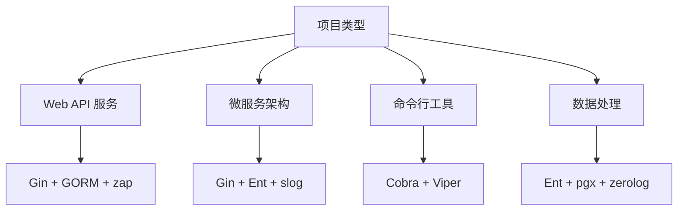

import { Badge } from '@rspress/core/theme';

# Go 生态系统概览

欢迎来到 Go 生态系统文档！本模块全面介绍 Go 语言生态中最流行和最实用的工具、框架和库，帮助你为项目选择合适的技术栈。

## 📊 快速导航

  <a class="kb-card" href="web-frameworks">
    Web 框架
    Gin、Echo、Fiber 深度对比，性能基准测试
  </a>
  <a class="kb-card" href="orm">
    ORM 库
    GORM vs Ent：类型安全与性能权衡
  </a>
  <a class="kb-card" href="database">
    数据库
    数据库驱动与连接管理最佳实践
  </a>
  <a class="kb-card" href="cli">
    CLI 工具
    Cobra 命令行工具开发指南
  </a>
  <a class="kb-card" href="logging">
    日志库
    zap、logrus、slog 性能对比
  </a>
  <a class="kb-card" href="config">
    配置管理
    Viper 多源配置解决方案
  </a>

## 🎯 生态体系分类

### Web 开发

| 类别 | 主要工具 | 特点 |
|------|---------|------|
| **Web 框架** | <Badge text="Gin" type="info" /> <Badge text="Echo" type="info" /> <Badge text="Fiber" type="warning" /> | 高性能、路由、中间件 |
| **ORM 库** | <Badge text="GORM" type="info" /> <Badge text="Ent" type="warning" /> | 数据库抽象、类型安全 |
| **数据库驱动** | <Badge text="sqlx" type="info" /> <Badge text="pgx" type="success" /> | 原生性能、高级特性 |

### 基础设施

| 类别 | 主要工具 | 特点 |
|------|---------|------|
| **CLI 工具** | <Badge text="Cobra" type="success" /> | 命令行应用框架 |
| **日志库** | <Badge text="zap" type="danger" /> <Badge text="logrus" type="info" /> <Badge text="slog" type="success" /> | 结构化日志、高性能 |
| **配置管理** | <Badge text="Viper" type="success" /> | 多格式、多源配置 |

### Lazygophers 系列

本项目自研的高性能工具库：

- <Badge text="lazy-log" type="warning" /> - 高性能日志库
- <Badge text="lazy-utils" type="warning" /> - 通用工具集
- <Badge text="lazy-lrpc" type="warning" /> - 轻量级 RPC 框架

## 📈 技术选型建议

### 按场景选择

### 按性能需求选择

| 场景 | 推荐方案 |
|------|---------|
| **超高 QPS** | Fiber + Ent + zap |
| **常规服务** | Gin + GORM + slog |
| **快速原型** | Gin + GORM + logrus |
| **类型安全优先** | Echo + Ent + zap |

## 🔄 技术栈组合

### 推荐组合 1：主流稳定栈
<Badge text="Gin" type="info" /> + <Badge text="GORM" type="info" /> + <Badge text="zap" type="danger" /> + <Badge text="Viper" type="success" />

- ✅ 社区支持最好
- ✅ 学习资源丰富
- ✅ 生产验证充分
- ✅ 适合团队协作

### 推荐组合 2：高性能栈
<Badge text="Fiber" type="warning" /> + <Badge text="Ent" type="warning" /> + <Badge text="zap" type="danger" /> + <Badge text="Viper" type="success" />

- ✅ 极致性能
- ✅ 类型安全
- ✅ 编译时检查
- ⚠️ 学习曲线较陡

### 推荐组合 3：标准库优先栈
<Badge text="net/http" type="success" /> + <Badge text="sqlx" type="info" /> + <Badge text="slog" type="success" /> + <Badge text="Viper" type="success" />

- ✅ 零外部依赖
- ✅ 长期维护性
- ✅ 标准化
- ⚠️ 开发效率较低

## 📚 学习路径

1. **初学者**：从 Gin + GORM 开始，快速上手
2. **进阶开发**：了解类型安全和性能优化，尝试 Ent
3. **性能优化**：深入 zap、Fiber 等高性能工具
4. **生产环境**：掌握 Viper 配置管理和 Cobra CLI 工具

## 🔗 相关资源

- [Go 官方文档](https://go.dev/doc/)
- [Go Packages](https://pkg.go.dev/)
- [Awesome Go](https://github.com/avelino/awesome-go)

## 🚀 快速开始

选择你感兴趣的主题开始探索：

- [Web 框架对比 →](web-frameworks)
- [ORM 库选型 →](orm)
- [日志库性能测试 →](logging)
