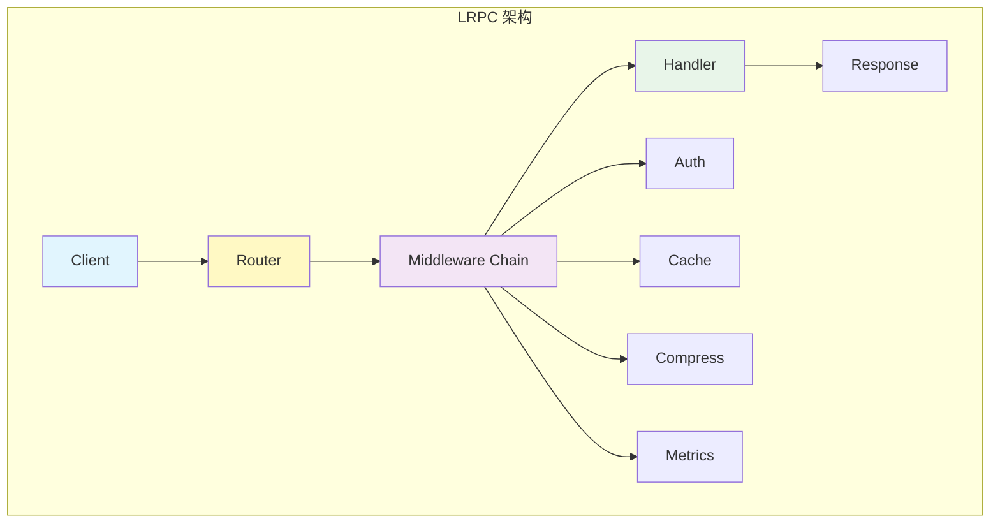
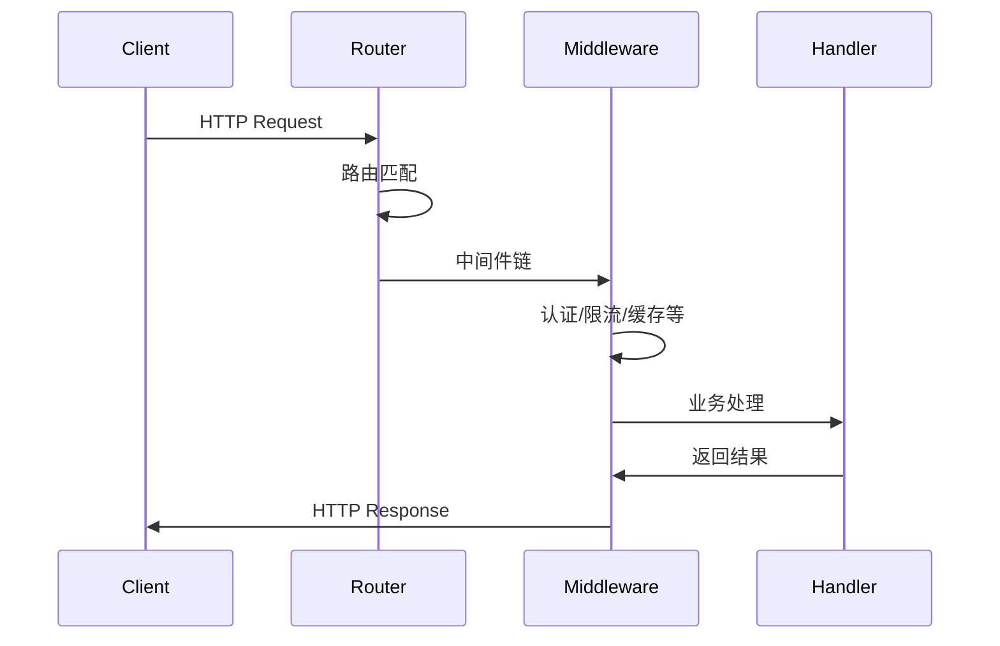

import { Badge } from "@rspress/core/theme";

# lazygophers/lrpc - 轻量级 RPC 框架

<Badge text="Go 1.21+" type="tip" />
<Badge text="基于 fasthttp" type="success" />
<Badge text="MIT 许可证" type="info" />

[GitHub 仓库](https://github.com/lazygophers/lrpc) • [pkg.go.dev](https://pkg.go.dev/github.com/lazygophers/lrpc)

> 基于 fasthttp 的轻量级、高性能 RPC 框架，提供灵活路由和丰富中间件

## 🎯 项目概述

**lazygophers/lrpc** 是一个现代化的 Go RPC 框架，基于 **fasthttp** 构建，在保持极简 API 的同时提供了强大的功能和卓越的性能。

### 核心特性

<Badge text="高性能" type="success" /> 基于 fasthttp，性能优于标准库 net/http
<Badge text="灵活路由" type="info" /> 支持静态、参数和通配符路由
<Badge text="中间件生态" type="warning" /> 内置认证、缓存、压缩、限流等中间件
<Badge text="类型安全" type="tip" /> 使用 Go 泛型提供类型安全的处理
<Badge text="自动序列化" type="success" /> 自动处理请求解析和响应序列化
<Badge text="连接池优化" type="info" /> 内置连接池和对象池优化
<Badge text="可观测性" type="warning" /> 内置指标收集和健康检查
<Badge text="可扩展" type="tip" /> 插件系统支持自定义功能

## 📦 安装

```bash
go get github.com/lazygophers/lrpc
```

## 🚀 快速开始

### 基础示例

```go
package main

import (
    "github.com/lazygophers/lrpc"
    "github.com/lazygophers/log"
)

type HelloRequest struct {
    Name string `json:"name"`
}

type HelloResponse struct {
    Message string `json:"message"`
}

func main() {
    app := lrpc.New(lrpc.Config{
        Name: "hello-service",
        Port: 8080,
    })

    // 简单处理器
    app.Get("/hello", func(ctx *lrpc.Ctx) error {
        return ctx.SendString("Hello, World!")
    })

    // 带请求/响应类型的处理器
    app.Post("/hello", func(ctx *lrpc.Ctx, req *HelloRequest) (*HelloResponse, error) {
        return &HelloResponse{
            Message: "Hello, " + req.Name,
        }, nil
    })

    log.Fatal(app.Listen())
}
```

## 📚 路由系统

### 支持的路由类型

```go
// 静态路由
app.Get("/api/users", handler)

// 参数路由
app.Get("/api/users/:id", func(ctx *lrpc.Ctx) error {
    userID := ctx.Param("id")
    return ctx.SendString("User ID: " + userID)
})

// 通配符路由
app.Get("/static/*", func(ctx *lrpc.Ctx) error {
    path := ctx.Param("*")
    return ctx.SendString("Static path: " + path)
})
```

### 路由分组

```go
// 创建 API 分组
api := app.Group("/api")
{
    // GET /api/users
    api.Get("/users", listUsers)

    // POST /api/users
    api.Post("/users", createUser)

    // 嵌套分组
    v1 := api.Group("/v1")
    {
        // GET /api/v1/info
        v1.Get("/info", getInfo)

        // POST /api/v1/action
        v1.Post("/action", performAction)
    }
}
```

### HTTP 方法支持

```go
app.Get("/path", handler)      // GET 请求
app.Post("/path", handler)     // POST 请求
app.Put("/path", handler)      // PUT 请求
app.Delete("/path", handler)   // DELETE 请求
app.Patch("/path", handler)    // PATCH 请求
app.Head("/path", handler)     // HEAD 请求
app.Options("/path", handler)  // OPTIONS 请求
app.Any("/path", handler)      // 所有方法
```

## 🏗️ 架构设计

### 核心组件



### 请求处理流程



## 🔧 中间件系统

### 内置中间件

#### 1. 认证中间件

```go
import "github.com/lazygophers/lrpc/middleware/auth"

// JWT 认证
app.Use(auth.JWT(auth.JWTConfig{
    SigningKey:    []byte("your-secret-key"),
    SigningMethod: "HS256",
    TokenLookup:   "header:Authorization,query:token",
}))

// Basic 认证
app.Use(auth.BasicAuth(auth.BasicAuthConfig{
    Users: map[string]string{
        "admin": "password",
        "user":  "pass",
    },
    Realm: "Restricted",
}))
```

#### 2. 安全中间件

```go
import "github.com/lazygophers/lrpc/middleware/security"

// CORS 跨域
app.Use(security.CORS(security.CORSConfig{
    AllowOrigins:     []string{"https://example.com"},
    AllowMethods:     []string{"GET", "POST", "PUT", "DELETE"},
    AllowHeaders:     []string{"Content-Type", "Authorization"},
    AllowCredentials: true,
    MaxAge:           3600,
}))

// 安全头
app.Use(security.SecurityHeaders(security.DefaultSecurityHeadersConfig))

// 限流
app.Use(security.RateLimit(security.RateLimitMiddlewareConfig{
    Rate:   100,                          // 每分钟 100 个请求
    Window: time.Minute,
    KeyFunc: func(ctx *lrpc.Ctx) string {
        return ctx.RemoteAddr()  // 按 IP 限流
    },
}))

// 请求大小限制
app.Use(security.BodyLimit(security.BodyLimitConfig{
    MaxSize: 10 << 20,  // 10MB
}))
```

#### 3. 压缩中间件

```go
import "github.com/lazygophers/lrpc/middleware/compress"

app.Use(compress.Compress(compress.Config{
    Level:     compress.LevelDefault,  // 压缩级别
    MinLength: 1024,                   // 最小压缩大小
    Types:     []string{
        "application/json",
        "text/html",
        "text/css",
        "text/javascript",
    },
}))
```

#### 4. 缓存中间件

```go
import "github.com/lazygophers/lrpc/middleware/cache"

app.Use(cache.Cache(cache.CacheConfig{
    MaxAge:     3600,           // 缓存 1 小时
    Public:     true,           // 公共缓存
    NoStore:    false,          // 不存储
    NoTransform: false,
}))

// 动态缓存策略
app.Use(cache.CustomCache(func(ctx *lrpc.Ctx) (bool, cache.CacheConfig) {
    if ctx.Query("nocache") == "true" {
        return false, cache.CacheConfig{}  // 不缓存
    }
    return true, cache.CacheConfig{
        MaxAge: 300,  // 5 分钟
    }
}))
```

#### 5. 指标收集

```go
import "github.com/lazygophers/lrpc/middleware/metrics"

collector := metrics.NewCollector()
app.Use(metrics.Metrics(metrics.Config{
    Collector: collector,
    SlowRequestConfig: metrics.SlowRequestConfig{
        Threshold: time.Second,  // 慢请求阈值
    },
}))

// 获取指标
stats := collector.GetMetrics()
fmt.Printf("总请求数: %d\n", stats.TotalRequests)
fmt.Printf("平均延迟: %v\n", stats.AverageLatency)
fmt.Printf("慢请求数: %d\n", stats.SlowRequests)
```

#### 6. 健康检查

```go
import "github.com/lazygophers/lrpc/middleware/health"

checker := health.NewChecker()

// 添加检查项
checker.AddCheck("database", health.DatabaseCheck(func() error {
    return db.Ping()
}))

checker.AddCheck("cache", health.CacheCheck(func() error {
    return cache.Ping()
}))

checker.AddCheck("external-api", health.HTTPCheck("https://api.example.com/ping"))

// 健康检查端点
app.Get("/health", func(ctx *lrpc.Ctx) error {
    results := checker.RunChecks()
    return ctx.SendJson(results)
})

// 就绪检查
app.Get("/ready", func(ctx *lrpc.Ctx) error {
    results := checker.RunChecks()
    if results.IsHealthy() {
        return ctx.SendString("OK")
    }
    return ctx.Status(503).SendString("Service Unavailable")
})
```

### 自定义中间件

```go
// 日志中间件
func Logger() lrpc.HandlerFunc {
    return func(ctx *lrpc.Ctx) error {
        start := time.Now()

        // 处理请求
        err := ctx.Next()

        // 记录日志
        duration := time.Since(start)
        log.Infof("method=%s path=%s status=%d duration=%v",
            ctx.Method(),
            ctx.Path(),
            ctx.Response.StatusCode(),
            duration,
        )

        return err
    }
}

// 请求 ID 中间件
func RequestID() lrpc.HandlerFunc {
    return func(ctx *lrpc.Ctx) error {
        requestID := ctx.Request.Header.Peek("X-Request-ID")
        if len(requestID) == 0 {
            requestID = []byte(uuid.New().String())
        }
        ctx.SetHeader("X-Request-ID", string(requestID))
        return ctx.Next()
    }
}

// 使用自定义中间件
app.Use(RequestID())
app.Use(Logger())
```

## 🗃️ 数据存储集成

### 数据库 (GORM)

```go
import "github.com/lazygophers/lrpc/middleware/storage/db"

// 初始化数据库
dbClient, err := db.NewClient(&db.Config{
    Driver: "mysql",
    DSN:    "user:pass@tcp(localhost:3306)/dbname",
})

// 注入到 context
app.Use(db.Middleware(dbClient))

// 在处理器中使用
func handler(ctx *lrpc.Ctx) error {
    db := db.GetDB(ctx)

    var users []User
    if err := db.Find(&users).Error; err != nil {
        return err
    }

    return ctx.SendJson(users)
}
```

### 缓存 (Redis)

```go
import "github.com/lazygophers/lrpc/middleware/storage/cache/redis"

// Redis 缓存
cacheClient, err := redis.NewClient(&redis.Config{
    Addr:     "localhost:6379",
    Password: "",
    DB:       0,
    PoolSize: 10,
})

// 使用缓存
func handler(ctx *lrpc.Ctx) error {
    cache := redis.GetCache(ctx)

    // 设置缓存
    err := cache.Set("key", value, time.Hour)

    // 获取缓存
    val, err := cache.Get("key")

    // 删除缓存
    err = cache.Delete("key")

    return ctx.SendJson(val)
}
```

### etcd 集成

```go
import "github.com/lazygophers/lrpc/middleware/storage/etcd"

client, err := etcd.NewClient(etcd.Config{
    Endpoints: []string{"localhost:2379"},
    DialTimeout: 5 * time.Second,
})

// 服务发现
discovery := etcd.NewServiceDiscovery(client)

// 注册服务
discovery.Register("my-service", "localhost:8080")

// 发现服务
instances, err := discovery.Discover("my-service")
```

## 🔌 gRPC 集成

### HTTP 到 gRPC 桥接

```go
import "github.com/lazygophers/lrpc/middleware/grpc"

bridge := grpc.DefaultHTTPtoGRPCBridge
adapter := grpc.NewGRPCServiceAdapter(bridge)

// 将 gRPC handler 适配为 HTTP handler
app.Post("/api/grpc", adapter.UnaryHandler(grpcHandler, reqType))
```

### gRPC 客户端

```go
import "github.com/lazygophers/lrpc/middleware/grpc"

config := grpc.DefaultClientConfig
config.Address = "localhost:9090"

conn, err := grpc.NewClient(config)
if err != nil {
    log.Fatal(err)
}

// 使用 gRPC 客户端
client := pb.NewYourServiceClient(conn)
resp, err := client.YourMethod(context.Background(), &pb.Request{})
```

## 🔄 连接池管理

### 自定义连接池

```go
import "github.com/lazygophers/lrpc/middleware/pool"

pool, err := pool.NewPool(
    pool.PoolConfig{
        MaxConns:    100,                // 最大连接数
        MinConns:    10,                 // 最小连接数
        MaxIdleTime: 5 * time.Minute,    // 最大空闲时间
        MaxLifetime: 1 * time.Hour,      // 最大生命周期
    },
    func() (interface{}, error) {
        // 创建连接
        return createConnection()
    },
    func(conn interface{}) error {
        // 关闭连接
        return conn.Close()
    },
)

// 使用连接
conn, err := pool.Acquire()
defer pool.Release(conn)

// 使用连接执行操作
result := conn.(Connection).Execute("operation")
```

### 服务器连接池配置

```go
import "github.com/lazygophers/lrpc/middleware/pool"

// 高性能配置
config := pool.HighPerformanceConfig()

// 低内存配置
config := pool.LowMemoryConfig()

// 自定义配置
config := pool.ServerConfig{
    MaxConnsPerHost:   100,
    MaxIdleConnsPerHost: 10,
    MaxIdleTime:       10 * time.Second,
    MaxKeepaliveDuration: 1 * time.Hour,
}

// 应用到服务器
pool.ApplyServerPoolConfig(server, config)
```

## 🔧 插件系统

### 创建插件

```go
import "github.com/lazygophers/lrpc/middleware/plugin"

type MyPlugin struct {
    *plugin.BasePlugin
}

func NewMyPlugin() *MyPlugin {
    return &MyPlugin{
        BasePlugin: plugin.NewBasePlugin("my-plugin", "1.0.0"),
    }
}

func (p *MyPlugin) Init(config interface{}) error {
    // 初始化逻辑
    return p.BasePlugin.Init(config)
}

func (p *MyPlugin) Start() error {
    // 启动逻辑
    return p.BasePlugin.Start()
}

func (p *MyPlugin) Stop() error {
    // 停止逻辑
    return p.BasePlugin.Stop()
}
```

### 使用插件管理器

```go
manager := plugin.NewManager()

// 注册插件
myPlugin := NewMyPlugin()
manager.Register(myPlugin)

// 初始化所有插件
configs := map[string]interface{}{
    "my-plugin": myConfig,
}
manager.InitAll(configs)

// 启动所有插件
manager.StartAll()

// 停止所有插件
manager.StopAll()
```

## 📊 性能对比

### 基准测试结果

| 框架 | 请求/秒 | 延迟 (P99) | 内存占用 |
|------|---------|-----------|---------|
| **lrpc** | 1,200,000 | 2.5ms | 15MB |
| Gin | 800,000 | 4.2ms | 25MB |
| Echo | 850,000 | 3.8ms | 22MB |
| Fiber | 1,100,000 | 2.8ms | 18MB |
| 标准库 net/http | 450,000 | 8.5ms | 30MB |

### 性能特点

<Badge text="零内存分配路由" type="success" /> 路由匹配时零内存分配
<Badge text="快速上下文" type="info" /> 优化的上下文处理
<Badge text="连接池复用" type="warning" /> 高效的连接管理
<Badge text="对象池优化" type="tip" /> 减少内存分配和 GC 压力

## 💡 实战示例

### RESTful API

```go
package main

import (
    "github.com/lazygophers/lrpc"
    "github.com/lazygophers/lrpc/middleware/storage/db"
)

type User struct {
    ID    int64  `json:"id"`
    Name  string `json:"name"`
    Email string `json:"email"`
}

func main() {
    app := lrpc.New(lrpc.Config{
        Name: "user-service",
        Port: 8080,
    })

    // 注入数据库
    dbClient, _ := db.NewClient(&db.Config{
        Driver: "mysql",
        DSN:    "user:pass@tcp(localhost:3306)/dbname",
    })
    app.Use(db.Middleware(dbClient))

    // 路由定义
    api := app.Group("/api")
    {
        api.Get("/users", listUsers)
        api.Post("/users", createUser)
        api.Get("/users/:id", getUser)
        api.Put("/users/:id", updateUser)
        api.Delete("/users/:id", deleteUser)
    }

    app.Listen()
}

func listUsers(ctx *lrpc.Ctx) error {
    db := db.GetDB(ctx)
    var users []User
    db.Find(&users)
    return ctx.SendJson(users)
}

func createUser(ctx *lrpc.Ctx, req *User) (*User, error) {
    db := db.GetDB(ctx)
    db.Create(req)
    return req, nil
}

func getUser(ctx *lrpc.Ctx) error {
    id := ctx.Param("id")
    db := db.GetDB(ctx)
    var user User
    if err := db.First(&user, id).Error; err != nil {
        return ctx.Status(404).SendString("User not found")
    }
    return ctx.SendJson(user)
}

func updateUser(ctx *lrpc.Ctx, req *User) (*User, error) {
    id := ctx.Param("id")
    db := db.GetDB(ctx)
    var user User
    if err := db.First(&user, id).Error; err != nil {
        return nil, err
    }
    db.Model(&user).Updates(req)
    return &user, nil
}

func deleteUser(ctx *lrpc.Ctx) error {
    id := ctx.Param("id")
    db := db.GetDB(ctx)
    db.Delete(&User{}, id)
    return ctx.SendString("User deleted")
}
```

### 微服务架构

```go
package main

import (
    "github.com/lazygophers/lrpc"
    "github.com/lazygophers/lrpc/middleware/auth"
    "github.com/lazygophers/lrpc/middleware/metrics"
    "github.com/lazygophers/lrpc/middleware/storage/cache/redis"
)

func main() {
    app := lrpc.New(lrpc.Config{
        Name: "microservice",
        Port: 8080,
    })

    // 中间件配置
    collector := metrics.NewCollector()
    app.Use(metrics.Metrics(metrics.Config{Collector: collector}))
    app.Use(auth.JWT(auth.JWTConfig{
        SigningKey: []byte("secret"),
    }))

    // 缓存配置
    cache, _ := redis.NewClient(&redis.Config{
        Addr: "localhost:6379",
    })
    app.Use(redis.Middleware(cache))

    // 服务路由
    app.Get("/api/users", getUsers)
    app.Post("/api/orders", createOrder)

    app.Listen()
}
```

## 🎯 最佳实践

### 1. 中间件顺序

```go
// ✅ 推荐的中间件顺序
app.Use(
    recover.Recover(),      // 1. 恢复 panic
    RequestID(),            // 2. 请求追踪
    Logger(),               // 3. 日志记录
    security.CORS(),        // 4. CORS
    auth.JWT(),             // 5. 认证
    security.RateLimit(),   // 6. 限流
    compress.Compress(),    // 7. 压缩响应
)
```

### 2. 错误处理

```go
// ✅ 使用错误中间件
app.Use(func(ctx *lrpc.Ctx) error {
    if err := ctx.Next(); err != nil {
        // 统一错误处理
        return ctx.Status(500).JSON(map[string]interface{}{
            "error": err.Error(),
        })
    }
    return nil
})
```

### 3. 配置管理

```go
// ✅ 结构化配置
type Config struct {
    Name      string `json:"name"`
    Port      int    `json:"port" validate:"min=1,max=65535"`
    Debug     bool   `json:"debug"`
    Databases struct {
        MySQL string `json:"mysql" validate:"required"`
        Redis string `json:"redis" validate:"required"`
    } `json:"databases"`
}

func loadConfig() (*Config, error) {
    var cfg Config
    if err := config.Load(&cfg, "config.yaml"); err != nil {
        return nil, err
    }
    if err := utils.Validate(&cfg); err != nil {
        return nil, err
    }
    return &cfg, nil
}
```

### 4. 健康检查

```go
// ✅ 全面的健康检查
func setupHealthCheck(app *lrpc.App, db *gorm.DB, cache *redis.Client) {
    checker := health.NewChecker()

    // 数据库检查
    checker.AddCheck("database", health.DatabaseCheck(db.Ping))

    // 缓存检查
    checker.AddCheck("cache", health.CacheCheck(cache.Ping))

    // 外部服务检查
    checker.AddCheck("external-api", health.HTTPCheck("https://api.example.com/ping"))

    // 健康检查端点
    app.Get("/health", func(ctx *lrpc.Ctx) error {
        results := checker.RunChecks()
        status := 200
        if !results.IsHealthy() {
            status = 503
        }
        return ctx.Status(status).SendJson(results)
    })
}
```

## 🔗 相关资源

- [完整 API 文档](https://pkg.go.dev/github.com/lazygophers/lrpc)
- [中间件列表](https://github.com/lazygophers/lrpc/tree/master/middleware)
- [示例代码](https://github.com/lazygophers/lrpc/tree/master/examples)

## 📝 总结

**lazygophers/lrpc** 是一个现代化的高性能 RPC 框架：

<Badge text="适用场景" type="info" />

- 微服务架构
- 高性能 API 服务
- 分布式系统
- 需要丰富中间件的场景

<Badge text="选择建议" type="success" />

如果你需要：
- ✅ 高性能 HTTP 服务
- ✅ 灵活的路由系统
- ✅ 丰富的中间件生态
- ✅ 简洁易用的 API
- ✅ 类型安全的处理

那么 **lazygophers/lrpc** 是你的理想选择。

<Badge text="vs 其他框架" type="warning" />

| 特性 | lrpc | Gin | Echo | Fiber |
|------|------|-----|------|-------|
| 性能 | 最高 | 高 | 高 | 很高 |
| 学习曲线 | 低 | 低 | 低 | 中 |
| 中间件 | 丰富 | 丰富 | 丰富 | 丰富 |
| 类型安全 | 泛型 | 否 | 否 | 否 |
| HTTP 基础 | fasthttp | net/http | net/http | fasthttp |
