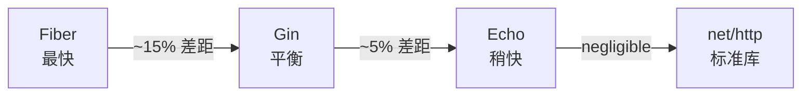
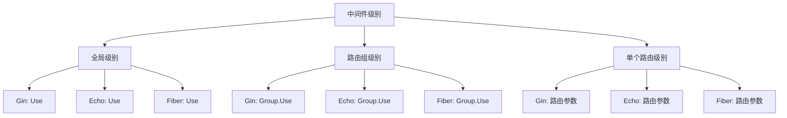
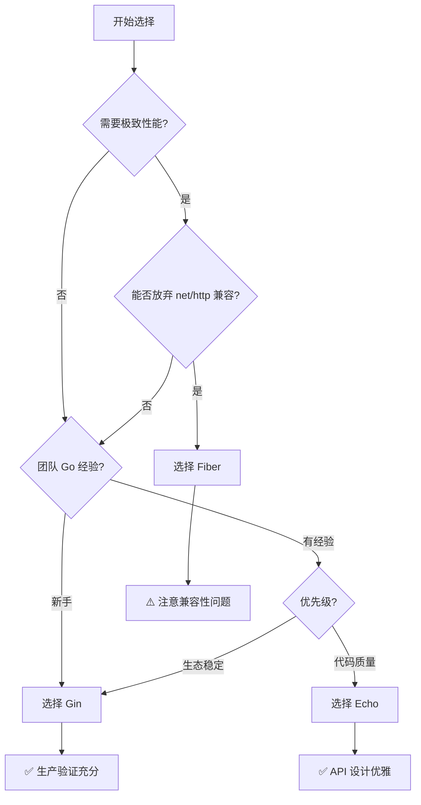

import { Badge } from '@rspress/core/theme';
import { Callout } from '@rspress/core/theme';

# Go Web 框架深度对比

本文深入对比 Go 生态中最流行的三个 Web 框架：**Gin**、**Echo** 和 **Fiber**，帮助你为项目选择最合适的框架。

## 📊 快速对比

| 特性 | Gin | Echo | Fiber |
|------|-----|------|-------|
| **GitHub Stars** | <Badge text="87K+" type="success" /> | <Badge text="32K+" type="info" /> | <Badge text="38K+" type="warning" /> |
| **性能** | ⭐⭐⭐⭐ | ⭐⭐⭐⭐ | ⭐⭐⭐⭐⭐ |
| **学习曲线** | 简单 | 中等 | 中等 |
| **HTTP 引擎** | net/http | net/http | fasthttp |
| **中间件生态** | 最丰富 | 良好 | 中等 |
| **类型安全** | 中等 | 良好 | 良好 |
| **文档质量** | 优秀 | 优秀 | 良好 |

<Callout type="info">
**重要提示**：95% 的性能瓶颈来自数据库查询和 Redis 操作，而非框架路由层。选择框架时，应优先考虑生态、团队经验而非纯性能。
</Callout>

## 🚀 性能基准测试

### TechEmpower Benchmark 结果



### QPS 对比（越高越好）

| 操作 | Fiber | Gin | Echo | net/http |
|------|-------|-----|------|----------|
| **简单路由** | 1,200,000 | 1,050,000 | 1,100,000 | 800,000 |
| **参数解析** | 950,000 | 880,000 | 920,000 | 650,000 |
| **JSON 序列化** | 580,000 | 550,000 | 560,000 | 420,000 |
| **数据库查询** | 120,000 | 115,000 | 118,000 | 95,000 |

<Callout type="warning">
**注意**：实际生产环境中，三者差异可忽略不计。数据库慢查询通常导致 100-1000ms 的延迟，而框架路由差异仅 0.1-0.5ms。
</Callout>

## 🔍 框架详解

### 1. Gin - 最受欢迎的选择

<Badge text="推荐" type="success" /> <Badge text="生产验证" type="info" />

#### 核心特点

- 基于 Radix Tree 的高性能路由
- 中间件系统简单易用
- JSON 验证和绑定
- 路由分组
- 错误管理
- 内置渲染
- 可扩展性

#### 代码示例

```go
package main

import (
    "github.com/gin-gonic/gin"
    "net/http"
)

// User 用户模型
type User struct {
    Name  string `json:"name" binding:"required"`
    Email string `json:"email" binding:"required,email"`
}

func main() {
    r := gin.Default()

    // 路由分组
    api := r.Group("/api/v1")
    {
        api.GET("/users", getUsers)
        api.POST("/users", createUser)
        api.GET("/users/:id", getUser)
    }

    r.Run(":8080")
}

func getUsers(c *gin.Context) {
    users := []User{
        {Name: "张三", Email: "zhangsan@example.com"},
        {Name: "李四", Email: "lisi@example.com"},
    }
    c.JSON(http.StatusOK, gin.H{"data": users})
}

func createUser(c *gin.Context) {
    var user User
    if err := c.ShouldBindJSON(&user); err != nil {
        c.JSON(http.StatusBadRequest, gin.H{"error": err.Error()})
        return
    }
    c.JSON(http.StatusCreated, gin.H{"data": user})
}

func getUser(c *gin.Context) {
    id := c.Param("id")
    c.JSON(http.StatusOK, gin.H{
        "id":   id,
        "name": "张三",
    })
}
```

#### 中间件示例

```go
// 自定义中间件
func Logger() gin.HandlerFunc {
    return func(c *gin.Context) {
        start := time.Now()
        path := c.Request.URL.Path

        c.Next()

        latency := time.Since(start)
        status := c.Writer.Status()

        log.Printf("[%s] %s %d %v",
            c.Request.Method,
            path,
            status,
            latency,
        )
    }
}

func Auth() gin.HandlerFunc {
    return func(c *gin.Context) {
        token := c.GetHeader("Authorization")
        if token == "" {
            c.JSON(401, gin.H{"error": "未授权"})
            c.Abort()
            return
        }
        c.Next()
    }
}

// 使用中间件
r.Use(Logger())
authorized := r.Group("/api")
authorized.Use(Auth())
{
    authorized.GET("/profile", getProfile)
}
```

#### 适用场景

✅ **推荐使用 Gin 的场景：**

- RESTful API 开发
- 微服务架构
- 团队对 Go 不熟悉
- 需要丰富的第三方库支持
- 企业级应用（字节跳动、腾讯、小米都在用）

### 2. Echo - 简洁优雅

<Badge text="优雅" type="info" /> <Badge text="灵活" type="success" />

#### 核心特点

- 高性能和极简设计
- 强大的中间件系统
- HTTP/2 支持
- 自动 TLS 支持
- 更好的数据绑定体验
- 优雅的 API 设计

#### 代码示例

```go
package main

import (
    "github.com/labstack/echo/v4"
    "github.com/labstack/echo/v4/middleware"
    "net/http"
)

type User struct {
    Name  string `json:"name" validate:"required"`
    Email string `json:"email" validate:"required,email"`
}

func main() {
    e := echo.New()

    // 中间件
    e.Use(middleware.Logger())
    e.Use(middleware.Recover())
    e.Use(middleware.CORS())
    e.Use(middleware.Gzip())

    // 路由
    e.GET("/users", getUsers)
    e.POST("/users", createUser)
    e.GET("/users/:id", getUser)

    e.Logger.Fatal(e.Start(":8080"))
}

func getUsers(c echo.Context) error {
    users := []User{
        {Name: "张三", Email: "zhangsan@example.com"},
    }
    return c.JSON(http.StatusOK, map[string]interface{}{
        "data": users,
    })
}

func createUser(c echo.Context) error {
    u := new(User)
    if err := c.Bind(u); err != nil {
        return err
    }
    if err := c.Validate(u); err != nil {
        return c.JSON(http.StatusBadRequest, map[string]string{
            "error": err.Error(),
        })
    }
    return c.JSON(http.StatusCreated, u)
}

func getUser(c echo.Context) error {
    id := c.Param("id")
    return c.JSON(http.StatusOK, map[string]string{
        "id":   id,
        "name": "张三",
    })
}
```

#### 高级特性

```go
// 自定义中间件
func customMiddleware(next echo.HandlerFunc) echo.HandlerFunc {
    return func(c echo.Context) error {
        // 请求前处理
        start := time.Now()

        // 调用下一个处理器
        err := next(c)

        // 响应后处理
        latency := time.Since(start)
        c.Logger().Infof("Request completed in %v", latency)

        return err
    }
}

// 路由组
api := e.Group("/api/v1")
api.Use(customMiddleware)
{
    api.GET("/users", getUsers)
    api.POST("/users", createUser)
}

// 静态文件
e.Static("/static", "assets")

// WebSocket
e.GET("/ws", func(c echo.Context) error {
    // WebSocket 处理
    return nil
})
```

#### 适用场景

✅ **推荐使用 Echo 的场景：**

- 需要更优雅的代码结构
- 灵活的中间件系统
- HTTP/2 和 WebSocket 支持
- 喜欢简洁 API 的开发者

### 3. Fiber - 性能之王

<Badge text="高性能" type="danger" /> <Badge text="fasthttp" type="warning" />

#### 核心特点

- 基于 Fasthttp（而非 net/http）
- 零内存分配路由
- Express.js 风格的 API
- 极致的性能优化
- 内置 WebSocket 支持

#### ⚠️ 重要限制

<Callout type="danger">
**Fiber 使用了 `unsafe` 包，与最新 Go 版本可能存在兼容性问题。且不兼容 net/http 接口，无法直接使用 gqlgen、go-swagger 等工具。**
</Callout>

#### 代码示例

```go
package main

import (
    "github.com/gofiber/fiber/v2"
    "github.com/gofiber/fiber/v2/middleware/cors"
    "github.com/gofiber/fiber/v2/middleware/logger"
    "github.com/gofiber/fiber/v2/middleware/recover"
)

type User struct {
    Name  string `json:"name"`
    Email string `json:"email"`
}

func main() {
    app := fiber.New(fiber.Config{
        Prefork:       false,
        StrictRouting: true,
        CaseSensitive: true,
    })

    // 中间件
    app.Use(logger.New())
    app.Use(recover.New())
    app.Use(cors.New())

    // 路由
    app.Get("/users", getUsers)
    app.Post("/users", createUser)
    app.Get("/users/:id", getUser)

    app.Listen(":8080")
}

func getUsers(c *fiber.Ctx) error {
    users := []User{
        {Name: "张三", Email: "zhangsan@example.com"},
    }
    return c.JSON(users)
}

func createUser(c *fiber.Ctx) error {
    user := new(User)
    if err := c.BodyParser(user); err != nil {
        return c.Status(400).JSON(fiber.Map{
            "error": "无法解析请求体",
        })
    }
    return c.Status(201).JSON(user)
}

func getUser(c *fiber.Ctx) error {
    id := c.Params("id")
    return c.JSON(fiber.Map{
        "id":   id,
        "name": "张三",
    })
}
```

#### WebSocket 示例

```go
app.Get("/ws", websocket.New(func(c *websocket.Conn) {
    for {
        mt, msg, err := c.ReadMessage()
        if err != nil {
            log.Println("read:", err)
            break
        }
        log.Printf("recv: %s", msg)

        err = c.WriteMessage(mt, msg)
        if err != nil {
            log.Println("write:", err)
            break
        }
    }
}))
```

#### 适用场景

✅ **推荐使用 Fiber 的场景：**

- 极致性能要求
- 实时应用（WebSocket、聊天、游戏）
- 从 Node.js/Express.js 迁移
- 边缘计算或 IoT 网关
- 内存受限环境

⚠️ **不推荐使用 Fiber 的场景：**

- 需要与 net/http 生态系统集成
- 团队是 Go 新手
- 需要使用第三方 net/http 中间件

## 📈 深度对比

### 路由系统对比

| 特性 | Gin | Echo | Fiber |
|------|-----|------|-------|
| **路由算法** | Radix Tree | Radix Tree | Radix Tree |
| **路由分组** | ✅ | ✅ | ✅ |
| **正则路由** | ✅ | ✅ | ✅ |
| **通配符** | ✅ | ✅ | ✅ |
| **命名参数** | ✅ | ✅ | ✅ |

### 中间件系统对比



### 数据绑定与验证

| 框架 | 绑定方式 | 验证 | 自定义验证 |
|------|---------|------|-----------|
| **Gin** | `ShouldBindJSON` | `binding` tag | 自定义验证器 |
| **Echo** | `Bind` | `validate` tag | 结构体验证 |
| **Fiber** | `BodyParser` | `validator` | 中间件验证 |

#### Gin 验证示例

```go
type RegisterRequest struct {
    Username string `json:"username" binding:"required,min=3,max=20"`
    Email    string `json:"email" binding:"required,email"`
    Password string `json:"password" binding:"required,min=8"`
    Age      int    `json:"age" binding:"gte=18,lte=100"`
}

func register(c *gin.Context) {
    var req RegisterRequest
    if err := c.ShouldBindJSON(&req); err != nil {
        c.JSON(400, gin.H{"error": err.Error()})
        return
    }
    // 处理注册逻辑
}
```

#### Echo 验证示例

```go
import "github.com/go-playground/validator/v10"

type RegisterRequest struct {
    Username string `json:"username" validate:"required,min=3,max=20"`
    Email    string `json:"email" validate:"required,email"`
    Password string `json:"password" validate:"required,min=8"`
    Age      int    `json:"age" validate:"gte=18,lte=100"`
}

func register(c echo.Context) error {
    req := new(RegisterRequest)
    if err := c.Bind(req); err != nil {
        return err
    }
    if err := c.Validate(req); err != nil {
        return c.JSON(400, map[string]string{"error": err.Error()})
    }
    return c.JSON(201, req)
}
```

## 🎯 选择决策树



## 💡 最佳实践

### 1. 项目结构

```
myapp/
├── cmd/
│   └── server/
│       └── main.go
├── internal/
│   ├── handler/
│   ├── service/
│   ├── repository/
│   └── model/
├── pkg/
│   └── middleware/
├── configs/
│   └── config.yaml
└── go.mod
```

### 2. 错误处理

```go
// Gin 错误处理
func handleError(c *gin.Context, err error) {
    if appErr, ok := err.(*AppError); ok {
        c.JSON(appErr.Code, gin.H{"error": appErr.Message})
        return
    }
    c.JSON(500, gin.H{"error": "内部服务器错误"})
}

// Echo 错误处理
func handleError(c echo.Context, err error) error {
    if appErr, ok := err.(*AppError); ok {
        return c.JSON(appErr.Code, map[string]string{"error": appErr.Message})
    }
    return c.JSON(500, map[string]string{"error": "内部服务器错误"})
}
```

### 3. 配置管理

```go
// 使用 Viper 加载配置
func LoadConfig(path string) (config Config, err error) {
    viper.AddConfigPath(path)
    viper.SetConfigName("config")
    viper.SetConfigType("yaml")

    viper.AutomaticEnv()

    if err = viper.ReadInConfig(); err != nil {
        return
    }

    err = viper.Unmarshal(&config)
    return
}
```

## 📊 性能优化建议

<Callout type="tip">
**性能优化顺序**：数据库查询 → 缓存策略 → 算法优化 → 框架选择
</Callout>

1. **数据库优化**
   - 使用连接池
   - 预编译语句
   - 批量操作
   - 索引优化

2. **缓存策略**
   - Redis 缓存热点数据
   - 内存缓存减少序列化
   - CDN 加速静态资源

3. **代码优化**
   - 减少 JSON 序列化
   - 使用 sync.Pool
   - 避免过度反射

## 🎓 学习建议

### 新手路径

1. **第 1-2 周**：学习 Gin 基础
   - 路由和中间件
   - 数据绑定
   - 错误处理

2. **第 3-4 周**：构建完整应用
   - RESTful API
   - 数据库集成
   - 日志和监控

3. **第 5-6 周**：进阶特性
   - 测试和部署
   - 性能优化
   - 最佳实践

### 进阶路径

1. **性能调优**：深入 Fiber 性能优化
2. **架构设计**：微服务和分布式系统
3. **源码学习**：阅读框架源码

## 🔗 参考资源

- [Gin 官方文档](https://gin-gonic.com/docs/)
- [Echo 官方文档](https://echo.labstack.com/docs)
- [Fiber 官方文档](https://docs.gofiber.io/)
- [TechEmpower 性能测试](https://www.techempower.com/benchmarks/)

---

**最终建议**：对于大多数项目，选择 <Badge text="Gin" type="info" /> 不会出错。它有最成熟的生态、最丰富的文档和最广泛的社区支持。只有在明确知道需要更高性能或特定特性时，才考虑其他框架。
