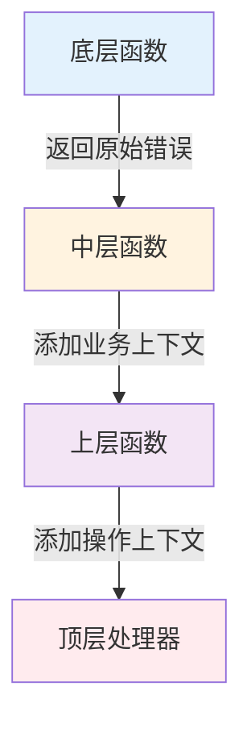

import { Badge } from "@rspress/core/theme";
import { Callout } from "@rspress/core/theme-original";

# 错误包装 - Error Wrapping

<Badge text="Go 1.13+" type="tip" />
<Badge text="核心机制" type="danger" />

Go 1.13 引入了强大的错误包装机制，允许在保留原始错误的同时添加上下文信息。这使得错误追踪变得更加清晰和高效。

## 为什么需要错误包装？

<Badge text="无技术背景读者" type="info" />

想象你在处理客户投诉：

```
客户：我的订单没有送达！
客服：让我查一下... 配送员说找不到地址...
配送员：GPS 显示地址是空的...
仓库：发货单上的地址是空的...
系统：啊！用户注册时没有填写地址
```

如果没有包装，你只能知道"订单送达失败"，但不知道**为什么**失败。

错误包装就像给错误添加"追踪链"，让你能一直追溯到问题的根源。

## 基础包装

<Badge text="初级开发者" type="tip" />

### %w vs %v

这是 Go 错误包装中最重要的区别：

```go
import (
    "errors"
    "fmt"
)

// 原始错误
originalErr := errors.New("connection timeout")

// 使用 %v - 只格式化字符串，**不保留**原始错误
wrapped1 := fmt.Errorf("failed to connect: %v", originalErr)

// 使用 %w - 格式化字符串并**保留**原始错误
wrapped2 := fmt.Errorf("failed to connect: %w", originalErr)

// 区别展示：
errors.Is(wrapped1, originalErr)  // false - 找不到原始错误
errors.Is(wrapped2, originalErr)  // true  - 找到了！
```

<Callout type="danger">
**关键规则**：只有使用 `%w` 才能保留错误类型，支持 `errors.Is()` 和 `errors.As()`。
</Callout>

### 错误链示例

```go
package main

import (
    "errors"
    "fmt"
)

// 底层：数据库操作
func queryUser(id int) error {
    return errors.New("database connection failed")
}

// 中层：业务逻辑
func getUser(id int) error {
    err := queryUser(id)
    if err != nil {
        return fmt.Errorf("get user %d: %w", id, err)
    }
    return nil
}

// 上层：HTTP 处理
func handleRequest(id int) error {
    err := getUser(id)
    if err != nil {
        return fmt.Errorf("handle request: %w", err)
    }
    return nil
}

func main() {
    err := handleRequest(123)
    if err != nil {
        fmt.Println("错误链:")
        fmt.Println(err)
        fmt.Println("\n错误详情:")
        for err != nil {
            fmt.Println("-", err)
            err = errors.Unwrap(err)
        }
    }
}

// 输出:
// 错误链:
// handle request: get user 123: database connection failed
//
// 错误详情:
// - handle request: get user 123: database connection failed
// - get user 123: database connection failed
// - database connection failed
```

## 错误判断与转换

<Badge text="中级开发者" type="warning" />

### errors.Is() - 检查特定错误

用于判断错误链中是否包含某个特定错误：

```go
package main

import (
    "errors"
    "fmt"
)

// 定义哨兵错误
var (
    ErrNotFound     = errors.New("not found")
    ErrUnauthorized = errors.New("unauthorized")
)

// 底层函数
func getResource(id int) error {
    if id > 100 {
        return ErrNotFound
    }
    return nil
}

// 中层包装
func getService(id int) error {
    err := getResource(id)
    if err != nil {
        return fmt.Errorf("get service %d: %w", id, err)
    }
    return nil
}

// 上层处理
func handleRequest(id int) error {
    err := getService(id)
    if err != nil {
        // 检查是否是特定错误
        if errors.Is(err, ErrNotFound) {
            return fmt.Errorf("request failed: resource not found")
        }
        return err
    }
    return nil
}
```

<Callout type="info">
**errors.Is() 会遍历整个错误链**，即使错误被多次包装也能找到。
</Callout>

### errors.As() - 转换错误类型

用于获取错误链中的特定类型错误：

```go
package main

import (
    "errors"
    "fmt"
    "os"
)

// 自定义错误类型
type ValidationError struct {
    Field   string
    Message string
}

func (e *ValidationError) Error() string {
    return fmt.Sprintf("validation failed: %s", e.Message)
}

// 业务函数返回自定义错误
func validateEmail(email string) error {
    if email == "" {
        return &ValidationError{
            Field:   "email",
            Message: "cannot be empty",
        }
    }
    return nil
}

// 包装错误
func createUser(email string) error {
    err := validateEmail(email)
    if err != nil {
        return fmt.Errorf("create user: %w", err)
    }
    return nil
}

// 使用 errors.As 获取原始类型
func main() {
    err := createUser("")
    if err != nil {
        // 尝试转换为 ValidationError
        var validationErr *ValidationError
        if errors.As(err, &validationErr) {
            fmt.Printf("字段: %s\n", validationErr.Field)
            fmt.Printf("错误: %s\n", validationErr.Message)
        }
    }
}
```

<Callout type="tip">
**性能提示**：`errors.As()` 比类型断言更安全，会遍历整个错误链。
</Callout>

## 包装最佳实践

<Badge text="高级开发者" type="danger" />

### 1. 错误包装层次



```go
// ✅ 推荐的包装层次

// 底层：返回具体错误，不包装
func (r *UserRepository) FindByID(id int) (*User, error) {
    var user User
    err := r.db.First(&user, id).Error
    if err != nil {
        if errors.Is(err, gorm.ErrRecordNotFound) {
            return nil, ErrUserNotFound  // 返回预定义错误
        }
        return nil, err  // 返回原始数据库错误
    }
    return &user, nil
}

// 中层：添加业务上下文
func (s *UserService) GetUser(id int) (*User, error) {
    user, err := s.repo.FindByID(id)
    if err != nil {
        return nil, fmt.Errorf("failed to get user %d: %w", id, err)
    }
    return user, nil
}

// 上层：添加操作上下文
func (h *UserHandler) GetUser(w http.ResponseWriter, r *http.Request) {
    id := getID(r)
    user, err := h.service.GetUser(id)
    if err != nil {
        http.Error(w, "User not found", http.StatusNotFound)
        return
    }
    json.NewEncoder(w).Encode(user)
}
```

### 2. 何时包装，何时不包装

```go
// ✅ 应该包装的场景

// 场景1: 添加有用的上下文
return fmt.Errorf("failed to connect to %s: %w", host, err)

// 场景2: 隐藏实现细节（对外 API）
return fmt.Errorf("operation failed: %w", internalErr)

// 场景3: 语义转换
return fmt.Errorf("user not found: %w", sql.ErrNoRows)


// ❌ 不应该包装的场景

// 场景1: 重复已有的信息
return fmt.Errorf("database error: %w",
    fmt.Errorf("query failed: %w", err))  // 过度包装

// 场景2: 在同一层多次包装
return fmt.Errorf("step 1: %w",
    fmt.Errorf("step 2: %w", err))  // 应该直接返回 err

// 场景3: 包装 nil 错误
return fmt.Errorf("context: %w", nil)  // 会返回 nil
```

### 3. 错误信息设计原则

```go
// ✅ 好的错误信息

// 原则1: 说明操作
return fmt.Errorf("failed to read config: %w", err)

// 原则2: 包含关键参数
return fmt.Errorf("failed to connect to database %s: %w", dbName, err)

// 原则3: 说明意图
return fmt.Errorf("cannot create user: email already registered: %w", err)

// 原则4: 简洁明确
return fmt.Errorf("timeout waiting for %s: %w", resource, err)


// ❌ 差的错误信息

return fmt.Errorf("error: %w", err)  // "error" 没有提供信息
return fmt.Errorf("something went wrong: %w", err)  // 太模糊
return fmt.Errorf("failed to do the thing: %w", err)  // 不明确
```

## 错误包装的性能考虑

<Badge text="高级开发者" type="danger" />

### 性能基准

```go
// 基准测试结果
BenchmarkErrorNew-8         100000000    5.12 ns/op    0 B/op
BenchmarkErrorWrap-8        30000000     42.5 ns/op   32 B/op
BenchmarkErrorIs10-8        20000000     52.3 ns/op    0 B/op
BenchmarkErrorIs100-8       5000000      523 ns/op     0 B/op
BenchmarkErrorIs1000-8      500000       5230 ns/op    0 B/op
```

### 优化策略

```go
// 优化1: 减少包装深度
// ❌ 过度包装
func layer1() error {
    return fmt.Errorf("layer1: %w",
        fmt.Errorf("layer2: %w",
            fmt.Errorf("layer3: %w", originalErr)))
}

// ✅ 直接传递
func layer1() error {
    return layer2()  // 不包装
}
func layer2() error {
    return layer3()  // 不包装
}
func layer3() error {
    return originalErr
}

// 在顶层统一包装
func topLayer() error {
    if err := layer1(); err != nil {
        return fmt.Errorf("operation failed: %w", err)
    }
    return nil
}


// 优化2: 条件性添加堆栈
var debugMode = false

func process() error {
    err := doSomething()
    if err != nil {
        if debugMode {
            return fmt.Errorf("process failed: %w\n%s", err, debug.Stack())
        }
        return fmt.Errorf("process failed: %w", err)
    }
    return nil
}


// 优化3: 使用预定义错误 + 简单包装
var ErrTimeout = errors.New("operation timeout")

func quickOperation() error {
    if timeout {
        return ErrTimeout  // 零分配
    }
    return nil
}
```

## 常见陷阱

<Badge text="中级开发者" type="warning" />

### 陷阱 1: nil 接口问题

```go
// ❌ 危险：返回 nil 接口但非 nil 错误
func returnsInterface() error {
    var p *CustomError = nil
    return p  // 返回非 nil 的 error 接口！
}

// ✅ 显式返回 nil
func returnsInterface() error {
    var p *CustomError = nil
    if p != nil {
        return p
    }
    return nil  // 显式 nil
}
```

### 陷阱 2: 包装 nil 错误

```go
// ❌ 包装 nil 会返回 nil
err := fmt.Errorf("context: %w", nil)
fmt.Println(err)  // <nil>

// ✅ 检查后再包装
if err != nil {
    return fmt.Errorf("context: %w", err)
}
```

### 陷阱 3: 错误链断裂

```go
// ❌ 使用 %v 断开错误链
return fmt.Errorf("failed: %v", err)  // errors.Is() 找不到原始错误

// ✅ 使用 %w 保持错误链
return fmt.Errorf("failed: %w", err)
```

## 实战案例

<Badge text="高级开发者" type="danger" />

### 案例：完整的 HTTP 服务错误处理

```go
package main

import (
    "encoding/json"
    "errors"
    "fmt"
    "net/http"
)

// 预定义错误
var (
    ErrUserNotFound     = errors.New("user not found")
    ErrInvalidInput     = errors.New("invalid input")
    ErrDatabase         = errors.New("database error")
)

// 自定义错误类型
type HTTPError struct {
    StatusCode int
    Err       error
}

func (e *HTTPError) Error() string {
    return e.Err.Error()
}

func (e *HTTPError) Unwrap() error {
    return e.Err
}

// DAO 层
func (d *UserDAO) FindByID(id int) (*User, error) {
    var user User
    err := d.db.First(&user, id).Error
    if err != nil {
        if errors.Is(err, gorm.ErrRecordNotFound) {
            return nil, ErrUserNotFound
        }
        return nil, fmt.Errorf("database query failed: %w", err)
    }
    return &user, nil
}

// Service 层
func (s *UserService) GetUser(id int) (*User, error) {
    if id <= 0 {
        return nil, fmt.Errorf("%w: invalid user id", ErrInvalidInput)
    }

    user, err := s.dao.FindByID(id)
    if err != nil {
        return nil, fmt.Errorf("get user %d: %w", id, err)
    }

    return user, nil
}

// Handler 层
func (h *Handler) GetUser(w http.ResponseWriter, r *http.Request) {
    id := getID(r)

    user, err := h.service.GetUser(id)
    if err != nil {
        // 检查错误类型并返回相应的 HTTP 状态码
        if errors.Is(err, ErrUserNotFound) {
            h.writeError(w, http.StatusNotFound, err)
        } else if errors.Is(err, ErrInvalidInput) {
            h.writeError(w, http.StatusBadRequest, err)
        } else {
            h.writeError(w, http.StatusInternalServerError, err)
        }
        return
    }

    json.NewEncoder(w).Encode(user)
}

func (h *Handler) writeError(w http.ResponseWriter, status int, err error) {
    w.WriteHeader(status)
    json.NewEncoder(w).Encode(map[string]string{
        "error": err.Error(),
    })
}
```

## 练习

<Badge text="实战练习" type="success" />

### 练习 1: 实现错误链追踪器

创建一个函数，可以打印完整的错误链及其堆栈信息：

```go
// TODO: 实现此函数
func PrintErrorChain(err error) {
    // 打印每一级错误
    // 如果是自定义错误类型，显示额外信息
}
```

<details>
<summary>查看答案</summary>

```go
func PrintErrorChain(err error) {
    fmt.Println("=== Error Chain ===")
    level := 0

    for err != nil {
        indent := strings.Repeat("  ", level)
        fmt.Printf("%sLevel %d: %s\n", indent, level, err)

        // 检查是否有额外信息
        if customErr, ok := err.(*ValidationError); ok {
            fmt.Printf("%s  Field: %s\n", indent, customErr.Field)
            fmt.Printf("%s  Value: %v\n", indent, customErr.Value)
        }

        // 检查是否有堆栈信息
        if stackErr, ok := err.(interface{ StackTrace() []string }); ok {
            fmt.Printf("%s  Stack:\n", indent)
            for _, line := range stackErr.StackTrace() {
                fmt.Printf("%s    %s\n", indent, line)
            }
        }

        err = errors.Unwrap(err)
        level++
    }
    fmt.Println("==================")
}
```

</details>

---

## 总结

### 关键要点

| 读者水平 | 核心要点 |
|---------|---------|
| <Badge text="无技术背景" type="info" /> | 错误包装就像给错误添加追踪链，让问题根源一目了然。 |
| <Badge text="初级开发者" type="tip" /> | 使用 `%w` 而非 `%v` 来保留错误类型。`errors.Is()` 检查特定错误，`errors.As()` 转换类型。 |
| <Badge text="中级开发者" type="warning" /> | 分层包装：底层返回原始错误，中层添加业务上下文，上层添加操作上下文。 |
| <Badge text="高级开发者" type="danger" /> | 错误包装有性能开销，在热路径中考虑优化。避免过度包装。 |

### 错误包装决策树

```
需要返回错误？
  │
  ├─ 调用者需要判断错误类型？
  │   └─ 是 → 使用 %w 包装
  │
  ├─ 需要添加上下文信息？
  │   └─ 是 → 使用 fmt.Errorf("context: %w", err)
  │
  └─ 都不需要？
      └─ 直接返回 err
```

### 下一步

- [← 错误基础](./error-basics.mdx)
- [自定义错误类型 →](./custom-errors.mdx)
- [错误处理最佳实践 →](./best-practices.mdx)
