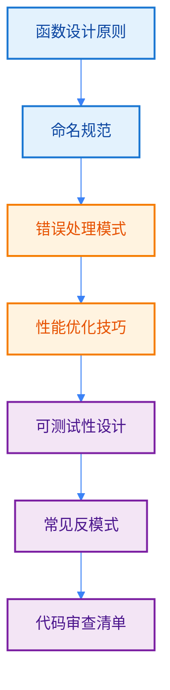

import { Badge } from "@rspress/core/theme";
import { Callout } from "@rspress/core/theme-original";

# 函数与方法最佳实践 - Best Practices

[← 返回函数与方法](./function-basics.mdx)

编写高质量的函数与方法是 Go 开发的核心技能。本文总结了专业 Go 开发者应遵循的最佳实践。

## 学习路径



## <Badge text="函数设计原则" type="tip" />

### 单一职责原则

<Badge text="专业开发者" type="danger" /> 每个函数应该只做一件事，并做好这件事。

```go
import "log"

// ✅ 好的设计：职责单一
func validateUserEmail(user *User) error {
    if user.Email == "" {
        return errors.New("email cannot be empty")
    }
    if !strings.Contains(user.Email, "@") {
        return errors.New("invalid email format")
    }
    return nil
}

func saveUserToDatabase(user *User) error {
    query := "INSERT INTO users (name, email) VALUES (?, ?)"
    _, err := db.Exec(query, user.Name, user.Email)
    if err != nil {
        log.Errorf("err:%s", err)
        return err
    }
    return nil
}

func sendWelcomeEmail(user *User) error {
    err := mailer.Send(user.Email, "Welcome!", "Welcome to our service!")
    if err != nil {
        log.Errorf("err:%s", err)
        return err
    }
    return nil
}

// ❌ 不好的设计：职责混乱
func handleUserRegistration(user *User) error {
    // 验证
    if user.Email == "" {
        return errors.New("email cannot be empty")
    }
    // 保存
    query := "INSERT INTO users (name, email) VALUES (?, ?)"
    _, err := db.Exec(query, user.Name, user.Email)
    if err != nil {
        log.Errorf("err:%s", err)
        return err
    }
    // 发送邮件
    return mailer.Send(user.Email, "Welcome!", "Welcome!")
}
```

### 函数大小控制

```go
// ✅ 好的设计：函数短小精悍（< 50 行）
func processOrder(order *Order) error {
    err := validateOrder(order)
    if err != nil {
        log.Errorf("err:%s", err)
        return err
    }

    err = reserveInventory(order)
    if err != nil {
        log.Errorf("err:%s", err)
        return err
    }

    err = chargePayment(order)
    if err != nil {
        log.Errorf("err:%s", err)
        return err
    }

    return confirmOrder(order)
}

// ❌ 不好的设计：函数过长（> 100 行）
func processOrder(order *Order) error {
    // 50 行验证代码...
    // 30 行库存处理...
    // 40 行支付逻辑...
    // 20 行确认逻辑...
    return nil
}
```

### 参数数量控制

```go
// ✅ 好的设计：参数少于 5 个
func createUser(name, email string, age int) (*User, error) {
    return &User{Name: name, Email: email, Age: age}, nil
}

// 使用选项模式处理多个参数
type UserOption func(*User)

func WithEmail(email string) UserOption {
    return func(u *User) { u.Email = email }
}

func WithAge(age int) UserOption {
    return func(u *User) { u.Age = age }
}

func CreateUser(name string, opts ...UserOption) *User {
    user := &User{Name: name}
    for _, opt := range opts {
        opt(user)
    }
    return user
}

// 使用
user := CreateUser("Alice",
    WithEmail("alice@example.com"),
    WithAge(30),
)

// ❌ 不好的设计：参数过多
func createUser(name, email, phone, address string, age int, active bool) (*User, error) {
    // ...
}
```

## <Badge text="命名规范" type="info" />

### 函数命名

<Badge text="中级开发者" type="warning" /> 函数名应该清晰表达其意图。

```go
// ✅ 好的命名：动词开头，语义清晰
func getUserById(id int64) (*User, error)
func validateEmail(email string) bool
func calculateTotal(items []Item) float64
func handleError(err error) error

// ✅ 命名约定
func NewUser() *User           // 构造函数
func ParseJSON(data []byte) error  // 解析函数
func FormatTime(t time.Time) string  // 格式化函数
func IsValid(s string) bool     // 判断函数返回 bool

// ❌ 不好的命名：模糊不清
func get(id int64) interface{}
func check(s string) bool
func do(items []interface{}) float64
func handle(data string) error
```

### 返回值命名

```go
// ✅ 好的设计：清晰的返回值命名
func divide(a, b float64) (quotient float64, err error) {
    if b == 0 {
        return 0, errors.New("division by zero")
    }
    return a / b, nil
}

// ✅ 多返回值时，error 总是最后
func getUser(id int64) (*User, error)
func parseConfig(path string) (*Config, error)

// ❌ 不好的设计：返回值顺序错误
func getUser(id int64) (error, *User)  // error 应该在最后
```

## <Badge text="错误处理模式" type="warning" />

### 错误处理最佳实践

```go
import "log"

// ✅ 尽早返回，减少嵌套
func processUser(id int64) error {
    user, err := getUser(id)
    if err != nil {
        log.Errorf("err:%s", err)
        return err
    }

    if user.Status == "inactive" {
        return errors.New("user is inactive")
    }

    if !user.HasPermission() {
        return errors.New("user lacks permission")
    }

    return processUserData(user)
}

// ❌ 深层嵌套，难以阅读
func processUser(id int64) error {
    user, err := getUser(id)
    if err == nil {
        if user.Status != "inactive" {
            if user.HasPermission() {
                return processUserData(user)
            } else {
                return errors.New("user lacks permission")
            }
        } else {
            return errors.New("user is inactive")
        }
    }
    return err
}
```

### 错误包装

<Badge text="注意" type="warning" /> 此章节展示错误包装的用法。在 panic-recover.mdx 中有详细教学。

```go
// ✅ 错误包装：添加上下文信息
func saveUser(user *User) error {
    err := db.Save(user)
    if err != nil {
        return fmt.Errorf("failed to save user %s: %w", user.Id, err)
    }
    return nil
}

// ✅ 使用自定义错误类型
type ValidationError struct {
    Field   string
    Message string
    Err     error
}

func (e *ValidationError) Error() string {
    return fmt.Sprintf("validation failed for field %s: %s", e.Field, e.Message)
}

func (e *ValidationError) Unwrap() error {
    return e.Err
}

func validateUser(id int) error {
    user, err := getUser(id)
    if err != nil {
        return fmt.Errorf("get user: %w", err)
    }
    if user.Age < 18 {
        return &ValidationError{
            Field:   "age",
            Message: "user is underage",
        }
    }
    return nil
}

// ❌ 不好的设计：吞掉错误
func saveUserBad(user *User) error {
    err := db.Save(user)
    if err != nil {
        log.Printf("error: %v", err)
        return nil  // 不要这样做！
    }
    return nil
}
```

<Callout type="danger" title={<Badge text="禁止" type="danger" />}>
  <strong>不要使用 panic/recover 处理常规错误</strong>

  • panic 只用于不可恢复的错误<br/>
  • 使用 error 返回值处理可预见的错误<br/>
  • recover 只在必要时使用，且应该在 defer 中
</Callout>

## <Badge text="性能优化技巧" type="warning" />

### 避免不必要的内存分配

```go
// ✅ 好的设计：复用缓冲区
var bufPool = sync.Pool{
    New: func() interface{} {
        return new(bytes.Buffer)
    },
}

func processData(data []byte) error {
    buf := bufPool.Get().(*bytes.Buffer)
    defer func() {
        buf.Reset()
        bufPool.Put(buf)
    }()

    buf.Write(data)
    // 处理数据...
    return nil
}

// ❌ 不好的设计：频繁分配
func processData(data []byte) error {
    buf := new(bytes.Buffer)  // 每次调用都分配
    buf.Write(data)
    return nil
}
```

### 使用值接收者 vs 指针接收者

```go
// ✅ 好的设计：根据场景选择
type Counter struct {
    count int
}

// 不需要修改原始值，使用值接收者
func (c Counter) GetCount() int {
    return c.count
}

// 需要修改原始值，使用指针接收者
func (c *Counter) Increment() {
    c.count++
}

// ✅ 大结构体使用指针接收者避免复制
type LargeStruct struct {
    data [1024]int
}

func (l *LargeStruct) Process() {
    // 处理逻辑
}

// ❌ 不好的设计：大结构体使用值接收者
func (l LargeStruct) Process() {
    // 会复制整个结构体
}
```

### defer 的性能考虑

```go
// ✅ 好的设计：简单资源清理使用 defer
func processFile(filename string) error {
    f, err := os.Open(filename)
    if err != nil {
        return err
    }
    defer f.Close()

    // 处理文件...
    return nil
}

// ⚠️ 性能敏感代码中，避免过度使用 defer
// 在高频循环中，直接调用可能更快
func processManyFiles(files []string) error {
    for _, filename := range files {
        f, err := os.Open(filename)
        if err != nil {
            return err
        }
        // 处理文件
        f.Close()  // 直接调用，不使用 defer
    }
    return nil
}
```

## <Badge text="可测试性设计" type="danger" />

### 依赖注入

```go
// ✅ 好的设计：使用接口实现依赖注入
type UserRepository interface {
    Get(id int64) (*User, error)
    Save(user *User) error
}

type UserService struct {
    repo UserRepository
}

func NewUserService(repo UserRepository) *UserService {
    return &UserService{repo: repo}
}

func (s *UserService) GetUser(id int64) (*User, error) {
    return s.repo.Get(id)
}

// 测试时可以注入 mock 实现
type MockUserRepository struct {
    mock.Mock
}

func (m *MockUserRepository) Get(id int64) (*User, error) {
    args := m.Called(id)
    return args.Get(0).(*User), args.Error(1)
}

// ❌ 不好的设计：硬编码依赖
type UserService struct {
    repo *UserRepository  // 具体类型，难以 mock
}
```

### 避免全局状态

```go
// ✅ 好的设计：传递依赖
type App struct {
    config *Config
    db     *Database
    logger *Logger
}

func NewApp(config *Config, db *Database, logger *Logger) *App {
    return &App{
        config: config,
        db:     db,
        logger: logger,
    }
}

func (a *App) Run() error {
    a.logger.Info("starting application")
    return nil
}

// ❌ 不好的设计：全局变量
var db *Database
var logger *Logger

func init() {
    // 初始化全局变量
}

func run() error {
    logger.Info("starting")
    return nil
}
```

## <Badge text="常见反模式" type="danger" />

### 反模式 1：过度使用可变参数

```go
// ✅ 好的设计：明确参数类型
func SendEmail(to, subject, body string) error {
    return mailer.Send(to, subject, body)
}

// ❌ 不好的设计：滥用可变参数
func SendEmail(args ...string) error {
    if len(args) != 3 {
        return errors.New("invalid arguments")
    }
    return mailer.Send(args[0], args[1], args[2])
}
```

### 反模式 2：返回接口类型

```go
// ✅ 好的设计：返回具体类型
func getUsers() []*User {
    return []*User{{Name: "Alice"}, {Name: "Bob"}}
}

// ❌ 不好的设计：返回接口
func getUsers() []interface{} {
    return []interface{}{&User{Name: "Alice"}, &User{Name: "Bob"}}
}
```

### 反模式 3：忽略错误

```go
// ✅ 好的设计：总是处理错误
func processFile(filename string) error {
    data, err := os.ReadFile(filename)
    if err != nil {
        return err
    }
    // 处理数据...
    return nil
}

// ❌ 不好的设计：忽略错误
func processFile(filename string) error {
    data, _ := os.ReadFile(filename)  // 忽略错误！
    // 处理数据...
    return nil
}
```

## <Badge text="代码审查清单" type="success" />

### 函数设计

- [ ] 函数名称清晰表达意图
- [ ] 函数只做一件事（单一职责）
- [ ] 函数长度 < 50 行
- [ ] 参数数量 < 5 个
- [ ] 避免使用可变参数（除非必要）

### 错误处理

- [ ] 所有错误都被处理
- [ ] 错误信息清晰有用
- [ ] 直接返回原始错误
- [ ] error 返回值总是最后
- [ ] 避免使用 panic 处理常规错误

### 性能考虑

- [ ] 避免不必要的内存分配
- [ ] 合理使用值/指针接收者
- [ ] defer 用于资源清理
- [ ] 性能敏感代码避免过度 defer

### 可测试性

- [ ] 使用接口定义依赖
- [ ] 避免全局状态
- [ ] 函数易于测试
- [ ] 依赖可注入
- [ ] 副作用明确

### 命名规范

- [ ] 导出函数有注释
- [ ] 命名遵循 Go 约定
- [ ] 避免缩写和无意义名称
- [ ] 布尔返回值使用 Is/Has/Can 前缀

## <Badge text="总结" type="success" />

编写高质量 Go 函数的关键：

1. **保持简单**：函数应该短小精悍，职责单一
2. **清晰命名**：使用有意义的名字，表达意图
3. **正确处理错误**：不忽略错误，合理包装
4. **注重性能**：避免不必要的分配，合理使用指针
5. **易于测试**：依赖注入，避免全局状态
6. **持续改进**：定期重构，提升代码质量

<Badge text="专业提示" type="danger" />
记住：代码被阅读的次数远多于被编写的次数。投入时间编写清晰、简洁的函数，长远来看会带来巨大回报。

---

[← 返回函数与方法](./function-basics.mdx)
