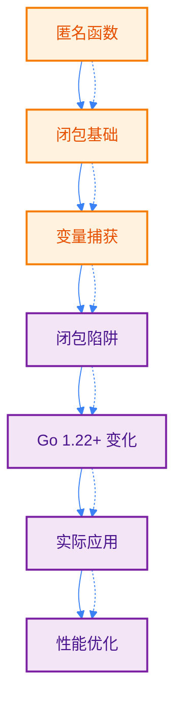
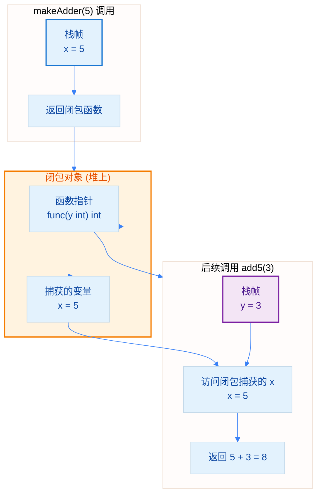
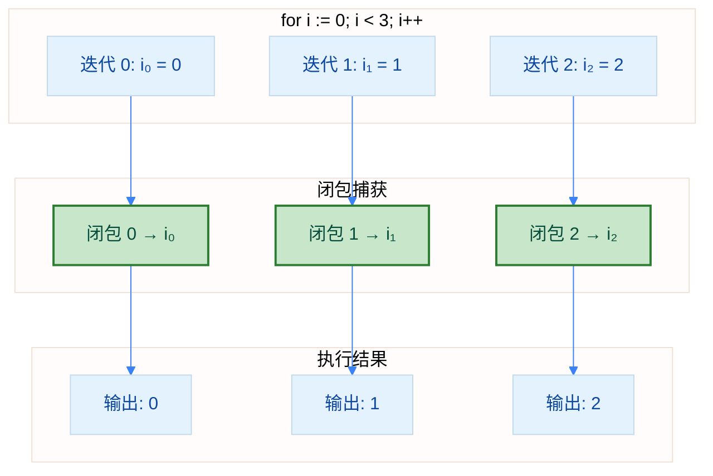

import { Badge } from "@rspress/core/theme";
import { Callout } from "@rspress/core/theme-original";

# 闭包 - Closures

[← 返回函数与方法](./function-basics.mdx)

闭包是 Go 语言中最强大的特性之一，它让函数能够"记住"其创建时的环境。深入理解闭包对于编写高质量的 Go 代码至关重要。

## 学习路径



## <Badge text="匿名函数" type="warning" />

<Badge text="中级开发者" type="warning" /> 匿名函数是没有名称的函数，可以在任何需要函数值的地方使用。

### 基本语法

```go
package main

import "fmt"

func main() {
    // 方式 1: 定义并立即调用
    func(msg string) {
        fmt.Println("立即执行:", msg)
    }("Hello, Anonymous!")

    // 方式 2: 赋值给变量
    add := func(a, b int) int {
        return a + b
    }
    fmt.Println("通过变量调用:", add(3, 5))

    // 方式 3: 作为参数传递
    numbers := []int{1, 2, 3, 4, 5}
    doubled := mapSlice(numbers, func(x int) int {
        return x * 2
    })
    fmt.Println("映射结果:", doubled)

    // 方式 4: 作为返回值
    multiplier := createMultiplier(3)
    fmt.Println("乘法器:", multiplier(10))
}

// 接收函数作为参数
func mapSlice(nums []int, fn func(int) int) []int {
    result := make([]int, len(nums))
    for i, num := range nums {
        result[i] = fn(num)
    }
    return result
}

// 返回函数
func createMultiplier(factor int) func(int) int {
    return func(x int) int {
        return x * factor
    }
}
```

### 匿名函数使用场景

```go
package main

import (
    "fmt"
    "sort"
)

func main() {
    // 场景 1: 排序自定义
    people := []struct {
        Name string
        Age  int
    }{
        {"Alice", 30},
        {"Bob", 25},
        {"Charlie", 35},
    }

    // 使用匿名函数定义排序规则
    sort.Slice(people, func(i, j int) bool {
        return people[i].Age < people[j].Age
    })
    fmt.Println("按年龄排序:", people)

    // 场景 2: 延迟执行
    fmt.Println("准备执行...")
    defer func() {
        fmt.Println("清理工作完成")
    }()

    // 场景 3: 并发处理
    tasks := []string{"task1", "task2", "task3"}
    for _, task := range tasks {
        go func(t string) {
            fmt.Println("执行:", t)
        }(task)
    }
}
```

## <Badge text="闭包原理" type="warning" />

<Badge text="高级开发者" type="danger" /> 闭包是函数值（function value），它引用了其函数体之外的变量。

### 什么是闭包

<Badge text="核心概念" type="info" /> **闭包 = 匿名函数 + 引用的外部变量**

```go
package main

import "fmt"

// makeAdder 返回一个闭包
func makeAdder(x int) func(int) int {
    // 返回的匿名函数引用了外部变量 x
    // 这个函数就是一个闭包
    return func(y int) int {
        return x + y  // 捕获并使用外部变量 x
    }
}

func main() {
    add5 := makeAdder(5)   // 创建一个"加 5"的闭包
    add10 := makeAdder(10)  // 创建一个"加 10"的闭包

    fmt.Println(add5(3))   // 输出: 8 (5 + 3)
    fmt.Println(add5(10))  // 输出: 15 (5 + 10)
    fmt.Println(add10(3))  // 输出: 13 (10 + 3)

    // 每个闭包都有自己独立的 x 副本
}
```

### 闭包内存模型



<Callout type="info" title="内存分配">
  <strong>关键理解</strong>：闭包捕获的变量存储在<strong>堆上</strong>而非栈上，因此即使外部函数返回，这些变量仍然存在。
</Callout>

### 闭包作为对象

```go
package main

import "fmt"

// 计数器闭包 - 保持状态
func makeCounter() func() int {
    count := 0
    return func() int {
        count++
        return count
    }
}

func main() {
    counter1 := makeCounter()
    counter2 := makeCounter()

    fmt.Println(counter1())  // 1
    fmt.Println(counter1())  // 2
    fmt.Println(counter1())  // 3

    fmt.Println(counter2())  // 1 (独立的计数器)
    fmt.Println(counter2())  // 2
}
```

## <Badge text="变量捕获机制" type="danger" />

<Badge text="高级开发者" type="danger" /> 理解闭包如何捕获变量是避免闭包陷阱的关键。

### 按引用捕获

<Badge text="重要" type="danger" /> Go 闭包<strong>按引用捕获</strong>变量，而非按值复制！

```go
package main

import "fmt"

func main() {
    values := []int{1, 2, 3, 4, 5}

    var funcs []func()

    // 创建闭包，捕获切片元素
    for _, value := range values {
        funcs = append(funcs, func() {
            fmt.Printf("值: %d\n", value)
        })
    }

    // 执行所有闭包
    for _, f := range funcs {
        f()
    }

    // 由于 range 使用值拷贝，这里输出正确
    // 值: 1, 值: 2, 值: 3, 值: 4, 值: 5
}
```

### 捕获循环变量（经典陷阱）

```go
package main

import "fmt"

func main() {
    var funcs []func()

    // 错误示例：捕获循环变量
    for i := 0; i < 3; i++ {
        funcs = append(funcs, func() {
            fmt.Printf("i = %d\n", i)
        })
    }

    // 所有闭包共享同一个 i
    for _, f := range funcs {
        f()
    }
    // Go 1.22 之前输出: i = 3, i = 3, i = 3
    // Go 1.22+ 输出: i = 0, i = 1, i = 2
}
```

<Callout type="danger" title="Go 1.22 之前的行为">
  在 Go 1.22 之前，for 循环的变量在每次迭代中是<strong>同一个变量</strong>。闭包捕获的是这个变量的引用，所以所有闭包共享同一个变量。
</Callout>

### 解决方案对比

```go
package main

import "fmt"

func main() {
    // === Go 1.22 之前的解决方案 ===

    // 方案 1: 创建局部变量（推荐）
    var funcs1 []func()
    for i := 0; i < 3; i++ {
        i := i  // 创建新的局部变量，遮蔽循环变量
        funcs1 = append(funcs1, func() {
            fmt.Printf("方案1 - i = %d\n", i)
        })
    }

    // 方案 2: 通过参数传递
    var funcs2 []func()
    for i := 0; i < 3; i++ {
        funcs2 = append(funcs2, func(n int) {
            fmt.Printf("方案2 - n = %d\n", n)
        }(i))  // 立即执行，传入当前值
    }

    // 方案 3: 使用辅助函数
    var funcs3 []func()
    for i := 0; i < 3; i++ {
        funcs3 = append(funcs3, makeFunc(i))
    }
}

func makeFunc(n int) func() {
    return func() {
        fmt.Printf("方案3 - n = %d\n", n)
    }
}
```

## <Badge text="闭包陷阱详解" type="danger" />

### 陷阱 1: 循环变量捕获

```go
package main

import "fmt"
import "time"

func main() {
    // 陷阱: 在 goroutine 中使用循环变量
    for i := 0; i < 3; i++ {
        go func() {
            fmt.Printf("Goroutine: %d\n", i)
        }()
    }

    time.Sleep(time.Millisecond)
    // Go 1.22 之前: 可能输出 3 3 3 或其他不可预测的结果
    // Go 1.22+: 输出 0 1 2
}
```

**正确做法（Go 1.22 之前）**：

```go
for i := 0; i < 3; i++ {
    go func(n int) {
        fmt.Printf("Goroutine: %d\n", n)
    }(i)  // 传递参数
}
```

### 陷阱 2: 延迟求值

```go
package main

import "fmt"

func main() {
    var funcs []func()

    // 陷阱: 循环结束时才执行闭包
    for i := 0; i < 3; i++ {
        funcs = append(funcs, func() {
            fmt.Println(i)
        })
    }

    // 执行闭包时，循环已经结束
    for _, f := range funcs {
        f()
    }
    // Go 1.22 之前输出: 3 3 3
}
```

### 陷阱 3: 修改共享状态

```go
package main

import "fmt"

func main() {
    // 多个闭包共享同一个变量
    data := []int{1, 2, 3}

    var modifiers []func()
    for i := range data {
        modifiers = append(modifiers, func() {
            data[i] *= 2  // 所有闭包操作同一个切片
        })
    }

    for _, m := range modifiers {
        m()
    }

    fmt.Println(data)
    // Go 1.22+: [2 4 6] (每次迭代 i 是新变量)
    // Go 1.22 之前: 不可预测的行为
}
```

## <Badge text="Go 1.22+ 变化" type="success" />

<Callout type="success" title="重要更新">
  从 Go 1.22 开始，for 循环的语义发生变化：每次迭代都会创建新的变量实例。这从根本上解决了循环变量捕获的问题。
</Callout>

### 版本差异对比

```go
package main

import "fmt"

func main() {
    var funcs []func()

    for i := 0; i < 3; i++ {
        funcs = append(funcs, func() {
            fmt.Println(i)
        })
    }

    for _, f := range funcs {
        f()
    }
}
```

| Go 版本 | 输出结果 | 原因 |
|---------|---------|------|
| Go 1.21 及之前 | `3 3 3` | 所有闭包共享同一个变量 i |
| Go 1.22+ | `0 1 2` | 每次迭代创建新的变量 i |

### 向后兼容

```go
package main

import "fmt"

func main() {
    // Go 1.22+ 中，这两种写法都正确

    // 写法 1: 直接使用循环变量
    for i := 0; i < 3; i++ {
        go func() {
            fmt.Println(i)
        }()
    }

    // 写法 2: 显式传递参数（仍然有效）
    for i := 0; i < 3; i++ {
        go func(n int) {
            fmt.Println(n)
        }(i)
    }
}
```

<Callout type="tip" title="最佳实践">
  即使在 Go 1.22+ 中，显式传递参数仍然是一个好的做法，因为它让代码意图更明确，且不依赖语言细节。
</Callout>

### Go 1.22+ 内存模型



## <Badge text="实际应用案例" type="warning" />

### 应用 1: 函数工厂

```go
package main

import "fmt"

// 创建不同类型的验证器
func validatorFactory(validatorType string) func(string) bool {
    switch validatorType {
    case "email":
        return func(s string) bool {
            return len(s) > 5 && contains(s, "@")
        }
    case "phone":
        return func(s string) bool {
            return len(s) == 11
        }
    default:
        return func(s string) bool {
            return len(s) > 0
        }
    }
}

func contains(s, substr string) bool {
    return len(s) > 0 && len(substr) > 0 && s[0:1] == substr[0:1]
}

func main() {
    emailValidator := validatorFactory("email")
    phoneValidator := validatorFactory("phone")

    fmt.Println("Email valid:", emailValidator("user@example.com"))  // true
    fmt.Println("Email valid:", emailValidator("user"))               // false
    fmt.Println("Phone valid:", phoneValidator("13800138000"))      // true
}
```

### 应用 2: 带缓存的计算

```go
package main

import "fmt"

// 记忆化：缓存计算结果
func memoize(fn func(int) int) func(int) int {
    cache := make(map[int]int)

    return func(x int) int {
        if val, ok := cache[x]; ok {
            fmt.Printf("从缓存获取: %d\n", x)
            return val
        }
        result := fn(x)
        cache[x] = result
        fmt.Printf("计算并缓存: %d\n", x)
        return result
    }
}

func expensiveCalculation(n int) int {
    fmt.Printf("执行复杂计算: %d\n", n)
    return n * n
}

func main() {
    memoizedCalc := memoize(expensiveCalculation)

    memoizedCalc(5)  // 计算并缓存
    memoizedCalc(5)  // 从缓存获取
    memoizedCalc(10) // 计算并缓存
    memoizedCalc(10) // 从缓存获取
}
```

### 应用 3: 中间件模式

```go
package main

import "fmt"

// 中间件包装器
func withLogging(fn func(string) error) func(string) error {
    return func(s string) error {
        fmt.Printf("开始处理: %s\n", s)
        err := fn(s)
        if err != nil {
            fmt.Printf("处理失败: %v\n", err)
        } else {
            fmt.Printf("处理成功: %s\n", s)
        }
        return err
    }
}

func processRequest(data string) error {
    if data == "" {
        return fmt.Errorf("空数据")
    }
    fmt.Printf("处理数据: %s\n", data)
    return nil
}

func main() {
    wrappedProcess := withLogging(processRequest)

    wrappedProcess("hello")
    wrappedProcess("")
}
```

### 应用 4: 迭代器模式

```go
package main

import "fmt"

// 创建一个斐波那契数列迭代器
func fibonacciIterator() func() int {
    a, b := 0, 1
    return func() int {
        result := a
        a, b = b, a+b
        return result
    }
}

func main() {
    fib := fibonacciIterator()

    fmt.Println("前 10 个斐波那契数:")
    for i := 0; i < 10; i++ {
        fmt.Printf("%d ", fib())
    }
    fmt.Println()
}
```

### 应用 5: 限流器

```go
package main

import (
    "fmt"
    "time"
)

// 创建限流器
func rateLimiter(maxRequests int, interval time.Duration) func() bool {
    requests := make([]time.Time, 0)

    return func() bool {
        now := time.Now()
        cutoff := now.Add(-interval)

        // 移除超出时间窗口的请求
        valid := 0
        for _, t := range requests {
            if t.After(cutoff) {
                requests[valid] = t
                valid++
            }
        }
        requests = requests[:valid]

        if len(requests) < maxRequests {
            requests = append(requests, now)
            return true
        }
        return false
    }
}

func main() {
    limiter := rateLimiter(3, time.Second)

    for i := 0; i < 10; i++ {
        if limiter() {
            fmt.Printf("请求 %d: 允许\n", i+1)
        } else {
            fmt.Printf("请求 %d: 限流\n", i+1)
        }
        time.Sleep(200 * time.Millisecond)
    }
}
```

## <Badge text="性能考虑" type="danger" />

### 内存分配

<Badge text="性能优化" type="warning" /> 闭包会带来堆内存分配，需要注意性能影响。

```go
package main

import "fmt"

// 低效: 每次调用都创建新闭包
func processItemsBad(items []int) []int {
    results := make([]int, len(items))
    for i, item := range items {
        // 每次循环创建新闭包
        processor := func(x int) int {
            return x * 2
        }
        results[i] = processor(item)
    }
    return results
}

// 高效: 闭包复用
func processItemsGood(items []int) []int {
    results := make([]int, len(items))

    // 只创建一次闭包
    processor := func(x int) int {
        return x * 2
    }

    for i, item := range items {
        results[i] = processor(item)
    }
    return results
}

func main() {
    items := []int{1, 2, 3, 4, 5}
    fmt.Println(processItemsBad(items))
    fmt.Println(processItemsGood(items))
}
```

### 闭包 vs 普通函数

```go
package main

import "fmt"
import "testing"

// 闭包版本
func makeClosureAdder(x int) func(int) int {
    return func(y int) int {
        return x + y
    }
}

// 普通函数版本
func makeStructAdder(x int) *structAdder {
    return &structAdder{x: x}
}

type structAdder struct {
    x int
}

func (s *structAdder) Add(y int) int {
    return s.x + y
}

func main() {
    // 性能基准测试建议
    adder1 := makeClosureAdder(5)
    adder2 := makeStructAdder(5)

    fmt.Println("闭包:", adder1(3))
    fmt.Println("结构体:", adder2.Add(3))
}

/* 基准测试代码
func BenchmarkClosure(b *testing.B) {
    adder := makeClosureAdder(5)
    for i := 0; i < b.N; i++ {
        adder(i)
    }
}

func BenchmarkStruct(b *testing.B) {
    adder := makeStructAdder(5)
    for i := 0; i < b.N; i++ {
        adder.Add(i)
    }
}
*/
```

<Callout type="info" title="性能建议">
  在<strong>热路径</strong>（高频调用路径）中，如果闭包带来明显性能问题，考虑使用结构体和方法替代。但在大多数应用场景中，闭包的性能影响可以忽略不计。
</Callout>

### 避免不必要的闭包

```go
package main

import "fmt"

// ❌ 不必要: 简单操作不需要闭包
func calculateBad(op string, a, b int) int {
    operations := map[string]func(int, int) int{
        "add": func(x, y int) int { return x + y },
        "sub": func(x, y int) int { return x - y },
    }
    fn := operations[op]
    return fn(a, b)
}

// ✅ 更好: 直接操作
func calculateGood(op string, a, b int) int {
    switch op {
    case "add":
        return a + b
    case "sub":
        return a - b
    default:
        return 0
    }
}

func main() {
    fmt.Println(calculateBad("add", 5, 3))
    fmt.Println(calculateGood("add", 5, 3))
}
```

## <Badge text="最佳实践" type="success" />

### 使用闭包的时机

<Badge text="推荐使用" type="success" /> 以下场景适合使用闭包：

```go
// 1. 需要保持状态
func makeCounter() func() int {
    count := 0
    return func() int {
        count++
        return count
    }
}

// 2. 函数工厂
func makeLogger(prefix string) func(string) {
    return func(msg string) {
        fmt.Printf("[%s] %s\n", prefix, msg)
    }
}

// 3. 配置预设置
func makeRequest(baseURL string) func(string) string {
    return func(endpoint string) string {
        return baseURL + endpoint
    }
}

// 4. 回调和异步操作
func processData(data string, callback func(string)) {
    go func() {
        result := "处理: " + data
        callback(result)
    }()
}
```

### 避免闭包的时机

<Badge text="不推荐使用" type="danger" /> 以下场景应避免闭包：

```go
// 1. 简单的固定操作
func simpleAdd(a, b int) int {
    return a + b  // 直接函数，无需闭包
}

// 2. 性能关键路径
func highFrequencyProcessing(data []int) {
    for _, d := range data {
        processDirectly(d)  // 避免创建闭包
    }
}

// 3. 需要序列化的场景
// 闭包无法序列化，使用结构体替代
type Processor struct {
    Config string
}

func (p *Processor) Process(data string) string {
    return p.Config + data
}
```

### 闭包设计原则

```go
package main

import "fmt"

// ✅ 原则 1: 闭包应该简单明确
func makeGoodClosure() func(int) int {
    multiplier := 2
    return func(x int) int {
        return x * multiplier  // 清晰的意图
    }
}

// ❌ 避免: 复杂的闭包逻辑
func makeBadClosure() func(int) int {
    var state1, state2, state3 int
    return func(x int) int {
        state1 = x
        state2 = x * 2
        state3 = x * 3
        return state1 + state2 + state3  // 难以理解
    }
}

// ✅ 原则 2: 明确变量生命周期
func createWithCleanup(resource string) func() {
    cleanup := func() {
        fmt.Println("清理资源:", resource)
    }
    return cleanup
}

// ✅ 原则 3: 限制闭包作用域
func useLimitedScope() {
    data := []int{1, 2, 3}

    processor := func(x int) int {
        return x * 2
    }

    // 只在需要的地方使用闭包
    for _, v := range data {
        result := processor(v)
        fmt.Println(result)
    }
    // processor 在此后不再使用
}
```

## <Badge text="常见问题" type="info" />

### Q1: 闭包和匿名函数有什么区别?

**答**: 所有的闭包都是匿名函数，但不是所有匿名函数都是闭包。

```go
// 匿名函数（不是闭包）
func(a, b int) int {
    return a + b
}

// 闭包（匿名函数 + 捕获外部变量）
func makeAdder(x int) func(int) int {
    return func(y int) int {
        return x + y  // 捕获外部变量 x
    }
}
```

### Q2: 闭包捕获的变量会占用内存多久?

**答**: 只要闭包存在，捕获的变量就会占用内存。

```go
func main() {
    // 这个闭包会一直占用内存
    longLived := makeCounter()  // count 变量一直存在

    // 如果不再需要，可以置 nil 帮助 GC
    longLived = nil
}
```

### Q3: 闭包会导致内存泄漏吗?

**答**: 可能会，如果闭包意外保持对大对象的引用。

```go
package main

import "fmt"

// 潜在内存泄漏
func makeProcessor() func() {
    // largeData 意外被闭包捕获
    largeData := make([]byte, 1024*1024*100)  // 100MB

    return func() int {
        return 42  // 实际不需要 largeData
    }
    // largeData 会一直存在于内存中！
}

// 正确做法
func makeProcessorCorrect() func() int {
    return func() int {
        return 42
    }
}
```

### Q4: 如何测试闭包?

**答**: 测试闭包的状态和行为。

```go
package main

import "fmt"

func makeCounter() func() int {
    count := 0
    return func() int {
        count++
        return count
    }
}

func main() {
    counter := makeCounter()

    // 测试初始状态
    if counter() != 1 {
        fmt.Println("测试失败: 第一次调用应该返回 1")
    }

    // 测试递增
    if counter() != 2 {
        fmt.Println("测试失败: 第二次调用应该返回 2")
    }

    // 测试独立实例
    counter2 := makeCounter()
    if counter2() != 1 {
        fmt.Println("测试失败: 新实例应该从 1 开始")
    }

    fmt.Println("所有测试通过!")
}
```

## <Badge text="总结" type="success" />

### 闭包关键点

| 方面 | 要点 |
|-----|------|
| **定义** | 匿名函数 + 捕获的外部变量 |
| **捕获方式** | 按引用捕获（共享变量） |
| **内存位置** | 捕获的变量分配在堆上 |
| **生命周期** | 与闭包函数值绑定 |
| **Go 1.22+** | 循环变量语义改变，每次迭代创建新变量 |

### 使用建议

<Badge text="核心建议" type="success" />

1. **充分利用闭包**：在函数工厂、回调、中间件等场景
2. **注意循环变量**：Go 1.22 之前需要显式创建局部变量
3. **考虑性能**：在热路径中评估闭包的性能影响
4. **保持简单**：闭包应该简洁明了，避免复杂逻辑
5. **明确生命周期**：了解闭包何时释放捕获的变量

### 相关阅读

- [变量生命周期](../fundamentals/variable-lifecycle.mdx) - 了解变量如何在堆和栈之间分配
- [函数类型](./function-types.mdx) - 深入理解 Go 的函数类型
- [defer 机制](./defer.mdx) - defer 也使用了闭包机制

---

[← 返回函数与方法](./function-basics.mdx) | [变量生命周期 →](../fundamentals/variable-lifecycle.mdx)
