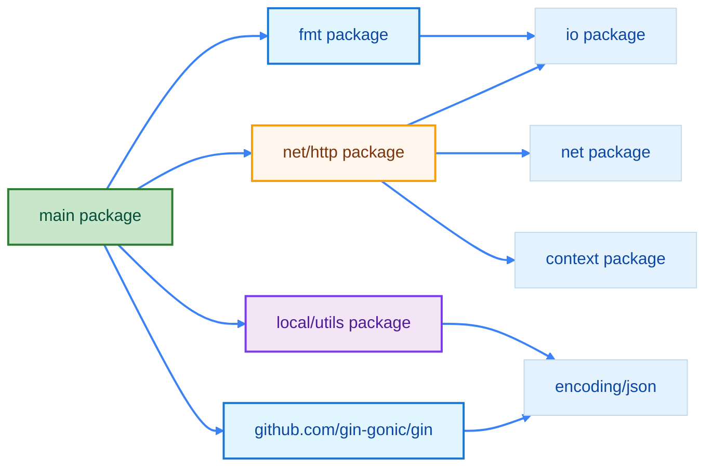

import { Badge } from "@rspress/core/theme";
import { Callout } from "@rspress/core/theme-original";

# 包系统 - Go 的模块化组织

[← 返回基础概念](overview/)

包是 Go 代码组织和复用的基本单位，理解包系统对于构建可维护的项目至关重要。


## <Badge text="包基础" type="tip" />

### package 声明

```go
// main.go
package main  // 可执行程序的入口包

import "fmt"

func main() {
    fmt.Println("Hello, World!")
}
```

```go
// utils/math.go
package utils  // 自定义包

func Add(a, b int) int {
    return a + b
}
```

<Badge text="规则" type="info" /> 每个 `.go` 文件必须以 `package` 声明开头。

### 导入包

```go
package main

import (
    "fmt"           // 标准库
    "net/http"      // 标准库
    "myproject/utils"  // 本地包
    "github.com/gin-gonic/gin"  // 第三方包
)

func main() {
    fmt.Println("Hello")
    resp, _ := http.Get("https://example.com")
    sum := utils.Add(1, 2)
    _ = resp
    _ = sum
}
```

### 包导入关系图




## <Badge text="包的可见性" type="info" />

### 导出规则

```go
// utils/calculator.go
package utils

// 公开函数（首字母大写）
func Add(a, b int) int {
    return a + b
}

// 私有函数（首字母小写）
func subtract(a, b int) int {
    return a - b
}

// 公开类型
type Calculator struct {
    Result int  // 公开字段
    steps  int  // 私有字段
}

// 私有类型
type debugInfo struct {
    line int
    file string
}
```

```go
// main.go
package main

import "myproject/utils"

func main() {
    // ✅ 可以访问公开函数
    sum := utils.Add(1, 2)

    // ❌ 无法访问私有函数
    // diff := utils.subtract(5, 3)

    // ✅ 可以访问公开类型
    calc := utils.Calculator{}
    calc.Result = 10

    // ❌ 无法访问私有字段
    // calc.steps = 5
    _ = sum
    _ = calc
}
```


## <Badge text="init 函数" type="warning" />

### init 函数基础

```go
package main

import "fmt"

// init 函数在 main 之前自动执行
func init() {
    fmt.Println("初始化中...")
}

func init() {
    fmt.Println("再次初始化...")
}

func main() {
    fmt.Println("主程序开始")
}

// 输出顺序：
// 初始化中...
// 再次初始化...
// 主程序开始
```

### init 函数应用

```go
// config/config.go
package config

var (
    DatabaseURL string
    DebugMode   bool
)

func init() {
    // 从环境变量加载配置
    DatabaseURL = "localhost:5432"
    DebugMode = true
}
```

```go
// main.go
package main

import (
    "fmt"
    "myproject/config"
)

func main() {
    // config 已经初始化
    fmt.Println("数据库:", config.DatabaseURL)
}
```

<Badge text="注意" type="danger" /> **init 函数的执行顺序**：
1. 同一文件内：按声明顺序
2. 同一包内：按文件名字母顺序
3. 不同包间：按导入顺序


## <Badge text="包别名" type="info" />

### 导入别名

```go
package main

import (
    fmt2 "fmt"           // 别名
    str "strings"        // 简短别名
    _ "image/png"        // 空白标识符（仅执行 init）
    . "math"             // 点导入（直接访问）
)

func main() {
    fmt2.Println("使用别名")
    str.HasPrefix("hello", "he")

    // 点导入后直接使用，无需包前缀
    println(Pi)  // 而不是 math.Pi
}
```

### 使用场景

| 别名类型 | 用途 | 示例 |
|---------|-----|------|
| 正常别名 | 避免命名冲突 | `import fmt2 "fmt"` |
| 简短别名 | 减少输入 | `import str "strings"` |
| 空白导入 | 仅执行 init | `import _ "database/sql"` |
| 点导入 | 直接访问 | `import . "math"` |


## <Badge text="依赖管理" type="warning" />

### go.mod 文件

```go
// go.mod
module myproject

go 1.26

require (
    github.com/gin-gonic/gin v1.10.0
    github.com/stretchr/testify v1.9.0
)
```

### go mod 命令

```bash
# ===== 基础操作 =====

# 初始化模块
go mod init myproject

# 下载依赖到本地缓存
go mod download

# 整理依赖（添加缺失的、移除未使用的）
go mod tidy

# 验证依赖完整性
go mod verify

# 制作 vendor 副本
go mod vendor

# ===== 编辑操作 =====

# 添加依赖
go get github.com/gin-gonic/gin

# 添加特定版本
go get github.com/gin-gonic/gin@v1.9.0

# 添加依赖到 require 块（不安装）
go get -d github.com/gin-gonic/gin

# 编辑 go.mod（添加 replace 指令）
go mod edit -replace=oldpkg=newpkg

# 编辑 go.mod（删除 replace 指令）
go mod edit -dropreplace=oldpkg

# ===== 查询操作 =====

# 查看所有依赖
go list -m all

# 查看某个模块信息
go list -m github.com/gin-gonic/gin

# 查看模块可用版本
go list -m -versions github.com/gin-gonic/gin

# 打印模块依赖图
go mod graph

# 解释为什么需要某个包
go mod why github.com/gin-gonic/gin
```

### 依赖版本管理

```bash
# 升级所有依赖
go get -u ./...

# 升级特定包
go get -u github.com/gin-gonic/gin

# 查看可用版本
go list -m -versions github.com/gin-gonic/gin

# 更新 go.mod 和 go.sum
go mod tidy
```

### replace 指令

replace 指令用于将依赖包替换为本地路径或其他版本，常用于本地模块开发。

```go
// go.mod
module myproject

go 1.26

require (
    github.com/example/mypackage v1.0.0
)

// 替换为本地路径
replace github.com/example/mypackage => ../mypackage

// 或替换为特定版本
// replace github.com/example/mypackage => github.com/example/mypackage v1.1.0

// 或替换为 fork 版本
// replace github.com/example/mypackage => github.com/myfork/mypackage v1.0.0
```

```bash
# 使用 replace 后需要整理依赖
go mod tidy

# 使用 go mod edit 添加 replace 指令
go mod edit -replace github.com/example/mypackage=../mypackage

# 查看完整的模块依赖图
go mod graph

# 查看为什么需要某个依赖
go mod why github.com/example/mypackage
```

### go.work 工作区

go.work 是 Go 1.18+ 引入的<strong>多模块工作区</strong>模式，用于在本地开发多个相关联的模块。

```go
// go.work
go 1.26

use (
    ./app
    ./mypackage
    ./utils
)
```

```
项目结构/
├── go.work
├── app/           # 主应用
│   ├── go.mod
│   └── main.go
├── mypackage/     # 被引用的本地包
│   ├── go.mod
│   └── package.go
└── utils/         # 被引用的本地包
    ├── go.mod
    └── util.go
```

```bash
# 创建工作区
go work init

# 添加模块到工作区
go work use ./app ./mypackage

# 同步工作区
go work sync
```

<Callout type="tip" title={<Badge text="优势" type="tip" />}>
  <strong>go.work vs replace</strong>：

  • <strong>多模块支持</strong>：可以同时开发多个本地模块
  • <strong>自动发现</strong>：无需在每个模块中配置 replace
  • <strong>IDE 友好</strong>：IDE 可以正确解析和跳转
  • <strong>团队协作</strong>：go.work 可以提交到仓库，团队成员共享配置
</Callout>

<Callout type="info" title={<Badge text="注意" type="info" />}>
  replace 指令仅在当前模块<strong>作为主模块</strong>时生效。当你的模块被其他项目引用为依赖时，replace 规则<strong>不会被继承</strong>。

  如果需要发布包含 replace 的包，考虑使用<strong> go.work</strong> 工作区模式。
</Callout>


## <Badge text="包设计原则" type="warning" outline />

### 包职责单一

```go
// ✅ 好的设计：职责单一
package user
    - user.go       // 用户类型
    - repository.go // 数据访问
    - service.go    // 业务逻辑

// ❌ 不好的设计：职责混乱
package utils
    - user.go       // 用户相关
    - db.go         // 数据库相关
    - http.go       // HTTP 相关
```

### 包命名约定

```go
// ✅ 推荐：简短、小写、单个单词
package fmt
package http
package strings

// ✅ 包名与目录名一致
// 目录: myproject/user
// 文件: user.go
package user

// ❌ 避免：下划线、混合大小写、过长
package my_utils
package myPackage
package verylongpackagename
```

### 包内部组织

```
user/
├── user.go          // 主要类型定义
├── user_test.go     // 测试文件
├── example_test.go  // 示例代码
└── doc.go           // 包文档（可选）
```


## <Badge text="标准库包" type="danger" />

### 常用标准库

| 包 | 用途 | 常用函数 |
|-----|------|---------|
| `fmt` | 格式化 I/O | `Print`, `Printf`, `Sprintf` |
| `strings` | 字符串操作 | `Contains`, `HasPrefix`, `Join` |
| `strconv` | 字符串转换 | `Atoi`, `Itoa`, `FormatInt` |
| `net/http` | HTTP 客户端/服务端 | `Get`, `Post`, `HandleFunc` |
| `encoding/json` | JSON 编解码 | `Marshal`, `Unmarshal` |
| `io` | 基础 I/O | `Copy`, `ReadFull`, `Writer` |
| `os` | 操作系统接口 | `Open`, `Create`, `Remove` |
| `time` | 时间日期 | `Now`, `Parse`, `Sleep` |
| `sync` | 并发同步 | `Mutex`, `WaitGroup`, `Once` |
| `context` | 上下文管理 | `Background`, `WithTimeout` |

### 标准库导入示例

```go
package main

import (
    "encoding/json"
    "fmt"
    "net/http"
    "strings"
    "time"
)

type User struct {
    Name  string `json:"name"`
    Email string `json:"email"`
}

func main() {
    // 字符串操作
    text := "Hello, Go!"
    fmt.Println(strings.ToLower(text))  // hello, go!
    fmt.Println(strings.Contains(text, "Go"))  // true

    // JSON 编解码
    user := User{Name: "Alice", Email: "alice@example.com"}
    data, _ := json.Marshal(user)
    fmt.Println(string(data))  // {"name":"Alice","email":"alice@example.com"}

    // HTTP 请求
    resp, _ := http.Get("https://example.com")
    defer resp.Body.Close()
    _ = resp

    // 时间处理
    fmt.Println(time.Now().Format("2006-01-02 15:04:05"))
}
```


## 包速查表

| 操作 | 命令 |
|-----|------|
| **模块管理** | |
| 初始化模块 | `go mod init <module-name>` |
| 整理依赖 | `go mod tidy` |
| 下载依赖 | `go mod download` |
| 验证依赖 | `go mod verify` |
| vendor 模式 | `go mod vendor` |
| **依赖操作** | |
| 添加依赖 | `go get <package>` |
| 添加特定版本 | `go get <package>@version` |
| 仅添加不安装 | `go get -d <package>` |
| 升级所有依赖 | `go get -u ./...` |
| **查询操作** | |
| 查看所有依赖 | `go list -m all` |
| 查看模块信息 | `go list -m <package>` |
| 查看可用版本 | `go list -m -versions <package>` |
| 依赖关系图 | `go mod graph` |
| 解释依赖来源 | `go mod why <package>` |
| **编辑操作** | |
| 添加 replace | `go mod edit -replace=old=new` |
| 删除 replace | `go mod edit -dropreplace=old` |
| **工作区** | |
| 初始化工作区 | `go work init` |
| 添加模块到工作区 | `go work use <path>` |
| 同步工作区 | `go work sync` |


## 练习

1. **创建一个 math 包**，实现加减乘除函数

<details>
<summary>查看答案</summary>

**math/math.go**:
```go
package math

// Add 加法
func Add(a, b float64) float64 {
    return a + b
}

// Subtract 减法
func Subtract(a, b float64) float64 {
    return a - b
}

// Multiply 乘法
func Multiply(a, b float64) float64 {
    return a * b
}

// Divide 除法（返回商和余数）
func Divide(a, b float64) (float64, error) {
    if b == 0 {
        return 0, fmt.Errorf("除零错误")
    }
    return a / b, nil
}
```

**main.go**:
```go
package main

import (
    "fmt"
    "yourmodule/math"
)

func main() {
    fmt.Println(math.Add(10, 5))        // 15
    fmt.Println(math.Subtract(10, 5))  // 5
    fmt.Println(math.Multiply(10, 5))  // 50

    result, err := math.Divide(10, 5)
    if err != nil {
        fmt.Println("错误:", err)
    } else {
        fmt.Println(result)  // 2
    }
}
```

**解释**：展示了包的创建、导入和使用。
</details>

2. **使用 init 函数**实现配置自动加载

<details>
<summary>查看答案</summary>

**config/config.go**:
```go
package config

import (
    "os"
    "strconv"
)

var (
    Port     int
    Debug    bool
    Host     string
)

func init() {
    // 从环境变量加载配置
    Port = getEnvInt("PORT", 8080)
    Debug = getEnvBool("DEBUG", false)
    Host = getEnvString("HOST", "localhost")

    println("[config] 配置已加载")
}

func getEnvInt(key string, defaultVal int) int {
    if val := os.Getenv(key); val != "" {
        if i, err := strconv.Atoi(val); err == nil {
            return i
        }
    }
    return defaultVal
}

func getEnvBool(key string, defaultVal bool) bool {
    if val := os.Getenv(key); val == "true" {
        return true
    }
    return defaultVal
}

func getEnvString(key, defaultVal string) string {
    if val := os.Getenv(key); val != "" {
        return val
    }
    return defaultVal
}
```

**解释**：init函数在包导入时自动执行，适合初始化配置。
</details>

3. **编写示例代码**展示你的包的用法

<details>
<summary>查看答案</summary>

**math/example_test.go**:
```go
package math_test

import (
    "fmt"
    "yourmodule/math"
)

func ExampleAdd() {
    result := math.Add(2, 3)
    fmt.Println(result)
    // Output: 5
}

func ExampleDivide() {
    result, err := math.Divide(10, 2)
    if err != nil {
        fmt.Println("错误:", err)
    } else {
        fmt.Println(result)
    }
    // Output: 5
}
```

**解释**：使用 `_test.go` 文件和 `Example` 前缀创建可执行的示例代码。
</details>


[← 返回基础概念](overview/) | [函数与方法](functions-methods/) | [继续：作用域 →](variable-lifecycle/)
