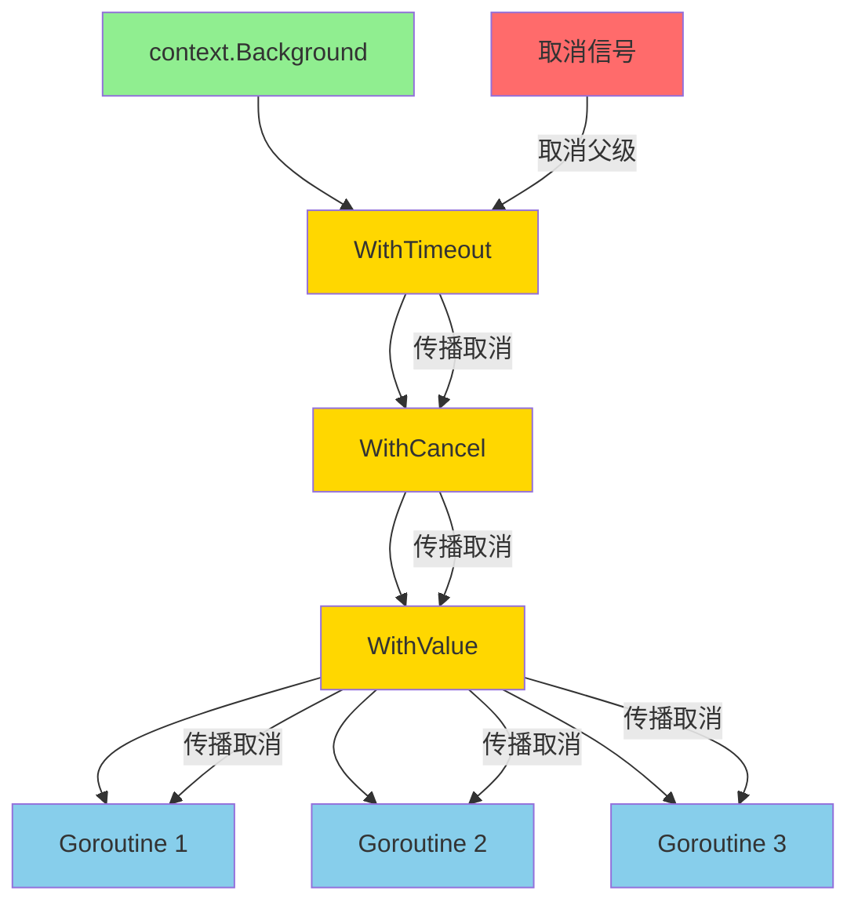
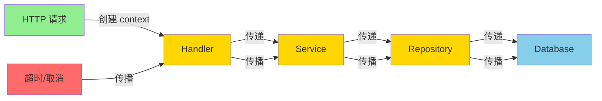

import { Badge } from "@rspress/core/theme";
import { Callout } from "@rspress/core/theme-original";

# context 包接口

<Badge text="标准库" type="info" />
<Badge text="Go 1.7+" type="success" />

`context` 包提供了跨 API 边界的请求范围值、取消信号和超时的支持。它是 Go 语言中处理并发和超时的核心机制。

## context.Context 接口

### 接口定义

```go
type Context interface {
    Deadline() (deadline time.Time, ok bool)
    Done() <-chan struct{}
    Err() error
    Value(key interface{}) interface{}
}
```

`Context` 接口包含四个核心方法，用于管理请求的生命周期和取消信号。

### 接口方法说明

| 方法 | 作用 | 返回值 |
|------|------|--------|
| `Deadline()` | 返回 context 的截止时间 | `(time.Time, bool)` |
| `Done()` | 返回一个只读通道，当 context 被取消时关闭 | `<-chan struct{}` |
| `Err()` | 返回 context 被取消的原因 | `error` |
| `Value(key)` | 根据 key 获取 context 中存储的值 | `interface{}` |

## Deadline() 方法

### 方法签名

```go
Deadline() (deadline time.Time, ok bool)
```

### 说明

`Deadline()` 返回 context 的截止时间：
- 如果设置了截止时间，返回 `(deadline, true)`
- 如果没有设置截止时间，返回 `(time.Time{}, false)`

### 使用示例

```go
package main

import (
    "context"
    "fmt"
    "time"
)

func main() {
    // 创建带截止时间的 context
    ctx, cancel := context.WithTimeout(context.Background(), 2*time.Second)
    defer cancel()

    deadline, ok := ctx.Deadline()
    if ok {
        fmt.Printf("截止时间: %v\n", deadline)
        fmt.Printf("剩余时间: %v\n", time.Until(deadline))
    } else {
        fmt.Println("没有设置截止时间")
    }

    // 没有截止时间的 context
    ctx2 := context.Background()
    _, ok = ctx2.Deadline()
    fmt.Printf("background context 有截止时间: %v\n", ok)
}
```

<Callout type="tip" title="最佳实践">
  <strong>使用 Deadline 的建议</strong>

  • 在长时间运行的操作前检查截止时间<br/>
  • 使用 <code>time.Until(deadline)</code> 计算剩余时间<br/>
  • 不要手动取消有截止时间的 context（使用 defer cancel）
</Callout>

## Done() 方法

### 方法签名

```go
Done() <-chan struct{}
```

### 说明

`Done()` 返回一个只读通道：
- 当 context 被取消或超时时，通道会关闭
- 如果 context 永不会被取消，返回 `nil`
- 常用于 `select` 语句中监听取消信号

### 使用示例

```go
package main

import (
    "context"
    "fmt"
    "time"
)

func worker(ctx context.Context, id int) {
    for {
        select {
        case <-ctx.Done():
            fmt.Printf("Worker %d: 收到取消信号, 原因: %v\n", id, ctx.Err())
            return
        default:
            fmt.Printf("Worker %d: 工作中...\n", id)
            time.Sleep(500 * time.Millisecond)
        }
    }
}

func main() {
    // 3 秒后取消 context
    ctx, cancel := context.WithTimeout(context.Background(), 3*time.Second)
    defer cancel()

    // 启动多个 worker
    for i := 1; i <= 3; i++ {
        go worker(ctx, i)
    }

    // 等待 context 被取消
    <-ctx.Done()
    fmt.Println("主函数: 所有 worker 已停止")

    time.Sleep(100 * time.Millisecond)
}
```

<Callout type="warning" title="重要提示">
  <strong>Done() 通道的使用规则</strong>

  • 通道只读，不应该向其发送数据<br/>
  • 通道关闭后，接收操作会立即返回零值<br/>
  • 如果 context 不会被取消，Done() 返回 nil<br/>
  • 总是检查 ctx.Err() 来获取取消原因
</Callout>

## Err() 方法

### 方法签名

```go
Err() error
```

### 说明

`Err()` 返回 context 被取消的原因：
- 如果 `Done()` 通道未关闭，返回 `nil`
- 如果 `Done()` 通道已关闭，返回非 nil 的错误
- 可能的错误：
  - `context.Canceled`：context 被主动取消
  - `context.DeadlineExceeded`：超过截止时间

### 使用示例

```go
package main

import (
    "context"
    "errors"
    "fmt"
    "time"
)

func operationWithContext(ctx context.Context) error {
    select {
    case <-time.After(5 * time.Second):
        fmt.Println("操作完成")
        return nil
    case <-ctx.Done():
        return fmt.Errorf("操作被取消: %w", ctx.Err())
    }
}

func main() {
    // 测试超时取消
    fmt.Println("--- 测试超时取消 ---")
    ctx1, cancel1 := context.WithTimeout(context.Background(), 1*time.Second)
    defer cancel1()

    err := operationWithContext(ctx1)
    if err != nil {
        if errors.Is(err, context.DeadlineExceeded) {
            fmt.Println("错误: 超时")
        } else if errors.Is(err, context.Canceled) {
            fmt.Println("错误: 被取消")
        }
        fmt.Printf("详细信息: %v\n", err)
    }

    // 测试主动取消
    fmt.Println("\n--- 测试主动取消 ---")
    ctx2, cancel2 := context.WithCancel(context.Background())

    go func() {
        time.Sleep(500 * time.Millisecond)
        cancel2() // 主动取消
    }()

    err = operationWithContext(ctx2)
    if err != nil {
        if errors.Is(err, context.Canceled) {
            fmt.Println("错误: 被主动取消")
        }
        fmt.Printf("详细信息: %v\n", err)
    }
}
```

## Value() 方法

### 方法签名

```go
Value(key interface{}) interface{}
```

### 说明

`Value()` 从 context 中检索值：
- 传入一个 key（通常是自定义类型），返回关联的 value
- 如果 key 不存在，返回 `nil`
- 常用于传递请求范围的数据（如用户 ID、追踪 ID 等）

### 使用示例

```go
package main

import (
    "context"
    "fmt"
)

// 定义 context key 类型（避免冲突）
type contextKey string

const (
    userIDKey    contextKey = "userID"
    requestIDKey contextKey = "requestID"
    authTokenKey contextKey = "authToken"
)

func processRequest(ctx context.Context) {
    // 从 context 获取值
    userID := ctx.Value(userIDKey)
    requestID := ctx.Value(requestIDKey)
    authToken := ctx.Value(authTokenKey)

    fmt.Printf("处理请求:\n")
    fmt.Printf("  用户 ID: %v\n", userID)
    fmt.Printf("  请求 ID: %v\n", requestID)
    fmt.Printf("  认证令牌: %v\n", authToken)
}

func main() {
    // 创建带值的 context
    ctx := context.Background()
    ctx = context.WithValue(ctx, userIDKey, 12345)
    ctx = context.WithValue(ctx, requestIDKey, "req-abc-123")
    ctx = context.WithValue(ctx, authTokenKey, "bearer-token-xyz")

    processRequest(ctx)

    // 尝试获取不存在的值
    value := ctx.Value(contextKey("nonExistent"))
    fmt.Printf("\n不存在的 key: %v\n", value)
}
```

<Callout type="danger" title="警告">
  <strong>context.Value 的使用建议</strong>

  • 不要使用内置类型（如 string、int）作为 key<br/>
  • 定义自定义类型作为 key，避免包之间冲突<br/>
  • 只传递请求范围的数据，不要传递可选参数<br/>
  • context.Value 应该是可选的，不应该影响核心逻辑
</Callout>

## Context 创建函数

### background() 和 todo()

```go
func Background() Context
func TODO() Context
```

- `Background()`：永远不会被取消的根 context，通常用于 main、初始化、测试
- `TODO()`：不确定使用什么 context 时使用，代码审查时应该替换

```go
// 示例
ctx1 := context.Background() // 根 context
ctx2 := context.TODO()       // 占位 context
```

### WithCancel()

```go
func WithCancel(parent Context) (ctx Context, cancel CancelFunc)
```

创建可取消的 context，调用 `cancel()` 会关闭 `Done()` 通道。

```go
package main

import (
    "context"
    "fmt"
    "sync"
    "time"
)

func main() {
    ctx, cancel := context.WithCancel(context.Background())

    var wg sync.WaitGroup
    for i := 1; i <= 5; i++ {
        wg.Add(1)
        go func(id int) {
            defer wg.Done()
            for {
                select {
                case <-ctx.Done():
                    fmt.Printf("Goroutine %d: 停止\n", id)
                    return
                default:
                    fmt.Printf("Goroutine %d: 运行中\n", id)
                    time.Sleep(200 * time.Millisecond)
                }
            }
        }(i)
    }

    // 1 秒后取消所有 goroutine
    time.Sleep(1 * time.Second)
    fmt.Println("主函数: 取消所有 goroutine")
    cancel()

    wg.Wait()
    fmt.Println("主函数: 所有 goroutine 已停止")
}
```

### WithTimeout()

```go
func WithTimeout(parent Context, timeout time.Duration) (Context, CancelFunc)
```

创建带超时的 context，超时后自动取消。

```go
package main

import (
    "context"
    "fmt"
    "time"
)

func slowOperation(ctx context.Context) error {
    // 模拟耗时操作
    select {
    case <-time.After(5 * time.Second):
        return fmt.Errorf("操作完成")
    case <-ctx.Done():
        return ctx.Err()
    }
}

func main() {
    // 设置 2 秒超时
    ctx, cancel := context.WithTimeout(context.Background(), 2*time.Second)
    defer cancel()

    start := time.Now()
    err := slowOperation(ctx)
    elapsed := time.Since(start)

    if err != nil {
        if err == context.DeadlineExceeded {
            fmt.Printf("操作超时（耗时: %v）\n", elapsed)
        } else {
            fmt.Printf("操作失败: %v\n", err)
        }
    } else {
        fmt.Printf("操作成功（耗时: %v）\n", elapsed)
    }
}
```

### WithDeadline()

```go
func WithDeadline(parent Context, deadline time.Time) (Context, CancelFunc)
```

创建带截止时间的 context，到达指定时间后自动取消。

```go
package main

import (
    "context"
    "fmt"
    "time"
)

func main() {
    // 设置截止时间为当前时间 + 3 秒
    deadline := time.Now().Add(3 * time.Second)
    ctx, cancel := context.WithDeadline(context.Background(), deadline)
    defer cancel()

    // 检查截止时间
    if d, ok := ctx.Deadline(); ok {
        fmt.Printf("截止时间: %v\n", d.Format("15:04:05"))
        fmt.Printf("剩余时间: %v\n", time.Until(d))
    }

    // 等待 context 被取消
    select {
    case <-time.After(5 * time.Second):
        fmt.Println("操作完成")
    case <-ctx.Done():
        fmt.Printf("context 被取消: %v\n", ctx.Err())
    }
}
```

### WithValue()

```go
func WithValue(parent Context, key, val interface{}) Context
```

创建存储键值对的 context。

```go
// 定义自定义 key 类型
type userIDKey struct{}
type traceIDKey struct{}

func main() {
    ctx := context.Background()

    // 添加值
    ctx = context.WithValue(ctx, userIDKey{}, 12345)
    ctx = context.WithValue(ctx, traceIDKey{}, "trace-abc-123")

    // 获取值
    userID := ctx.Value(userIDKey{})
    traceID := ctx.Value(traceIDKey{})

    fmt.Printf("User ID: %v\n", userID)
    fmt.Printf("Trace ID: %v\n", traceID)
}
```

## Context 传播示意图



## 使用场景和最佳实践

### 场景 1: HTTP 服务器处理超时

```go
package main

import (
    "context"
    "fmt"
    "net/http"
    "time"
)

func handler(w http.ResponseWriter, r *http.Request) {
    // 从请求创建带超时的 context
    ctx, cancel := context.WithTimeout(r.Context(), 2*time.Second)
    defer cancel()

    // 模拟数据库查询
    result := make(chan string)
    go func() {
        // 模拟慢查询
        time.Sleep(3 * time.Second)
        result <- "查询结果"
    }()

    select {
    case res := <-result:
        fmt.Fprintf(w, "成功: %s", res)
    case <-ctx.Done():
        if ctx.Err() == context.DeadlineExceeded {
            http.Error(w, "请求超时", http.StatusRequestTimeout)
        } else {
            http.Error(w, "请求被取消", http.StatusBadGateway)
        }
    }
}

func main() {
    http.HandleFunc("/", handler)
    fmt.Println("服务器启动在 :8080")
    http.ListenAndServe(":8080", nil)
}
```

### 场景 2: 数据库操作超时

```go
package main

import (
    "context"
    "database/sql"
    "fmt"
    "time"
)

func queryUser(ctx context.Context, db *sql.DB, userID int) error {
    // 设置查询超时
    ctx, cancel := context.WithTimeout(ctx, 5*time.Second)
    defer cancel()

    query := "SELECT id, name, email FROM users WHERE id = ?"
    row := db.QueryRowContext(ctx, query, userID)

    var name, email string
    err := row.Scan(&userID, &name, &email)
    if err != nil {
        if ctx.Err() == context.DeadlineExceeded {
            return fmt.Errorf("查询超时")
        }
        return fmt.Errorf("查询失败: %w", err)
    }

    fmt.Printf("用户: %s <%s>\n", name, email)
    return nil
}

func main() {
    ctx := context.Background()
    db, err := sql.Open("mysql", "user:pass@/dbname")
    if err != nil {
        panic(err)
    }
    defer db.Close()

    err = queryUser(ctx, db, 123)
    if err != nil {
        fmt.Printf("错误: %v\n", err)
    }
}
```

### 场景 3: 微服务链路追踪

```go
package main

import (
    "context"
    "fmt"
    "time"
)

type traceIDKey struct{}

func serviceA(ctx context.Context) context.Context {
    // 生成追踪 ID
    traceID := fmt.Sprintf("trace-%d", time.Now().UnixNano())
    ctx = context.WithValue(ctx, traceIDKey{}, traceID)

    fmt.Printf("[Service A] 开始处理, TraceID: %v\n", ctx.Value(traceIDKey{}))
    return ctx
}

func serviceB(ctx context.Context) {
    traceID := ctx.Value(traceIDKey{})
    fmt.Printf("[Service B] 开始处理, TraceID: %v\n", traceID)

    // 模拟工作
    time.Sleep(100 * time.Millisecond)
}

func serviceC(ctx context.Context) {
    traceID := ctx.Value(traceIDKey{})
    fmt.Printf("[Service C] 开始处理, TraceID: %v\n", traceID)

    // 模拟工作
    time.Sleep(100 * time.Millisecond)
}

func main() {
    ctx := context.Background()

    // Service A 创建追踪 ID
    ctx = serviceA(ctx)

    // Service B 和 C 共享同一个追踪 ID
    go serviceB(ctx)
    go serviceC(ctx)

    time.Sleep(200 * time.Millisecond)
    fmt.Println("所有服务处理完成")
}
```

<Callout type="warning" title="最佳实践">
  <strong>Context 使用规则</strong>

  • 不要把 Context 存储在结构体中<br/>
  • Context 应该作为函数的第一个参数<br/>
  • 不要传递 nil Context，不知道用什么时传 <code>context.TODO()</code><br/>
  • 使用 <code>context.WithValue</code> 传递请求范围的数据<br/>
  • 总是调用 cancel 函数，即使不再需要 context<br/>
  • 不要在相同的函数中多次取消 context
</Callout>

### 场景 4: 批量操作取消

```go
package main

import (
    "context"
    "fmt"
    "sync"
    "time"
)

func processItem(ctx context.Context, item int) error {
    // 检查是否已被取消
    select {
    case <-ctx.Done():
        return ctx.Err()
    default:
    }

    // 模拟处理
    fmt.Printf("处理项目 %d\n", item)
    time.Sleep(200 * time.Millisecond)
    return nil
}

func batchProcess(ctx context.Context, items []int) error {
    ctx, cancel := context.WithCancel(ctx)
    defer cancel()

    var wg sync.WaitGroup
    errCh := make(chan error, len(items))

    for _, item := range items {
        wg.Add(1)
        go func(i int) {
            defer wg.Done()

            if err := processItem(ctx, i); err != nil {
                cancel() // 取消所有 goroutine
                errCh <- err
            }
        }(item)
    }

    // 等待所有 goroutine 完成
    wg.Wait()
    close(errCh)

    // 检查错误
    for err := range errCh {
        if err != nil {
            return err
        }
    }

    return nil
}

func main() {
    ctx, cancel := context.WithTimeout(context.Background(), 500*time.Millisecond)
    defer cancel()

    items := []int{1, 2, 3, 4, 5}
    err := batchProcess(ctx, items)

    if err != nil {
        fmt.Printf("批量处理失败: %v\n", err)
    } else {
        fmt.Println("批量处理成功")
    }
}
```

## Context 传播链



## 常见错误

### 错误 1: 存储 Context

```go
// ❌ 错误：不要将 context 存储在结构体中
type MyStruct struct {
    ctx context.Context // 不要这样做
}

// ✅ 正确：将 context 作为参数传递
func (s *MyStruct) DoSomething(ctx context.Context) error {
    // 使用 ctx
    return nil
}
```

### 错误 2: 传递 nil Context

```go
// ❌ 错误：传递 nil context
func doWork() {
    doSomething(context.Background()) // 应该从调用者传递
}

func doSomething(ctx context.Context) {
    // 使用 ctx
}

// ✅ 正确：从调用者传递 context
func doWork(ctx context.Context) {
    doSomething(ctx)
}
```

### 错误 3: 忘记调用 cancel

```go
// ❌ 错误：忘记调用 cancel
func badFunction() {
    ctx, _ := context.WithTimeout(context.Background(), 5*time.Second)
    // 忘记调用 cancel，可能导致资源泄漏
    doSomething(ctx)
}

// ✅ 正确：总是调用 cancel
func goodFunction() {
    ctx, cancel := context.WithTimeout(context.Background(), 5*time.Second)
    defer cancel() // 确保资源被释放
    doSomething(ctx)
}
```

### 错误 4: 使用内置类型作为 key

```go
// ❌ 错误：使用 string 作为 key
ctx := context.WithValue(ctx, "userID", 12345)

// ✅ 正确：定义自定义类型
type contextKey string
const userIDKey contextKey = "userID"
ctx := context.WithValue(ctx, userIDKey, 12345)
```

## 练习

### 练习 1: 实现带超时的文件下载

创建一个函数，使用 context 实现带超时的文件下载功能。

<details>
<summary>查看答案</summary>

```go
package main

import (
    "context"
    "fmt"
    "io"
    "net/http"
    "time"
)

func downloadFile(ctx context.Context, url string) ([]byte, error) {
    // 创建带超时的 context
    ctx, cancel := context.WithTimeout(ctx, 10*time.Second)
    defer cancel()

    // 创建请求
    req, err := http.NewRequestWithContext(ctx, "GET", url, nil)
    if err != nil {
        return nil, fmt.Errorf("创建请求失败: %w", err)
    }

    // 发送请求
    client := &http.Client{}
    resp, err := client.Do(req)
    if err != nil {
        if ctx.Err() == context.DeadlineExceeded {
            return nil, fmt.Errorf("下载超时")
        }
        return nil, fmt.Errorf("请求失败: %w", err)
    }
    defer resp.Body.Close()

    // 读取响应
    data, err := io.ReadAll(resp.Body)
    if err != nil {
        return nil, fmt.Errorf("读取响应失败: %w", err)
    }

    return data, nil
}

func main() {
    ctx := context.Background()

    // 测试下载
    data, err := downloadFile(ctx, "https://example.com")
    if err != nil {
        fmt.Printf("下载失败: %v\n", err)
        return
    }

    fmt.Printf("下载成功，大小: %d 字节\n", len(data))
}
```

</details>

### 练习 2: 实现可取消的任务队列

创建一个任务队列，支持通过 context 取消所有等待的任务。

<details>
<summary>查看答案</summary>

```go
package main

import (
    "context"
    "fmt"
    "sync"
    "time"
)

type Task struct {
    ID   int
    Name string
}

type TaskQueue struct {
    tasks chan Task
    wg    sync.WaitGroup
    ctx   context.Context
    cancel context.CancelFunc
}

func NewTaskQueue(size int) *TaskQueue {
    ctx, cancel := context.WithCancel(context.Background())
    return &TaskQueue{
        tasks:  make(chan Task, size),
        ctx:    ctx,
        cancel: cancel,
    }
}

func (tq *TaskQueue) Start(workers int) {
    for i := 0; i < workers; i++ {
        tq.wg.Add(1)
        go tq.worker(i)
    }
}

func (tq *TaskQueue) worker(id int) {
    defer tq.wg.Done()

    for {
        select {
        case <-tq.ctx.Done():
            fmt.Printf("Worker %d: 收到停止信号\n", id)
            return
        case task, ok := <-tq.tasks:
            if !ok {
                return
            }
            fmt.Printf("Worker %d: 处理任务 %d - %s\n", id, task.ID, task.Name)
            time.Sleep(500 * time.Millisecond)
        }
    }
}

func (tq *TaskQueue) Add(task Task) {
    select {
    case tq.tasks <- task:
        fmt.Printf("任务 %d 已添加\n", task.ID)
    case <-tq.ctx.Done():
        fmt.Printf("任务队列已关闭，无法添加任务 %d\n", task.ID)
    }
}

func (tq *TaskQueue) Stop() {
    tq.cancel()
    close(tq.tasks)
    tq.wg.Wait()
    fmt.Println("任务队列已停止")
}

func main() {
    queue := NewTaskQueue(10)
    queue.Start(3)

    // 添加任务
    for i := 1; i <= 10; i++ {
        queue.Add(Task{ID: i, Name: fmt.Sprintf("任务-%d", i)})
    }

    // 等待一会儿
    time.Sleep(2 * time.Second)

    // 停止队列
    queue.Stop()
}
```

</details>

### 练习 3: 实现请求追踪中间件

创建一个 HTTP 中间件，为每个请求生成唯一的追踪 ID，并传播到所有子调用。

<details>
<summary>查看答案</summary>

```go
package main

import (
    "context"
    "fmt"
    "net/http"
    "time"
)

type traceIDKey struct{}

// 生成唯一追踪 ID
func generateTraceID() string {
    return fmt.Sprintf("trace-%d", time.Now().UnixNano())
}

// 追踪中间件
func tracingMiddleware(next http.HandlerFunc) http.HandlerFunc {
    return func(w http.ResponseWriter, r *http.Request) {
        // 从请求头获取追踪 ID，如果没有则生成新的
        traceID := r.Header.Get("X-Trace-ID")
        if traceID == "" {
            traceID = generateTraceID()
        }

        // 将追踪 ID 存储到 context
        ctx := context.WithValue(r.Context(), traceIDKey{}, traceID)

        // 将响应头设置追踪 ID
        w.Header().Set("X-Trace-ID", traceID)

        // 调用下一个处理器
        next.ServeHTTP(w, r.WithContext(ctx))
    }
}

func handler(w http.ResponseWriter, r *http.Request) {
    // 从 context 获取追踪 ID
    traceID := r.Context().Value(traceIDKey{})
    fmt.Printf("处理请求, TraceID: %v\n", traceID)

    // 调用子函数
    processRequest(r.Context())
}

func processRequest(ctx context.Context) {
    traceID := ctx.Value(traceIDKey{})
    fmt.Printf("处理子请求, TraceID: %v\n", traceID)
}

func main() {
    // 使用中间件包装处理器
    http.HandleFunc("/", tracingMiddleware(handler))

    fmt.Println("服务器启动在 :8080")
    http.ListenAndServe(":8080", nil)
}
```

</details>

## 总结

### 关键要点

<Badge text="核心方法" type="success" />

- `Deadline()` - 获取截止时间
- `Done()` - 监听取消信号
- `Err()` - 获取取消原因
- `Value()` - 传递请求范围的数据

<Badge text="创建函数" type="info" />

- `Background()` - 根 context
- `TODO()` - 占位 context
- `WithCancel()` - 可取消 context
- `WithTimeout()` - 带超时 context
- `WithDeadline()` - 带截止时间 context
- `WithValue()` - 带键值对 context

<Badge text="最佳实践" type="warning" />

1. **Context 作为第一个参数传递**
2. **不要存储在结构体中**
3. **总是调用 cancel 函数**
4. **使用自定义类型作为 key**
5. **设置合理的超时时间**
6. **传播 context 到所有子调用**

### Context 使用决策图

```
需要控制操作生命周期?
  │
  ├─ 需要超时?
  │   └─ 是 → WithTimeout / WithDeadline
  │
  ├─ 需要手动取消?
  │   └─ 是 → WithCancel
  │
  └─ 只传递数据?
      └─ 是 → WithValue
```

### 进一步学习

- [Go Context 官方文档](https://golang.org/pkg/context/)
- [Go Blog: Context](https://blog.golang.org/context)
- [Context 最佳实践](https://go.dev/blog/context)

---

[← sort 接口](./sort.mdx) | [继续：GORM 接口 →](./gorm.mdx)
