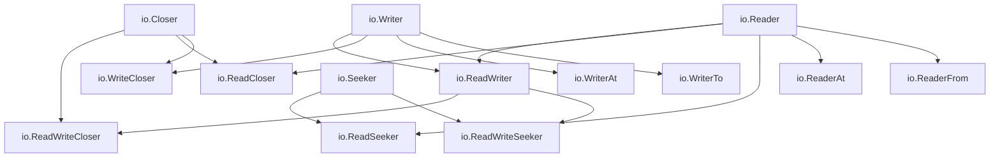

import { Badge } from "@rspress/core/theme";
import { Callout } from "@rspress/core/theme-original";

# io 包接口 - io Package Interfaces

[← 返回标准库接口](./)

Go 的 `io` 包提供了基础的 I/O 原语接口，是整个 Go I/O 系统的核心。

## <Badge text="io.Reader" type="tip" />

### 接口定义

```go
type Reader interface {
    Read(p []byte) (n int, err error)
}
```

<Badge text="核心" type="danger" /> `io.Reader` 是 Go 中最重要的接口之一，用于从数据源读取数据。

### Read 方法说明

- **参数** `p []byte` - 接收数据的缓冲区
- **返回** `n int` - 实际读取的字节数
- **返回** `err error` - 错误信息

<Callout type="warning" title={<Badge text="重要规则" type="danger" />}>
  <strong>Read 方法的行为契约</strong>

  • 即使没有读取到字节，返回 `n = 0` 也是合法的<br/>
  • 当 `n < len(p)` 时，本次读取可能返回 `err == nil` 或 `err == io.EOF`<br/>
  • 当读取到流末尾时，应该返回 `err == io.EOF`<br/>
  • 调用者应该在每次读取后检查错误<br/>
  • 即使返回 `io.EOF`，`n` 可能仍然大于 0
</Callout>

### 实现示例

```go
package main

import (
    "fmt"
    "io"
    "strings"
)

// StringReader 字符串读取器
type StringReader struct {
    data string
    pos  int
}

// Read 实现 io.Reader 接口
func (sr *StringReader) Read(p []byte) (n int, err error) {
    if sr.pos >= len(sr.data) {
        return 0, io.EOF
    }

    // 计算可读取的字节数
    n = copy(p, sr.data[sr.pos:])
    sr.pos += n

    return n, nil
}

// 编译时检查
var _ io.Reader = &StringReader{}

func main() {
    reader := &StringReader{data: "Hello, World!"}
    buf := make([]byte, 5)

    for {
        n, err := reader.Read(buf)
        if err == io.EOF {
            fmt.Printf("读取完成: %q\n", string(buf[:n]))
            break
        }
        if err != nil {
            fmt.Printf("读取错误: %v\n", err)
            break
        }
        fmt.Printf("读取 %d 字节: %q\n", n, string(buf[:n]))
    }
}
```

### 使用场景

```go
// 场景 1: 使用 strings.Reader
reader := strings.NewReader("Go 语言接口")

buf := make([]byte, 8)
n, err := reader.Read(buf)
fmt.Printf("读取 %d 字节: %s\n", n, buf[:n])

// 场景 2: 使用 bytes.Buffer
var buffer bytes.Buffer
buffer.Write("Hello")
buffer.Write(" ")

n, err = buffer.Read(buf)
fmt.Printf("从 buffer 读取: %s\n", buf[:n])

// 场景 3: 使用 os.File
file, err := os.Open("example.txt")
if err != nil {
    log.Fatal(err)
}
defer file.Close()

// 每次读取最多 1024 字节
buf = make([]byte, 1024)
for {
    n, err := file.Read(buf)
    if err == io.EOF {
        break
    }
    if err != nil {
        log.Fatal(err)
    }
    fmt.Printf("从文件读取 %d 字节\n", n)
}
```

### 常见错误

<Badge text="注意" type="warning" /> 常见的 `io.Reader` 使用错误：

```go
// ✗ 错误: 假设 Read 总是填满缓冲区
buf := make([]byte, 1024)
n, _ := reader.Read(buf)
processAllData(buf)  // 错误！应该使用 buf[:n]

// ✓ 正确: 只处理实际读取的字节
buf := make([]byte, 1024)
n, _ := reader.Read(buf)
processData(buf[:n])  // 正确

// ✗ 错误: 忽略 io.EOF 的部分读取
for {
    n, err := reader.Read(buf)
    if err == io.EOF {
        break  // 可能丢失 n 字节的数据！
    }
    process(buf[:n])
}

// ✓ 正确: 先处理数据，再检查 EOF
for {
    n, err := reader.Read(buf)
    if n > 0 {
        process(buf[:n])
    }
    if err == io.EOF {
        break
    }
    if err != nil {
        return err
    }
}
```

## <Badge text="io.Writer" type="tip" />

### 接口定义

```go
type Writer interface {
    Write(p []byte) (n int, err error)
}
```

### Write 方法说明

- **参数** `p []byte` - 要写入的数据
- **返回** `n int` - 实际写入的字节数
- **返回** `err error` - 错误信息

<Callout type="tip" title="Writer 行为规则">
  <strong>Write 方法必须遵守的契约</strong>

  • `n` 必须等于 `len(p)`，即使只写入了部分数据也要返回错误<br/>
  • 如果 `n < len(p)`，必须返回非 nil 的错误<br/>
  • 即使写入失败，也可能修改底层数据源<br/>
  • 不允许修改传入的 `p []byte` 切片
</Callout>

### 实现示例

```go
package main

import (
    "fmt"
    "io"
    "os"
)

// UpperWriter 将所有数据转换为大写后写入
type UpperWriter struct {
    writer io.Writer
}

// NewUpperWriter 创建大写写入器
func NewUpperWriter(w io.Writer) *UpperWriter {
    return &UpperWriter{writer: w}
}

// Write 实现 io.Writer 接口
func (uw *UpperWriter) Write(p []byte) (n int, err error) {
    // 转换为大写
    upper := make([]byte, len(p))
    for i, b := range p {
        if b >= 'a' && b <= 'z' {
            upper[i] = b - 32
        } else {
            upper[i] = b
        }
    }

    // 委托给底层 Writer
    return uw.writer.Write(upper)
}

// 编译时检查
var _ io.Writer = &UpperWriter{}

func main() {
    upper := NewUpperWriter(os.Stdout)

    n, err := upper.Write([]byte("Hello, Go!\n"))
    if err != nil {
        fmt.Printf("写入错误: %v\n", err)
        return
    }
    fmt.Printf("写入 %d 字节\n", n)
}
```

### 使用场景

```go
// 场景 1: 写入文件
file, err := os.Create("output.txt")
if err != nil {
    log.Fatal(err)
}
defer file.Close()

n, err := file.Write([]byte("Hello, File!\n"))
fmt.Printf("写入 %d 字节到文件\n", n)

// 场景 2: 使用 bytes.Buffer
var buffer bytes.Buffer
buffer.WriteString("Line 1\n")
buffer.WriteString("Line 2\n")
fmt.Println(buffer.String())

// 场景 3: 使用 io.Copy 结合 Writer
file, _ := os.Create("copy.txt")
defer file.Close()

reader := strings.NewReader("复制这段内容")
written, err := io.Copy(file, reader)
fmt.Printf("复制了 %d 字节\n", written)
```

## <Badge text="io.Closer" type="info" />

### 接口定义

```go
type Closer interface {
    Close() error
}
```

### Close 方法说明

`Close` 方法用于释放资源，如文件句柄、网络连接等。

<Callout type="warning" title={<Badge text="最佳实践" type="danger" />}>
  <strong>Close 方法的使用建议</strong>

  • 总是使用 <code>defer</code> 调用 Close，确保资源被释放<br/>
  • 检查 Close 返回的错误（例如写入缓冲区时的错误）<br/>
  • Close 应该是幂等的：多次调用不应该产生错误<br/>
  • 对于网络连接，Close 可能会发送 FIN 包
</Callout>

### 实现示例

```go
package main

import (
    "fmt"
    "io"
    "os"
)

// SafeFile 带有状态检查的文件封装
type SafeFile struct {
    *os.File
    closed bool
}

// Close 安全地关闭文件
func (sf *SafeFile) Close() error {
    if sf.closed {
        return nil  // 幂等性：多次调用不会出错
    }

    sf.closed = true
    return sf.File.Close()
}

// 编译时检查
var _ io.Closer = &SafeFile{}

func main() {
    file, err := os.Create("test.txt")
    if err != nil {
        fmt.Printf("创建文件失败: %v\n", err)
        return
    }

    safeFile := &SafeFile{File: file}
    defer safeFile.Close()  // 使用 defer 确保关闭

    safeFile.Write([]byte("Hello, Safe Close!"))

    // 再次关闭不会出错
    err = safeFile.Close()
    fmt.Printf("第二次关闭: %v\n", err)
}
```

## <Badge text="io.Seeker" type="info" />

### 接口定义

```go
type Seeker interface {
    Seek(offset int64, whence int) (int64, error)
}
```

### Seek 方法说明

- **参数** `offset int64` - 偏移量
- **参数** `whence int` - 参考位置
  - `io.SeekStart` - 相对于文件开始
  - `io.SeekCurrent` - 相对于当前位置
  - `io.SeekEnd` - 相对于文件末尾
- **返回** 新位置的偏移量

### 实现示例

```go
package main

import (
    "fmt"
    "io"
    "strings"
)

// MemSeeker 可定位的内存读取器
type MemSeeker struct {
    data []byte
    pos  int64
}

// NewMemSeeker 创建内存定位器
func NewMemSeeker(data string) *MemSeeker {
    return &MemSeeker{
        data: []byte(data),
        pos:  0,
    }
}

// Read 实现 io.Reader
func (ms *MemSeeker) Read(p []byte) (n int, err error) {
    if ms.pos >= int64(len(ms.data)) {
        return 0, io.EOF
    }

    n = copy(p, ms.data[ms.pos:])
    ms.pos += int64(n)
    return n, nil
}

// Seek 实现 io.Seeker
func (ms *MemSeeker) Seek(offset int64, whence int) (int64, error) {
    var newPos int64

    switch whence {
    case io.SeekStart:
        newPos = offset
    case io.SeekCurrent:
        newPos = ms.pos + offset
    case io.SeekEnd:
        newPos = int64(len(ms.data)) + offset
    default:
        return 0, fmt.Errorf("无效的 whence 值: %d", whence)
    }

    if newPos < 0 {
        return 0, fmt.Errorf("负位置不允许")
    }

    ms.pos = newPos
    return newPos, nil
}

// 编译时检查
var _ io.ReadSeeker = &MemSeeker{}

func main() {
    seeker := NewMemSeeker("Hello, World!")

    // 读取前 5 个字节
    buf := make([]byte, 5)
    seeker.Read(buf)
    fmt.Printf("读取: %s\n", buf)

    // 定位到开始位置
    seeker.Seek(0, io.SeekStart)
    seeker.Read(buf)
    fmt.Printf("再次读取: %s\n", buf)

    // 定位到末尾前 6 字节
    pos, _ := seeker.Seek(-6, io.SeekEnd)
    fmt.Printf("新位置: %d\n", pos)

    seeker.Read(buf)
    fmt.Printf("读取: %s\n", buf)
}
```

## <Badge text="组合接口" type="warning" />

### 接口组合关系



### io.ReadWriter

```go
type ReadWriter interface {
    Reader
    Writer
}
```

可读可写的接口，组合了 `Reader` 和 `Writer`。

```go
package main

import (
    "fmt"
    "io"
)

// Buffer 实现了 ReadWriter
type Buffer struct {
    data []byte
    pos  int
}

func (b *Buffer) Read(p []byte) (n int, err error) {
    if b.pos >= len(b.data) {
        return 0, io.EOF
    }
    n = copy(p, b.data[b.pos:])
    b.pos += n
    return n, nil
}

func (b *Buffer) Write(p []byte) (n int, err error) {
    b.data = append(b.data, p...)
    n = len(p)
    return n, nil
}

var _ io.ReadWriter = &Buffer{}

func main() {
    buf := &Buffer{}

    // 写入数据
    n, _ := buf.Write([]byte("Hello"))
    fmt.Printf("写入 %d 字节\n", n)

    // 读取数据
    readBuf := make([]byte, 10)
    n, _ = buf.Read(readBuf)
    fmt.Printf("读取 %d 字节: %s\n", n, readBuf[:n])
}
```

### io.ReadWriteCloser

```go
type ReadWriteCloser interface {
    Reader
    Writer
    Closer
}
```

可读可写可关闭的接口，常用于网络连接和文件。

```go
package main

import (
    "fmt"
    "io"
    "net"
)

func handleConnection(conn net.Conn) {
    defer conn.Close()  // ReadWriteCloser 的 Close 方法

    buf := make([]byte, 1024)

    for {
        // 读取数据
        n, err := conn.Read(buf)
        if err != nil {
            if err == io.EOF {
                fmt.Println("连接关闭")
            }
            return
        }

        // 写回数据
        conn.Write(buf[:n])
    }
}

var _ io.ReadWriteCloser = &net.TCPConn{}  // 示例类型检查
```

### io.ReadCloser / io.WriteCloser

```go
type ReadCloser interface {
    Reader
    Closer
}

type WriteCloser interface {
    Writer
    Closer
}
```

<Badge text="常用" type="success" /> `io.ReadCloser` 是 HTTP 响应体常用的接口。

```go
package main

import (
    "fmt"
    "io"
    "net/http"
)

func fetchURL(url string) error {
    resp, err := http.Get(url)
    if err != nil {
        return err
    }
    defer resp.Body.Close()  // io.ReadCloser 的 Close 方法

    // resp.Body 实现了 io.ReadCloser
    body, err := io.ReadAll(resp.Body)
    if err != nil {
        return err
    }

    fmt.Printf("读取 %d 字节\n", len(body))
    return nil
}

var _ io.ReadCloser = &http.Response{}.Body  // 类型检查
```

## <Badge text="io.ReaderAt / io.WriterAt" type="info" />

### 接口定义

```go
type ReaderAt interface {
    ReadAt(p []byte, off int64) (n int, err error)
}

type WriterAt interface {
    WriteAt(p []byte, off int64) (n int, err error)
}
```

### 说明

<Badge text="特点" type="tip" /> 这些接口允许在指定位置读写，适合并发操作。

<Callout type="info" title="与 Read/Write 的区别">
  <strong>ReaderAt/WriterAt 的特性</strong>

  • <code>ReadAt</code> 和 <code>WriteAt</code> 的位置是绝对的，不受当前位置影响<br/>
  • 适合并发安全的随机访问<br/>
  • 不会改变内部的读取位置（因为没有内部位置概念）<br/>
  • 如果读取超出数据末尾，返回 <code>io.EOF</code>
</Callout>

### 实现示例

```go
package main

import (
    "fmt"
    "io"
    "sync"
)

// ConcurrentFile 支持并发读写的文件
type ConcurrentFile struct {
    data []byte
    mu   sync.RWMutex
}

// NewConcurrentFile 创建并发文件
func NewConcurrentFile(initialData string) *ConcurrentFile {
    return &ConcurrentFile{
        data: []byte(initialData),
    }
}

// ReadAt 在指定位置读取
func (cf *ConcurrentFile) ReadAt(p []byte, off int64) (n int, err error) {
    cf.mu.RLock()
    defer cf.mu.RUnlock()

    if off >= int64(len(cf.data)) {
        return 0, io.EOF
    }

    n = copy(p, cf.data[off:])
    if off+int64(n) >= int64(len(cf.data)) {
        err = io.EOF
    }

    return n, err
}

// WriteAt 在指定位置写入
func (cf *ConcurrentFile) WriteAt(p []byte, off int64) (n int, err error) {
    cf.mu.Lock()
    defer cf.mu.Unlock()

    // 扩展数据长度
    needed := int(off) + len(p)
    if needed > len(cf.data) {
        newData := make([]byte, needed)
        copy(newData, cf.data)
        cf.data = newData
    }

    n = copy(cf.data[off:], p)
    return n, nil
}

// 编译时检查
var _ io.ReaderAt = &ConcurrentFile{}
var _ io.WriterAt = &ConcurrentFile{}

func main() {
    cf := NewConcurrentFile("Hello, World!")

    // 并发读取
    var wg sync.WaitGroup
    wg.Add(2)

    go func() {
        defer wg.Done()
        buf := make([]byte, 5)
        n, _ := cf.ReadAt(buf, 0)
        fmt.Printf("协程1 读取: %s\n", buf[:n])
    }()

    go func() {
        defer wg.Done()
        buf := make([]byte, 6)
        n, _ := cf.ReadAt(buf, 7)
        fmt.Printf("协程2 读取: %s\n", buf[:n])
    }()

    wg.Wait()

    // 并发写入
    cf.WriteAt([]byte("Go"), 7)
    cf.WriteAt([]byte("Programming"), 10)

    result := make([]byte, 100)
    n, _ := cf.ReadAt(result, 0)
    fmt.Printf("最终结果: %s\n", string(result[:n]))
}
```

## <Badge text="io.ReaderFrom / io.WriterTo" type="info" />

### 接口定义

```go
type ReaderFrom interface {
    ReadFrom(r Reader) (n int64, err error)
}

type WriterTo interface {
    WriteTo(w Writer) (n int64, err error)
}
```

### 说明

<Badge text="优化" type="success" /> 这些接口用于优化数据传输，避免不必要的缓冲。

<Callout type="tip" title="性能优化">
  <strong>何时实现 ReaderFrom/WriterTo</strong>

  • 如果知道数据源/目标类型，可以直接传输而不经过中间缓冲<br/>
  • 例如 <code>os.File</code> 实现 <code>WriteTo</code> 可以使用 <code>sendfile</code> 系统调用<br/>
  • <code>io.Copy</code> 会优先使用这些接口（如果实现了的话）
</Callout>

### 实现示例

```go
package main

import (
    "fmt"
    "io"
)

// FixedData 固定数据源，实现了 WriterTo
type FixedData struct {
    data string
}

// WriteTo 直接写入，避免中间缓冲
func (fd *FixedData) WriteTo(w io.Writer) (n int64, err error) {
    // 可以使用优化的写入方法
    written, err := w.Write([]byte(fd.data))
    return int64(written), err
}

// 编译时检查
var _ io.WriterTo = &FixedData{}

// Accumulator 累积器，实现了 ReaderFrom
type Accumulator struct {
    buffer []byte
}

// ReadFrom 直接读取到内部缓冲
func (a *Accumulator) ReadFrom(r io.Reader) (n int64, err error) {
    // 使用较大的缓冲区提高效率
    buf := make([]byte, 32*1024)  // 32KB
    var total int64

    for {
        read, err := r.Read(buf)
        if read > 0 {
            a.buffer = append(a.buffer, buf[:read]...)
            total += int64(read)
        }
        if err != nil {
            if err == io.EOF {
                return total, nil
            }
            return total, err
        }
    }
}

// 编译时检查
var _ io.ReaderFrom = &Accumulator{}

func main() {
    // 使用 WriterTo
    data := &FixedData{data: "Hello from WriterTo!"}

    var result bytes.Buffer
    n, err := io.Copy(&result, data)
    fmt.Printf("使用 WriterTo 传输 %d 字节: %s\n", n, result.String())

    // 使用 ReaderFrom
    acc := &Accumulator{}
    reader := strings.NewReader("Hello from ReaderFrom!")

    n, err = io.Copy(acc, reader)
    fmt.Printf("使用 ReaderFrom 接收 %d 字节: %s\n", n, string(acc.buffer))
}
```

### io.Copy 优化机制

```go
// io.Copy 的简化实现逻辑
func Copy(dst Writer, src Reader) (written int64, err error) {
    // 1. 检查是否实现了 WriterTo
    if wt, ok := src.(WriterTo); ok {
        return wt.WriteTo(dst)
    }

    // 2. 检查是否实现了 ReaderFrom
    if rf, ok := dst.(ReaderFrom); ok {
        return rf.ReadFrom(src)
    }

    // 3. 否则使用默认的缓冲复制
    buf := make([]byte, 32*1024)
    // ... 标准复制逻辑
}
```

## <Badge text="常用工具函数" type="success" />

### io.Copy

```go
func Copy(dst Writer, src Reader) (written int64, err error)
```

从 src 复制数据到 dst，直到 EOF 或错误发生。

```go
file, _ := os.Create("copy.txt")
defer file.Close()

reader := strings.NewReader("复制这段内容")
written, err := io.Copy(file, reader)
fmt.Printf("复制了 %d 字节\n", written)
```

### io.CopyN

```go
func CopyN(dst Writer, src Reader, n int64) (written int64, err error)
```

只复制指定字节数。

```go
reader := strings.NewReader("0123456789")
var buf bytes.Buffer

io.CopyN(&buf, reader, 5)  // 只复制 5 字节
fmt.Println(buf.String())  // 输出: 01234
```

### io.LimitReader

```go
func LimitReader(r Reader, n int64) Reader
```

创建一个最多读取 n 字节的 Reader。

```go
reader := strings.NewReader("0123456789")
limited := io.LimitReader(reader, 5)

buf := make([]byte, 10)
limited.Read(buf)
fmt.Println(string(buf))  // 输出: 01234
```

### io.MultiReader / io.MultiWriter

```go
func MultiReader(readers ...Reader) Reader
func MultiWriter(writers ...Writer) Writer
```

组合多个 Reader 或 Writer。

```go
// MultiReader
r1 := strings.NewReader("Hello, ")
r2 := strings.NewReader("World!")
multi := io.MultiReader(r1, r2)

buf := make([]byte, 20)
multi.Read(buf)
fmt.Println(string(buf))  // 输出: Hello, World!

// MultiWriter
var buf1, buf2 bytes.Buffer
multi := io.MultiWriter(&buf1, &buf2)

multi.Write([]byte("Hello"))
fmt.Println(buf1.String())  // 输出: Hello
fmt.Println(buf2.String())  // 输出: Hello
```

### io.ReadAll

```go
func ReadAll(r Reader) ([]byte, error)
```

读取所有数据直到 EOF。

```go
reader := strings.NewReader("Hello, World!")
data, err := io.ReadAll(reader)
if err != nil {
    log.Fatal(err)
}
fmt.Printf("读取: %s\n", data)
```

## <Badge text="常见错误模式" type="danger" />

### 错误 1: 忽略部分读取

```go
// ✗ 错误
buf := make([]byte, 1024)
n, _ := reader.Read(buf)
process(buf)  // 应该用 buf[:n]

// ✓ 正确
buf := make([]byte, 1024)
n, _ := reader.Read(buf)
process(buf[:n])
```

### 错误 2: 不检查 EOF

```go
// ✗ 错误
for {
    n, err := reader.Read(buf)
    if err != nil {
        break  // 可能丢失最后的 n 字节
    }
    process(buf[:n])
}

// ✓ 正确
for {
    n, err := reader.Read(buf)
    if n > 0 {
        process(buf[:n])
    }
    if err == io.EOF {
        break
    }
    if err != nil {
        return err
    }
}
```

### 错误 3: 不关闭资源

```go
// ✗ 错误
file, _ := os.Open("data.txt")
io.Copy(os.Stdout, file)
// 忘记关闭文件

// ✓ 正确
file, _ := os.Open("data.txt")
defer file.Close()
io.Copy(os.Stdout, file)
```

## 练习

### 练习 1: 实现单词计数 Reader

创建一个 `WordCounterReader`，包装 `io.Reader`，统计读取的单词数量。

<details>
<summary>查看答案</summary>

```go
package main

import (
    "bufio"
    "fmt"
    "io"
    "strings"
)

// WordCounterReader 单词计数读取器
type WordCounterReader struct {
    reader io.Reader
    words  int
}

// NewWordCounterReader 创建单词计数器
func NewWordCounterReader(r io.Reader) *WordCounterReader {
    return &WordCounterReader{reader: r}
}

// Read 实现 io.Reader
func (wc *WordCounterReader) Read(p []byte) (n int, err error) {
    n, err = wc.reader.Read(p)

    // 统计单词数
    if n > 0 {
        scanner := bufio.NewScanner(strings.NewReader(string(p[:n])))
        scanner.Split(bufio.ScanWords)
        for scanner.Scan() {
            wc.words++
        }
    }

    return n, err
}

// Words 返回单词计数
func (wc *WordCounterReader) Words() int {
    return wc.words
}

var _ io.Reader = &WordCounterReader{}

func main() {
    text := "Hello World Go Programming"
    reader := strings.NewReader(text)

    counter := NewWordCounterReader(reader)

    buf := make([]byte, 1024)
    counter.Read(buf)

    fmt.Printf("单词数: %d\n", counter.Words())  // 输出: 4
}
```

**解释**：展示了如何包装 `io.Reader` 添加额外功能。
</details>

### 练习 2: 实现进度追踪 Writer

创建一个 `ProgressWriter`，在写入时报告进度。

<details>
<summary>查看答案</summary>

```go
package main

import (
    "fmt"
    "io"
)

// ProgressWriter 进度追踪写入器
type ProgressWriter struct {
    writer  io.Writer
    total   int64
    written int64
}

// NewProgressWriter 创建进度写入器
func NewProgressWriter(w io.Writer, total int64) *ProgressWriter {
    return &ProgressWriter{
        writer: w,
        total:  total,
    }
}

// Write 实现 io.Writer
func (pw *ProgressWriter) Write(p []byte) (n int, err error) {
    n, err = pw.writer.Write(p)
    pw.written += int64(n)

    // 报告进度
    percent := float64(pw.written) / float64(pw.total) * 100
    fmt.Printf("\r进度: %.1f%% (%d/%d bytes)", percent, pw.written, pw.total)

    return n, err
}

// Progress 返回进度百分比
func (pw *ProgressWriter) Progress() float64 {
    return float64(pw.written) / float64(pw.total) * 100
}

var _ io.Writer = &ProgressWriter{}

func main() {
    data := make([]byte, 1024*1024)  // 1MB 数据
    var output bytes.Buffer

    progress := NewProgressWriter(&output, int64(len(data)))

    // 分块写入以观察进度
    chunk := 1024 * 100  // 每次写入 100KB
    for i := 0; i < len(data); i += chunk {
        end := i + chunk
        if end > len(data) {
            end = len(data)
        }
        progress.Write(data[i:end])
    }

    fmt.Printf("\n完成! 总计: %d 字节\n", progress.written)
}
```

**解释**：展示了如何包装 `io.Writer` 添加进度追踪功能。
</details>

### 练习 3: 实现带缓冲的 ReaderAt

创建一个 `BufferedFileAt`，使用内部缓冲区优化小的随机读取。

<details>
<summary>查看答案</summary>

```go
package main

import (
    "fmt"
    "io"
    "sync"
)

// BufferedFileAt 带缓冲的随机访问文件
type BufferedFileAt struct {
    data     []byte
    mu       sync.Mutex
    cache    map[int64][]byte  // 位置缓存
    cacheHit int
    cacheMiss int
}

// NewBufferedFileAt 创建缓冲文件
func NewBufferedFileAt(data string) *BufferedFileAt {
    return &BufferedFileAt{
        data:  []byte(data),
        cache: make(map[int64][]byte),
    }
}

// ReadAt 实现 io.ReaderAt
func (bf *BufferedFileAt) ReadAt(p []byte, off int64) (n int, err error) {
    bf.mu.Lock()
    defer bf.mu.Unlock()

    // 检查缓存
    if cached, ok := bf.cache[off]; ok && len(cached) >= len(p) {
        bf.cacheHit++
        n = copy(p, cached)
        return n, nil
    }

    bf.cacheMiss++

    // 从数据源读取
    if off >= int64(len(bf.data)) {
        return 0, io.EOF
    }

    n = copy(p, bf.data[off:])

    // 缓存这次读取的结果
    cacheData := make([]byte, n)
    copy(cacheData, p[:n])
    bf.cache[off] = cacheData

    if off+int64(n) >= int64(len(bf.data)) {
        err = io.EOF
    }

    return n, err
}

// WriteAt 实现 io.WriterAt
func (bf *BufferedFileAt) WriteAt(p []byte, off int64) (n int, err error) {
    bf.mu.Lock()
    defer bf.mu.Unlock()

    // 清除受影响的缓存
    for key := range bf.cache {
        if key >= off && key < off+int64(len(p)) {
            delete(bf.cache, key)
        }
    }

    // 扩展数据
    needed := int(off) + len(p)
    if needed > len(bf.data) {
        newData := make([]byte, needed)
        copy(newData, bf.data)
        bf.data = newData
    }

    n = copy(bf.data[off:], p)
    return n, nil
}

// CacheStats 返回缓存统计
func (bf *BufferedFileAt) CacheStats() (hits, misses int) {
    return bf.cacheHit, bf.cacheMiss
}

var _ io.ReaderAt = &BufferedFileAt{}
var _ io.WriterAt = &BufferedFileAt{}

func main() {
    bf := NewBufferedFileAt("Hello, World! This is a test.")

    // 多次读取同一位置
    buf := make([]byte, 5)

    bf.ReadAt(buf, 0)   // 缓存未命中
    bf.ReadAt(buf, 0)   // 缓存命中
    bf.ReadAt(buf, 7)   // 缓存未命中
    bf.ReadAt(buf, 7)   // 缓存命中
    bf.ReadAt(buf, 0)   // 缓存命中

    hits, misses := bf.CacheStats()
    fmt.Printf("缓存命中: %d, 未命中: %d\n", hits, misses)
    fmt.Printf("命中率: %.1f%%\n", float64(hits)/float64(hits+misses)*100)

    // 写入会清除缓存
    bf.WriteAt([]byte("Go"), 7)
    bf.ReadAt(buf, 7)   // 缓存未命中（因为写操作清除了）

    hits, misses = bf.CacheStats()
    fmt.Printf("写入后 - 缓存命中: %d, 未命中: %d\n", hits, misses)
}
```

**解释**：展示了如何使用缓存优化 `ReaderAt` 性能。
</details>

---

## 总结

<Badge text="核心要点" type="success" />

- `io.Reader` 和 `io.Writer` 是 Go I/O 的基础接口
- 组合接口（如 `io.ReadWriter`）通过嵌入多个接口创建
- `ReaderAt/WriterAt` 支持并发安全的随机访问
- `ReaderFrom/WriterTo` 可以优化数据传输性能
- 总是使用 `defer` 确保资源被关闭
- `io.Copy` 会自动使用优化接口（如果可用）

[← 返回标准库接口](./) | [继续：http 包接口 →](./http.mdx)
