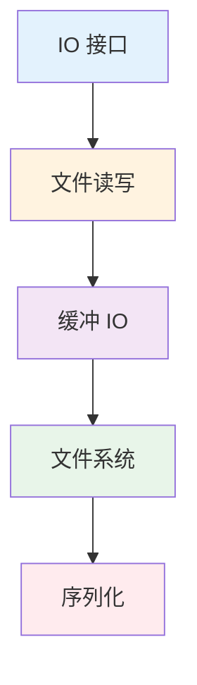

import { Badge } from "@rspress/core/theme";
import { Callout } from "@rspress/core/theme-original";

# I/O 操作 - Input/Output

<Badge text="核心模块" type="danger" />

I/O 操作是任何程序的核心功能。Go 的 I/O 设计简洁而强大，通过 `io` 包的接口实现了统一的读写模式。

## 学习路径



## 模块概览

| 模块 | 内容 | 难度 |
|------|------|------|
| [IO 接口](./io-interfaces.mdx) | Reader、Writer、Closer 等核心接口 | <Badge text="中级" type="warning" /> |
| [文件读写](./file-io.mdx) | os 包、文件读写操作 | <Badge text="初级" type="tip" /> |
| [缓冲 I/O](./bufio.mdx) | bufio 包、提高 I/O 效率 | <Badge text="中级" type="warning" /> |
| [文件系统](./filesystem.mdx) | 文件系统操作、路径处理 | <Badge text="初级" type="tip" /> |
| [序列化](./serialization.mdx) | JSON、YAML 编解码 | <Badge text="初级" type="tip" /> |

## 核心概念

### io.Reader 和 io.Writer

Go 的 I/O 建立在两个简单接口之上：

```go
type Reader interface {
    Read(p []byte) (n int, err error)
}

type Writer interface {
    Write(p []byte) (n int, err error)
}
```

<Callout type="info">
**统一抽象**：任何实现了这两个接口的类型都可以用于读写操作，包括文件、网络连接、内存缓冲区等。
</Callout>

### 读写模式对比


## 读者指南

### <Badge text="初级开发者" type="tip" />

1. [文件读写](./file-io.mdx) - 学习基本的文件操作
2. [文件系统](./filesystem.mdx) - 掌握路径和文件操作
3. [序列化](./serialization.mdx) - JSON 编解码

### <Badge text="中级开发者" type="warning" />

1. [IO 接口](./io-interfaces.mdx) - 理解 Reader/Writer 设计
2. [缓冲 I/O](./bufio.mdx) - 优化 I/O 性能
3. 实现自定义 Reader/Writer

### <Badge text="高级开发者" type="danger" />

1. 实现复杂的 Reader/Writer 组合
2. 性能优化和内存管理
3. 并发安全的 I/O 操作

## 快速参考

### 读取文件

```go
// 读取整个文件
data, err := os.ReadFile("file.txt")

// 按行读取
file, _ := os.Open("file.txt")
scanner := bufio.NewScanner(file)
for scanner.Scan() {
    fmt.Println(scanner.Text())
}
```

### 写入文件

```go
// 写入整个文件
os.WriteFile("file.txt", []byte("hello"), 0644)

// 流式写入
file, _ := os.Create("file.txt")
writer := bufio.NewWriter(file)
writer.WriteString("hello")
writer.Flush()
```

### JSON 编解码

```go
// 编码
json.NewEncoder(file).Encode(data)

// 解码
json.NewDecoder(file).Decode(&data)
```

## 相关资源

- [io 包文档](https://pkg.go.dev/io)
- [bufio 包文档](https://pkg.go.dev/bufio)
- [Go 文件操作最佳实践](https://go.dev/doc/effective_go#files)

---

[← 返回 Go 首页](/golang/) | [开始学习：文件读写 →](./file-io.mdx)
