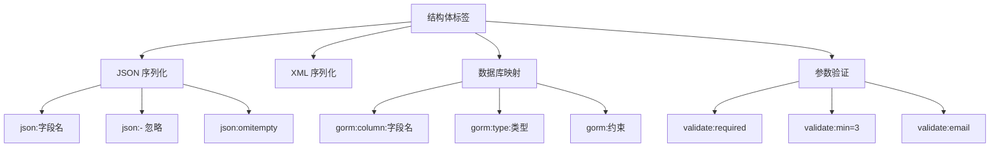

import { Badge } from "@rspress/core/theme";
import { Callout } from "@rspress/core/theme-original";

# 结构体标签

<Badge text="中级" type="warning" /> <Badge text="Go 1.0+" type="info" />

结构体标签（Struct Tags）是 Go 中一种强大的元数据机制，通过反射可以在运行时读取这些元数据，广泛应用于序列化、验证、ORM 等场景。

## 什么是结构体标签

结构体标签是字段声明后面的字符串字面量：

```go
type User struct {
    Name     string `json:"name" xml:"name"`
    Age      int    `json:"age" validate:"gte=0"`
    Password string `json:"-"` // 忽略
}
```

```mermaid
graph LR
    A[结构体字段] --> B[标签字符串]
    B --> C[键1:"值1"]
    B --> D[键2:"值2"]
    B --> E[键3:"选项1,选项2"]
```

## 标签语法

### 基本格式

```go
type User struct {
    // 标准格式：`key:"value"`
    Name string `json:"name"`

    // 多个标签：空格分隔
    Email string `json:"email" xml:"email" validate:"email"`

    // 值中包含空格：使用反引号
    Description string `json:"description" help:"用户描述信息"`

    // 特殊字符
    Data string `json:"data,omitempty" validate:"required"`
}
```

### 标签规范

```go
type Example struct {
    // 常见规范
    Field1 string `json:"field1"`              // 小写命名
    Field2 string `json:"field2,omitempty"`    // omitempty 选项
    Field3 string `json:"-"`                   // - 表示忽略
    Field4 string `json:"field4" xml:"field4"` // 多个标签

    // 自定义标签
    Field5 string `mylib:"custom"`
    Field6 string `validate:"required,email"`
    Field7 string `gorm:"column:field7;type:varchar(100)"`
}
```

## 反射读取标签

### 基础读取

```go
package main

import (
    "fmt"
    "reflect"
)

type User struct {
    Name     string `json:"name" xml:"user_name" validate:"required"`
    Age      int    `json:"age" validate:"gte=0,lte=130"`
    Email    string `json:"email,omitempty" validate:"email"`
    Password string `json:"-"` // 忽略
}

func main() {
    t := reflect.TypeOf(User{})

    // 遍历所有字段
    for i := 0; i < t.NumField(); i++ {
        field := t.Field(i)
        tag := field.Tag

        fmt.Printf("Field: %s\n", field.Name)

        // Get 方法获取标签值
        jsonTag := tag.Get("json")
        fmt.Printf("  json: %q\n", jsonTag)

        xmlTag := tag.Get("xml")
        fmt.Printf("  xml: %q\n", xmlTag)

        validateTag := tag.Get("validate")
        fmt.Printf("  validate: %q\n", validateTag)

        // 不存在的标签返回空字符串
        unknownTag := tag.Get("unknown")
        fmt.Printf("  unknown: %q\n", unknownTag)

        fmt.Println()
    }
}
```

### Lookup 方法

```go
package main

import (
    "fmt"
    "reflect"
)

type User struct {
    Name string `json:"name"`
    Age  int    // 没有标签
}

func main() {
    t := reflect.TypeOf(User{})

    nameField, _ := t.FieldByName("Name")
    ageField, _ := t.FieldByName("Age")

    // Get: 不存在的标签返回空字符串
    fmt.Println("Name json (Get):", nameField.Tag.Get("json"))  // name
    fmt.Println("Name xml (Get):", nameField.Tag.Get("xml"))    // (空字符串)

    // Lookup: 区分空标签和不存在的标签
    val, ok := nameField.Tag.Lookup("json")
    fmt.Printf("Name json (Lookup): %q, %v\n", val, ok)  // "name", true

    val, ok = nameField.Tag.Lookup("xml")
    fmt.Printf("Name xml (Lookup): %q, %v\n", val, ok)  // "", false

    val, ok = ageField.Tag.Lookup("json")
    fmt.Printf("Age json (Lookup): %q, %v\n", val, ok)  // "", false
}
```

<Callout type="info" title="Get vs Lookup">
  <strong>Get(key)</strong>: 返回标签值，不存在返回空字符串<br />
  <strong>Lookup(key)</strong>: 返回标签值和布尔值，区分空标签和不存在
</Callout>

## 解析标签值

### 解析选项

```go
package main

import (
    "fmt"
    "reflect"
    "strings"
)

type User struct {
    Name  string `json:"name,omitempty"`
    Email string `json:"email,omitempty"`
    Age   int    `json:"age"`
}

func parseJSONTag(tag string) (name string, opts map[string]bool) {
    parts := strings.Split(tag, ",")
    name = parts[0]
    opts = make(map[string]bool)

    for _, opt := range parts[1:] {
        opts[opt] = true
    }

    return
}

func main() {
    t := reflect.TypeOf(User{})

    for i := 0; i < t.NumField(); i++ {
        field := t.Field(i)
        jsonTag := field.Tag.Get("json")

        if jsonTag == "-" {
            fmt.Printf("%s: ignored\n", field.Name)
            continue
        }

        name, opts := parseJSONTag(jsonTag)
        fmt.Printf("%s: name=%q, omitempty=%v\n",
            field.Name, name, opts["omitempty"])
    }
}
```

### 解析复杂标签

```go
package main

import (
    "fmt"
    "reflect"
    "strings"
)

type User struct {
    Age  int    `validate:"gte=0,lte=130"`
    Name string `validate:"required,min=3,max=50"`
}

type ValidationRule struct {
    Name     string
    Value    string
}

func parseValidateTag(tag string) []ValidationRule {
    var rules []ValidationRule

    parts := strings.Split(tag, ",")
    for _, part := range parts {
        kv := strings.Split(part, "=")
        if len(kv) == 1 {
            rules = append(rules, ValidationRule{
                Name: kv[0],
            })
        } else {
            rules = append(rules, ValidationRule{
                Name:  kv[0],
                Value: kv[1],
            })
        }
    }

    return rules
}

func main() {
    t := reflect.TypeOf(User{})

    for i := 0; i < t.NumField(); i++ {
        field := t.Field(i)
        validateTag := field.Tag.Get("validate")

        if validateTag == "" {
            continue
        }

        rules := parseValidateTag(validateTag)
        fmt.Printf("%s:\n", field.Name)
        for _, rule := range rules {
            if rule.Value == "" {
                fmt.Printf("  - %s\n", rule.Name)
            } else {
                fmt.Printf("  - %s: %s\n", rule.Name, rule.Value)
            }
        }
        fmt.Println()
    }
}
```

## 常见标签应用

### JSON 序列化

```go
package main

import (
    "encoding/json"
    "fmt"
)

type User struct {
    Name     string `json:"name"`                    // 自定义字段名
    Age      int    `json:"age,omitempty"`           // 零值省略
    Email    string `json:"email,omitempty"`         // 零值省略
    Password string `json:"-"`                       // 忽略
    Internal string `json:"-"`                       // 内部字段
}

func main() {
    u := User{
        Name:     "Alice",
        Age:      30,
        Email:    "",  // 空字符串，omitempty 会省略
        Password: "secret",
        Internal: "internal",
    }

    data, _ := json.Marshal(u)
    fmt.Println(string(data))
    // {"name":"Alice","age":30}

    // 带邮箱
    u.Email = "alice@example.com"
    data, _ = json.Marshal(u)
    fmt.Println(string(data))
    // {"name":"Alice","age":30","email":"alice@example.com"}
}
```

### XML 序列化

```go
package main

import (
    "encoding/xml"
    "fmt"
)

type User struct {
    XMLName  xml.Name `xml:"user"`
    Name     string   `xml:"name"`
    Age      int      `xml:"age"`
    Email    string   `xml:"email,omitempty"`
    Password string   `xml:"-"`
}

func main() {
    u := User{
        Name:  "Alice",
        Age:   30,
        Email: "alice@example.com",
    }

    data, _ := xml.Marshal(u)
    fmt.Println(string(data))
    // <user><name>Alice</name><age>30</age><email>alice@example.com</email></user>
}
```

### 数据库映射（GORM 示例）

```go
package main

import (
    "fmt"
    "reflect"
)

type User struct {
    ID        uint   `gorm:"column:id;primaryKey"`
    Name      string `gorm:"column:name;type:varchar(100);not null"`
    Email     string `gorm:"column:email;type:varchar(100);uniqueIndex"`
    Age       int    `gorm:"column:age;default:0"`
    CreatedAt int64  `gorm:"column:created_at;autoCreateTime"`
}

func parseGormTag(tag string) map[string]string {
    opts := make(map[string]string)

    parts := strings.Split(tag, ";")
    for _, part := range parts {
        kv := strings.Split(part, ":")
        if len(kv) == 2 {
            opts[kv[0]] = kv[1]
        } else {
            opts[kv[0]] = "true"
        }
    }

    return opts
}

func main() {
    t := reflect.TypeOf(User{})

    for i := 0; i < t.NumField(); i++ {
        field := t.Field(i)
        gormTag := field.Tag.Get("gorm")

        opts := parseGormTag(gormTag)
        fmt.Printf("%s:\n", field.Name)
        for k, v := range opts {
            fmt.Printf("  %s: %s\n", k, v)
        }
        fmt.Println()
    }
}
```

### 参数验证

```go
package main

import (
    "fmt"
    "reflect"
    "strconv"
    "strings"
)

type User struct {
    Name     string `validate:"required,min=3,max=50"`
    Age      int    `validate:"gte=0,lte=130"`
    Email    string `validate:"required,email"`
    Password string `validate:"required,min=8"`
}

func validate(v any) error {
    val := reflect.ValueOf(v)

    if val.Kind() == reflect.Ptr {
        val = val.Elem()
    }

    if val.Kind() != reflect.Struct {
        return fmt.Errorf("expected struct, got %s", val.Kind())
    }

    typ := val.Type()

    for i := 0; i < val.NumField(); i++ {
        field := val.Field(i)
        fieldType := typ.Field(i)

        validateTag := fieldType.Tag.Get("validate")
        if validateTag == "" {
            continue
        }

        // 解析验证规则
        rules := strings.Split(validateTag, ",")
        for _, rule := range rules {
            parts := strings.Split(rule, "=")
            ruleName := parts[0]

            var ruleValue string
            if len(parts) > 1 {
                ruleValue = parts[1]
            }

            // 执行验证
            if err := applyRule(fieldType.Name, field, ruleName, ruleValue); err != nil {
                return err
            }
        }
    }

    return nil
}

func applyRule(fieldName string, field reflect.Value, rule, value string) error {
    switch rule {
    case "required":
        if field.IsZero() {
            return fmt.Errorf("%s is required", fieldName)
        }
    case "email":
        // 简单验证
        email := field.String()
        if !strings.Contains(email, "@") {
            return fmt.Errorf("%s must be a valid email", fieldName)
        }
    case "min":
        min, _ := strconv.Atoi(value)
        switch field.Kind() {
        case reflect.String:
            if field.Len() < min {
                return fmt.Errorf("%s length must be at least %d", fieldName, min)
            }
        case reflect.Int, reflect.Int8, reflect.Int16, reflect.Int32, reflect.Int64:
            if field.Int() < int64(min) {
                return fmt.Errorf("%s must be at least %d", fieldName, min)
            }
        }
    case "max":
        max, _ := strconv.Atoi(value)
        switch field.Kind() {
        case reflect.String:
            if field.Len() > max {
                return fmt.Errorf("%s length must not exceed %d", fieldName, max)
            }
        case reflect.Int, reflect.Int8, reflect.Int16, reflect.Int32, reflect.Int64:
            if field.Int() > int64(max) {
                return fmt.Errorf("%s must not exceed %d", fieldName, max)
            }
        }
    case "gte":
        min, _ := strconv.Atoi(value)
        if field.Int() < int64(min) {
            return fmt.Errorf("%s must be >= %d", fieldName, min)
        }
    case "lte":
        max, _ := strconv.Atoi(value)
        if field.Int() > int64(max) {
            return fmt.Errorf("%s must be <= %d", fieldName, max)
        }
    }

    return nil
}

func main() {
    // 有效用户
    validUser := User{
        Name:     "Alice",
        Age:      30,
        Email:    "alice@example.com",
        Password: "password123",
    }

    err := validate(validUser)
    fmt.Println("Valid user:", err)  // <nil>

    // 无效用户
    invalidUser := User{
        Name:     "Al",  // 太短
        Age:      150,   // 太大
        Email:    "invalid",
        Password: "short",
    }

    err = validate(invalidUser)
    fmt.Println("Invalid user:", err)
}
```



## 自定义标签处理

### 通用标签处理器

```go
package main

import (
    "fmt"
    "reflect"
    "strings"
)

type TagParser struct {
    tagName string
}

func NewTagParser(tagName string) *TagParser {
    return &TagParser{tagName: tagName}
}

func (p *TagParser) Parse(v any) map[string]map[string]string {
    result := make(map[string]map[string]string)

    val := reflect.ValueOf(v)
    if val.Kind() == reflect.Ptr {
        val = val.Elem()
    }

    if val.Kind() != reflect.Struct {
        return result
    }

    typ := val.Type()

    for i := 0; i < val.NumField(); i++ {
        field := typ.Field(i)
        tag := field.Tag.Get(p.tagName)

        if tag == "" || tag == "-" {
            continue
        }

        result[field.Name] = p.parseTag(tag)
    }

    return result
}

func (p *TagParser) parseTag(tag string) map[string]string {
    opts := make(map[string]string)

    parts := strings.Split(tag, ",")
    for _, part := range parts {
        kv := strings.SplitN(part, "=", 2)
        if len(kv) == 1 {
            opts[kv[0]] = "true"
        } else {
            opts[kv[0]] = kv[1]
        }
    }

    return opts
}

type User struct {
    Name  string `custom:"name,required"`
    Age   int    `custom:"age,min=0"`
    Email string `custom:"email,required,email"`
}

func main() {
    parser := NewTagParser("custom")

    user := User{}
    tags := parser.Parse(user)

    for field, opts := range tags {
        fmt.Printf("%s:\n", field)
        for k, v := range opts {
            fmt.Printf("  %s: %s\n", k, v)
        }
    }
}
```

## 标签最佳实践

<Callout type="warning" title="标签规范">
  <ul>
    <li>使用<strong>空格</strong>分隔多个标签</li>
    <li>使用<strong>逗号</strong>分隔标签内的选项</li>
    <li>使用<strong>-</strong>表示忽略字段</li>
    <li>使用<strong>omitempty</strong>省略零值</li>
    <li>标签值使用<strong>双引号</strong>包裹</li>
  </ul>
</Callout>

### 命名约定

```go
// ✅ 好的标签命名
type User struct {
    Name     string `json:"name" xml:"name"`
    Age      int    `json:"age" xml:"age"`
    Password string `json:"-"` // 不导出敏感信息
}

// ❌ 不好的标签命名
type User struct {
    Name     string `json:"UserName"` // 不一致
    AGE      int    `json:"age"`      // 大小写不一致
    password string `json:"password"` // 未导出但序列化
}
```

### 性能考虑

```go
package main

import (
    "fmt"
    "reflect"
    "sync"
)

// 缓存反射信息提高性能
type FieldCache struct {
    mu     sync.RWMutex
    cached map[reflect.Type][]FieldInfo
}

type FieldInfo struct {
    Name     string
    Index    int
    TagValue string
}

var globalCache = &FieldCache{
    cached: make(map[reflect.Type][]FieldInfo),
}

func GetFieldInfo(t reflect.Type) []FieldInfo {
    globalCache.mu.RLock()
    if info, ok := globalCache.cached[t]; ok {
        globalCache.mu.RUnlock()
        return info
    }
    globalCache.mu.RUnlock()

    // 构建缓存
    var info []FieldInfo
    for i := 0; i < t.NumField(); i++ {
        field := t.Field(i)
        info = append(info, FieldInfo{
            Name:     field.Name,
            Index:    i,
            TagValue: field.Tag.Get("json"),
        })
    }

    globalCache.mu.Lock()
    globalCache.cached[t] = info
    globalCache.mu.Unlock()

    return info
}

func main() {
    t := reflect.TypeOf(struct {
        Name string `json:"name"`
        Age  int    `json:"age"`
    }{})

    info := GetFieldInfo(t)
    for _, field := range info {
        fmt.Printf("%s: %s\n", field.Name, field.TagValue)
    }
}
```

## 练习

1. **自定义序列化**：实现一个支持标签的结构体到 map 的转换器

<details>
<summary>查看答案</summary>

```go
package main

import (
    "fmt"
    "reflect"
    "strings"
)

type User struct {
    Name     string `map:"name" alias:"username"`
    Age      int    `map:"age" alias:"years"`
    Email    string `map:"email,omitempty" alias:"mail"`
    Password string `map:"-"` // 忽略
}

func ToMap(v any) map[string]string {
    result := make(map[string]string)

    val := reflect.ValueOf(v)
    if val.Kind() == reflect.Ptr {
        val = val.Elem()
    }

    if val.Kind() != reflect.Struct {
        return result
    }

    typ := val.Type()

    for i := 0; i < val.NumField(); i++ {
        field := val.Field(i)
        fieldType := typ.Field(i)

        mapTag := fieldType.Tag.Get("map")
        if mapTag == "" || mapTag == "-" {
            continue
        }

        // 解析标签
        parts := strings.Split(mapTag, ",")
        key := parts[0]
        omitEmpty := false

        for _, opt := range parts[1:] {
            if opt == "omitempty" {
                omitEmpty = true
            }
        }

        // 检查 omitempty
        if omitEmpty && field.IsZero() {
            continue
        }

        // 转换值
        var value string
        switch field.Kind() {
        case reflect.String:
            value = field.String()
        case reflect.Int, reflect.Int8, reflect.Int16, reflect.Int32, reflect.Int64:
            value = fmt.Sprintf("%d", field.Int())
        case reflect.Uint, reflect.Uint8, reflect.Uint16, reflect.Uint32, reflect.Uint64:
            value = fmt.Sprintf("%d", field.Uint())
        case reflect.Bool:
            value = fmt.Sprintf("%t", field.Bool())
        case reflect.Float32, reflect.Float64:
            value = fmt.Sprintf("%f", field.Float())
        }

        result[key] = value
    }

    return result
}

func main() {
    // 完整用户
    u1 := User{
        Name:  "Alice",
        Age:   30,
        Email: "alice@example.com",
    }
    fmt.Printf("%+v\n", ToMap(u1))
    // map[age:30 email:alice@example.com name:Alice]

    // 部分零值
    u2 := User{
        Name: "Bob",
    }
    fmt.Printf("%+v\n", ToMap(u2))
    // map[age:0 name:Bob]
}
```

**解释**：解析自定义标签，支持 omitempty 选项，将结构体转换为 map。

</details>

---

[← 值反射](./value-reflection.mdx) | [动态调用 →](./dynamic-calls.mdx)
