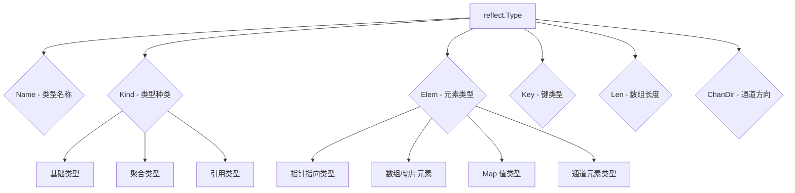

import { Badge } from "@rspress/core/theme";
import { Callout } from "@rspress/core/theme-original";

# 类型反射

<Badge text="中级" type="warning" /> <Badge text="Go 1.0+" type="info" />

`reflect.Type` 提供了丰富的类型信息查询接口，是理解 Go 类型系统的重要工具。

## 获取 Type

```go
package main

import (
    "fmt"
    "reflect"
)

type Person struct {
    Name string
    Age  int
}

func main() {
    // 方法1：通过 Value 获取
    p := Person{Name: "Alice"}
    v := reflect.ValueOf(p)
    t1 := v.Type()

    // 方法2：直接获取
    t2 := reflect.TypeOf(p)

    // 方法3：通过类型字面量
    t3 := reflect.TypeOf((*Person)(nil)).Elem()

    fmt.Println(t1 == t2)  // true
    fmt.Println(t2 == t3)  // true
    fmt.Println(t1)        // main.Person
}
```

## 类型信息查询

### 基础信息

```go
package main

import (
    "fmt"
    "reflect"
)

type Person struct {
    Name string
    Age  int
}

func (p Person) Greet() string {
    return "Hello"
}

func main() {
    p := Person{Name: "Alice"}
    t := reflect.TypeOf(p)

    fmt.Println("Type:", t)                    // main.Person
    fmt.Println("Name:", t.Name())              // Person
    fmt.Println("Kind:", t.Kind())              // struct
    fmt.Println("PkgPath:", t.PkgPath())        // main
    fmt.Println("String:", t.String())          // main.Person
    fmt.Println("Size:", t.Size())              // 24 (平台相关)

    // 类型比较
    fmt.Println(t == reflect.TypeOf(Person{}))  // true
}
```

### 类型的各种属性

```go
package main

import (
    "fmt"
    "reflect"
)

type MyInt int

func main() {
    // 命名类型
    t1 := reflect.TypeOf(MyInt(0))
    fmt.Println("Name:", t1.Name())     // MyInt
    fmt.Println("Kind:", t1.Kind())     // int

    // 基础类型
    t2 := reflect.TypeOf(0)
    fmt.Println("Name:", t2.Name())     // int
    fmt.Println("Kind:", t2.Kind())     // int

    // 指针类型
    t3 := reflect.TypeOf(&MyInt{})
    fmt.Println("Name:", t3.Name())     //
    fmt.Println("Kind:", t3.Kind())     // ptr
    fmt.Println("Elem:", t3.Elem().Name())  // MyInt

    // 数组类型
    arr := [5]int{}
    t4 := reflect.TypeOf(arr)
    fmt.Println("Kind:", t4.Kind())             // array
    fmt.Println("Len:", t4.Len())               // 5
    fmt.Println("Elem:", t4.Elem().Name())      // int

    // 切片类型
    slice := []int{}
    t5 := reflect.TypeOf(slice)
    fmt.Println("Kind:", t5.Kind())             // slice
    fmt.Println("Elem:", t5.Elem().Name())      // int

    // Map 类型
    m := map[string]int{}
    t6 := reflect.TypeOf(m)
    fmt.Println("Kind:", t6.Kind())             // map
    fmt.Println("Key:", t6.Key().Name())        // string
    fmt.Println("Elem:", t6.Elem().Name())      // int

    // Channel 类型
    ch := make(chan int)
    t7 := reflect.TypeOf(ch)
    fmt.Println("Kind:", t7.Kind())             // chan
    fmt.Println("Elem:", t7.Elem().Name())      // int
    fmt.Println("ChanDir:", t7.ChanDir())       // 3 (both send and recv)
}
```



## 结构体类型

### 字段信息

```go
package main

import (
    "fmt"
    "reflect"
)

type Person struct {
    ID       int    `json:"id"`
    Name     string `json:"name"`
    Age      int    `json:"age"`
    password string // 未导出
}

func main() {
    t := reflect.TypeOf(Person{})

    // 字段数量
    fmt.Println("NumField:", t.NumField())  // 4

    // 遍历字段
    for i := 0; i < t.NumField(); i++ {
        field := t.Field(i)
        fmt.Printf("Field %d:\n", i)
        fmt.Printf("  Name: %s\n", field.Name)
        fmt.Printf("  Type: %s\n", field.Type)
        fmt.Printf("  PkgPath: %s\n", field.PkgPath)
        fmt.Printf("  Exported: %v\n", field.IsExported())
        fmt.Printf("  Tag: %q\n", field.Tag)
        fmt.Println()
    }

    // 通过名称获取字段
    field, ok := t.FieldByName("Name")
    if ok {
        fmt.Println("FieldByName 'Name':", field.Type)
    }

    // 嵌套字段
    type Address struct {
        City string
    }
    type User struct {
        Person
        Address `json:"address"`
    }
    t2 := reflect.TypeOf(User{})
    field2, _ := t2.FieldByName("City")
    fmt.Println("FieldByName 'City':", field2.Index)  // [1 0]
}
```

### 字段标签解析

```go
package main

import (
    "fmt"
    "reflect"
    "strings"
)

type Person struct {
    Name     string `json:"name" xml:"name" validate:"required"`
    Age      int    `json:"age" validate:"gte=0"`
    Email    string `json:"email" validate:"email"`
    Password string `json:"-"` // 忽略
}

func main() {
    t := reflect.TypeOf(Person{})

    for i := 0; i < t.NumField(); i++ {
        field := t.Field(i)
        tag := field.Tag

        // 获取特定标签
        jsonTag := tag.Get("json")
        fmt.Printf("%s: json=%q\n", field.Name, jsonTag)

        // 解析完整标签
        validateTag := tag.Get("validate")
        if validateTag != "" {
            rules := strings.Split(validateTag, ",")
            fmt.Printf("  validate: %v\n", rules)
        }
    }

    // 检查标签是否存在
    nameField, _ := t.FieldByName("Name")
    fmt.Println("\nHas json tag:", nameField.Tag.Get("json") != "")
    fmt.Println("Has xml tag:", nameField.Tag.Get("xml") != "")
    fmt.Println("Has unknown tag:", nameField.Tag.Get("unknown") == "")

    // 使用 Lookup 区分空标签和不存在
    val, ok := nameField.Tag.Lookup("validate")
    fmt.Printf("Lookup validate: %q, %v\n", val, ok)
}
```

### 匿名字段和嵌入

```go
package main

import (
    "fmt"
    "reflect"
)

type Base struct {
    ID int
}

type Person struct {
    Base     // 匿名嵌入
    Name string
}

func main() {
    t := reflect.TypeOf(Person{})

    // 查找字段（包括嵌入字段）
    field, found := t.FieldByName("ID")
    if found {
        fmt.Printf("Found 'ID': %v\n", field.Index)  // [0 0]
    }

    // 检查字段是否为匿名
    baseField, _ := t.FieldByName("Base")
    fmt.Printf("Base is anonymous: %v\n", baseField.Anonymous)  // true

    // 遍历所有字段
    for i := 0; i < t.NumField(); i++ {
        field := t.Field(i)
        if field.Anonymous {
            fmt.Printf("Embedded: %s\n", field.Name)
        } else {
            fmt.Printf("Regular: %s\n", field.Name)
        }
    }
}
```

## 函数类型

```go
package main

import (
    "fmt"
    "reflect"
)

func Add(a, b int) int {
    return a + b
}

func main() {
    t := reflect.TypeOf(Add)

    fmt.Println("Kind:", t.Kind())       // func
    fmt.Println("NumIn:", t.NumIn())     // 2
    fmt.Println("NumOut:", t.NumOut())   // 1

    // 输入参数
    for i := 0; i < t.NumIn(); i++ {
        param := t.In(i)
        fmt.Printf("In[%d]: %s\n", i, param)
    }

    // 返回参数
    for i := 0; i < t.NumOut(); i++ {
        ret := t.Out(i)
        fmt.Printf("Out[%d]: %s\n", i, ret)
    }

    // 是否可变参数
    fmt.Println("IsVariadic:", t.IsVariadic())  // false
}
```

### 可变参数函数

```go
package main

import (
    "fmt"
    "reflect"
)

func Sum(nums ...int) int {
    total := 0
    for _, n := range nums {
        total += n
    }
    return total
}

func main() {
    t := reflect.TypeOf(Sum)

    fmt.Println("NumIn:", t.NumIn())         // 1
    fmt.Println("IsVariadic:", t.IsVariadic()) // true

    // 最后一个参数是可变参数
    lastIn := t.In(t.NumIn() - 1)
    fmt.Println("Last param:", lastIn)        // []int
    fmt.Println("Last param kind:", lastIn.Kind())  // slice
}
```

## 接口类型

```go
package main

import (
    "fmt"
    "reflect"
)

type Stringer interface {
    String() string
}

type Reader interface {
    Read([]byte) (int, error)
}

func main() {
    // 接口类型
    t := reflect.TypeOf((*Stringer)(nil)).Elem()

    fmt.Println("Kind:", t.Kind())       // interface
    fmt.Println("NumMethod:", t.NumMethod())  // 1

    // 遍历方法
    for i := 0; i < t.NumMethod(); i++ {
        method := t.Method(i)
        fmt.Printf("Method[%d]: %s\n", i, method.Name)
        fmt.Printf("  Type: %s\n", method.Type)
    }

    // 通过名称查找方法
    m, ok := t.MethodByName("String")
    if ok {
        fmt.Printf("MethodByName: %s\n", m.Name)
        fmt.Printf("  NumIn: %d\n", m.Type.NumIn())  // 1 (receiver)
    }
}
```

## 类型比较和转换

### 类型相等

```go
package main

import (
    "fmt"
    "reflect"
)

type MyInt int
type YourInt int

func main() {
    var a, b int = 1, 2
    var c MyInt = 1
    var d YourInt = 1

    ta := reflect.TypeOf(a)
    tb := reflect.TypeOf(b)
    tc := reflect.TypeOf(c)
    td := reflect.TypeOf(d)

    // Type 相等需要完全相同
    fmt.Println("ta == tb:", ta == tb)  // true
    fmt.Println("ta == tc:", ta == tc)  // false (int vs MyInt)
    fmt.Println("tc == td:", tc == td)  // false (MyInt vs YourInt)

    // Kind 相等只需底层类型相同
    fmt.Println("ta.Kind() == tc.Kind():", ta.Kind() == tc.Kind())  // true
}
```

### Implements 检查

```go
package main

import (
    "fmt"
    "reflect"
)

type Stringer interface {
    String() string
}

type Person struct {
    Name string
}

func (p Person) String() string {
    return p.Name
}

type Point struct {
    X, Y int
}

func main() {
    personT := reflect.TypeOf(Person{})
    pointT := reflect.TypeOf(Point{})
    stringerT := reflect.TypeOf((*Stringer)(nil)).Elem()

    // 检查是否实现接口
    fmt.Println("Person implements Stringer:",
        personT.Implements(stringerT))  // true

    fmt.Println("Point implements Stringer:",
        pointT.Implements(stringerT))  // false
}
```

### AssignableTo 检查

```go
package main

import (
    "fmt"
    "reflect"
)

type MyInt int

func main() {
    var x int
    var y MyInt

    tx := reflect.TypeOf(x)
    ty := reflect.TypeOf(y)

    // 检查是否可以赋值
    fmt.Println("MyInt assignable to int:", ty.AssignableTo(tx))  // false
    fmt.Println("int assignable to MyInt:", tx.AssignableTo(ty))  // false

    // 接口的赋值性
    var any interface{}
    tAny := reflect.TypeOf(any)

    fmt.Println("int assignable to interface{}:",
        tx.AssignableTo(tAny))  // true

    // 指针的赋值性
    var px *int
    var py *MyInt
    var pAny interface{}

    tPx := reflect.TypeOf(px)
    tPy := reflect.TypeOf(py)
    tPAny := reflect.TypeOf(pAny)

    fmt.Println("*int assignable to *MyInt:",
        tPx.AssignableTo(tPy))  // false
    fmt.Println("*MyInt assignable to interface{}:",
        tPy.AssignableTo(tPAny))  // true
}
```

### ConvertibleTo 检查

```go
package main

import (
    "fmt"
    "reflect"
)

type MyInt int
type MyString string

func main() {
    var x int
    var y MyInt
    var z string
    var w MyString

    tx := reflect.TypeOf(x)
    ty := reflect.TypeOf(y)
    tz := reflect.TypeOf(z)
    tw := reflect.TypeOf(w)

    // 相同底层类型可以转换
    fmt.Println("int convertible to MyInt:",
        tx.ConvertibleTo(ty))  // true
    fmt.Println("MyInt convertible to int:",
        ty.ConvertibleTo(tx))  // true

    // 不同底层类型不能转换
    fmt.Println("int convertible to string:",
        tx.ConvertibleTo(tz))  // false
    fmt.Println("MyInt convertible to MyString:",
        ty.ConvertibleTo(tw))  // false
}
```

## 练习

1. **JSON 序列化器**：实现一个简单的 JSON 序列化函数，支持结构体标签

<details>
<summary>查看答案</summary>

```go
package main

import (
    "fmt"
    "reflect"
    "strings"
)

type Person struct {
    Name     string `json:"name"`
    Age      int    `json:"age"`
    Email    string `json:"email,omitempty"`
    Password string `json:"-"` // 忽略
}

func ToJSON(obj any) string {
    v := reflect.ValueOf(obj)
    t := v.Type()

    if t.Kind() == reflect.Ptr {
        v = v.Elem()
        t = v.Type()
    }

    if t.Kind() != reflect.Struct {
        return "{}"
    }

    var pairs []string

    for i := 0; i < t.NumField(); i++ {
        field := t.Field(i)
        value := v.Field(i)

        // 跳过未导出字段
        if !field.IsExported() {
            continue
        }

        // 获取 json 标签
        jsonTag := field.Tag.Get("json")
        if jsonTag == "-" {
            continue
        }

        fieldName := field.Name
        if jsonTag != "" {
            // 解析 "name,omitempty"
            parts := strings.Split(jsonTag, ",")
            fieldName = parts[0]

            // omitempty: 跳过零值
            if len(parts) > 1 && parts[1] == "omitempty" {
                if value.IsZero() {
                    continue
                }
            }
        }

        // 转换值
        var valStr string
        switch value.Kind() {
        case reflect.String:
            valStr = `"` + value.String() + `"`
        case reflect.Int, reflect.Int8, reflect.Int16, reflect.Int32, reflect.Int64:
            valStr = fmt.Sprintf("%d", value.Int())
        case reflect.Uint, reflect.Uint8, reflect.Uint16, reflect.Uint32, reflect.Uint64:
            valStr = fmt.Sprintf("%d", value.Uint())
        case reflect.Float32, reflect.Float64:
            valStr = fmt.Sprintf("%f", value.Float())
        case reflect.Bool:
            valStr = fmt.Sprintf("%t", value.Bool())
        default:
            valStr = `null`
        }

        pairs = append(pairs, fmt.Sprintf(`"%s":%s`, fieldName, valStr))
    }

    return "{" + strings.Join(pairs, ",") + "}"
}

func main() {
    p1 := Person{
        Name:  "Alice",
        Age:   30,
        Email: "alice@example.com",
    }
    fmt.Println(ToJSON(p1))
    // {"name":"Alice","age":30,"email":"alice@example.com"}

    p2 := Person{
        Name: "Bob",
        Age:  25,
        // Email 留空，omitempty 跳过
    }
    fmt.Println(ToJSON(p2))
    // {"name":"Bob","age":25}
}
```

**解释**：使用反射遍历结构体字段，解析 json 标签，处理 omitempty 选项，生成 JSON 字符串。

</details>

---

[← 反射基础](./basics.mdx) | [值反射 →](./value-reflection.mdx)
