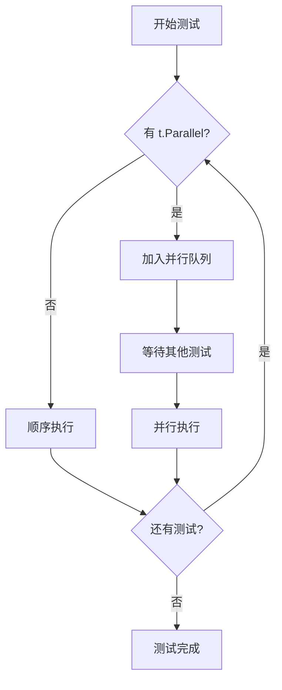

import { Badge } from "@rspress/core/theme";
import { Callout } from "@rspress/core/theme-original";

# 并发测试

<Badge text="高级" type="danger" /> <Badge text="Go 1.0+" type="info" />

并发测试可以加速测试执行，同时帮助发现并发相关的 bug。

## t.Parallel()

标记测试为可并行执行：

```go
func TestParallel1(t *testing.T) {
    t.Parallel() // 标记为并行测试

    // 测试代码...
}

func TestParallel2(t *testing.T) {
    t.Parallel() // 标记为并行测试

    // 测试代码...
}
```

### 并行执行顺序



## 并行表驱动测试

```go
func TestParallelTable(t *testing.T) {
    tests := []struct {
        name string
        data string
    }{
        {"test1", "data1"},
        {"test2", "data2"},
        {"test3", "data3"},
    }

    for _, tt := range tests {
        tt := tt
        t.Run(tt.name, func(t *testing.T) {
            t.Parallel() // 子测试并行执行

            result := Process(tt.data)
            if result != expected {
                t.Errorf("Process(%q) = %v", tt.data, result)
            }
        })
    }
}
```

<Callout type="warning" title="循环变量捕获">
  Go 1.22 之前需要在循环中创建局部变量：<br />
  <code>tt := tt</code>

  Go 1.22+ 使用 range-over-func 自动捕获，<br />
  不再需要显式声明
</Callout>

## 并行度控制

```bash
# 设置并行度（默认为 GOMAXPROCS）
go test -parallel=4

# 结合其他参数
go test -v -parallel=8 -race
```

### 子测试并行控制

```go
func TestControlledParallelism(t *testing.T) {
    // 限制最多 2 个并行测试
    t.Parallel()

    tests := []struct {
        name string
        url  string
    }{
        {"endpoint1", "https://api.example.com/e1"},
        {"endpoint2", "https://api.example.com/e2"},
        {"endpoint3", "https://api.example.com/e3"},
    }

    // 使用 semaphore 控制并发数
    sem := make(chan struct{}, 2)

    for _, tt := range tests {
        tt := tt
        t.Run(tt.name, func(t *testing.T) {
            t.Parallel()

            sem <- struct{}{}        // 获取 token
            defer func() { <-sem }() // 释放 token

            // 测试代码
            resp, err := http.Get(tt.url)
            if err != nil {
                t.Fatal(err)
            }
            resp.Body.Close()
        })
    }
}
```

## 竞态检测

```bash
# 启用竞态检测
go test -race

# 并行测试 + 竞态检测
go test -race -parallel=4
```

### 竞态检测示例

```go
// counter.go
package counter

type Counter struct {
    mu    sync.Mutex
    value int
}

func (c *Counter) Inc() {
    c.value++ // 竞态条件
}

func (c *Counter) Value() int {
    return c.value
}

// counter_test.go
package counter_test

import (
    "sync"
    "testing"
)

func TestCounter_Race(t *testing.T) {
    t.Parallel()

    c := &Counter{}
    var wg sync.WaitGroup

    // 多个 goroutine 并发增加计数器
    for i := 0; i < 100; i++ {
        wg.Add(1)
        go func() {
            defer wg.Done()
            c.Inc()
        }()
    }

    wg.Wait()

    if c.Value() != 100 {
        t.Errorf("got %d, want 100", c.Value())
    }
}
```

```bash
$ go test -race
==================
WARNING: DATA RACE
Read at 0x... by goroutine ...:
  ...
Previous write at 0x... by goroutine ...:
  ...
==================
FAIL
```

### 修复竞态

```go
// counter_fixed.go
package counter

func (c *Counter) Inc() {
    c.mu.Lock()
    defer c.mu.Unlock()
    c.value++
}

func (c *Counter) Value() int {
    c.mu.Lock()
    defer c.mu.Unlock()
    return c.value
}
```

## 并发测试模式

### 工作池模式

```go
func TestWorkerPool(t *testing.T) {
    t.Parallel()

    jobs := make(chan int, 100)
    results := make(chan int, 100)

    // 启动 workers
    for w := 1; w <= 3; w++ {
        go func(id int) {
            for j := range jobs {
                results <- j * 2
            }
        }(w)
    }

    // 发送任务
    for j := 1; j <= 5; j++ {
        jobs <- j
    }
    close(jobs)

    // 收集结果
    for r := 1; r <= 5; r++ {
        <-results
    }
}
```

### 并行 HTTP 测试

```go
func TestHTTPEndpoints(t *testing.T) {
    t.Parallel()

    server := setupTestServer(t)
    defer server.Close()

    endpoints := []struct {
        name     string
        path     string
        expected int
    }{
        {"users", "/users", 200},
        {"posts", "/posts", 200},
        {"comments", "/comments", 200},
    }

    for _, tt := range endpoints {
        tt := tt
        t.Run(tt.name, func(t *testing.T) {
            t.Parallel()

            resp, err := http.Get(server.URL + tt.path)
            if err != nil {
                t.Fatal(err)
            }
            defer resp.Body.Close()

            if resp.StatusCode != tt.expected {
                t.Errorf("got %d, want %d", resp.StatusCode, tt.expected)
            }
        })
    }
}
```

## 并行测试注意事项

### 共享状态

```go
// ❌ 错误：共享可变状态
func TestSharedState(t *testing.T) {
    t.Parallel()

    data := map[string]string{} // 并发写入会panic

    for i := 0; i < 10; i++ {
        tt := tt
        t.Run(fmt.Sprintf("test-%d", i), func(t *testing.T) {
            t.Parallel()
            data[tt.name] = "value" // 竞态条件
        })
    }
}

// ✅ 正确：避免共享状态
func TestNoSharedState(t *testing.T) {
    t.Parallel()

    for i := 0; i < 10; i++ {
        i := i
        t.Run(fmt.Sprintf("test-%d", i), func(t *testing.T) {
            t.Parallel()

            data := map[string]string{} // 每个测试独立
            data["key"] = "value"
        })
    }
}
```

### 资源限制

```go
func TestResourceLimit(t *testing.T) {
    t.Parallel()

    // 限制并发数据库连接数
    db := setupTestDB(t)
    db.SetMaxOpenConns(5)
    defer db.Close()

    tests := make([]struct{ name string }, 20)
    for i := range tests {
        tests[i].name = fmt.Sprintf("test-%d", i)
    }

    // 使用 semaphore 控制并发
    sem := make(chan struct{}, 5)

    for _, tt := range tests {
        tt := tt
        t.Run(tt.name, func(t *testing.T) {
            t.Parallel()

            sem <- struct{}{}
            defer func() { <-sem }()

            // 执行数据库操作
            _, err := db.Exec("SELECT 1")
            if err != nil {
                t.Errorf("db error: %v", err)
            }
        })
    }
}
```

## 练习

1. **并发缓存测试**：为并发安全的缓存编写测试

<details>
<summary>查看答案</summary>

```go
// cache.go
package cache

import "sync"

type Cache struct {
    mu    sync.RWMutex
    data  map[string]string
}

func NewCache() *Cache {
    return &Cache{
        data: make(map[string]string),
    }
}

func (c *Cache) Get(key string) (string, bool) {
    c.mu.RLock()
    defer c.mu.RUnlock()
    val, ok := c.data[key]
    return val, ok
}

func (c *Cache) Set(key, value string) {
    c.mu.Lock()
    defer c.mu.Unlock()
    c.data[key] = value
}

func (c *Cache) Delete(key string) {
    c.mu.Lock()
    defer c.mu.Unlock()
    delete(c.data, key)
}
```

```go
// cache_test.go
package cache_test

import (
    "sync"
    "testing"
    "time"

    "yourmodule/cache"
)

func TestCache_Concurrent(t *testing.T) {
    t.Parallel()

    c := cache.NewCache()
    var wg sync.WaitGroup

    // 并发写入
    for i := 0; i < 100; i++ {
        wg.Add(1)
        go func(n int) {
            defer wg.Done()
            key := fmt.Sprintf("key-%d", n)
            c.Set(key, fmt.Sprintf("value-%d", n))
        }(i)
    }

    // 并发读取
    for i := 0; i < 100; i++ {
        wg.Add(1)
        go func(n int) {
            defer wg.Done()
            key := fmt.Sprintf("key-%d", n)
            c.Get(key)
        }(i)
    }

    wg.Wait()

    // 验证数据
    val, ok := c.Get("key-50")
    if !ok {
        t.Error("key-50 should exist")
    }
    if val != "value-50" {
        t.Errorf("got %s, want value-50", val)
    }
}

func TestCache_RaceDetection(t *testing.T) {
    t.Parallel()

    // 使用 -race 运行此测试
    c := cache.NewCache()

    done := make(chan bool)

    // Writer
    go func() {
        for i := 0; i < 1000; i++ {
            c.Set("key", "value")
        }
        done <- true
    }()

    // Reader
    go func() {
        for i := 0; i < 1000; i++ {
            c.Get("key")
        }
        done <- true
    }()

    // Deleter
    go func() {
        for i := 0; i < 1000; i++ {
            c.Delete("key")
        }
        done <- true
    }()

    <-done
    <-done
    <-done
}
```

**解释**：测试并发的读写操作，使用 `-race` 参数可以验证缓存实现的线程安全性。

</details>