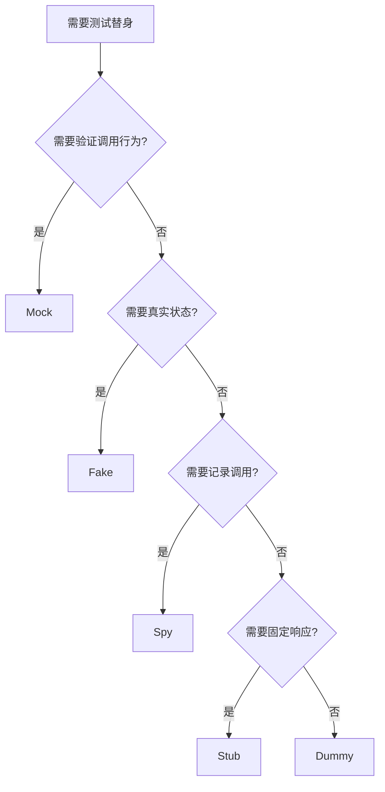

import { Badge } from "@rspress/core/theme";
import { Callout } from "@rspress/core/theme-original";

# 测试替身

<Badge text="中级" type="warning" /> <Badge text="Go 1.0+" type="info" />

测试替身（Test Doubles）是用于替换生产依赖的测试技术，让你能够隔离测试特定功能。

## 测试替身类型

```
┌─────────────────────────────────────────────────────────────┐
│                    测试替身类型对比                          │
├─────────────────────────────────────────────────────────────┤
│  Dummy   ──→  不包含逻辑，仅用于填充参数                      │
│              示例：空的 io.Reader                             │
│                                                              │
│  Stub    ──→  预定义响应，不关心调用细节                       │
│              示例：固定返回值的数据库                          │
│                                                              │
│  Spy     ──→  记录调用信息，用于验证                          │
│              示例：记录方法调用次数                            │
│                                                              │
│  Fake    ──→  简化但可工作的实现                             │
│              示例：内存数据库                                  │
│                                                              │
│  Mock    ──→  预定义期望，验证调用行为                        │
│              示例：验证方法调用顺序和参数                       │
└─────────────────────────────────────────────────────────────┘
```

## Dummy（哑元）

仅用于填充参数位置，不包含任何逻辑。

```go
// 不关心实际读取的内容
func TestProcessWithDummy(t *testing.T) {
    // Dummy: 只需要满足接口要求
    dummyReader := struct{ io.Reader }{}

    err := Process(dummyReader)
    if err != nil {
        t.Errorf("Process() failed: %v", err)
    }
}
```

## Stub（桩）

预定义响应的简单实现。

```go
// 定义依赖接口
type Database interface {
    GetUser(id int) (*User, error)
}

// Stub 实现
type StubDatabase struct {
    users map[int]*User
}

func (s *StubDatabase) GetUser(id int) (*User, error) {
    if user, ok := s.users[id]; ok {
        return user, nil
    }
    return nil, fmt.Errorf("user not found")
}

func TestWithStub(t *testing.T) {
    // 创建 stub
    db := &StubDatabase{
        users: map[int]*User{
            1: {ID: 1, Name: "Alice"},
        },
    }

    user, err := db.GetUser(1)
    if err != nil {
        t.Fatal(err)
    }

    if user.Name != "Alice" {
        t.Errorf("got %s, want Alice", user.Name)
    }
}
```

## Spy（间谍）

记录调用信息用于验证。

```go
// Spy 实现
type SpyLogger struct {
    logs []string
}

func (s *SpyLogger) Log(message string) {
    s.logs = append(s.logs, message)
}

func (s *SpyLogger) GetLogs() []string {
    return s.logs
}

func (s *SpyLogger) LogCount() int {
    return len(s.logs)
}

func TestWithSpy(t *testing.T) {
    logger := &SpyLogger{}

    service := NewService(logger)
    service.DoWork()

    // 验证日志被调用
    if logger.LogCount() != 2 {
        t.Errorf("got %d logs, want 2", logger.LogCount())
    }

    logs := logger.GetLogs()
    if logs[0] != "Starting work" {
        t.Errorf("first log = %s, want 'Starting work'", logs[0])
    }
}
```

## Fake（伪造）

简化但可工作的实现。

```go
// Fake 数据库：使用内存存储
type FakeDatabase struct {
    users map[string]*User
    mu    sync.Mutex
}

func NewFakeDatabase() *FakeDatabase {
    return &FakeDatabase{
        users: make(map[string]*User),
    }
}

func (f *FakeDatabase) Save(user *User) error {
    f.mu.Lock()
    defer f.mu.Unlock()
    f.users[user.ID] = user
    return nil
}

func (f *FakeDatabase) Find(id string) (*User, error) {
    f.mu.Lock()
    defer f.mu.Unlock()
    if user, ok := f.users[id]; ok {
        return user, nil
    }
    return nil, fmt.Errorf("not found")
}

func (f *FakeDatabase) Count() int {
    f.mu.Lock()
    defer f.mu.Unlock()
    return len(f.users)
}

func TestWithFake(t *testing.T) {
    db := NewFakeDatabase()
    service := NewUserService(db)

    // 可以真正地添加和查询数据
    user := &User{ID: "1", Name: "Alice"}
    err := service.CreateUser(user)
    if err != nil {
        t.Fatal(err)
    }

    found, err := service.GetUser("1")
    if err != nil {
        t.Fatal(err)
    }

    if found.Name != "Alice" {
        t.Errorf("got %s, want Alice", found.Name)
    }

    // Fake 可以检查状态
    if db.Count() != 1 {
        t.Errorf("got %d users, want 1", db.Count())
    }
}
```

## Mock（模拟）

预定义期望并验证行为。

```go
// Mock 实现
type MockRepository struct {
    mock.Mock
}

func (m *MockRepository) GetUser(id int) (*User, error) {
    args := m.Called(id)
    if args.Get(0) == nil {
        return nil, args.Error(1)
    }
    return args.Get(0).(*User), args.Error(1)
}

func TestWithMock(t *testing.T) {
    mockRepo := new(MockRepository)

    // 设置期望
    mockRepo.On("GetUser", 1).Return(&User{ID: 1, Name: "Alice"}, nil)
    mockRepo.On("GetUser", 999).Return(nil, fmt.Errorf("not found"))

    service := NewUserService(mockRepo)

    // 测试成功场景
    user, err := service.GetUser(1)
    if err != nil {
        t.Errorf("unexpected error: %v", err)
    }
    if user.Name != "Alice" {
        t.Errorf("got %s, want Alice", user.Name)
    }

    // 测试错误场景
    _, err = service.GetUser(999)
    if err == nil {
        t.Error("expected error, got nil")
    }

    // 验证所有期望都被满足
    mockRepo.AssertExpectations(t)
}
```

<Callout type="info" title="何时使用何种替身">
  <strong>Dummy</strong>: 仅需要满足接口签名时

  <strong>Stub</strong>: 需要固定响应，不关心调用细节时

  <strong>Spy</strong>: 需要验证调用次数或参数时

  <strong>Fake</strong>: 需要真实行为但简化实现时

  <strong>Mock</strong>: 需要验证具体交互行为时
</Callout>

## 实战示例

### 使用 Spy 验证缓存行为

```go
type CacheSpy struct {
    gets     int
    sets     int
    deleted  bool
}

func (c *CacheSpy) Get(key string) (string, bool) {
    c.gets++
    return "value", true
}

func (c *CacheSpy) Set(key, value string) {
    c.sets++
}

func (c *CacheSpy) Delete(key string) {
    c.deleted = true
}

func TestCachingService(t *testing.T) {
    spy := &CacheSpy{}
    service := NewCachingService(spy)

    // 第一次调用应该从缓存获取
    result, err := service.GetData("key1")
    if err != nil {
        t.Fatal(err)
    }

    if spy.gets != 1 {
        t.Errorf("got %d cache gets, want 1", spy.gets)
    }

    // 第二次调用应该使用内存缓存
    result, err = service.GetData("key1")
    if err != nil {
        t.Fatal(err)
    }

    if spy.gets != 1 {
        t.Errorf("cache should not be called again, got %d gets", spy.gets)
    }
}
```

### 使用 Fake 测试业务逻辑

```go
// FakeEmailSender: 记录发送的邮件而不是真实发送
type FakeEmailSender struct {
    emails []Email
    mu     sync.Mutex
}

func (f *FakeEmailSender) Send(email Email) error {
    f.mu.Lock()
    defer f.mu.Unlock()
    f.emails = append(f.emails, email)
    return nil
}

func (f *FakeEmailSender) WasEmailSent(to string) bool {
    f.mu.Lock()
    defer f.mu.Unlock()
    for _, e := range f.emails {
        if e.To == to {
            return true
        }
    }
    return false
}

func TestUserRegistration(t *testing.T) {
    emailSender := &FakeEmailSender{}
    db := NewFakeDatabase()

    service := NewUserService(db, emailSender)

    // 注册用户
    err := service.Register("alice@example.com", "password")
    if err != nil {
        t.Fatal(err)
    }

    // 验证欢迎邮件已发送
    if !emailSender.WasEmailSent("alice@example.com") {
        t.Error("welcome email was not sent")
    }

    // 可以检查邮件内容
    if len(emailSender.emails) != 1 {
        t.Errorf("got %d emails, want 1", len(emailSender.emails))
    }
}
```

## 选择指南



## 练习

1. **实现 Fake**：创建一个 Fake HTTP 客户端用于测试

<details>
<summary>查看答案</summary>

```go
// httpclient.go
package httpclient

type HTTPClient interface {
    Get(url string) ([]byte, error)
}

type Service struct {
    client HTTPClient
}

func NewService(client HTTPClient) *Service {
    return &Service{client: client}
}

func (s *Service) FetchData() (string, error) {
    data, err := s.client.Get("https://api.example.com/data")
    if err != nil {
        return "", err
    }
    return string(data), nil
}
```

```go
// httpclient_test.go
package httpclient

import "testing"

// Fake HTTP 客户端
type FakeHTTPClient struct {
    responses map[string][]byte
    errors    map[string]error
    mu        sync.Mutex
}

func NewFakeHTTPClient() *FakeHTTPClient {
    return &FakeHTTPClient{
        responses: make(map[string][]byte),
        errors:    make(map[string]error),
    }
}

func (f *FakeHTTPClient) SetResponse(url string, data []byte) {
    f.mu.Lock()
    defer f.mu.Unlock()
    f.responses[url] = data
}

func (f *FakeHTTPClient) SetError(url string, err error) {
    f.mu.Lock()
    defer f.mu.Unlock()
    f.errors[url] = err
}

func (f *FakeHTTPClient) Get(url string) ([]byte, error) {
    f.mu.Lock()
    defer f.mu.Unlock()

    if err, ok := f.errors[url]; ok {
        return nil, err
    }

    if data, ok := f.responses[url]; ok {
        return data, nil
    }

    return nil, fmt.Errorf("no response configured for %s", url)
}

func TestService_FetchData(t *testing.T) {
    fakeClient := NewFakeHTTPClient()
    fakeClient.SetResponse("https://api.example.com/data", []byte("test data"))

    service := NewService(fakeClient)

    result, err := service.FetchData()
    if err != nil {
        t.Fatalf("FetchData() error = %v", err)
    }

    if result != "test data" {
        t.Errorf("got %s, want 'test data'", result)
    }
}

func TestService_FetchData_Error(t *testing.T) {
    fakeClient := NewFakeHTTPClient()
    fakeClient.SetError("https://api.example.com/data", fmt.Errorf("network error"))

    service := NewService(fakeClient)

    _, err := service.FetchData()
    if err == nil {
        t.Error("expected error, got nil")
    }
}
```

**解释**：Fake HTTP 客户端模拟了 HTTP 请求，可以设置预设的响应或错误，用于测试服务的网络交互逻辑。

</details>