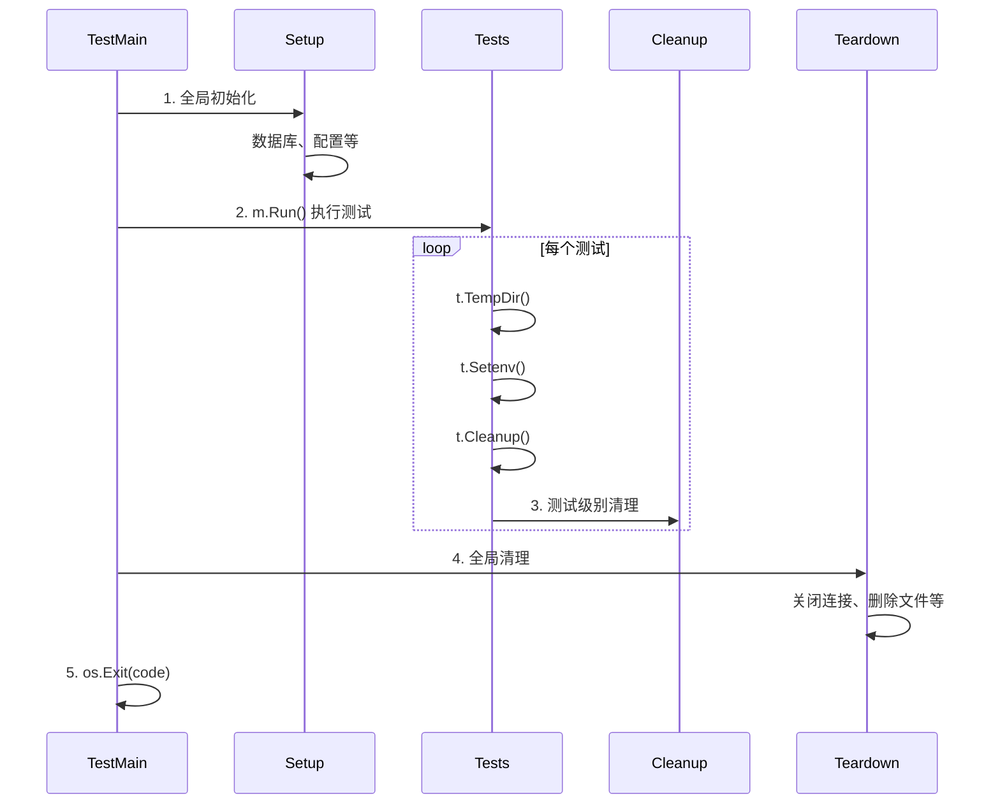

import { Badge } from "@rspress/core/theme";
import { Callout } from "@rspress/core/theme-original";

# TestMain

<Badge text="中级" type="warning" /> <Badge text="Go 1.0+" type="info" />

TestMain 允许你在测试运行前后的全局 setup 和 teardown，用于初始化测试环境。

## 基本用法

```go
package main

import (
    "fmt"
    "os"
    "testing"
)

func TestMain(m *testing.M) {
    fmt.Println("测试开始前的全局设置")

    // Setup 代码
    setupTestEnvironment()

    // 运行测试
    code := m.Run()

    // Teardown 代码
    cleanupTestEnvironment()

    fmt.Println("测试结束，清理完成")

    // 设置退出码
    os.Exit(code)
}

func setupTestEnvironment() {
    fmt.Println("设置测试环境...")
}

func cleanupTestEnvironment() {
    fmt.Println("清理测试环境...")
}

func TestSomething(t *testing.T) {
    t.Log("运行测试...")
}
```

## 使用场景

### 数据库初始化

```go
package db_test

import (
    "database/sql"
    "os"
    "testing"

    _ "github.com/lib/pq"
)

var testDB *sql.DB

func TestMain(m *testing.M) {
    // 设置测试数据库
    dsn := os.Getenv("TEST_DATABASE_URL")
    if dsn == "" {
        dsn = "postgres://localhost/testdb?sslmode=disable"
    }

    var err error
    testDB, err = sql.Open("postgres", dsn)
    if err != nil {
        panic(err)
    }

    // 运行迁移
    if err := runMigrations(testDB); err != nil {
        panic(err)
    }

    // 运行测试
    code := m.Run()

    // 清理
    testDB.Close()
    os.Exit(code)
}

func TestUserRepository(t *testing.T) {
    // 使用全局 testDB
    repo := NewUserRepository(testDB)
    // 测试代码...
}
```

### 测试容器启动

```go
package integration_test

import (
    "os"
    "testing"
    "time"
)

var testServer *TestServer

func TestMain(m *testing.M) {
    // 启动测试服务器
    testServer = NewTestServer()
    if err := testServer.Start(); err != nil {
        panic(err)
    }

    // 等待服务器就绪
    time.Sleep(time.Second)

    // 运行测试
    code := m.Run()

    // 停止服务器
    testServer.Stop()
    os.Exit(code)
}

func TestAPIEndpoint(t *testing.T) {
    // 使用 testServer
    resp, err := http.Get(testServer.URL + "/api/users")
    if err != nil {
        t.Fatal(err)
    }
    defer resp.Body.Close()
    // 测试代码...
}
```

<Callout type="warning" title="TestMain 注意事项">
  <strong>不要忘记调用 m.Run()</strong>

  <ul>
    <li>必须调用 <code>m.Run()</code> 来执行测试</li>
    <li>必须使用 <code>os.Exit(code)</code> 返回正确的退出码</li>
    <li>不要在 TestMain 中使用 <code>t.*</code> 方法</li>
  </ul>
</Callout>

## 全局状态管理

```go
package config_test

import (
    "os"
    "sync"
    "testing"
)

var (
    testConfig *Config
    once       sync.Once
)

func TestMain(m *testing.M) {
    // 设置环境变量
    os.Setenv("API_KEY", "test-key")
    os.Setenv("DEBUG", "true")

    // 初始化配置
    once.Do(func() {
        var err error
        testConfig, err = LoadConfig()
        if err != nil {
            panic(err)
        }
    })

    // 运行测试
    code := m.Run()

    // 清理环境变量
    os.Unsetenv("API_KEY")
    os.Unsetenv("DEBUG")

    os.Exit(code)
}

func TestConfig_APIKey(t *testing.T) {
    if testConfig.APIKey != "test-key" {
        t.Errorf("APIKey = %s, want test-key", testConfig.APIKey)
    }
}
```

## 与 t.Cleanup 配合

```go
package main

import (
    "fmt"
    "os"
    "testing"
)

func TestMain(m *testing.M) {
    // 全局 setup
    fmt.Println("全局 setup")
    db := setupGlobalDB()

    code := m.Run()

    // 全局 teardown
    db.Close()
    fmt.Println("全局 teardown")

    os.Exit(code)
}

func TestWithCleanup(t *testing.T) {
    // 测试级别的 cleanup
    tmpDir := t.TempDir()
    t.Cleanup(func() {
        fmt.Println("测试 cleanup")
    })

    // 测试代码...
}
```

## 生命周期可视化



## 并行测试

```go
package main

import (
    "os"
    "testing"
)

func TestMain(m *testing.M) {
    // 初始化共享资源
    pool := setupTestPool()
    defer pool.Close()

    // 设置环境变量
    os.Setenv("TEST_MODE", "true")

    code := m.Run()

    os.Exit(code)
}

func TestParallel1(t *testing.T) {
    t.Parallel()
    // 并行测试代码...
}

func TestParallel2(t *testing.T) {
    t.Parallel()
    // 并行测试代码...
}
```

## 完整示例

```go
// test_main_test.go
package integration

import (
    "database/sql"
    "fmt"
    "log"
    "os"
    "testing"
    "time"

    _ "github.com/lib/pq"
)

var (
    db        *sql.DB
    redis     *RedisClient
    serverURL string
)

func TestMain(m *testing.M) {
    // 1. 解析测试配置
    if err := loadTestConfig(); err != nil {
        log.Fatalf("Failed to load config: %v", err)
    }

    // 2. 启动依赖服务
    db = setupTestDB()
    defer teardownTestDB(db)

    redis = setupTestRedis()
    defer teardownTestRedis(redis)

    // 3. 运行数据库迁移
    if err := runMigrations(db); err != nil {
        log.Fatalf("Migration failed: %v", err)
    }

    // 4. 启动测试服务器
    server := startTestServer(db, redis)
    serverURL = server.URL
    defer server.Close()

    log.Printf("Test environment ready: server=%s", serverURL)

    // 5. 运行测试
    code := m.Run()

    // 6. 清理
    log.Println("Cleaning up test environment...")
    os.Exit(code)
}

func setupTestDB() *sql.DB {
    dsn := "postgres://localhost:5432/testdb?sslmode=disable"
    db, err := sql.Open("postgres", dsn)
    if err != nil {
        log.Fatalf("Failed to connect to database: %v", err)
    }

    // 测试连接
    if err := db.Ping(); err != nil {
        log.Fatalf("Failed to ping database: %v", err)
    }

    return db
}

func teardownTestDB(db *sql.DB) {
    // 清理测试数据
    db.Exec("DROP TABLE IF EXISTS users")
    db.Exec("DROP TABLE IF EXISTS products")
    db.Close()
}

func setupTestRedis() *RedisClient {
    client := NewRedisClient("localhost:6379")
    if err := client.Ping(); err != nil {
        log.Fatalf("Failed to connect to Redis: %v", err)
    }
    return client
}

func teardownTestRedis(redis *RedisClient) {
    redis.FlushAll()
    redis.Close()
}

func startTestServer(db *sql.DB, redis *RedisClient) *TestServer {
    server := NewTestServer(db, redis)
    if err := server.Start(); err != nil {
        log.Fatalf("Failed to start server: %v", err)
    }

    // 等待服务器就绪
    for i := 0; i < 10; i++ {
        if server.Ready() {
            break
        }
        time.Sleep(100 * time.Millisecond)
    }

    return server
}

// 测试示例
func TestUserAPI_Create(t *testing.T) {
    resp, err := http.Post(serverURL+"/api/users", "application/json", strings.NewReader(`{"name":"Alice"}`))
    if err != nil {
        t.Fatal(err)
    }
    defer resp.Body.Close()

    if resp.StatusCode != 201 {
        t.Errorf("got status %d, want 201", resp.StatusCode)
    }
}

func TestUserAPI_List(t *testing.T) {
    resp, err := http.Get(serverURL + "/api/users")
    if err != nil {
        t.Fatal(err)
    }
    defer resp.Body.Close()

    if resp.StatusCode != 200 {
        t.Errorf("got status %d, want 200", resp.StatusCode)
    }
}
```

## 练习

1. **编写 TestMain**：为使用数据库的服务编写 TestMain

<details>
<summary>查看答案</summary>

```go
// service_test.go
package service_test

import (
    "database/sql"
    "fmt"
    "log"
    "os"
    "testing"

    _ "github.com/mattn/go-sqlite3"
)

var testDB *sql.DB

func TestMain(m *testing.M) {
    // 创建内存数据库
    var err error
    testDB, err = sql.Open("sqlite3", ":memory:")
    if err != nil {
        log.Fatalf("Failed to open database: %v", err)
    }

    // 创建表结构
    schema := `
    CREATE TABLE users (
        id INTEGER PRIMARY KEY AUTOINCREMENT,
        name TEXT NOT NULL,
        email TEXT NOT NULL UNIQUE
    );`

    if _, err := testDB.Exec(schema); err != nil {
        log.Fatalf("Failed to create schema: %v", err)
    }

    fmt.Println("Test database initialized")

    // 运行测试
    code := m.Run()

    // 清理
    testDB.Close()
    fmt.Println("Test database closed")

    os.Exit(code)
}

func TestUserService_CreateUser(t *testing.T) {
    service := NewUserService(testDB)

    user, err := service.CreateUser("Alice", "alice@example.com")
    if err != nil {
        t.Fatalf("CreateUser() error = %v", err)
    }

    if user.Name != "Alice" {
        t.Errorf("got name %s, want Alice", user.Name)
    }

    if user.ID == 0 {
        t.Error("ID should be set")
    }
}

func TestUserService_DuplicateEmail(t *testing.T) {
    service := NewUserService(testDB)

    _, err := service.CreateUser("Bob", "bob@example.com")
    if err != nil {
        t.Fatalf("CreateUser() error = %v", err)
    }

    _, err = service.CreateUser("Charlie", "bob@example.com")
    if err == nil {
        t.Error("expected error for duplicate email, got nil")
    }
}
```

**解释**：TestMain 创建了内存 SQLite 数据库并初始化表结构，所有测试共享这个数据库实例。

</details>