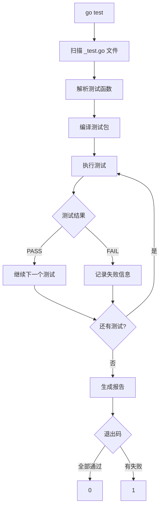

import { Badge } from "@rspress/core/theme";
import { Callout } from "@rspress/core/theme-original";

# 测试文件

<Badge text="初级" type="info" /> <Badge text="Go 1.0+" type="info" />

Go 语言的测试系统设计简洁，测试文件遵循特定的命名和组织规范。

## 测试文件命名

### 基本规则

测试文件必须以 `_test.go` 后缀命名：

```go
// calc.go - 源代码文件
package calc

func Add(a, b int) int {
    return a + b
}

// calc_test.go - 测试文件
package calc

import "testing"

func TestAdd(t *testing.T) {
    result := Add(2, 3)
    if result != 5 {
        t.Errorf("Add(2, 3) = %d; want 5", result)
    }
}
```

### 测试文件位置

```bash
# 同包测试（白盒测试）
mypackage/
├── calc.go
└── calc_test.go     # package mypackage

# 独立包测试（黑盒测试）
mypackage/
├── calc.go          # package mypackage
└── calc_test.go     # package mypackage_test
```

<Callout type="info" title="白盒 vs 黑盒测试">
  <strong>同包测试</strong>：可访问未导出的函数和变量，适合内部逻辑测试

  <strong>独立包测试</strong>：只能测试公开 API，模拟用户视角，更适合行为验证
</Callout>

## 测试函数类型

### TestXxx - 单元测试

```go
func TestAdd(t *testing.T) { ... }     // ✓ 正确
func TestAdd_Positive(t *testing.T) { ... }  // ✓ 正确
func testAdd(t *testing.T) { ... }     // ✗ 不会被执行
func Test_add(t *testing.T) { ... }    // ✗ 小写不会执行
```

### ExampleXxx - 示例测试

```go
func ExampleAdd() {
    result := Add(2, 3)
    fmt.Println(result)
    // Output: 5
}
```

### BenchmarkXxx - 基准测试

```go
func BenchmarkAdd(b *testing.B) {
    for i := 0; i < b.N; i++ {
        Add(2, 3)
    }
}
```

### FuzzXxx - 模糊测试 (Go 1.18+)

```go
func FuzzReverse(f *testing.F) {
    f.Add("hello")
    f.Fuzz(func(t *testing.T, s string) {
        // 测试逻辑
    })
}
```

## go test 命令

### 基础用法

```bash
# 运行当前包的测试
go test

# 运行所有包的测试
go test ./...

# 详细输出
go test -v

# 运行特定测试
go test -run TestAdd
go test -run "TestAdd|TestSubtract"

# 运行特定子测试
go test -run "TestAdd/positive"
```

### 常用参数

```bash
# 覆盖率
go test -cover
go test -coverprofile=coverage.out
go tool cover -html=coverage.out

# 竞态检测
go test -race

# 超时设置
go test -timeout=30s

# 并行测试数
go test -parallel=4

# 基准测试
go test -bench=.
go test -bench=. -benchmem
```

## 测试包结构

### 同包测试

```go
// math/calculator.go
package math

type Calculator struct{}

func (c *Calculator) add(a, b int) int {
    return a + b
}

func (c *Calculator) Add(a, b int) int {
    return c.add(a, b)
}

// math/calculator_test.go
package math

import "testing"

func TestCalculator_add(t *testing.T) {
    c := &Calculator{}
    // 可以测试未导出的方法
    result := c.add(2, 3)
    if result != 5 {
        t.Errorf("add() = %d; want 5", result)
    }
}
```

### 独立包测试

```go
// stringutil/util.go
package stringutil

func ToUpper(s string) string {
    // 实现
}

// stringutil/util_test.go
package stringutil_test

import (
    "testing"
    "yourmodule/stringutil"
)

func TestToUpper(t *testing.T) {
    // 只能测试公开的 API
    result := stringutil.ToUpper("hello")
    if result != "HELLO" {
        t.Errorf("ToUpper() = %s; want HELLO", result)
    }
}
```

## 构建标签

```go
// +build linux,darwin

package mypackage

import "testing"

func TestLinuxFeature(t *testing.T) {
    // 只在 Linux 和 macOS 上运行
}
```

```go
// testutil_test.go
package testutil

// +build !prod

func SetupTestDB() *sql.DB {
    // 测试专用函数
}
```

## 测试执行流程



## 练习

1. **创建第一个测试**：编写一个简单的加法函数并为其编写测试

<details>
<summary>查看答案</summary>

```go
// calc.go
package calc

func Add(a, b int) int {
    return a + b
}

// calc_test.go
package calc

import "testing"

func TestAdd(t *testing.T) {
    tests := []struct {
        name string
        a, b int
        want int
    }{
        {"positive", 2, 3, 5},
        {"negative", -2, -3, -5},
        {"zero", 0, 5, 5},
        {"mixed", -2, 3, 1},
    }

    for _, tt := range tests {
        t.Run(tt.name, func(t *testing.T) {
            got := Add(tt.a, tt.b)
            if got != tt.want {
                t.Errorf("Add(%d, %d) = %d; want %d",
                    tt.a, tt.b, got, tt.want)
            }
        })
    }
}
```

运行测试：
```bash
$ go test -v
=== RUN   TestAdd
=== RUN   TestAdd/positive
=== RUN   TestAdd/negative
=== RUN   TestAdd/zero
=== RUN   TestAdd/mixed
--- PASS: TestAdd (0.00s)
    --- PASS: TestAdd/positive (0.00s)
    --- PASS: TestAdd/negative (0.00s)
    --- PASS: TestAdd/zero (0.00s)
    --- PASS: TestAdd/mixed (0.00s)
PASS
```

**解释**：创建了基础的测试文件和测试函数，使用表驱动测试覆盖了多种场景。

</details>

2. **编写独立包测试**：使用独立包测试一个字符串处理函数

<details>
<summary>查看答案</summary>

```go
// stringutil/reverse.go
package stringutil

func Reverse(s string) string {
    runes := []rune(s)
    for i, j := 0, len(runes)-1; i < j; i, j = i+1, j-1 {
        runes[i], runes[j] = runes[j], runes[i]
    }
    return string(runes)
}

// stringutil/reverse_test.go
package stringutil_test

import (
    "testing"

    "yourmodule/stringutil"
)

func TestReverse(t *testing.T) {
    tests := []struct {
        name string
        input string
        want string
    }{
        {"normal", "hello", "olleh"},
        {"empty", "", ""},
        {"single", "a", "a"},
        {"unicode", "你好", "好你"},
    }

    for _, tt := range tests {
        t.Run(tt.name, func(t *testing.T) {
            got := stringutil.Reverse(tt.input)
            if got != tt.want {
                t.Errorf("Reverse(%q) = %q; want %q",
                    tt.input, got, tt.want)
            }
        })
    }
}
```

**解释**：使用独立包测试（`stringutil_test`）只测试公开的 `Reverse` 函数，模拟用户视角。

</details>