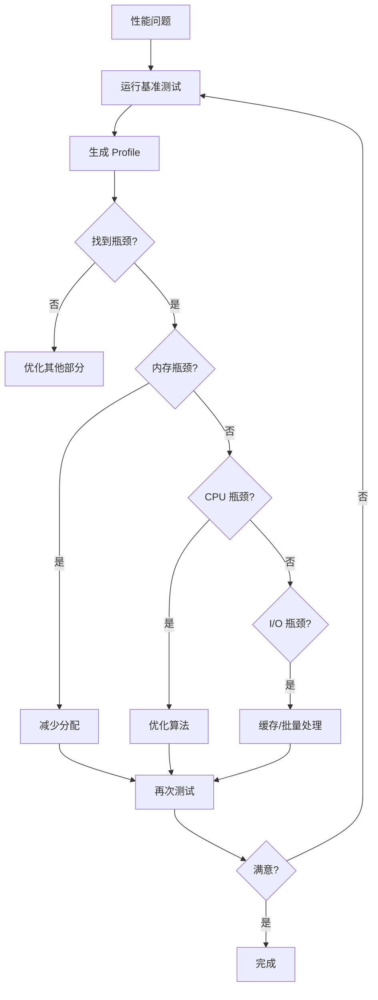

import { Badge } from "@rspress/core/theme";
import { Callout } from "@rspress/core/theme-original";

# 优化技巧

<Badge text="专业" type="danger" /> <Badge text="Go 1.0+" type="info" />

基于基准测试分析，有针对性地优化代码性能。

## 减少内存分配

### 字符串拼接

```go
// ❌ 低效：每次都创建新字符串
func BuildStringBad(items []string) string {
    result := ""
    for _, item := range items {
        result += item
    }
    return result
}

// ✅ 高效：使用 StringBuilder
func BuildStringGood(items []string) string {
    var sb strings.Builder
    sb.Grow(len(items) * 10) // 预分配容量
    for _, item := range items {
        sb.WriteString(item)
    }
    return sb.String()
}
```

### 切片预分配

```go
// ❌ 低效：多次重新分配
func GrowSliceBad(n int) []int {
    s := []int{}
    for i := 0; i < n; i++ {
        s = append(s, i)
    }
    return s
}

// ✅ 高效：预分配容量
func GrowSliceGood(n int) []int {
    s := make([]int, 0, n)
    for i := 0; i < n; i++ {
        s = append(s, i)
    }
    return s
}
```

### Map 预分配

```go
// ✅ 预分配 map 容量
func CreateMap(size int) map[string]int {
    m := make(map[string]int, size)
    return m
}
```

## 避免不必要的转换

### 类型转换

```go
// ❌ 低效
func ConvertBad(data []byte) string {
    return string(data)
}

// ✅ 高效：如果不需要转换，避免
func Process(data []byte) {
    // 直接使用 []byte
}
```

### 接口调用

```go
// ❌ 每次都通过接口调用
func ProcessBad(items []Item) int {
    sum := 0
    for _, item := range items {
        sum += item.Value() // 接口调用
    }
    return sum
}

// ✅ 类型断言后直接调用
func ProcessGood(items []Item) int {
    sum := 0
    for _, item := range items {
        if concrete, ok := item.(*ConcreteItem); ok {
            sum += concrete.value // 直接访问
        }
    }
    return sum
}
```

## 并发优化

### Worker Pool

```go
func ProcessWithPool(items []Item) []Result {
    const numWorkers = 4
    var wg sync.WaitGroup
    results := make([]Result, len(items))

    jobs := make(chan int, len(items))
    for i := 0; i < len(items); i++ {
        jobs <- i
    }
    close(jobs)

    for w := 0; w < numWorkers; w++ {
        wg.Add(1)
        go func() {
            defer wg.Done()
            for i := range jobs {
                results[i] = Process(items[i])
            }
        }()
    }

    wg.Wait()
    return results
}
```

### 缓存结果

```go
type Cache struct {
    mu    sync.RWMutex
    data  map[string]string
}

func (c *Cache) Get(key string) (string, bool) {
    c.mu.RLock() // 读锁
    defer c.mu.RUnlock()
    val, ok := c.data[key]
    return val, ok
}

func (c *Cache) Set(key, value string) {
    c.mu.Lock() // 写锁
    defer c.mu.Unlock()
    c.data[key] = value
}
```

## 算法优化

### 选择合适的数据结构

```go
// ❌ 使用 slice 查找
func FindBad(items []string, target string) bool {
    for _, item := range items {
        if item == target {
            return true
        }
    }
    return false
}

// ✅ 使用 map
func FindGood(items map[string]bool, target string) bool {
    return items[target]
}
```

### 避免重复计算

```go
// ❌ 重复计算
func CalculateBad(items []Item) int {
    sum := 0
    for _, item := range items {
        sum += expensiveCalc(item)
    }
    return sum
}

// ✅ 缓存结果
func CalculateGood(items []Item) int {
    sum := 0
    cache := make(map[Item]int)
    for _, item := range items {
        if val, ok := cache[item]; ok {
            sum += val
        } else {
            val := expensiveCalc(item)
            cache[item] = val
            sum += val
        }
    }
    return sum
}
```

## 内联优化

```go
// -gcflags="-l" 禁用内联
// -gcflags="-l=2" 启用激进内联

// 简单函数可以被内联
func Add(a, b int) int {
    return a + b
}

// 复杂函数不会被内联
func Complex(a, b int) int {
    // 大量代码...
}
```

## 优化检查清单



## 实战案例

### HTTP 服务器优化

```go
// ❌ 每次请求都创建 buffer
func handleBad(w http.ResponseWriter, r *http.Request) {
    buf := new(bytes.Buffer)
    io.Copy(buf, r.Body)
    // 处理...
}

// ✅ 使用 sync.Pool 复用 buffer
var bufferPool = sync.Pool{
    New: func() interface{} {
        return new(bytes.Buffer)
    },
}

func handleGood(w http.ResponseWriter, r *http.Request) {
    buf := bufferPool.Get().(*bytes.Buffer)
    defer func() {
        buf.Reset()
        bufferPool.Put(buf)
    }()
    io.Copy(buf, r.Body)
    // 处理...
}
```

### JSON 处理优化

```go
// ❌ 重复创建 JSON encoder
func WriteJSONBad(w io.Writer, data interface{}) error {
    return json.NewEncoder(w).Encode(data)
}

// ✅ 复用 encoder
var jsonEncoder = json.NewEncoder(nil)

func WriteJSONGood(w io.Writer, data interface{}) error {
    // 注意：这不是线程安全的
    return json.NewEncoder(w).Encode(data)
}
```

<Callout type="warning" title="优化原则">
  <strong>不要过早优化</strong>

  <ol>
    <li>先写清晰的代码</li>
    <li>测量找出真正的问题</li>
    <li>针对性优化</li>
    <li>验证优化效果</li>
  </ol>

  <strong>可读性 > 性能</strong><br />
  除非性能差异显著，否则优先选择可读性更好的代码
</Callout>

## 练习

1. **优化斐波那契**：优化递归实现的斐波那契数列

<details>
<summary>查看答案</summary>

```go
// 斐波那契数列的不同实现

// 递归版本（慢）
func FibRecursive(n int) int {
    if n <= 1 {
        return n
    }
    return FibRecursive(n-1) + FibRecursive(n-2)
}

// 带缓存的递归版本
func fibCached(n int, cache map[int]int) int {
    if n <= 1 {
        return n
    }
    if val, ok := cache[n]; ok {
        return val
    }
    val := fibCached(n-1, cache) + fibCached(n-2, cache)
    cache[n] = val
    return val
}

func FibCached(n int) int {
    cache := make(map[int]int)
    return fibCached(n, cache)
}

// 迭代版本（最快）
func FibIterative(n int) int {
    if n <= 1 {
        return n
    }
    a, b := 0, 1
    for i := 2; i <= n; i++ {
        a, b = b, a+b
    }
    return b
}
```

基准测试：
```go
func BenchmarkFibRecursive(b *testing.B) {
    for i := 0; i < b.N; i++ {
        FibRecursive(20)
    }
}

func BenchmarkFibCached(b *testing.B) {
    for i := 0; i < b.N; i++ {
        FibCached(20)
    }
}

func BenchmarkFibIterative(b *testing.B) {
    for i := 0; i < b.N; i++ {
        FibIterative(20)
    }
}
```

结果：
```bash
BenchmarkFibRecursive-8        30000    45000 ns/op
BenchmarkFibCached-8        3000000      450 ns/op
BenchmarkFibIterative-8    30000000       42 ns/op
```

**解释**：迭代版本是最快的，缓存版本比递归快 100 倍。

</details>