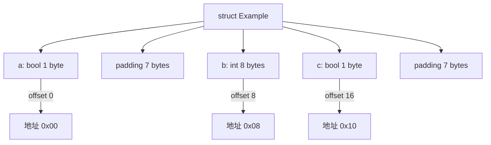

import { Badge } from "@rspress/core/theme";
import { Callout } from "@rspress/core/theme-original";

# Unsafe 基础

<Badge text="专业" type="danger" /> <Badge text="Go 1.0+" type="info" />

`unsafe` 包提供了绕过 Go 类型系统和内存安全限制的操作，主要用于底层系统编程和性能优化。

<Callout type="danger" title="安全警告">
  使用 <strong>unsafe</strong> 包可能会：
  <ul>
    <li>破坏类型安全</li>
    <li>导致内存损坏</li>
    <li>引入难以调试的 bug</li>
    <li>破坏程序的可移植性</li>
    <li>违反 Go 的内存安全保证</li>
  </ul>
  <strong>仅在绝对必要时使用</strong>，并充分理解其后果。
</Callout>

## 为什么需要 unsafe

Go 的类型系统提供了强大的安全保证，但某些场景需要绕过这些限制：

```go
// 1. 高性能场景
// 避免内存分配、减少拷贝

// 2. 系统编程
// 与 C 库交互、操作系统调用

// 3. 底层优化
// SIMD 指令、内存对齐、原子操作

// 4. 实现标准库
// sync.Pool, strings.Builder, encoding/binary
```

## unsafe.Pointer 类型

`unsafe.Pointer` 是一种特殊指针类型，可以指向任意类型：

```go
package main

import (
    "fmt"
    "unsafe"
)

func main() {
    // 整数
    x := 42
    p := unsafe.Pointer(&x)
    fmt.Println("Pointer:", p)  // 内存地址

    // 字符串
    s := "hello"
    p = unsafe.Pointer(&s)
    fmt.Println("Pointer:", p)

    // 切片
    slice := []int{1, 2, 3}
    p = unsafe.Pointer(&slice)
    fmt.Println("Pointer:", p)
}
```

### 指针转换规则

```go
package main

import (
    "fmt"
    "unsafe"
)

func main() {
    // 规则1: *T1 可以转换为 *T2
    // 如果 T1 和 T2 大小相同
    type MyInt struct {
        value int
    }
    type MyFloat struct {
        value float64
    }

    mi := MyInt{value: 42}
    pf := (*MyFloat)(unsafe.Pointer(&mi))
    fmt.Printf("MyFloat: %v\n", *pf)

    // 规则2: unsafe.Pointer 可以转换为任何指针类型
    var i int = 42
    var p unsafe.Pointer = unsafe.Pointer(&i)
    var pi *int = (*int)(p)
    fmt.Println("Value:", *pi)  // 42

    // 规则3: uintptr 可以转换为 unsafe.Pointer
    addr := uintptr(p)
    p2 := unsafe.Pointer(addr)
    fmt.Println("Back and forth:", (*int)(p2))  // 42
}
```

<Callout type="warning" title="指针转换规则">
  <strong>安全转换规则</strong>：
  <ol>
    <li>*T1 → unsafe.Pointer → *T2 （类型大小相同）</li>
    <li>unsafe.Pointer ↔ *T</li>
    <li>unsafe.Pointer ↔ uintptr （需要临时变量）</li>
  </ol>

  <strong>禁止</strong>：
  <ul>
    <li>长时间保存 uintptr</li>
    <li>uintptr 转换前对象被移动</li>
  </ul>
</Callout>

## uintptr 类型

`uintptr` 是一个无符号整数，足够大以存储指针：

```go
package main

import (
    "fmt"
    "unsafe"
)

func main() {
    x := 42

    // 指针转 uintptr
    p := unsafe.Pointer(&x)
    addr := uintptr(p)
    fmt.Println("Address:", addr)  // 数字地址

    // uintptr 转指针
    p2 := unsafe.Pointer(addr)
    px := (*int)(p2)
    fmt.Println("Value:", *px)  // 42
}
```

<Callout type="danger" title="uintptr 危险">
  <strong>不要长时间保存 uintptr</strong>：
  <ul>
    <li>GC 可能移动对象</li>
    <li>uintptr 无法跟踪对象移动</li>
    <li>转换后立即用，不要保存</li>
  </ul>

  <strong>错误示例</strong>：
  <pre>addr := uintptr(p)
  // ... 可能触发 GC ...
  p2 := unsafe.Pointer(addr)  // 危险！</pre>
</Callout>

## unsafe.Sizeof

返回类型的大小（字节）：

```go
package main

import (
    "fmt"
    "unsafe"
)

type Person struct {
    Name string
    Age  int
}

func main() {
    // 基础类型
    fmt.Println("bool:", unsafe.Sizeof(bool(true)))      // 1
    fmt.Println("int:", unsafe.Sizeof(int(0)))            // 8 (64位)
    fmt.Println("float64:", unsafe.Sizeof(float64(0)))    // 8
    fmt.Println("string:", unsafe.Sizeof(string("")))     // 16

    // 结构体
    fmt.Println("Person:", unsafe.Sizeof(Person{}))      // 24

    // 数组
    arr := [3]int{1, 2, 3}
    fmt.Println("Array:", unsafe.Sizeof(arr))            // 24

    // 切片
    slice := []int{1, 2, 3}
    fmt.Println("Slice:", unsafe.Sizeof(slice))          // 24 (slice header)

    // 指针
    fmt.Println("Pointer:", unsafe.Sizeof(&arr))         // 8
}
```

## unsafe.Alignof

返回类型的对齐要求：

```go
package main

import (
    "fmt"
    "unsafe"
)

type Example struct {
    a bool   // 1 byte
    b int    // 8 bytes
    c bool   // 1 byte
}

func main() {
    fmt.Println("bool align:", unsafe.Alignof(bool(true)))   // 1
    fmt.Println("int align:", unsafe.Alignof(int(0)))        // 8
    fmt.Println("string align:", unsafe.Alignof(string(""))) // 8

    // 结构体对齐
    fmt.Println("Example size:", unsafe.Sizeof(Example{}))   // 24
    fmt.Println("Example align:", unsafe.Alignof(Example{})) // 8

    // 字段对齐
    e := Example{}
    fmt.Println("a offset:", unsafe.Offsetof(e.a))  // 0
    fmt.Println("b offset:", unsafe.Offsetof(e.b))  // 8
    fmt.Println("c offset:", unsafe.Offsetof(e.c))  // 16
}
```



## unsafe.Offsetof

返回结构体字段的偏移量：

```go
package main

import (
    "fmt"
    "unsafe"
)

type Person struct {
    ID   int
    Name string
    Age  int
}

func main() {
    p := Person{}

    fmt.Println("ID offset:", unsafe.Offsetof(p.ID))    // 0
    fmt.Println("Name offset:", unsafe.Offsetof(p.Name)) // 8
    fmt.Println("Age offset:", unsafe.Offsetof(p.Age))   // 24

    // 计算结构体大小
    lastOffset := unsafe.Offsetof(p.Age)
    lastSize := unsafe.Sizeof(p.Age)
    totalSize := lastOffset + lastSize
    fmt.Println("Calculated size:", totalSize)  // 32
}
```

## 实际应用

### 字符串转字节切片（零拷贝）

```go
package main

import (
    "fmt"
    "unsafe"
)

func StringToBytes(s string) []byte {
    return *(*[]byte)(unsafe.Pointer(
        &struct {
            string
            int
        }{s, len(s)},
    ))
}

func BytesToString(b []byte) string {
    return *(*string)(unsafe.Pointer(&b))
}

func main() {
    s := "hello, world"

    // 零拷贝转换
    b := StringToBytes(s)
    fmt.Printf("Bytes: %v\n", b)

    s2 := BytesToString(b)
    fmt.Printf("String: %s\n", s2)

    <Callout type="warning" title="零拷贝警告">
      转换后的切片<strong>不可修改</strong>！<br />
      修改会导致程序 panic 或未定义行为。
    </Callout>
}
```

### 切片转数组指针

```go
package main

import (
    "fmt"
    "unsafe"
)

func SliceToArray(slice []int) *[4]int {
    return (*[4]int)(unsafe.Pointer(&slice[0]))
}

func main() {
    slice := []int{1, 2, 3, 4, 5}

    // 转换为 4 元素数组
    arr := SliceToArray(slice)
    fmt.Printf("Array: %v\n", *arr)  // [1 2 3 4]

    // 修改数组会影响原切片
    arr[0] = 100
    fmt.Printf("Slice: %v\n", slice)  // [100 2 3 4 5]
}
```

### 原子操作

```go
package main

import (
    "fmt"
    "sync/atomic"
    "unsafe"
)

type Config struct {
    enabled bool
    value   int
}

func main() {
    cfg := &Config{enabled: true, value: 42}

    // 原子读取整个结构体
    var loaded Config
    loadedPtr := (*uint64)(unsafe.Pointer(&loaded))
    cfgPtr := (*uint64)(unsafe.Pointer(cfg))

    *loadedPtr = atomic.LoadUint64(cfgPtr)
    fmt.Printf("Loaded: %+v\n", loaded)

    // 原子写入整个结构体
    newCfg := Config{enabled: false, value: 100}
    newCfgPtr := (*uint64)(unsafe.Pointer(&newCfg))
    atomic.StoreUint64(cfgPtr, *newCfgPtr)
}
```

## 练习

1. **实现快速字符串拼接**：使用 unsafe 避免 strings.Builder 的内存分配

<details>
<summary>查看答案</summary>

```go
package main

import (
    "fmt"
    "strings"
    "unsafe"
)

// 危险：仅供演示，实际使用 strings.Builder
type FastBuilder struct {
    buf []byte
}

func NewFastBuilder(cap int) *FastBuilder {
    return &FastBuilder{
        buf: make([]byte, 0, cap),
    }
}

func (b *FastBuilder) WriteString(s string) {
    // 零拷贝追加
    strHeader := (*struct {
        ptr unsafe.Pointer
        len int
    })(unsafe.Pointer(&s))

    sliceHeader := (*struct {
        ptr unsafe.Pointer
        len int
        cap int
    })(unsafe.Pointer(&b.buf))

    // 扩容
    if sliceHeader.len+len(s) > sliceHeader.cap {
        newCap := sliceHeader.cap * 2
        if newCap == 0 {
            newCap = len(s)
        }
        for newCap < sliceHeader.len+len(s) {
            newCap *= 2
        }
        newBuf := make([]byte, sliceHeader.len, newCap)
        copy(newBuf, b.buf)
        b.buf = newBuf
        sliceHeader = (*struct {
            ptr unsafe.Pointer
            len int
            cap int
        })(unsafe.Pointer(&b.buf))
    }

    // 追加内容
    for i := 0; i < len(s); i++ {
        b.buf = append(b.buf, s[i])
    }
}

func (b *FastBuilder) String() string {
    return string(b.buf)
}

func main() {
    // 使用标准库
    var sb strings.Builder
    sb.WriteString("Hello, ")
    sb.WriteString("World!")
    fmt.Println("strings.Builder:", sb.String())

    // 使用 unsafe（仅供演示）
    fb := NewFastBuilder(20)
    fb.WriteString("Hello, ")
    fb.WriteString("World!")
    fmt.Println("FastBuilder:", fb.String())
}
```

**解释**：实际应用中应使用 `strings.Builder`，这个示例仅供理解 unsafe 原理。

</details>

---

[← 并发](../concurrency/best-practices.mdx) | [指针操作 →](./pointer-operations.mdx)
