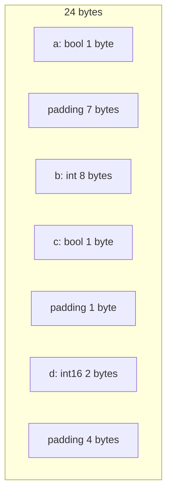
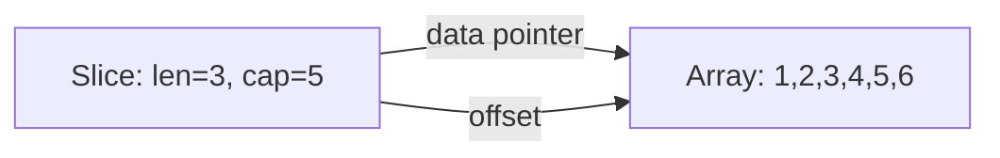

import { Badge } from "@rspress/core/theme";
import { Callout } from "@rspress/core/theme-original";

# 内存布局

<Badge text="专业" type="danger" /> <Badge text="Go 1.0+" type="info" />

理解 Go 类型的内存布局对于性能优化和系统编程至关重要。

## 基础类型的内存布局

### 布尔类型

```go
bool: 1 byte
值: false (0x00) 或 true (0x01)
```

### 整数类型

```go
// 有符号整数
int8:   1 byte  (-128 to 127)
int16:  2 bytes (-32768 to 32767)
int32:  4 bytes
int64:  8 bytes

// 无符号整数
uint8:  1 byte  (0 to 255)
uint16: 2 bytes (0 to 65535)
uint32: 4 bytes
uint64: 8 bytes

// 平台相关
int:    4 bytes (32位) / 8 bytes (64位)
uint:   4 bytes (32位) / 8 bytes (64位)
uintptr: 4 bytes (32位) / 8 bytes (64位)
```

### 浮点类型

```go
float32: 4 bytes  (IEEE 754 single precision)
float64: 8 bytes  (IEEE 754 double precision)
```

### 字符串类型

```go
// 字符串是 2 字节的结构体
type string struct {
    ptr unsafe.Pointer  // 8 bytes (64位)
    len int             // 8 bytes (64位)
}
// 总共 16 bytes

// 内容存储在只读内存中
```

### 切片类型

```go
// 切片是 3 字段的结构体
type slice struct {
    ptr unsafe.Pointer  // 8 bytes
    len int             // 8 bytes
    cap int             // 8 bytes
}
// 总共 24 bytes

// 指向底层数组
```

### 接口类型

```go
// 空接口
type eface struct {
    _type *_type       // 8 bytes
    data  unsafe.Pointer  // 8 bytes
}
// 总共 16 bytes

// 非空接口
type iface struct {
    tab  *itab         // 8 bytes
    data unsafe.Pointer  // 8 bytes
}
// 总共 16 bytes
```

## 结构体内存布局

### 基本布局规则

```go
package main

import (
    "fmt"
    "unsafe"
)

type Example struct {
    a bool   // 1 byte
    b int    // 8 bytes
    c bool   // 1 byte
    d int16  // 2 bytes
}

func main() {
    fmt.Printf("Size: %d bytes\n", unsafe.Sizeof(Example{}))  // 24
    fmt.Printf("Align: %d bytes\n", unsafe.Alignof(Example{})) // 8

    e := Example{}
    fmt.Printf("a offset: %d\n", unsafe.Offsetof(e.a))  // 0
    fmt.Printf("b offset: %d\n", unsafe.Offsetof(e.b))  // 8
    fmt.Printf("c offset: %d\n", unsafe.Offsetof(e.c))  // 16
    fmt.Printf("d offset: %d\n", unsafe.Offsetof(e.d))  // 18
}
```



### 内存对齐

```go
package main

import (
    "fmt"
    "unsafe"
)

// 对齐规则：
// 1. 字段偏移量必须是字段大小的整数倍
// 2. 结构体大小必须是最大字段大小的整数倍

type Aligned struct {
    a int8   // 1 byte, offset 0
    _ int8   // 1 byte padding
    _ int16  // 2 bytes padding
    b int32  // 4 bytes, offset 4
    c int64  // 8 bytes, offset 8
    d int8   // 1 byte, offset 16
    _ [7]int8 // 7 bytes padding
    // 总共 24 bytes，8 的倍数
}

func main() {
    fmt.Printf("Size: %d\n", unsafe.Sizeof(Aligned{}))  // 24
    fmt.Printf("Align: %d\n", unsafe.Alignof(Aligned{})) // 8
}
```

### 字段重排优化

```go
package main

import (
    "fmt"
    "unsafe"
)

// ❌ 未优化
type Bad struct {
    a int8   // 1 byte
    b int64  // 8 bytes
    c int8   // 1 byte
    d int64  // 8 bytes
}

// ✅ 已优化
type Good struct {
    b int64  // 8 bytes
    d int64  // 8 bytes
    a int8   // 1 byte
    c int8   // 1 byte
}

func main() {
    fmt.Printf("Bad:   %d bytes\n", unsafe.Sizeof(Bad{}))   // 32
    fmt.Printf("Good:  %d bytes\n", unsafe.Sizeof(Good{}))  // 24
}
```

## 数组内存布局

### 固定大小数组

```go
package main

import (
    "fmt"
    "unsafe"
)

func main() {
    // 一维数组
    arr1 := [4]int32{1, 2, 3, 4}
    fmt.Printf("Size: %d bytes\n", unsafe.Sizeof(arr1))  // 16

    // 二维数组
    arr2 := [2][3]int{
        {1, 2, 3},
        {4, 5, 6},
    }
    fmt.Printf("Size: %d bytes\n", unsafe.Sizeof(arr2))  // 48

    // 访问元素
    base := unsafe.Pointer(&arr2[0][0])

    // arr2[0][0] 的地址
    elem0 := (*int)(unsafe.Pointer(uintptr(base)))
    fmt.Printf("arr2[0][0] = %d\n", *elem0)

    // arr2[1][2] 的地址
    elem := (*int)(unsafe.Pointer(
        uintptr(base) + uintptr(1*3+2)*unsafe.Sizeof(int(0)),
    ))
    fmt.Printf("arr2[1][2] = %d\n", *elem)  // 6
}
```

### 数组内存连续性

```go
package main

import (
    "fmt"
    "unsafe"
)

func main() {
    arr := [4]int32{1, 2, 3, 4}

    // 验证内存连续性
    base := uintptr(unsafe.Pointer(&arr[0]))

    for i := 0; i < len(arr); i++ {
        addr := uintptr(unsafe.Pointer(&arr[i]))
        offset := addr - base
        fmt.Printf("arr[%d] offset: %d\n", i, offset)
    }
    // arr[0] offset: 0
    // arr[1] offset: 4
    // arr[2] offset: 8
    // arr[3] offset: 12
}
```

## 切片内存布局

### 切片与数组的关系

```go
package main

import (
    "fmt"
    "unsafe"
)

func main() {
    // 底层数组
    arr := [6]int{1, 2, 3, 4, 5, 6}

    // 创建切片
    slice := arr[1:4]  // [2, 3, 4]

    fmt.Printf("Slice length: %d\n", len(slice))  // 3
    fmt.Printf("Slice capacity: %d\n", cap(slice)) // 5

    // 切片 header
    type sliceHeader struct {
        data unsafe.Pointer
        len  int
        cap  int
    }

    header := (*sliceHeader)(unsafe.Pointer(&slice))
    fmt.Printf("Data: %p\n", header.data)
    fmt.Printf("Len: %d\n", header.len)
    fmt.Printf("Cap: %d\n", header.cap)

    // 第一个元素与数组的关系
    fmt.Printf("arr[1] == slice[0]: %v\n",
        arr[1] == slice[0])  // true
}
```



### 多个切片共享底层数组

```go
package main

import (
    "fmt"
)

func main() {
    arr := [6]int{1, 2, 3, 4, 5, 6}

    s1 := arr[0:3]  // [1, 2, 3]
    s2 := arr[2:5]  // [3, 4, 5]

    // 修改 s1 会影响 arr 和 s2
    s1[2] = 100

    fmt.Println("arr:", arr)  // [1 2 100 4 5 6]
    fmt.Println("s1:", s1)    // [1 2 100]
    fmt.Println("s2:", s2)    // [100 4 5]
}
```

## Map 内存布局

### 哈希表结构

```go
// hmap 是 map 的底层结构
type hmap struct {
    count     int       // 元素数量
    flags     uint8     // 状态标志
    B         uint8     // 桶数量的对数
    noverflow uint16    // 溢出桶数量
    hash0     uint32    // 哈希种子
    buckets   unsafe.Pointer  // 桶数组
    oldbuckets unsafe.Pointer  // 扩容时的旧桶
    nevacuate uintptr   // 搬迁进度
    extra     *mapextra // 额外信息
}

// bucket 是单个桶的结构
type bmap struct {
    tophash [bucketCnt]uint8  // 哈希高8位
    // 接着是 key
    // 然后是 value
    // 最后是溢出指针
}
```

### Map 内存使用

```go
package main

import (
    "fmt"
    "unsafe"
)

func main() {
    m := make(map[string]int)

    // 添加元素
    for i := 0; i < 10; i++ {
        m[fmt.Sprintf("key%d", i)] = i
    }

    // map header 大小
    fmt.Printf("Map header size: %d bytes\n",
        unsafe.Sizeof(m))  // 8 (指针)

    // 每个 bucket 的大小 (Go 1.18+)
    // bucketCnt = 8
    // 每个桶最多 8 个 key-value 对
}
```

## 通道内存布局

### Channel 结构

```go
type hchan struct {
    qcount   uint           // 队列中数据数量
    dataqsiz uint           // 环形队列大小
    buf      unsafe.Pointer // 环形队列指针
    elemsize uint16         // 元素大小
    closed   uint32         // 关闭标志
    elemtype *_type         // 元素类型
    sendx    uint           // 发送索引
    recvx    uint           // 接收索引
    recvq    waitq          // 接收等待队列
    sendq    waitq          // 发送等待队列
    lock     mutex          // 互斥锁
}
```

### 无缓冲 vs 有缓冲通道

```go
package main

import (
    "fmt"
    "unsafe"
)

func main() {
    // 无缓冲通道
    unbuffered := make(chan int)
    fmt.Printf("Unbuffered: %d bytes\n",
        unsafe.Sizeof(unbuffered))  // ~112 bytes

    // 有缓冲通道
    buffered := make(chan int, 10)
    fmt.Printf("Buffered: %d bytes\n",
        unsafe.Sizeof(buffered))  // ~112 + 10*8 = ~192 bytes
}
```

## 接口内存布局

### 空接口

```go
package main

import (
    "fmt"
    "unsafe"
)

type eface struct {
    _type unsafe.Pointer  // 类型信息
    data  unsafe.Pointer  // 数据指针
}

func main() {
    var a any = 42

    // 查看空接口的内部结构
    e := (*eface)(unsafe.Pointer(&a))
    fmt.Printf("Type: %p\n", e._type)
    fmt.Printf("Data: %p\n", e.data)

    // 存储指针
    var p *int = new(int)
    *p = 100
    a = p

    e = (*eface)(unsafe.Pointer(&a))
    fmt.Printf("Pointer Data: %p\n", e.data)  // 直接存储指针
}
```

### 非空接口

```go
package main

import (
    "fmt"
    "unsafe"
)

type Stringer interface {
    String() string
}

type Person struct {
    Name string
}

func (p Person) String() string {
    return p.Name
}

type iface struct {
    tab  unsafe.Pointer  // itab 指针
    data unsafe.Pointer  // 数据指针
}

func main() {
    var s Stringer = Person{Name: "Alice"}

    // 查看接口的内部结构
    i := (*iface)(unsafe.Pointer(&s))
    fmt.Printf("Tab: %p\n", i.tab)
    fmt.Printf("Data: %p\n", i.data)
}
```

## 内存布局优化

### 减少内存占用

```go
package main

import (
    "fmt"
    "unsafe"
)

// ❌ 浪费内存
type Point struct {
    X float64
    Y float64
    Z float64
    Label string
}

// ✅ 节省内存
type CompactPoint struct {
    Label string
    X float64
    Y float64
    Z float64
}

func main() {
    fmt.Printf("Point: %d bytes\n", unsafe.Sizeof(Point{}))         // 32
    fmt.Printf("CompactPoint: %d bytes\n", unsafe.Sizeof(CompactPoint{})) // 32
}
```

### 使用小整数类型

```go
package main

import (
    "fmt"
    "unsafe"
)

// ❌ 使用 int
type Status struct {
    Code int     // 8 bytes
    Flag int     // 8 bytes
}

// ✅ 使用 int8
type CompactStatus struct {
    Code int8    // 1 byte
    Flag int8    // 1 byte
}

func main() {
    fmt.Printf("Status: %d bytes\n", unsafe.Sizeof(Status{}))           // 16
    fmt.Printf("CompactStatus: %d bytes\n", unsafe.Sizeof(CompactStatus{})) // 2
}
```

## 练习

1. **计算结构体大小**：预测并验证结构体的大小

<details>
<summary>查看答案</summary>

```go
package main

import (
    "fmt"
    "unsafe"
)

func predictSize(v any) int {
    return int(unsafe.Sizeof(v))
}

func main() {
    tests := []struct {
        name string
        value any
        want int
    }{
        {"bool", true, 1},
        {"int8", int8(0), 1},
        {"int16", int16(0), 2},
        {"int32", int32(0), 4},
        {"int64", int64(0), 8},
        {"string", "", 16},
        {"[]int", []int{}, 24},
        {"map[string]int", map[string]int{}, 8},
        {"chan int", make(chan int), 112}, // 平台相关
    }

    for _, tt := range tests {
        got := predictSize(tt.value)
        status := "✓"
        if got != tt.want {
            status = "✗"
        }
        fmt.Printf("%s %s: got %d, want %d\n",
            status, tt.name, got, tt.want)
    }
}
```

**解释**：理解每种类型的内存大小有助于优化内存使用。

</details>

---

[← 指针操作](./pointer-operations.mdx) | [最佳实践 →](./best-practices.mdx)
