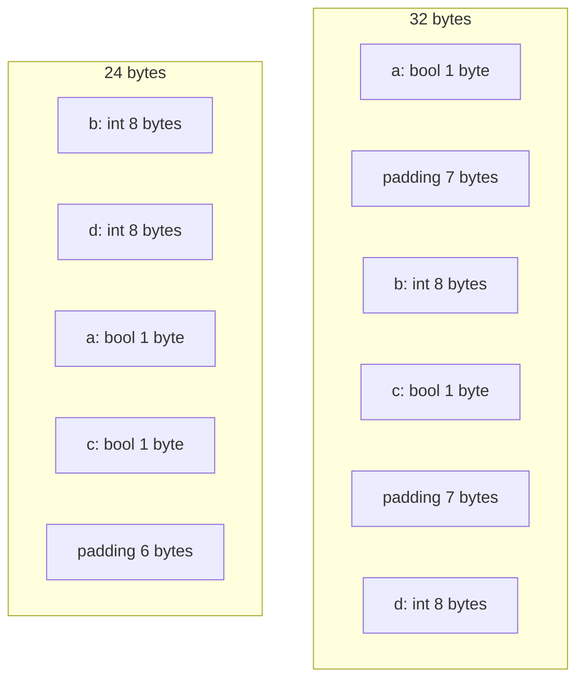

import { Badge } from "@rspress/core/theme";
import { Callout } from "@rspress/core/theme-original";

# 指针操作

<Badge text="专业" type="danger" /> <Badge text="Go 1.0+" type="info" />

使用 `unsafe` 可以进行高级指针操作，实现类型转换、内存访问等功能。

## 类型转换

### 相同大小类型转换

```go
package main

import (
    "fmt"
    "unsafe"
)

type MyInt struct {
    value int
}

type MyFloat struct {
    value float64
}

func main() {
    mi := MyInt{value: 42}

    // 不安全的类型转换
    pf := (*MyFloat)(unsafe.Pointer(&mi))
    fmt.Printf("MyFloat: %f\n", pf.value)  // 未定义行为

    // 正确方式：大小相同时可以安全转换
    type Bytes [8]byte
    type Int64 int64

    var b Bytes = [8]byte{1, 2, 3, 4, 5, 6, 7, 8}
    pi := (*Int64)(unsafe.Pointer(&b))
    fmt.Printf("Int64: %d\n", *pi)
}
```

### 指针类型转换

```go
package main

import (
    "fmt"
    "reflect"
    "unsafe"
)

func main() {
    // *int -> *float64 (大小相同)
    var i int = 42
    pf := (*float64)(unsafe.Pointer(&i))
    fmt.Printf("Float: %f\n", *pf)  // IEEE 754 表示

    // 检查类型大小
    fmt.Println("int size:", unsafe.Sizeof(i))      // 8
    fmt.Println("float64 size:", unsafe.Sizeof(*pf)) // 8

    // 不同大小的类型转换是危险的
    var f32 float32 = 3.14
    pi64 := (*int64)(unsafe.Pointer(&f32))  // 危险！大小不同
    fmt.Printf("Result: %d\n", *pi64)
}
```

## 数组和切片操作

### 数组转切片

```go
package main

import (
    "fmt"
    "unsafe"
)

func ArrayToSlice[T any](arr *[N]T) []T {
    return unsafe.Slice((*T)(unsafe.Pointer(&arr[0])), N)
}

func main() {
    arr := [4]int{1, 2, 3, 4}

    // 方法1：直接转换（Go 1.17+）
    slice := unsafe.Slice(&arr[0], len(arr))
    fmt.Println("Slice:", slice)  // [1 2 3 4]

    // 方法2：使用 slice header
    sliceHeader := (*struct {
        ptr unsafe.Pointer
        len int
        cap int
    })(unsafe.Pointer(&slice))

    sliceHeader.ptr = unsafe.Pointer(&arr[0])
    sliceHeader.len = len(arr)
    sliceHeader.cap = len(arr)

    fmt.Println("Slice:", slice)
}
```

### 切片转数组

```go
package main

import (
    "fmt"
    "unsafe"
)

func SliceToArray[T any, N int](slice []T) *[N]T {
    if len(slice) < N {
        panic("slice too short")
    }
    return (*[N]T)(unsafe.Pointer(&slice[0]))
}

func main() {
    slice := []int{1, 2, 3, 4, 5}

    // 转换为 3 元素数组
    arr3 := (*[3]int)(unsafe.Pointer(&slice[0]))
    fmt.Println("Array[3]:", *arr3)  // [1 2 3]

    // 修改数组会影响原切片
    arr3[0] = 100
    fmt.Println("Slice:", slice)  // [100 2 3 4 5]
}
```

### 零长度切片技巧

```go
package main

import (
    "fmt"
    "unsafe"
)

func main() {
    // 创建指向任意地址的切片
    var x int = 42
    p := unsafe.Pointer(&x)

    // 创建长度为 0 的切片
    slice := (*[1]int)(p)[:0:0]
    fmt.Printf("Slice: %v, len=%d, cap=%d\n",
        slice, len(slice), cap(slice))

    // 调整长度和容量
    slice = (*[1]int)(p)[:1:1]
    fmt.Printf("Slice: %v, len=%d, cap=%d\n",
        slice, len(slice), cap(slice))
}
```

## 字符串操作

### 字符串转字节切片（零拷贝）

```go
package main

import (
    "fmt"
    "unsafe"
)

// 危险：返回的字节切片不可修改
func StringToBytes(s string) []byte {
    stringHeader := (*struct {
        ptr unsafe.Pointer
        len int
    })(unsafe.Pointer(&s))

    sliceHeader := struct {
        ptr unsafe.Pointer
        len int
        cap int
    }{
        ptr: stringHeader.ptr,
        len: stringHeader.len,
        cap: stringHeader.len,
    }

    return *(*[]byte)(unsafe.Pointer(&sliceHeader))
}

func main() {
    s := "hello"

    b := StringToBytes(s)
    fmt.Printf("Bytes: %v\n", b)  // [104 101 108 108 111]

    // 危险：不要修改！
    // b[0] = 'H'  // 可能导致 panic

    // 正确方式：先复制
    safe := make([]byte, len(s))
    copy(safe, b)
    safe[0] = 'H'
    fmt.Printf("Safe: %s\n", safe)
}
```

### 字节切片转字符串（零拷贝）

```go
package main

import (
    "fmt"
    "unsafe"
)

// 危险：字节切片在转换期间不能被修改
func BytesToString(b []byte) string {
    return *(*string)(unsafe.Pointer(&b))
}

func main() {
    b := []byte{104, 101, 108, 108, 111}

    s := BytesToString(b)
    fmt.Printf("String: %s\n", s)  // hello

    // 危险：修改切片会影响字符串
    // b[0] = 'H'
    // fmt.Println(s)  // 未定义行为
}
```

<Callout type="danger" title="字符串只读警告">
  Go 字符串是<strong>不可变</strong>的：
  <ul>
    <li>零拷贝转换的字节切片<strong>不能修改</strong></li>
    <li>修改可能导致程序 panic</li>
    <li>仅用于只读场景（如传递给 C 函数）</li>
  </ul>
</Callout>

## 结构体操作

### 结构体字段直接访问

```go
package main

import (
    "fmt"
    "unsafe"
)

type Person struct {
    Name string
    Age  int
    Addr string
}

func main() {
    p := Person{
        Name: "Alice",
        Age:  30,
        Addr: "Beijing",
    }

    // 方法1：通过字段指针
    agePtr := (*int)(unsafe.Pointer(uintptr(unsafe.Pointer(&p)) +
        unsafe.Offsetof(p.Age)))
    *agePtr = 31
    fmt.Printf("Age: %d\n", p.Age)  // 31

    // 方法2：直接计算偏移
    namePtr := (*string)(unsafe.Pointer(
        uintptr(unsafe.Pointer(&p)) + unsafe.Offsetof(p.Name),
    ))
    *namePtr = "Bob"
    fmt.Printf("Name: %s\n", p.Name)  // Bob
}
```

### 结构体切片技巧

```go
package main

import (
    "fmt"
    "unsafe"
)

type Item struct {
    ID   int
    Name string
}

func main() {
    items := []Item{
        {ID: 1, Name: "A"},
        {ID: 2, Name: "B"},
        {ID: 3, Name: "C"},
    }

    // 访问切片元素的字段
    base := unsafe.Pointer(&items[0])

    for i := 0; i < len(items); i++ {
        // 计算元素地址
        itemPtr := (*Item)(unsafe.Pointer(
            uintptr(base) + uintptr(i)*unsafe.Sizeof(Item{}),
        ))

        fmt.Printf("Item %d: %+v\n", i, *itemPtr)
    }

    // 直接访问第二个元素的 ID 字段
    idPtr := (*int)(unsafe.Pointer(
        uintptr(base) +
            unsafe.Sizeof(Item{}) +
            unsafe.Offsetof(items[0].ID),
    ))
    fmt.Printf("Second ID: %d\n", *idPtr)  // 2
}
```

## 联合体模拟

```go
package main

import (
    "fmt"
    "unsafe"
)

// 使用 unsafe 模拟联合体
type Union struct {
    value [8]byte
}

func (u *Union) AsInt64() int64 {
    return *(*int64)(unsafe.Pointer(&u.value))
}

func (u *Union) AsFloat64() float64 {
    return *(*float64)(unsafe.Pointer(&u.value))
}

func (u *Union) SetInt64(v int64) {
    *(*int64)(unsafe.Pointer(&u.value)) = v
}

func (u *Union) SetFloat64(v float64) {
    *(*float64)(unsafe.Pointer(&u.value)) = v
}

func main() {
    var u Union

    u.SetInt64(0x0102030405060708)
    fmt.Printf("Int64: %#x\n", u.AsInt64())
    fmt.Printf("Float64: %f\n", u.AsFloat64())

    u.SetFloat64(3.14)
    fmt.Printf("Int64: %d\n", u.AsInt64())
    fmt.Printf("Float64: %f\n", u.AsFloat64())
}
```

## 内存对齐操作

### 手动对齐分配

```go
package main

import (
    "fmt"
    "unsafe"
)

func AlignedAlloc(size, align int) unsafe.Pointer {
    // 分配额外空间
    buf := make([]byte, size+align-1)

    // 计算对齐地址
    ptr := unsafe.Pointer(&buf[0])
    aligned := (uintptr(ptr) + uintptr(align-1)) &^ uintptr(align-1)

    return unsafe.Pointer(aligned)
}

func main() {
    // 分配 16 字节，16 字节对齐
    p := AlignedAlloc(16, 16)

    // 检查对齐
    addr := uintptr(p)
    fmt.Printf("Address: %#x\n", addr)
    fmt.Printf("Aligned to 16: %v\n", addr%16 == 0)
}
```

### 结构体字段重排

```go
package main

import (
    "fmt"
    "unsafe"
)

// ❌ 不好：未优化
type BadStruct struct {
    a bool   // 1 byte
    b int    // 8 bytes
    c bool   // 1 byte
    d int    // 8 bytes
}

// ✅ 好：优化排列
type GoodStruct struct {
    b int    // 8 bytes
    d int    // 8 bytes
    a bool   // 1 byte
    c bool   // 1 byte
}

func main() {
    fmt.Printf("BadStruct size: %d\n", unsafe.Sizeof(BadStruct{}))   // 32
    fmt.Printf("GoodStruct size: %d\n", unsafe.Sizeof(GoodStruct{})) // 24

    // 内存布局
    bad := BadStruct{}
    fmt.Printf("BadStruct.a offset: %d\n", unsafe.Offsetof(bad.a))  // 0
    fmt.Printf("BadStruct.b offset: %d\n", unsafe.Offsetof(bad.b))  // 8
    fmt.Printf("BadStruct.c offset: %d\n", unsafe.Offsetof(bad.c))  // 16
    fmt.Printf("BadStruct.d offset: %d\n", unsafe.Offsetof(bad.d))  // 24
}
```



## 练习

1. **实现共享内存**：使用 unsafe 实现两个变量共享同一内存

<details>
<summary>查看答案</summary>

```go
package main

import (
    "encoding/binary"
    "fmt"
    "unsafe"
)

// 共享内存区域
type SharedMemory struct {
    data [8]byte
}

func (s *SharedMemory) WriteInt64(v int64) {
    binary.LittleEndian.PutUint64(s.data[:], uint64(v))
}

func (s *SharedMemory) ReadInt64() int64 {
    return int64(binary.LittleEndian.Uint64(s.data[:]))
}

func (s *SharedMemory) WriteFloat64(v float64) {
    // 使用 unsafe 直接写入
    *(*float64)(unsafe.Pointer(&s.data[0])) = v
}

func (s *SharedMemory) ReadFloat64() float64 {
    return *(*float64)(unsafe.Pointer(&s.data[0]))
}

func (s *SharedMemory) AsBytes() []byte {
    return s.data[:]
}

func main() {
    var mem SharedMemory

    // 写入 int64
    mem.WriteInt64(0x0102030405060708)
    fmt.Printf("Int64: %#x\n", mem.ReadInt64())

    // 读取为 float64
    f := mem.ReadFloat64()
    fmt.Printf("Float64: %f\n", f)

    // 写入 float64
    mem.WriteFloat64(3.14159)
    fmt.Printf("Float64: %f\n", mem.ReadFloat64())
    fmt.Printf("Int64: %d\n", mem.ReadInt64())

    // 原始字节
    fmt.Printf("Bytes: %v\n", mem.AsBytes())
}
```

**解释**：通过共享同一块内存，不同类型可以访问相同的数据位。

</details>

---

[← Unsafe 基础](./basics.mdx) | [内存布局 →](./memory-layout.mdx)
