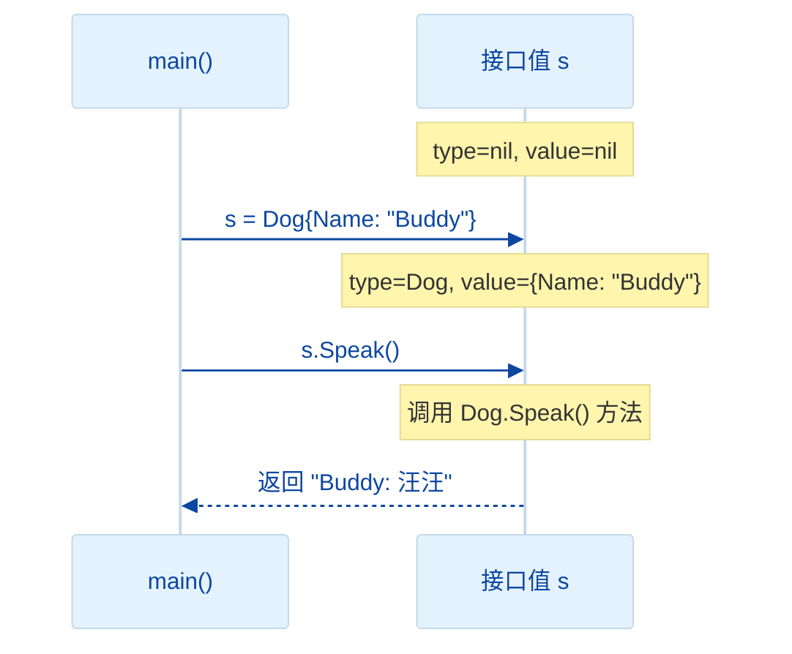
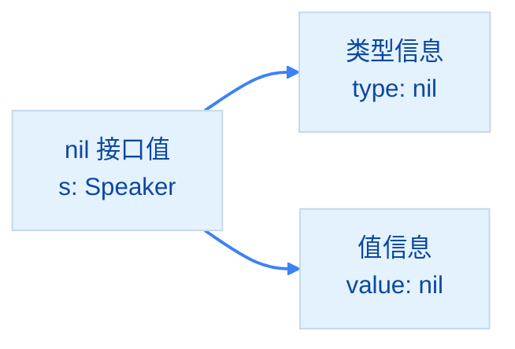
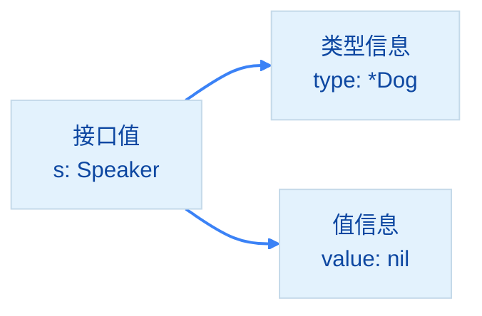
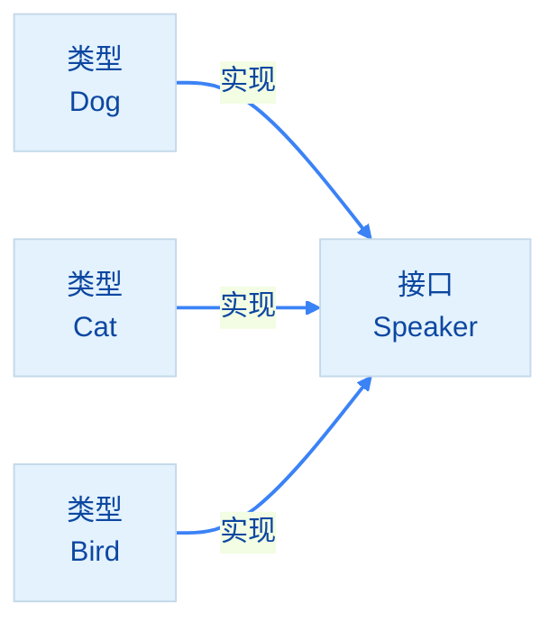

import { Badge } from "@rspress/core/theme";

# Interface Value Mechanism

[← 返回接口](../)

理解接口值的内部结构对于掌握 Go 的接口行为至关重要。

## <Badge text="接口内部结构" type="tip" />

### 接口值的组成

```go
type Speaker interface {
    Speak() string
}

type Dog struct {
    Name string
}

func (d Dog) Speak() string {
    return fmt.Sprintf("%s: 汪汪", d.Name)
}
```

每个接口值由两部分组成：

```go
var s Speaker = Dog{Name: "Buddy"}
```

```mermaid
%%{init: {'theme':'base', 'themeVariables': { 'lineColor':'#3b82f6', 'primaryColor':'#e3f2fd', 'primaryTextColor':'#0d47a1'}}}%%
flowchart LR
    A[接口值<br/>s: Speaker] --> B[类型信息<br/>type: Dog]
    A --> C[值信息<br/>value: Dog实例]

    B --> D["Dog (concrete type)"]
    C --> E["{Name: \"Buddy\"}"]

    linkStyle default stroke:#3b82f6,stroke-width:2px
```

<Badge text="关键概念" type="danger" />
- **类型信息**：存储在接口中的具体类型（如 `Dog`）
- **值信息**：该类型的一个实例（如 `Dog{Name: "Buddy"}`）

### 接口赋值过程

```go
var s Speaker

s = Dog{Name: "Buddy"}
```



## <Badge text="nil 接口值" type="warning" />

### 接口零值

```go
var s Speaker
fmt.Printf("s == nil: %v\n", s == nil)  // true

// 调用方法会 panic
// s.Speak()  // panic: nil pointer dereference
```



<Badge text="重要" type="danger" /> nil 接口值的类型和值都是 `nil`。

## <Badge text="包含 nil 指针的接口" type="danger" />

### 常见陷阱

```go
var d *Dog           // d 是 nil 指针
var s Speaker = d    // s 持有 *Dog 类型的 nil 指针

fmt.Printf("s == nil: %v\n", s == nil)  // false!
fmt.Printf("d == nil: %v\n", d == nil)  // true
```



<Badge text="陷阱" type="danger" /> 包含 nil 指针的接口<strong>不是 nil</strong>！

### 为什么不是 nil？

接口只有在<strong>类型和值都是 nil</strong>时才等于 nil：

```go
// 情况1：真正的 nil 接口
var s1 Speaker
// s1.type = nil, s1.value = nil
// s1 == nil → true

// 情况2：包含 nil 指针的接口
var d *Dog
var s2 Speaker = d
// s2.type = *Dog, s2.value = nil
// s2 == nil → false
```

### 实际问题

```go
// 返回接口的函数
func GetSpeaker() Speaker {
    var d *Dog
    return d  // 返回 nil 指针
}

func main() {
    s := GetSpeaker()

    // 检查失败！
    if s != nil {
        s.Speak()  // panic: nil pointer dereference
    }
}
```

<Badge text="解决方案" type="tip" />

```go
// 方案1：明确返回 nil
func GetSpeaker() Speaker {
    var d *Dog
    if d == nil {
        return nil  // 返回 nil 接口，不是 nil 指针
    }
    return d
}

// 方案2：不要返回 nil 接口
func GetSpeaker() (Speaker, error) {
    d := &Dog{Name: "Buddy"}
    if d == nil {
        return nil, errors.New("no speaker available")
    }
    return d, nil
}
```

## <Badge text="接口比较" type="info" />

### 接口值比较规则

```go
type Speaker interface {
    Speak() string
}

type Dog struct{ Name string }
func (d Dog) Speak() string { return "汪汪" }

d1 := Dog{Name: "Buddy"}
d2 := Dog{Name: "Buddy"}

var s1, s2 Speaker
s1 = d1
s2 = d2

// 比较规则：类型和值都相等时才相等
fmt.Println(s1 == s2)  // true

// nil 接口比较
var nil1, nil2 Speaker
fmt.Println(nil1 == nil2)  // true
fmt.Println(nil1 == nil)   // true
```

<Badge text="注意" type="warning" /> 包含不可比较类型的接口<strong>不可比较</strong>：

```go
type Speaker interface {
    Speak() string
}

type Dog struct {
    Data map[string]int  // 不可比较
}

func (d Dog) Speak() string { return "汪汪" }

d1 := Dog{Data: make(map[string]int)}
d2 := Dog{Data: make(map[string]int)}

var s1, s2 Speaker
s1 = d1
s2 = d2

// s1 == s2  // panic: cannot compare
```

## <Badge text="接口 vs 继承" type="info" />

### Go 的接口是隐式的

```go
// Go 不需要显式声明实现接口
type Dog struct{}

func (d Dog) Speak() string {
    return "汪汪"
}

// Dog 自动实现了 Speaker 接口
type Speaker interface {
    Speak() string
}

var s Speaker = Dog{}  // 自动兼容
```



### 与传统继承对比

| 特性 | Go 接口 | 传统继承 |
|-----|---------|---------|
| 实现方式 | 隐式 | 显式声明 |
| 耦合度 | 低 | 高 |
| 灵活性 | 高 | 低 |
| 层次结构 | 扁平 | 深层嵌套 |
| 多实现 | 一个类型实现多个接口 | 多重继承复杂 |

<Badge text="优势" type="tip" />
- **解耦**：类型无需声明实现接口
- **灵活**：可以随时添加新接口
- **简洁**：没有复杂的继承层次
- **组合优于继承**：通过接口组合实现复用

## 练习

1. 编写函数检查接口是否为 nil

<details>
<summary>查看答案</summary>

```go
package main

import "fmt"

type Speaker interface {
    Speak() string
}

type Dog struct {
    Name string
}

func (d Dog) Speak() string {
    return fmt.Sprintf("%s: 汪汪", d.Name)
}

// IsNilInterface 安全检查接口是否为 nil
func IsNilInterface(s Speaker) bool {
    return s == nil
}

func main() {
    // 测试 nil 接口
    var s1 Speaker
    fmt.Printf("s1 是 nil: %v\n", IsNilInterface(s1))

    // 测试有效接口
    s2 := Dog{Name: "Buddy"}
    fmt.Printf("s2 是 nil: %v\n", IsNilInterface(s2))

    // 测试包含 nil 指针的接口
    var d *Dog
    var s3 Speaker = d
    fmt.Printf("s3 是 nil: %v\n", IsNilInterface(s3))
    fmt.Printf("s3 == nil: %v\n", s3 == nil)
}
```

**解释**：展示了 nil 接口和包含 nil 指针接口的区别。
</details>

2. 创建返回接口的函数，正确处理 nil 情况

<details>
<summary>查看答案</summary>

```go
package main

import (
    "errors"
    "fmt"
)

type Speaker interface {
    Speak() string
}

type Dog struct {
    Name string
}

func (d Dog) Speak() string {
    return fmt.Sprintf("%s: 汪汪", d.Name)
}

// GetSpeakerByName 根据名称获取 Speaker
func GetSpeakerByName(name string) (Speaker, error) {
    if name == "" {
        return nil, errors.New("name cannot be empty")
    }

    // 模拟查找
    if name == "Unknown" {
        return nil, nil  // 明确返回 nil 接口
    }

    return Dog{Name: name}, nil
}

func main() {
    // 测试有效名称
    s1, err := GetSpeakerByName("Buddy")
    if err != nil {
        fmt.Println("错误:", err)
    } else if s1 != nil {
        fmt.Println(s1.Speak())
    } else {
        fmt.Println("未找到 Speaker")
    }

    // 测试未知名称
    s2, err := GetSpeakerByName("Unknown")
    if err != nil {
        fmt.Println("错误:", err)
    } else if s2 != nil {
        fmt.Println(s2.Speak())
    } else {
        fmt.Println("未找到 Speaker")
    }
}
```

**解释**：展示了正确处理 nil 接口返回的模式。
</details>

---

[← 接口基础](./interface-basics.mdx) | [继续：空接口 →](./empty-interface.mdx)
