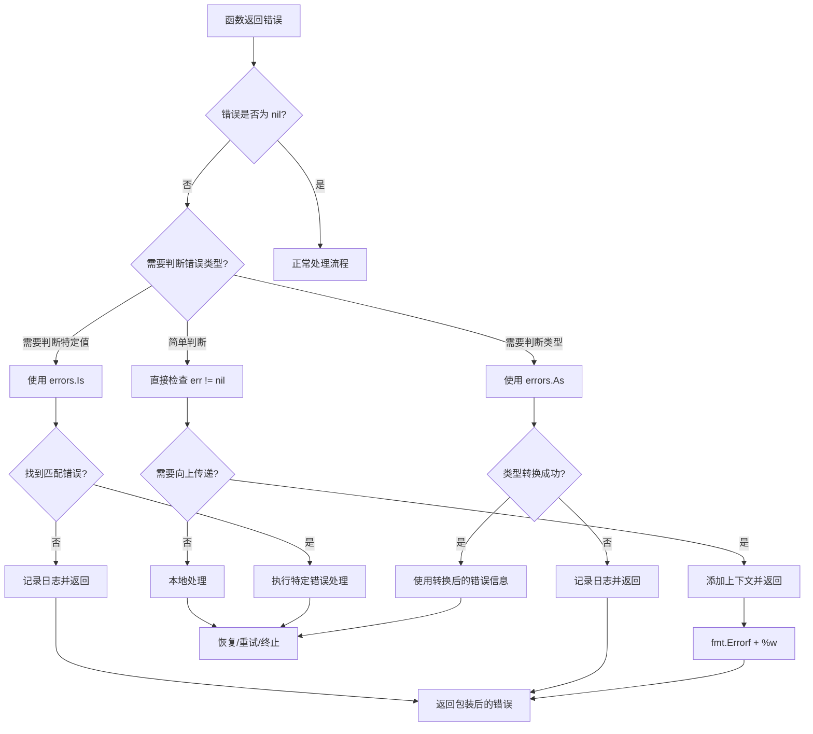

import { Badge } from "@rspress/core/theme";
import { Callout } from "@rspress/core/theme-original";

# error Interface

<Badge text="标准库" color="blue" />
<Badge text="Go 1.13+" color="green" />

## 概述

`error` 接口是 Go 语言中处理错误的核心接口。虽然它是一个简单的内置接口，但理解其工作原理和最佳实践对于编写健壮的 Go 程序至关重要。

## error 接口定义

```go
// error 接口位于 builtin 包中
type error interface {
    Error() string
}
```

### 基本用法

```go
package main

import (
    "errors"
    "fmt"
)

func divide(a, b int) (int, error) {
    if b == 0 {
        return 0, errors.New("division by zero")
    }
    return a / b, nil
}

func main() {
    result, err := divide(10, 2)
    if err != nil {
        fmt.Println("Error:", err)
        return
    }
    fmt.Println("Result:", result)
}
```

<Callout type="info">
**最佳实践**：总是检查并处理错误，不要忽略返回的 error 值。使用 `fmt.Errorf` 可以创建带有格式化字符串的错误。
</Callout>

## 错误包装（Error Wrapping）

Go 1.13 引入了错误包装机制，允许在保留原始错误的同时添加上下文信息。

### errors.Unwrap()

`Unwrap` 方法用于返回被包装的底层错误：

```go
package main

import (
    "errors"
    "fmt"
)

func main() {
    originalErr := errors.New("original error")
    wrappedErr := fmt.Errorf("context: %w", originalErr)

    fmt.Println("Wrapped error:", wrappedErr)
    fmt.Println("Unwrapped error:", errors.Unwrap(wrappedErr))
}
```

<Callout type="warning">
**注意**：`%w` 格式动词用于包装错误，而 `%v` 或 `%s` 只会格式化错误字符串，不会保留原始错误。
</Callout>

## 错误判断与转换

### errors.Is()

`errors.Is()` 用于判断错误链中是否包含特定错误：

```go
package main

import (
    "errors"
    "fmt"
)

var ErrNotFound = errors.New("not found")

func findById(id int) error {
    if id <= 0 {
        return fmt.Errorf("invalid id: %d", id)
    }
    if id > 100 {
        return fmt.Errorf("database error: %w", ErrNotFound)
    }
    return nil
}

func main() {
    err := findById(101)

    if errors.Is(err, ErrNotFound) {
        fmt.Println("Not found error occurred")
        // 处理 not found 情况
    } else if err != nil {
        fmt.Println("Other error:", err)
    }
}
```

### errors.As()

`errors.As()` 用于将错误转换为特定类型：

```go
package main

import (
    "errors"
    "fmt"
)

// 自定义错误类型
type ValidationError struct {
    Field   string
    Message string
}

func (e *ValidationError) Error() string {
    return fmt.Sprintf("validation failed for field %s: %s", e.Field, e.Message)
}

func validate(input string) error {
    if input == "" {
        return &ValidationError{
            Field:   "username",
            Message: "cannot be empty",
        }
    }
    return nil
}

func main() {
    err := validate("")

    var validationErr *ValidationError
    if errors.As(err, &validationErr) {
        fmt.Printf("Field: %s, Message: %s\n",
            validationErr.Field, validationErr.Message)
    }
}
```

<Callout type="tip">
**性能提示**：`errors.As()` 比类型断言更安全，它会遍历整个错误链，直到找到匹配的类型。
</Callout>

## 自定义错误类型

### 基本自定义错误

```go
package main

import (
    "fmt"
)

// 自定义错误类型
type AppError struct {
    Code    int
    Message string
    Err     error
}

func (e *AppError) Error() string {
    if e.Err != nil {
        return fmt.Sprintf("[%d] %s: %v", e.Code, e.Message, e.Err)
    }
    return fmt.Sprintf("[%d] %s", e.Code, e.Message)
}

// 实现 Unwrap 方法支持错误链
func (e *AppError) Unwrap() error {
    return e.Err
}

// 预定义错误
var (
    ErrInvalidInput = &AppError{Code: 400, Message: "Invalid input"}
    ErrNotFound     = &AppError{Code: 404, Message: "Resource not found"}
)

func processData(input string) error {
    if input == "" {
        return fmt.Errorf("%w: input cannot be empty", ErrInvalidInput)
    }
    return nil
}

func main() {
    err := processData("")
    if err != nil {
        var appErr *AppError
        if errors.As(err, &appErr) {
            fmt.Printf("Error Code: %d\n", appErr.Code)
            fmt.Printf("Error Message: %s\n", appErr.Message)
        }
    }
}
```

### 带方法的自定义错误

```go
package main

import (
    "fmt"
    "net/http"
)

// HTTPError 实现 error 接口并提供额外信息
type HTTPError struct {
    StatusCode int
    Message    string
}

func (e *HTTPError) Error() string {
    return fmt.Sprintf("HTTP %d: %s", e.StatusCode, e.Message)
}

// 额外方法
func (e *HTTPError) Temporary() bool {
    return e.StatusCode >= 500 || e.StatusCode == http.StatusTooManyRequests
}

func (e *HTTPError) Timeout() bool {
    return e.StatusCode == http.StatusGatewayTimeout ||
           e.StatusCode == http.StatusServiceUnavailable
}

func handleRequest() error {
    return &HTTPError{
        StatusCode: http.StatusTooManyRequests,
        Message:    "Rate limit exceeded",
    }
}

func main() {
    err := handleRequest()
    if httpErr, ok := err.(*HTTPError); ok {
        fmt.Printf("Status: %d\n", httpErr.StatusCode)
        fmt.Printf("Temporary: %v\n", httpErr.Temporary())
        fmt.Printf("Timeout: %v\n", httpErr.Timeout())
    }
}
```

## 错误处理流程图



## 错误包装最佳实践

### 1. 选择合适的包装方式

```go
// ✅ 使用 %w 保留原始错误，支持 errors.Is 和 errors.As
err1 := fmt.Errorf("context: %w", originalErr)

// ❌ 使用 %v 丢失原始错误类型
err2 := fmt.Errorf("context: %v", originalErr)
```

### 2. 错误上下文添加规则

```go
package main

import (
    "errors"
    "fmt"
)

func openFile(path string) error {
    // 不要重复添加已有信息
    // ❌ 不好
    return fmt.Errorf("failed to open file %s: %w", path,
        fmt.Errorf("file error: %w", errors.New("permission denied")))

    // ✅ 好
    return fmt.Errorf("open %s: %w", path, errors.New("permission denied"))
}

func main() {
    err := openFile("/etc/passwd")
    fmt.Println(err)
}
```

### 3. 错误处理层次

```go
package main

import (
    "errors"
    "fmt"
    "log"
)

// 底层：返回具体错误
func lowLevelOperation() error {
    return errors.New("disk I/O error")
}

// 中层：添加业务上下文
func middleLayerOperation() error {
    err := lowLevelOperation()
    if err != nil {
        return fmt.Errorf("save user data: %w", err)
    }
    return nil
}

// 上层：决定如何处理
func highLayerHandler() {
    err := middleLayerOperation()
    if err != nil {
        // 这里可以决定是记录、返回还是其他处理
        log.Printf("Operation failed: %v", err)
        return
    }
    fmt.Println("Success")
}

func main() {
    highLayerHandler()
}
```

<Callout type="warning">
**错误 vs 日志**：不要在底层函数中直接记录错误日志，应该让上层决定是否记录。错误应该被返回，而不是被吞噬。
</Callout>

### 4. 避免错误包装过深

```go
// ❌ 避免：过度包装
err := fmt.Errorf("level 1: %w",
    fmt.Errorf("level 2: %w",
        fmt.Errorf("level 3: %w", originalErr)))

// ✅ 推荐：适度的包装
err := fmt.Errorf("operation failed: %w", originalErr)
```

## 常见错误处理模式

### Sentinel 错误（哨兵错误）

```go
package main

import (
    "errors"
    "fmt"
)

var (
    ErrUserNotFound    = errors.New("user not found")
    ErrInvalidPassword = errors.New("invalid password")
)

func authenticate(username, password string) error {
    if username == "" {
        return fmt.Errorf("username required: %w", ErrUserNotFound)
    }
    if password == "" {
        return fmt.Errorf("password required: %w", ErrInvalidPassword)
    }
    return nil
}

func main() {
    err := authenticate("", "")

    if errors.Is(err, ErrUserNotFound) {
        fmt.Println("User not found")
    } else if errors.Is(err, ErrInvalidPassword) {
        fmt.Println("Invalid password")
    }
}
```

### 错误类型检查

```go
package main

import (
    "errors"
    "fmt"
    "os"
)

func readFile(path string) ([]byte, error) {
    data, err := os.ReadFile(path)
    if err != nil {
        // 转换为自定义错误类型
        return nil, &FileReadError{
            Path: path,
            Err:  err,
        }
    }
    return data, nil
}

type FileReadError struct {
    Path string
    Err  error
}

func (e *FileReadError) Error() string {
    return fmt.Sprintf("failed to read file %s: %v", e.Path, e.Err)
}

func (e *FileReadError) Unwrap() error {
    return e.Err
}

func main() {
    _, err := readFile("nonexistent.txt")

    var fileErr *FileReadError
    if errors.As(err, &fileErr) {
        fmt.Printf("Failed to read %s\n", fileErr.Path)
        if errors.Is(fileErr.Err, os.ErrNotExist) {
            fmt.Println("File does not exist")
        }
    }
}
```

### 错误恢复（Panic Recover）

```go
package main

import (
    "fmt"
    "log"
)

func riskyOperation() (err error) {
    defer func() {
        if r := recover(); r != nil {
            err = fmt.Errorf("panic recovered: %v", r)
        }
    }()

    // 可能触发 panic 的代码
    panic("something went wrong")
}

func main() {
    err := riskyOperation()
    if err != nil {
        log.Println("Recovered from panic:", err)
    }
}
```

<Callout type="warning">
**谨慎使用 panic**：panic 应该只用于真正不可恢复的错误（如配置错误）。对于预期内的错误，应该使用 error 返回值。
</Callout>

## 练习

### 练习 1：错误包装与解包

创建一个多层函数调用链，每层都添加错误上下文，然后使用 `errors.Unwrap()` 遍历整个错误链。

**答案：**

```go
package main

import (
    "errors"
    "fmt"
)

func layer1() error {
    return errors.New("base error")
}

func layer2() error {
    err := layer1()
    if err != nil {
        return fmt.Errorf("layer 2: %w", err)
    }
    return nil
}

func layer3() error {
    err := layer2()
    if err != nil {
        return fmt.Errorf("layer 3: %w", err)
    }
    return nil
}

func main() {
    err := layer3()

    fmt.Println("Full error:", err)

    // 遍历错误链
    for err != nil {
        fmt.Println("Unwrapped:", err)
        err = errors.Unwrap(err)
    }
}
```

### 练习 2：自定义错误类型

创建一个 `NetworkError` 类型，实现 `error` 接口和 `Temporary()` 方法。然后编写一个函数返回这个错误，并在主函数中使用 `errors.As()` 检查错误类型。

**答案：**

```go
package main

import (
    "errors"
    "fmt"
    "time"
)

type NetworkError struct {
    Op       string
    Endpoint string
    Err      error
    Retry    bool
}

func (e *NetworkError) Error() string {
    return fmt.Sprintf("%s %s failed: %v", e.Op, e.Endpoint, e.Err)
}

func (e *NetworkError) Unwrap() error {
    return e.Err
}

func (e *NetworkError) Temporary() bool {
    return e.Retry
}

func (e *NetworkError) Timeout() bool {
    return e.Retry
}

func fetchData() error {
    return &NetworkError{
        Op:       "GET",
        Endpoint: "https://api.example.com/data",
        Err:      errors.New("connection timeout"),
        Retry:    true,
    }
}

func main() {
    err := fetchData()

    var netErr *NetworkError
    if errors.As(err, &netErr) {
        fmt.Printf("Operation: %s\n", netErr.Op)
        fmt.Printf("Endpoint: %s\n", netErr.Endpoint)
        fmt.Printf("Temporary: %v\n", netErr.Temporary())

        if netErr.Temporary() {
            fmt.Println("Will retry after 1 second...")
            time.Sleep(1 * time.Second)
            // 重试逻辑
        }
    }
}
```

### 练习 3：错误判断

定义一组 sentinel 错误（如 `ErrNotFound`、`ErrPermissionDenied`），创建一个函数可能返回这些错误，然后使用 `errors.Is()` 在调用处判断具体错误类型并采取不同行动。

**答案：**

```go
package main

import (
    "errors"
    "fmt"
)

var (
    ErrNotFound         = errors.New("resource not found")
    ErrPermissionDenied = errors.New("permission denied")
    ErrInvalidInput     = errors.New("invalid input")
)

type Resource struct {
    ID       int
    Public   bool
    Owner    string
}

func getResource(id int, user string) (*Resource, error) {
    if id <= 0 {
        return nil, fmt.Errorf("invalid id %d: %w", id, ErrInvalidInput)
    }

    if id > 100 {
        return nil, fmt.Errorf("resource %d not found: %w", id, ErrNotFound)
    }

    resource := &Resource{ID: id, Public: false, Owner: "admin"}

    if !resource.Public && user != resource.Owner {
        return nil, fmt.Errorf("access denied to resource %d: %w", id, ErrPermissionDenied)
    }

    return resource, nil
}

func main() {
    testCases := []struct {
        id   int
        user string
    }{
        {50, "admin"},    // 成功
        {0, "admin"},     // 无效输入
        {101, "admin"},   // 未找到
        {50, "user"},     // 权限拒绝
    }

    for _, tc := range testCases {
        resource, err := getResource(tc.id, tc.user)

        if errors.Is(err, ErrInvalidInput) {
            fmt.Printf("Test case %d: Invalid input\n", tc.id)
        } else if errors.Is(err, ErrNotFound) {
            fmt.Printf("Test case %d: Resource not found\n", tc.id)
        } else if errors.Is(err, ErrPermissionDenied) {
            fmt.Printf("Test case %d: Permission denied\n", tc.id)
        } else if err != nil {
            fmt.Printf("Test case %d: Unknown error: %v\n", tc.id, err)
        } else {
            fmt.Printf("Test case %d: Success! Resource ID: %d\n", tc.id, resource.ID)
        }
    }
}
```

## 总结

### 关键要点

1. **总是处理错误**：不要忽略返回的 error 值
2. **使用 %w 包装**：保留原始错误以支持 `errors.Is()` 和 `errors.As()`
3. **添加上下文**：在返回错误前添加有意义的上下文信息
4. **避免过度包装**：不要创建过深的错误链
5. **选择合适的方法**：
   - `errors.Is()` 用于判断特定错误值
   - `errors.As()` 用于获取特定错误类型
   - 类型断言用于已知类型的快速检查

### 错误处理决策树

```
收到错误
  │
  ├─ 需要判断特定错误值？
  │   └─ 是 → 使用 errors.Is()
  │
  ├─ 需要获取特定错误类型？
  │   └─ 是 → 使用 errors.As()
  │
  ├─ 需要向上传递？
  │   └─ 是 → 使用 fmt.Errorf("context: %w", err)
  │
  └─ 可以本地处理？
      └─ 是 → 记录日志并采取恢复措施
```

### 进一步学习

- [Go 错误处理最佳实践](https://go.dev/blog/error-handling-and-go)
- [Go 1.13 错误处理](https://go.dev/blog/go1.13-errors)
- [error values 包](https://pkg.go.dev/errors)

---

[← http 包接口](./http.mdx) | [继续：sort 接口 →](./sort.mdx)
