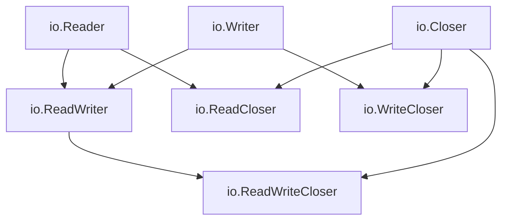

import { Badge } from "@rspress/core/theme";
import { Callout } from "@rspress/core/theme-original";

# IO Interface

<Badge text="核心概念" type="danger" />

Go 的 I/O 系统建立在简单的接口之上。理解这些接口是掌握 Go I/O 的关键。

## io.Reader 接口

<Badge text="初级开发者" type="tip" />

### 接口定义

```go
type Reader interface {
    Read(p []byte) (n int, err error)
}
```

### Read 方法契约

<Callout type="danger">
**重要规则**：

1. 即使没有读取到字节，返回 `n = 0` 也是合法的
2. 当 `n < len(p)` 时，本次读取可能返回 `err == nil` 或 `err == io.EOF`
3. 当读取到流末尾时，应该返回 `err == io.EOF`
4. 调用者应该在每次读取后检查错误
5. 即使返回 `io.EOF`，`n` 可能仍然大于 0

</Callout>

### 实现示例

```go
package main

import (
    "fmt"
    "io"
    "strings"
)

// StringReader 字符串读取器
type StringReader struct {
    data string
    pos  int
}

// Read 实现 io.Reader 接口
func (sr *StringReader) Read(p []byte) (n int, err error) {
    if sr.pos >= len(sr.data) {
        return 0, io.EOF
    }

    // 计算可读取的字节数
    n = copy(p, sr.data[sr.pos:])
    sr.pos += n

    return n, nil
}

func main() {
    reader := &StringReader{data: "Hello, World!"}
    buf := make([]byte, 5)

    // 第一次读取
    n, err := reader.Read(buf)
    fmt.Printf("读取 %d 字节: %q, 错误: %v\n", n, string(buf[:n]), err)

    // 第二次读取
    n, err = reader.Read(buf)
    fmt.Printf("读取 %d 字节: %q, 错误: %v\n", n, string(buf[:n]), err)

    // 第三次读取（EOF）
    n, err = reader.Read(buf)
    fmt.Printf("读取 %d 字节: %q, 错误: %v\n", n, string(buf[:n]), err)
}
```

### 正确的读取循环

```go
// ❌ 错误：可能丢失最后的数据
for {
    n, err := reader.Read(buf)
    if err == io.EOF {
        break
    }
    // 处理 buf[:n]
}

// ✅ 正确：先处理数据，再检查 EOF
for {
    n, err := reader.Read(buf)
    if n > 0 {
        process(buf[:n])
    }
    if err == io.EOF {
        break
    }
    if err != nil {
        return err
    }
}
```

## io.Writer 接口

<Badge text="初级开发者" type="tip" />

### 接口定义

```go
type Writer interface {
    Write(p []byte) (n int, err error)
}
```

### Write 方法契约

<Callout type="tip">
**Write 方法规则**：

1. `n` 必须等于 `len(p)`，即使只写入了部分数据也要返回错误
2. 如果 `n < len(p)`，必须返回非 nil 的错误
3. 不允许修改传入的 `p []byte` 切片

</Callout>

### 实现示例

```go
package main

import (
    "fmt"
    "io"
    "os"
)

// UpperWriter 将所有数据转换为大写后写入
type UpperWriter struct {
    writer io.Writer
}

func (uw *UpperWriter) Write(p []byte) (n int, err error) {
    // 转换为大写
    upper := make([]byte, len(p))
    for i, b := range p {
        if b >= 'a' && b <= 'z' {
            upper[i] = b - 32
        } else {
            upper[i] = b
        }
    }

    // 委托给底层 Writer
    return uw.writer.Write(upper)
}

func main() {
    upper := &UpperWriter{writer: os.Stdout}

    n, err := upper.Write([]byte("Hello, Go!\n"))
    if err != nil {
        fmt.Printf("写入错误: %v\n", err)
        return
    }
    fmt.Printf("写入 %d 字节\n", n)
}
```

## 组合接口

<Badge text="中级开发者" type="warning" />

### 接口组合关系



### 常用组合接口

```go
// io.ReadWriter - 可读可写
type ReadWriter interface {
    Reader
    Writer
}

// io.ReadCloser - 可读可关闭
type ReadCloser interface {
    Reader
    Closer
}

// io.WriteCloser - 可写可关闭
type WriteCloser interface {
    Writer
    Closer
}

// io.ReadWriteCloser - 可读可写可关闭
type ReadWriteCloser interface {
    Reader
    Writer
    Closer
}
```

### 使用示例

```go
package main

import (
    "fmt"
    "io"
    "os"
)

// ProcessFile 处理文件（读取、处理、写入）
func ProcessFile(inputPath, outputPath string) error {
    // 打开输入文件
    inputFile, err := os.Open(inputPath)
    if err != nil {
        return fmt.Errorf("open input: %w", err)
    }
    defer inputFile.Close()

    // 创建输出文件
    outputFile, err := os.Create(outputPath)
    if err != nil {
        return fmt.Errorf("create output: %w", err)
    }
    defer outputFile.Close()

    // 使用 io.Copy 直接复制
    // 自动处理 ReadWriteCloser 接口
    _, err = io.Copy(outputFile, inputFile)
    if err != nil {
        return fmt.Errorf("copy: %w", err)
    }

    return nil
}
```

## io.Copy 和相关函数

<Badge text="中级开发者" type="warning" />

### io.Copy

```go
func Copy(dst Writer, src Reader) (written int64, err error)
```

从 src 复制数据到 dst，直到 EOF 或错误发生。

```go
// 复制文件
src, _ := os.Open("input.txt")
dst, _ := os.Create("output.txt")
defer src.Close()
defer dst.Close()

written, err := io.Copy(dst, src)
fmt.Printf("复制了 %d 字节\n", written)
```

<Callout type="info">
**优化机制**：`io.Copy` 会自动使用缓冲区（32KB），如果目标实现了 `ReaderFrom` 或源实现了 `WriterTo`，会使用优化的实现。
</Callout>

### io.CopyN

只复制指定字节数：

```go
// 只复制前 100 字节
src := strings.NewReader("Hello, World!")
dst := &bytes.Buffer{}

io.CopyN(dst, src, 5)
fmt.Println(dst.String())  // "Hello"
```

### io.LimitReader

创建一个最多读取 n 字节的 Reader：

```go
reader := strings.NewReader("0123456789")
limited := io.LimitReader(reader, 5)

buf := make([]byte, 10)
limited.Read(buf)
fmt.Println(string(buf))  // "01234"
```

### io.MultiReader / io.MultiWriter

```go
// MultiReader - 串联多个 Reader
r1 := strings.NewReader("Hello, ")
r2 := strings.NewReader("World!")
multi := io.MultiReader(r1, r2)

data, _ := io.ReadAll(multi)
fmt.Println(string(data))  // "Hello, World!"

// MultiWriter - 并联多个 Writer
var buf1, buf2 bytes.Buffer
multi := io.MultiWriter(&buf1, &buf2)

multi.Write([]byte("Hello"))
fmt.Println(buf1.String())  // "Hello"
fmt.Println(buf2.String())  // "Hello"
```

## 实现自定义 Reader/Writer

<Badge text="高级开发者" type="danger" />

### 案例 1: 进度追踪 Reader

```go
package main

import (
    "fmt"
    "io"
    "strings"
)

// ProgressReader 进度追踪读取器
type ProgressReader struct {
    reader    io.Reader
    total     int64
    read      int64
    onProgress func(read, total int64)
}

func NewProgressReader(reader io.Reader, total int64) *ProgressReader {
    return &ProgressReader{
        reader:    reader,
        total:     total,
        onProgress: func(read, total int64) {},
    }
}

func (pr *ProgressReader) Read(p []byte) (n int, err error) {
    n, err = pr.reader.Read(p)
    pr.read += int64(n)

    // 报告进度
    pr.onProgress(pr.read, pr.total)

    return n, err
}

func (pr *ProgressReader) OnProgress(fn func(read, total int64)) {
    pr.onProgress = fn
}

func main() {
    reader := strings.NewReader("Hello, World! This is a test.")
    progress := NewProgressReader(reader, int64(reader.Len()))

    progress.OnProgress(func(read, total int64) {
        percent := float64(read) / float64(total) * 100
        fmt.Printf("\r进度: %.1f%% (%d/%d)", percent, read, total)
    })

    data, _ := io.ReadAll(progress)
    fmt.Printf("\n读取完成: %d 字节\n", len(data))
}
```

### 案例 2: 限速 Writer

```go
package main

import (
    "fmt"
    "io"
    "time"
)

// RateLimitedWriter 限速写入器
type RateLimitedWriter struct {
    writer    io.Writer
    rate      int  // 字节/秒
    lastWrite time.Time
}

func NewRateLimitedWriter(writer io.Writer, rate int) *RateLimitedWriter {
    return &RateLimitedWriter{
        writer:    writer,
        rate:      rate,
        lastWrite: time.Now(),
    }
}

func (rlw *RateLimitedWriter) Write(p []byte) (n int, err error) {
    if len(p) == 0 {
        return 0, nil
    }

    // 计算需要的等待时间
    now := time.Now()
    if !rlw.lastWrite.IsZero() {
        elapsed := now.Sub(rlw.lastWrite)
        allowed := int(elapsed.Seconds()) * rlw.rate

        // 如果超过了允许的速率，等待
        if len(p) > allowed {
            waitTime := time.Duration(len(p)-allowed) * time.Second / time.Duration(rlw.rate)
            time.Sleep(waitTime)
        }
    }

    n, err = rlw.writer.Write(p)
    rlw.lastWrite = time.Now()

    return n, err
}

func main() {
    // 创建限速写入器：每秒最多写入 10 字节
    writer := NewRateLimitedWriter(os.Stdout, 10)

    start := time.Now()
    writer.Write([]byte("Hello, World!"))
    duration := time.Since(start)

    fmt.Printf("\n写入完成，耗时: %v\n", duration)
}
```

## 性能考虑

<Badge text="高级开发者" type="danger" />

### 缓冲区大小

```go
// 小缓冲区 - 频繁系统调用
buf := make([]byte, 100)  // 不推荐

// 推荐缓冲区
buf := make([]byte, 4096)   // 4KB - 适合大多数场景
buf := make([]byte, 32*1024) // 32KB - io.Copy 默认大小
buf := make([]byte, 64*1024) // 64KB - 大文件优化
```

### 性能基准

```go
// 使用 bufio 包装提高性能
reader := bufio.NewReaderSize(file, 32*1024)  // 32KB 缓冲
```

## 练习

<Badge text="实战练习" type="success" />

### 练习：实现哈希 Reader

创建一个 Reader，在读取数据的同时计算哈希值：

```go
// TODO: 实现
type HashReader struct {
    // ...
}

func (hr *HashReader) Read(p []byte) (n int, err error) {
    // 读取数据
    // 更新哈希
}

func (hr *HashReader) Sum() string {
    // 返回哈希值
}
```

<details>
<summary>查看答案</summary>

```go
import (
    "crypto/sha256"
    "encoding/hex"
    "io"
)

type HashReader struct {
    reader io.Reader
    hash   hash.Hash
}

func NewHashReader(reader io.Reader) *HashReader {
    return &HashReader{
        reader: reader,
        hash:   sha256.New(),
    }
}

func (hr *HashReader) Read(p []byte) (n int, err error) {
    n, err = hr.reader.Read(p)
    if n > 0 {
        // 更新哈希
        hr.hash.Write(p[:n])
    }
    return n, err
}

func (hr *HashReader) Sum() string {
    return hex.EncodeToString(hr.hash.Sum(nil))
}

// 使用
func main() {
    data := strings.NewReader("Hello, World!")
    hasher := NewHashReader(data)

    io.ReadAll(hasher)
    fmt.Println("SHA256:", hasher.Sum())
}
```

</details>

---

## 总结

### 关键要点

| 读者水平 | 核心要点 |
|---------|---------|
| <Badge text="初级开发者" type="tip" /> | 掌握 Reader/Writer 接口定义。正确使用读取循环。 |
| <Badge text="中级开发者" type="warning" /> | 理解接口组合。使用 io.Copy 等工具函数。 |
| <Badge text="高级开发者" type="danger" /> | 实现自定义 Reader/Writer。性能优化。 |

### 接口速查

```go
// 读取
n, err := reader.Read(buf)

// 写入
n, err := writer.Write(data)

// 复制
io.Copy(dst, src)

// 读取全部
data, _ := io.ReadAll(reader)
```

### 下一步

- [← 文件读写](./file-io.mdx)
- [缓冲 I/O →](./bufio.mdx)
- [文件系统 →](./filesystem.mdx)
