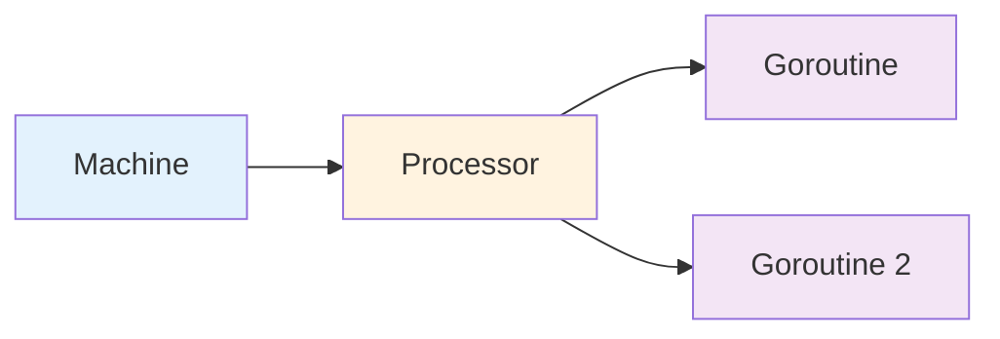

import { Badge } from "@rspress/core/theme";
import { Callout } from "@rspress/core/theme-original";

# CPU Optimization

<Badge text="性能优化" type="danger" />

CPU 优化可以显著提升程序的执行效率。

## Goroutine 调度

<Badge text="中级开发者" type="warning" />

### G-M-P 模型



### 避免 Goroutine 泄漏

```go
// ❌ 错误：无限 goroutine
func leakGoroutine() {
    ch := make(chan int)
    go func() {
        for {
            <-ch  // 永久阻塞
        }
    }()
}

// ✅ 正确：使用 context 控制
func worker(ctx context.Context) {
    for {
        select {
        case <-ctx.Done():
            return
        }
    }
}
```

## 并发优化

<Badge text="高级开发者" type="danger" />

### Worker Pool

```go
package main

import (
    "context"
    "sync"
)

type Task struct {
    ID   int
    Data string
}

type Result struct {
    TaskID int
    Output string
}

func worker(ctx context.Context, tasks <-chan Task, results chan<- Result) {
    for task := range tasks {
        select {
        case <-ctx.Done():
            return
        default:
            // 处理任务
            results <- Result{
                TaskID: task.ID,
                Output: processTask(task),
            }
        }
    }
}

func processTask(task Task) string {
    // 模拟处理
    return "processed: " + task.Data
}

func main() {
    tasks := make(chan Task, 100)
    results := make(chan Result, 100)

    // 创建 worker pool
    var wg sync.WaitGroup
    ctx, cancel := context.WithCancel(context.Background())

    for i := 0; i < 5; i++ {
        wg.Add(1)
        go func() {
            defer wg.Done()
            worker(ctx, tasks, results)
        }()
    }

    // 提交任务
    go func() {
        wg.Wait()
        close(tasks)
        cancel()
    }()
}
```

### Goroutine 数量

```go
// ❌ 过多 goroutine
func TooManyGoroutines() {
    for i := 0; i < 10000; i++ {
        go func() {
            // ...
        }()
    }
}

// ✅ 合理的 goroutine 数量
func ReasonableGoroutines() {
    // 通常设置为 CPU 核心数的 2-10 倍
    numWorkers := runtime.NumCPU() * 4
    sem := make(chan struct{}, numWorkers)

    for i := 0; i < 10000; i++ {
        sem <- struct{}{}  // 获取信号量
        go func() {
            defer func() { <-sem }()  // 释放信号量
            // ...
        }()
    }
}
```

## 算法优化

<Badge text="高级开发者" type="danger" />

### 选择合适的数据结构

```go
// 查找操作 - map 比 slice 快
func findSlice(items []int, target int) bool {
    for _, item := range items {
        if item == target {
            return true
        }
    }
    return false
}

func findMap(items map[int]bool, target int) bool {
    return items[target]
}
```

### 避免不必要的转换

```go
// ❌ 多次转换
func process(s string) {
    bytes := []byte(s)
    str := string(bytes)
    // ...
}

// ✅ 避免转换
func processOptimized(s string) {
    // 直接使用 string
    // ...
}
```

## 实战案例

### 案例：并行处理

```go
package main

import (
    "context"
    "sync"
)

func ParallelProcess(data []string) []string {
    ctx, cancel := context.WithCancel(context.Background())
    defer cancel()

    results := make([]string, len(data))
    var wg sync.WaitGroup

    for i, item := range data {
        wg.Add(1)
        go func(idx int, item string) {
            defer wg.Done()
            results[idx] = processItem(item)
        }(i, item)
    }

    wg.Wait()
    return results
}

func processItem(item string) string {
    // 处理逻辑
    return "processed: " + item
}
```

---

## 总结

### 关键要点

| 读者水平 | 核心要点 |
|---------|---------|
| <Badge text="中级开发者" type="warning" /> | 合理设置 goroutine 数量。使用 worker pool。 |
| <Badge text="高级开发者" type="danger" /> | G-M-P 模型。CPU profile。 |

### 速查表

```bash
# CPU profile
go test -cpuprofile=cpu.prof
go tool pprof cpu.prof
```
