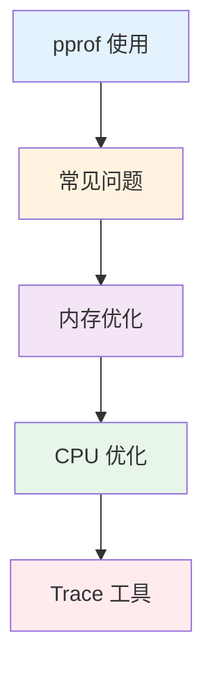

import { Badge } from "@rspress/core/theme";
import { Callout } from "@rspress/core/theme-original";

# Performance Optimization

<Badge text="高级内容" type="danger" />

性能优化是 Go 开发的高级主题。通过正确的工具和方法，你可以显著提升程序的性能。

## 学习路径



## 模块概览

| 模块 | 内容 | 难度 |
|------|------|------|
| [pprof 使用](./pprof.mdx) | 性能分析工具 | <Badge text="高级" type="danger" /> |
| [常见问题](./common-issues.mdx) | 常见性能陷阱 | <Badge text="中级" type="warning" /> |
| [内存优化](./memory-optimization.mdx) | 内存分配、GC | <Badge text="高级" type="danger" /> |
| [CPU 优化](./cpu-optimization.mdx) | CPU 使用、并发 | <Badge text="高级" type="danger" /> |
| [Trace 工具](./trace.mdx) | 执行追踪 | <Badge text="高级" type="danger" /> |

## 性能分析工具

### pprof

```bash
# 添加 CPU 分析
import _ "net/http/pprof"

# 启用后访问
curl http://localhost:6060/debug/pprof/
```

### 基准测试

```go
func BenchmarkMyFunction(b *testing.B) {
    for i := 0; i < b.N; i++ {
        MyFunction()
    }
}

// 运行
go test -bench=. -benchmem
```

## 优化原则

### 1. 测量优先

<Callout type="danger">
**重要**：不要猜测，先测量。使用 pprof 找到真正的瓶颈。
</Callout>

### 2. 常见优化方向

| 方向 | 优化方法 |
|------|---------|
| **内存** | 减少分配、使用对象池、避免逃逸 |
| **CPU** | 减少系统调用、批量操作、缓存 |
| **I/O** | 使用缓冲、批量写入、异步 |
| **并发** | 增加并发度、减少锁竞争 |

## 读者指南

### <Badge text="中级开发者" type="warning" />

1. [常见问题](./common-issues.mdx) - 了解常见陷阱
2. [pprof 使用](./pprof.mdx) - 学习性能分析

### <Badge text="高级开发者" type="danger" />

1. [内存优化](./memory-optimization.mdx)
2. [CPU 优化](./cpu-optimization.mdx)
3. [Trace 工具](./trace.mdx)

## 快速参考

### 启用 pprof

```go
import (
    _ "net/http/pprof"
    "net/http"
)

func main() {
    go http.ListenAndServe("localhost:6060", nil)
    // 主程序
}
```

### 分析 CPU

```bash
# 采集 CPU 数据
go tool pprof http://localhost:6060/debug/pprof/profile?seconds=30

# 查看结果
(pprof) top
(pprof) list function_name
```

### 分析内存

```bash
# 采集堆数据
go tool pprof http://localhost:6060/debug/pprof/heap

# 查看结果
(pprof) top
```

---

## 总结

### 关键要点

| 读者水平 | 核心要点 |
|---------|---------|
| <Badge text="中级开发者" type="warning" /> | 了解常见性能陷阱。使用 pprof 分析。 |
| <Badge text="高级开发者" type="danger" /> | 深入理解 GC、内存分配、并发优化。 |

### 下一步

- [← 构建工具](../build-tools/)
- [pprof 使用 →](./pprof.mdx)
