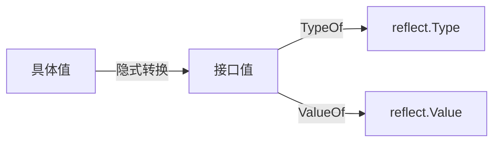
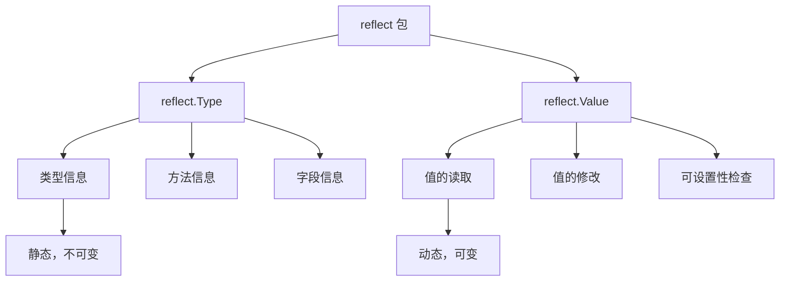

import { Badge } from "@rspress/core/theme";
import { Callout } from "@rspress/core/theme-original";

# Reflection Basics

<Badge text="中级" type="warning" /> <Badge text="Go 1.0+" type="info" />

反射是 Go 语言提供的一种在运行时检查类型和值的机制，通过 `reflect` 包实现。

## 什么是反射

反射允许程序在**运行时**（而非编译时）：

- 检查变量的类型信息
- 获取和修改变量的值
- 动态调用方法
- 遍历结构体字段

```go
package main

import (
    "fmt"
    "reflect"
)

func main() {
    var x int = 42

    // 获取变量的反射信息
    v := reflect.ValueOf(x)
    t := reflect.TypeOf(x)

    fmt.Println("Value:", v)           // Value: 42
    fmt.Println("Type:", t)            // Type: int
    fmt.Println("Kind:", t.Kind())     // Kind: int
}
```

<Callout type="info" title="生活类比">
  反射就像照<strong>镜子</strong>：
  <ul>
    <li>你（变量）站在镜子前</li>
    <li>镜子中映出你的<strong>形象</strong>（Value）</li>
    <li>也映出你的<strong>特征</strong>（Type）</li>
  </ul>
</Callout>

## 反射的三大定律

Go 反射有三条核心定律，理解它们是掌握反射的关键：

### 定律一：反射从接口值到反射对象

```go
// reflect.ValueOf 和 reflect.TypeOf 接受接口类型
func ValueOf(i any) Value
func TypeOf(i any) Type
```

```go
package main

import (
    "fmt"
    "reflect"
)

func main() {
    var x float64 = 3.4

    // Go 自动将 float64 转换为 interface{}
    v := reflect.ValueOf(x)

    fmt.Println("Type:", v.Type())     // Type: float64
    fmt.Println("Kind:", v.Kind())     // Kind: float64
    fmt.Println("Value:", v.Float())   // Value: 3.4
}
```



### 定律二：反射对象可以转换为接口值

```go
// Value.Interface() 将反射值还原为接口值
func (v Value) Interface() any
```

```go
package main

import (
    "fmt"
    "reflect"
)

func main() {
    var x float64 = 3.4

    v := reflect.ValueOf(x)

    // 将反射值还原为接口值
    i := v.Interface()

    // 类型断言获取原始类型
    y := i.(float64)

    fmt.Println("Value:", y)  // Value: 3.4
}
```

```mermaid
graph TD
    A[reflect.Value] -->|Interface| B[interface{}]
    B -->|类型断言| C[原始类型值]
```

### 定律三：要修改反射对象，该值必须可设置

```go
package main

import (
    "fmt"
    "reflect"
)

func main() {
    var x float64 = 3.4

    // ❌ 错误：使用 reflect.ValueOf 传递的是副本
    v := reflect.ValueOf(x)
    if v.CanSet() {
        v.SetFloat(7.1)  // 不会执行，CanSet() 返回 false
    }

    // ✅ 正确：传递指针
    p := reflect.ValueOf(&x)
    v = p.Elem()  // 获取指针指向的值

    if v.CanSet() {
        v.SetFloat(7.1)
    }

    fmt.Println("x =", x)  // x = 7.1
}
```

<Callout type="warning" title="可设置性规则">
  只有满足以下条件的值才能被修改：
  <ul>
    <li>值必须是可寻址的（addressable）</li>
    <li>值必须是通过<strong>指针解引用</strong>获得的</li>
    <li>不能是结构体的未导出字段</li>
  </ul>
</Callout>

## Type vs Value

`reflect` 包中最重要的两个类型：

### reflect.Type

表示 Go 类型的接口，提供类型信息但不包含值：

```go
package main

import (
    "fmt"
    "reflect"
)

type Person struct {
    Name string
    Age  int
}

func (p Person) Greet() string {
    return "Hello, " + p.Name
}

func main() {
    p := Person{Name: "Alice", Age: 30}

    t := reflect.TypeOf(p)

    fmt.Println("Type:", t)                    // Type: main.Person
    fmt.Println("Kind:", t.Kind())              // Kind: struct
    fmt.Println("Name:", t.Name())              // Name: Person
    fmt.Println("PkgPath:", t.PkgPath())        // PkgPath: main

    // 获取结构体字段
    for i := 0; i < t.NumField(); i++ {
        field := t.Field(i)
        fmt.Printf("Field %d: %s %s\n",
            i, field.Name, field.Type)
    }

    // 获取方法
    for i := 0; i < t.NumMethod(); i++ {
        method := t.Method(i)
        fmt.Printf("Method %d: %s\n",
            i, method.Name)
    }
}
```

### reflect.Value

表示 Go 值的结构，可以读取和修改值：

```go
package main

import (
    "fmt"
    "reflect"
)

func main() {
    x := 42
    v := reflect.ValueOf(x)

    fmt.Println("Value:", v)              // Value: 42
    fmt.Println("Type:", v.Type())        // Type: int
    fmt.Println("Kind:", v.Kind())        // Kind: int
    fmt.Println("CanAddr:", v.CanAddr())  // CanAddr: false
    fmt.Println("CanSet:", v.CanSet())    // CanSet: false

    // 通过指针获取可设置值
    p := reflect.ValueOf(&x).Elem()
    fmt.Println("CanSet (via ptr):", p.CanSet())  // true

    p.SetInt(100)
    fmt.Println("x =", x)  // x = 100
}
```



## Kind 类型

`reflect.Kind` 是类型的底层分类：

```go
package main

import (
    "fmt"
    "reflect"
)

type MyInt int
type Person struct {
    Name string
}

func main() {
    var i MyInt = 42
    var p Person = Person{Name: "Alice"}

    // Type 是具体类型
    fmt.Println(reflect.TypeOf(i).Name())  // MyInt
    fmt.Println(reflect.TypeOf(p).Name())  // Person

    // Kind 是底层分类
    fmt.Println(reflect.TypeOf(i).Kind())  // int
    fmt.Println(reflect.TypeOf(p).Kind())  // struct
}
```

<Callout type="info" title="Kind vs Type">
  <strong>Type</strong>：具体的命名类型（如 main.Person）<br />
  <strong>Kind</strong>：底层类型分类（如 struct、int、slice）
</Callout>

### 常见的 Kind 值

```go
// 基础类型
reflect.Invalid
reflect.Bool
reflect.Int, Int8, Int16, Int32, Int64
reflect.Uint, Uint8, Uint16, Uint32, Uint64, Uintptr
reflect.Float32, Float64
reflect.Complex64, Complex128
reflect.String

// 聚合类型
reflect.Array
reflect.Slice
reflect.Map
reflect.Struct

// 接口和函数
reflect.Interface
reflect.Func

// 其他
reflect.Chan
reflect.Ptr
reflect.UnsafePointer
```

## 反射的使用场景

### 1. 通用函数

```go
package main

import (
    "fmt"
    "reflect"
)

// PrintAny 打印任意类型的值
func PrintAny(v any) {
    val := reflect.ValueOf(v)

    switch val.Kind() {
    case reflect.String:
        fmt.Println("String:", val.String())
    case reflect.Int, reflect.Int8, reflect.Int16, reflect.Int32, reflect.Int64:
        fmt.Println("Int:", val.Int())
    case reflect.Float32, reflect.Float64:
        fmt.Println("Float:", val.Float())
    case reflect.Bool:
        fmt.Println("Bool:", val.Bool())
    case reflect.Slice, reflect.Array:
        fmt.Println("Slice/Array length:", val.Len())
    case reflect.Map:
        fmt.Println("Map keys:", val.MapKeys())
    default:
        fmt.Println("Unknown type:", val.Type())
    }
}

func main() {
    PrintAny("hello")
    PrintAny(42)
    PrintAny(3.14)
    PrintAny(true)
    PrintAny([]int{1, 2, 3})
    PrintAny(map[string]int{"a": 1})
}
```

### 2. 深度相等

```go
package main

import (
    "fmt"
    "reflect"
)

func main() {
    a := map[int]string{1: "one", 2: "two"}
    b := map[int]string{1: "one", 2: "two"}

    // == 不能比较 map
    // fmt.Println(a == b)  // 编译错误

    // reflect.DeepEqual 可以比较
    fmt.Println(reflect.DeepEqual(a, b))  // true

    // 也可以比较切片
    s1 := []int{1, 2, 3}
    s2 := []int{1, 2, 3}
    fmt.Println(reflect.DeepEqual(s1, s2))  // true
}
```

### 3. 动态创建切片

```go
package main

import (
    "fmt"
    "reflect"
)

func main() {
    // 动态创建切片
    sliceType := reflect.TypeOf([]int{})
    sliceValue := reflect.MakeSlice(sliceType, 3, 5)

    for i := 0; i < 3; i++ {
        sliceValue.Index(i).SetInt(reflect.ValueOf(i + 1).Int())
    }

    fmt.Println(sliceValue)  // [1 2 3]
    fmt.Println(sliceValue.Interface().([]int))  // [1 2 3]
}
```

## 性能考虑

反射比直接代码调用慢 10-100 倍：

```go
package main

import (
    "fmt"
    "reflect"
    "time"
)

type Person struct {
    Name string
}

func main() {
    p := Person{Name: "Alice"}

    // 直接访问
    start := time.Now()
    for i := 0; i < 1000000; i++ {
        _ = p.Name
    }
    fmt.Println("Direct:", time.Since(start))

    // 反射访问
    v := reflect.ValueOf(&p).Elem()
    f := v.FieldByName("Name")
    start = time.Now()
    for i := 0; i < 1000000; i++ {
        _ = f.String()
    }
    fmt.Println("Reflect:", time.Since(start))
}
```

<Callout type="warning" title="性能警告">
  <strong>只在必要时使用反射</strong>：
  <ul>
    <li>反射比直接调用慢 10-100 倍</li>
    <li>考虑使用代码生成代替反射</li>
    <li>缓存反射对象以提高性能</li>
  </ul>
</Callout>

## 版本兼容性

### Go 1.20+ 重要变化

<Callout type="danger" title="SliceHeader/StringHeader 已弃用">
  从 <strong>Go 1.20</strong> 开始，<code>reflect.SliceHeader</code> 和 <code>reflect.StringHeader</code> 已被弃用。
  <br /><br />
  <strong>原因：</strong> 这些类型不安全，可能导致 GC 问题。
  <br /><br />
  <strong>替代方案：</strong> 使用 <code>unsafe</code> 包的新函数：
  <ul>
    <li><code>unsafe.SliceData(slice []T) *T</code> - 获取切片底层数据指针</li>
    <li><code>unsafe.StringData(s string) *byte</code> - 获取字符串底层数据指针</li>
    <li><code>unsafe.String(ptr *byte, len int) string</code> - 从指针构造字符串</li>
    <li><code>unsafe.Slice(ptr *T, len int) []T</code> - 从指针构造切片</li>
  </ul>
</Callout>

```go
package main

import (
    "fmt"
    "unsafe"
)

func main() {
    // ✅ Go 1.20+ 推荐方式
    s := "hello"

    // 获取字符串底层数据指针
    ptr := unsafe.StringData(s)
    fmt.Printf("Data pointer: %p\n", ptr)

    // 从指针构造切片（谨慎使用）
    b := unsafe.Slice(ptr, len(s))
    fmt.Printf("Bytes: %v\n", b)  // [104 101 108 108 111]

    // 切片操作
    nums := []int{1, 2, 3, 4, 5}
    data := unsafe.SliceData(nums)
    fmt.Printf("Slice data: %p\n", data)

    // 从指针构造切片
    newSlice := unsafe.Slice(data, 3)
    fmt.Printf("New slice: %v\n", newSlice)  // [1 2 3]
}
```

<Callout type="warning" title="Unsafe 操作警告">
  <code>unsafe</code> 包的操作绕过了 Go 的类型系统，使用时必须：
  <ul>
    <li>确保指针有效</li>
    <li>遵守 GC 安全规则</li>
    <li>理解内存布局</li>
    <li>只在性能关键路径使用</li>
  </ul>
</Callout>

## 练习

1. **通用序列化函数**：编写一个函数，将任意结构体序列化为 map

<details>
<summary>查看答案</summary>

```go
package main

import (
    "fmt"
    "reflect"
)

func ToMap(obj any) (map[string]any, error) {
    result := make(map[string]any)

    v := reflect.ValueOf(obj)

    // 检查是否为结构体
    if v.Kind() == reflect.Ptr {
        v = v.Elem()
    }

    if v.Kind() != reflect.Struct {
        return nil, fmt.Errorf("expected struct, got %s", v.Kind())
    }

    t := v.Type()

    for i := 0; i < v.NumField(); i++ {
        field := t.Field(i)
        // 跳过未导出字段
        if !field.IsExported() {
            continue
        }

        value := v.Field(i).Interface()
        result[field.Name] = value
    }

    return result, nil
}

type Person struct {
    Name string
    Age  int
    private string
}

func main() {
    p := Person{
        Name:    "Alice",
        Age:     30,
        private: "secret",
    }

    m, err := ToMap(p)
    if err != nil {
        fmt.Println("Error:", err)
        return
    }

    fmt.Printf("%+v\n", m)
    // map[Age:30 Name:Alice]
}
```

**解释**：使用反射遍历结构体字段，跳过未导出字段，将导出字段转换为 map。

</details>

---

[← 接口基础](../interface/interface-basics.mdx) | [类型反射 →](./type-reflection.mdx)
