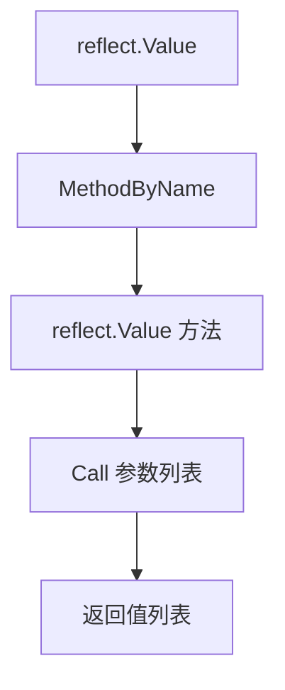
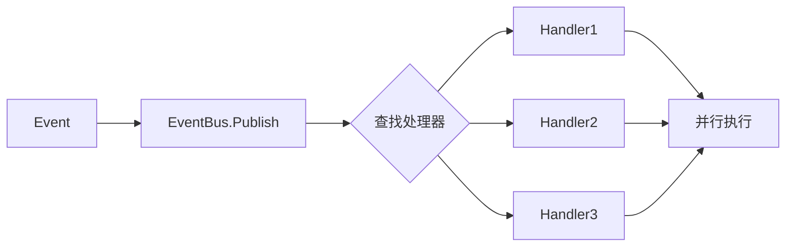

import { Badge } from "@rspress/core/theme";
import { Callout } from "@rspress/core/theme-original";

# Dynamic Calls

<Badge text="高级" type="danger" /> <Badge text="Go 1.0+" type="info" />

反射允许在运行时动态调用方法和函数，这是构建通用框架和工具的核心能力。

## 动态方法调用

### 基础方法调用

```go
package main

import (
    "fmt"
    "reflect"
)

type Calculator struct {
    name string
}

func (c Calculator) Add(a, b int) int {
    return a + b
}

func (c Calculator) Subtract(a, b int) int {
    return a - b
}

func (c *Calculator) SetName(name string) {
    c.name = name
}

func main() {
    calc := Calculator{}

    // 获取方法
    v := reflect.ValueOf(calc)
    addMethod := v.MethodByName("Add")

    // 准备参数
    args := []reflect.Value{
        reflect.ValueOf(10),
        reflect.ValueOf(20),
    }

    // 调用方法
    results := addMethod.Call(args)

    // 获取返回值
    if len(results) > 0 {
        fmt.Println("10 + 20 =", results[0].Int())  // 30
    }

    // 调用 Subtract
    subMethod := v.MethodByName("Subtract")
    results = subMethod.Call([]reflect.Value{
        reflect.ValueOf(50),
        reflect.ValueOf(20),
    })
    fmt.Println("50 - 20 =", results[0].Int())  // 30

    // 调用指针接收者方法
    ptrV := reflect.ValueOf(&calc)
    setNameMethod := ptrV.MethodByName("SetName")
    setNameMethod.Call([]reflect.Value{
        reflect.ValueOf("MyCalc"),
    })
}
```



### 可变参数方法调用

```go
package main

import (
    "fmt"
    "reflect"
)

type Summer struct{}

func (s Summer) Sum(nums ...int) int {
    total := 0
    for _, n := range nums {
        total += n
    }
    return total
}

func main() {
    summer := Summer{}
    v := reflect.ValueOf(summer)

    // 方法 1: 传递切片
    sumMethod := v.MethodByName("Sum")
    sliceValue := reflect.ValueOf([]int{1, 2, 3, 4, 5})

    // 对于可变参数，需要创建切片值的切片
    results := sumMethod.Call([]reflect.Value{sliceValue})
    fmt.Println("Sum(1,2,3,4,5) =", results[0].Int())  // 15

    // 方法 2: 使用 CallSlice
    results = sumMethod.CallSlice([]reflect.Value{sliceValue})
    fmt.Println("SumSlice =", results[0].Int())  // 15
}
```

### 返回多个值的方法

```go
package main

import (
    "fmt"
    "reflect"
)

type Divider struct{}

func (d Divider) Divide(a, b int) (int, int) {
    quotient := a / b
    remainder := a % b
    return quotient, remainder
}

func main() {
    divider := Divider{}
    v := reflect.ValueOf(divider)

    divideMethod := v.MethodByName("Divide")
    results := divideMethod.Call([]reflect.Value{
        reflect.ValueOf(17),
        reflect.ValueOf(5),
    })

    // 多个返回值
    quotient := results[0].Int()
    remainder := results[1].Int()

    fmt.Printf("17 / 5 = %d, remainder %d\n", quotient, remainder)
    // 17 / 5 = 3, remainder 2
}
```

## 动态函数调用

### 基础函数调用

```go
package main

import (
    "fmt"
    "reflect"
)

func Add(a, b int) int {
    return a + b
}

func Greet(name string) string {
    return "Hello, " + name
}

func main() {
    // 获取函数值
    addFn := reflect.ValueOf(Add)

    // 调用函数
    results := addFn.Call([]reflect.Value{
        reflect.ValueOf(10),
        reflect.ValueOf(20),
    })

    fmt.Println("Add(10, 20) =", results[0].Int())  // 30

    // 无参数函数
    getPi := reflect.ValueOf(func() float64 {
        return 3.14159
    })
    results = getPi.Call(nil)
    fmt.Println("Pi =", results[0].Float())  // 3.14159
}
```

### 使用 CallSlice

```go
package main

import (
    "fmt"
    "reflect"
)

func Sum(nums ...int) int {
    total := 0
    for _, n := range nums {
        total += n
    }
    return total
}

func PrintAll(args ...any) {
    for _, arg := range args {
        fmt.Println(arg)
    }
}

func main() {
    // CallSlice 专门用于可变参数函数
    sumFn := reflect.ValueOf(Sum)
    nums := reflect.ValueOf([]int{1, 2, 3, 4, 5})

    results := sumFn.CallSlice([]reflect.Value{nums})
    fmt.Println("Sum =", results[0].Int())  // 15

    // 使用接口的可变参数
    printFn := reflect.ValueOf(PrintAll)
    args := []reflect.Value{
        reflect.ValueOf("Hello"),
        reflect.ValueOf(42),
        reflect.ValueOf(3.14),
    }
    printFn.Call(args)
}
```

## 接口方法的动态调用

```go
package main

import (
    "fmt"
    "reflect"
)

type Stringer interface {
    String() string
}

type Person struct {
    Name string
}

func (p Person) String() string {
    return "Person: " + p.Name
}

func PrintString(s Stringer) {
    fmt.Println(s.String())
}

func main() {
    person := Person{Name: "Alice"}

    // 通过反射获取接口方法
    stringerType := reflect.TypeOf((*Stringer)(nil)).Elem()
    personValue := reflect.ValueOf(person)

    // 检查是否实现接口
    if personValue.Type().Implements(stringerType) {
        // 获取方法
        method := personValue.MethodByName("String")
        results := method.Call(nil)
        fmt.Println("Via reflection:", results[0].String())
        // Via reflection: Person: Alice
    }
}
```

## 通用调用框架

### 简易 RPC 框架

```go
package main

import (
    "encoding/json"
    "fmt"
    "reflect"
)

// RPC 框架
type Service struct{}

func (s *Service) Add(a, b int) int {
    return a + b
}

func (s *Service) Subtract(a, b int) int {
    return a - b
}

func (s *Service) Multiply(a, b int) int {
    return a * b
}

// RPC 请求
type RPCRequest struct {
    Method string          `json:"method"`
    Args   []json.RawMessage `json:"args"`
}

// RPC 响应
type RPCResponse struct {
    Result any    `json:"result"`
    Error  string `json:"error,omitempty"`
}

// RPC 服务器
type RPCServer struct {
    services map[string]any
}

func NewRPCServer() *RPCServer {
    return &RPCServer{
        services: make(map[string]any),
    }
}

func (s *RPCServer) Register(name string, service any) {
    s.services[name] = service
}

func (s *RPCServer) Call(req RPCRequest) RPCResponse {
    // 解析服务名和方法名
    // 简化版：假设格式 "service.method"
    var serviceName, methodName string
    fmt.Sscanf(req.Method, "%[^.].%s", &serviceName, &methodName)

    service, ok := s.services[serviceName]
    if !ok {
        return RPCResponse{Error: "service not found"}
    }

    // 获取方法
    value := reflect.ValueOf(service)
    method := value.MethodByName(methodName)
    if !method.IsValid() {
        return RPCResponse{Error: "method not found"}
    }

    // 获取方法类型
    methodType := value.Type().MethodByName(methodName)
    if !methodType.IsValid() {
        return RPCResponse{Error: "method type not found"}
    }

    // 准备参数
    args := make([]reflect.Value, methodType.Type.NumIn())
    for i := 0; i < methodType.Type.NumIn(); i++ {
        argType := methodType.Type.In(i)
        argValue := reflect.New(argType).Elem()

        // 从 JSON 解析参数
        if err := json.Unmarshal(req.Args[i], argValue.Addr().Interface()); err != nil {
            return RPCResponse{Error: fmt.Sprintf("arg %d parse error: %v", i, err)}
        }

        args[i] = argValue
    }

    // 调用方法
    results := method.Call(args)

    // 处理返回值
    if len(results) == 0 {
        return RPCResponse{Result: nil}
    }

    // 假设只有一个返回值
    return RPCResponse{Result: results[0].Interface()}
}

func main() {
    // 创建 RPC 服务器
    server := NewRPCServer()
    server.Register("service", &Service{})

    // 调用 Add
    req := RPCRequest{
        Method: "service.Add",
        Args: []json.RawMessage{
            json.RawMessage(`10`),
            json.RawMessage(`20`),
        },
    }

    resp := server.Call(req)
    fmt.Printf("Add: %+v\n", resp)  // Add: {Result:30 Error:}

    // 调用 Multiply
    req = RPCRequest{
        Method: "service.Multiply",
        Args: []json.RawMessage{
            json.RawMessage(`5`),
            json.RawMessage(`6`),
        },
    }

    resp = server.Call(req)
    fmt.Printf("Multiply: %+v\n", resp)  // Multiply: {Result:30 Error:}
}
```

### 事件处理器

```go
package main

import (
    "fmt"
    "reflect"
    "sync"
)

// 事件
type Event struct {
    Name string
    Data any
}

// 事件处理器类型
type EventHandler func(Event)

// 事件总线
type EventBus struct {
    mu      sync.RWMutex
    handlers map[string][]reflect.Value
}

func NewEventBus() *EventBus {
    return &EventBus{
        handlers: make(map[string][]reflect.Value),
    }
}

func (eb *EventBus) Subscribe(eventName string, handler any) {
    eb.mu.Lock()
    defer eb.mu.Unlock()

    v := reflect.ValueOf(handler)
    if v.Kind() != reflect.Func {
        panic("handler must be a function")
    }

    t := v.Type()
    if t.NumIn() != 1 || t.In(0) != reflect.TypeOf(Event{}) {
        panic("handler must accept exactly one Event parameter")
    }

    eb.handlers[eventName] = append(eb.handlers[eventName], v)
}

func (eb *EventBus) Publish(event Event) {
    eb.mu.RLock()
    handlers := eb.handlers[event.Name]
    eb.mu.RUnlock()

    for _, handler := range handlers {
        go handler.Call([]reflect.Value{reflect.ValueOf(event)})
    }
}

func main() {
    bus := NewEventBus()

    // 订阅事件
    bus.Subscribe("user.created", func(e Event) {
        fmt.Printf("[Handler1] User created: %+v\n", e.Data)
    })

    bus.Subscribe("user.created", func(e Event) {
        fmt.Printf("[Handler2] Sending welcome email to: %+v\n", e.Data)
    })

    bus.Subscribe("user.deleted", func(e Event) {
        fmt.Printf("[Handler] User deleted: %+v\n", e.Data)
    })

    // 发布事件
    bus.Publish(Event{
        Name: "user.created",
        Data: map[string]any{"name": "Alice", "email": "alice@example.com"},
    })

    bus.Publish(Event{
        Name: "user.deleted",
        Data: map[string]any{"name": "Bob"},
    })
}
```



## 性能优化

### 缓存方法信息

```go
package main

import (
    "fmt"
    "reflect"
    "sync"
)

type MethodCache struct {
    mu   sync.RWMutex
    cache map[reflect.Type]map[string]reflect.Method
}

func NewMethodCache() *MethodCache {
    return &MethodCache{
        cache: make(map[reflect.Type]map[string]reflect.Method),
    }
}

func (mc *MethodCache) GetMethod(t reflect.Type, name string) (reflect.Method, bool) {
    // 读缓存
    mc.mu.RLock()
    if methods, ok := mc.cache[t]; ok {
        if method, ok := methods[name]; ok {
            mc.mu.RUnlock()
            return method, true
        }
    }
    mc.mu.RUnlock()

    // 写缓存
    mc.mu.Lock()
    defer mc.mu.Unlock()

    // 双重检查
    if methods, ok := mc.cache[t]; ok {
        if method, ok := methods[name]; ok {
            return method, true
        }
    } else {
        mc.cache[t] = make(map[string]reflect.Method)
    }

    // 查找方法
    method, ok := t.MethodByName(name)
    if !ok {
        return method, false
    }

    mc.cache[t][name] = method
    return method, true
}

func main() {
    cache := NewMethodCache()

    type Calculator struct{}
    func (c Calculator) Add(a, b int) int { return a + b }

    calc := Calculator{}
    t := reflect.TypeOf(calc)

    // 第一次调用：查找并缓存
    method, ok := cache.GetMethod(t, "Add")
    if ok {
        fmt.Println("Found method:", method.Name)  // Found method: Add
    }

    // 第二次调用：从缓存读取
    method, ok = cache.GetMethod(t, "Add")
    if ok {
        fmt.Println("Found method:", method.Name)  // Found method: Add
    }
}
```

### 使用代码生成替代反射

```go
//go:generate go run github.com/example/codegen

// 代码生成器可以生成类似这样的代码：
// func Call_Add(obj Calculator, a, b int) int {
//     return obj.Add(a, b)
// }
//
// 这样就避免了反射的开销
```

## 练习

1. **命令调度器**：实现一个根据命令字符串动态调用方法的调度器

<details>
<summary>查看答案</summary>

```go
package main

import (
    "fmt"
    "reflect"
    "strconv"
    "strings"
)

type CommandHandler struct{}

func (h *CommandHandler) Add(args []string) string {
    if len(args) < 2 {
        return "Error: Add requires 2 arguments"
    }
    a, _ := strconv.Atoi(args[0])
    b, _ := strconv.Atoi(args[1])
    return fmt.Sprintf("Result: %d", a + b)
}

func (h *CommandHandler) Greet(args []string) string {
    if len(args) < 1 {
        return "Hello, World!"
    }
    return fmt.Sprintf("Hello, %s!", args[0])
}

func (h *CommandHandler) Help(args []string) string {
    return `Available commands:
- Add <a> <b>   : Add two numbers
- Greet [name]  : Greet someone
- Help          : Show this help`
}

type CommandDispatcher struct {
    handler reflect.Value
}

func NewCommandDispatcher(handler any) *CommandDispatcher {
    return &CommandDispatcher{
        handler: reflect.ValueOf(handler),
    }
}

func (d *CommandDispatcher) Dispatch(input string) string {
    parts := strings.Fields(input)
    if len(parts) == 0 {
        return "Error: empty command"
    }

    command := parts[0]
    var args []string
    if len(parts) > 1 {
        args = parts[1:]
    }

    // 查找方法（首字母大写）
    methodName := strings.ToUpper(command[:1]) + command[1:]
    method := d.handler.MethodByName(methodName)
    if !method.IsValid() {
        return fmt.Sprintf("Error: unknown command '%s'", command)
    }

    // 准备参数
    methodType := d.handler.Type().MethodByName(methodName)
    argCount := methodType.Type.NumIn()

    var callArgs []reflect.Value
    if argCount == 1 {
        // 方法接受 []string 参数
        argsValue := reflect.ValueOf(args)
        callArgs = []reflect.Value{argsValue}
    } else {
        // 方法不接受参数
        callArgs = []reflect.Value{}
    }

    // 调用方法
    results := method.Call(callArgs)
    if len(results) == 0 {
        return ""
    }

    return results[0].String()
}

func (d *CommandDispatcher) Run() {
    fmt.Println("Command Dispatcher (type 'exit' to quit)")
    fmt.Println("Type 'Help' for available commands")
    fmt.Println()

    for {
        fmt.Print("> ")
        var input string
        fmt.Scanln(&input)

        if input == "exit" {
            break
        }

        if input == "" {
            continue
        }

        output := d.Dispatch(input)
        fmt.Println(output)
        fmt.Println()
    }
}

func main() {
    handler := &CommandHandler{}
    dispatcher := NewCommandDispatcher(handler)

    // 示例调用
    fmt.Println(dispatcher.Dispatch("Add 10 20"))
    fmt.Println(dispatcher.Dispatch("Greet Alice"))
    fmt.Println(dispatcher.Dispatch("Help"))

    // 或者交互式运行
    // dispatcher.Run()
}
```

**解释**：通过反射根据命令字符串动态调用对应的方法，支持参数传递。

</details>

---

[← 结构体标签](./struct-tags.mdx) | [最佳实践 →](./best-practices.mdx)
