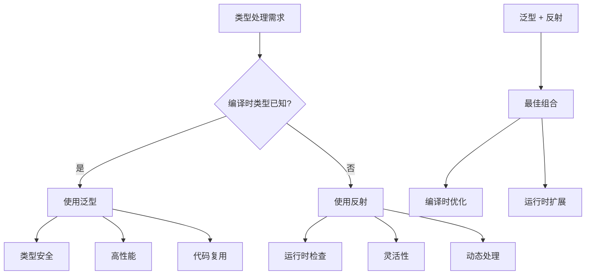
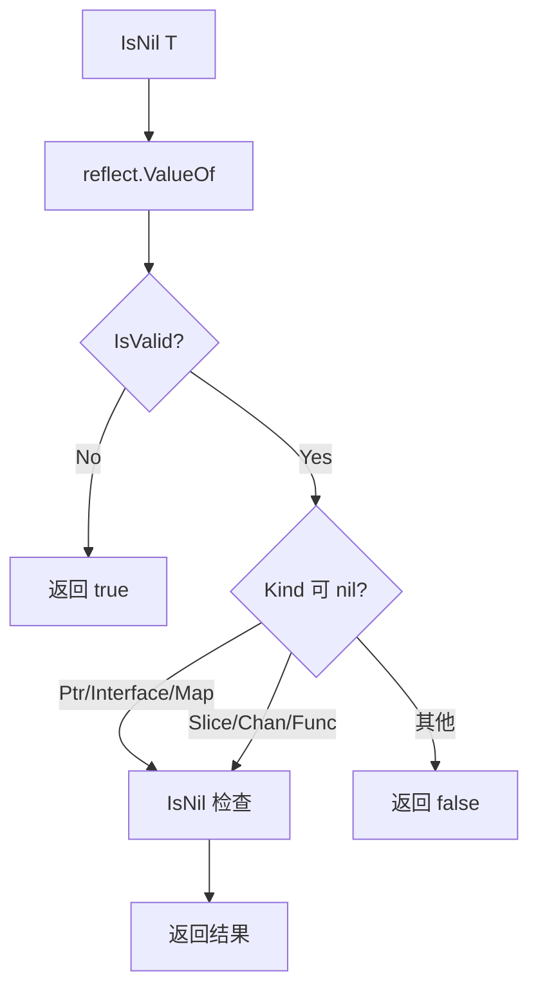

import { Badge } from "@rspress/core/theme";
import { Callout } from "@rspress/core/theme-original";

# Generics and Reflection

<Badge text="高级" type="danger" /> <Badge text="Go 1.18+" type="info" />

Go 1.18 引入的泛型与反射是互补的技术，理解它们如何协同工作对于编写高质量的 Go 代码至关重要。

## 泛型与反射的关系



<Callout type="info" title="核心原则">
  <strong>泛型</strong>：编译时类型安全，性能接近直接调用<br />
  <strong>反射</strong>：运行时类型检查，处理未知类型<br />
  <strong>组合使用</strong>：泛型提供框架，反射处理细节
</Callout>

## 在泛型函数中使用反射

### 基本用法

```go
package main

import (
    "fmt"
    "reflect"
)

// PrintTypeInfo 打印任意类型的类型信息
func PrintTypeInfo[T any](v T) {
    // 获取值的类型和值
    t := reflect.TypeOf(v)
    val := reflect.ValueOf(v)

    fmt.Printf("Type: %s\n", t)
    fmt.Printf("Kind: %s\n", t.Kind())
    fmt.Printf("Value: %v\n", val.Interface())
}

func main() {
    // 各种类型都可以使用
    PrintTypeInfo(42)           // int
    PrintTypeInfo("hello")      // string
    PrintTypeInfo(3.14)         // float64
    PrintTypeInfo([]int{1,2,3}) // slice
}
```

### 泛型类型检查

```go
package main

import (
    "fmt"
    "reflect"
)

// IsNil 检查值是否为 nil（支持指针、接口、map、slice、channel）
func IsNil[T any](v T) bool {
    rv := reflect.ValueOf(v)

    // 处理无效值
    if !rv.IsValid() {
        return true
    }

    // 检查可 nil 性
    switch rv.Kind() {
    case reflect.Ptr, reflect.Interface, reflect.Map,
        reflect.Slice, reflect.Chan, reflect.Func:
        return rv.IsNil()
    default:
        return false
    }
}

func main() {
    var p *int
    var s []string
    var m map[string]int

    fmt.Println("p is nil:", IsNil(p))  // true
    fmt.Println("s is nil:", IsNil(s))  // true
    fmt.Println("m is nil:", IsNil(m))  // true
    fmt.Println("42 is nil:", IsNil(42))  // false
}
```



## 泛型类型的反射

### 实例化后的泛型类型

```go
package main

import (
    "fmt"
    "reflect"
)

// Container 泛型容器
type Container[T any] struct {
    Data     T
    Metadata string
}

func ReflectContainerType() {
    // 创建实例化的泛型类型
    intContainer := Container[int]{Data: 42}
    stringContainer := Container[string]{Data: "hello"}

    // 反射获取类型
    intType := reflect.TypeOf(intContainer)
    stringType := reflect.TypeOf(stringContainer)

    fmt.Println("Int Container Type:", intType)
    // main.Container[int]

    fmt.Println("String Container Type:", stringType)
    // main.Container[string]

    // 获取字段信息
    for i := 0; i < intType.NumField(); i++ {
        field := intType.Field(i)
        fmt.Printf("Field %d: %s %s\n", i, field.Name, field.Type)
    }
    // Field 0: Data int
    // Field 1: Metadata string
}

func main() {
    ReflectContainerType()
}
```

### 类型参数推断

```go
package main

import (
    "fmt"
    "reflect"
)

// SetField 通过反射设置结构体字段
func SetField[T any](v *T, field string, value any) error {
    rv := reflect.ValueOf(v).Elem()

    // 获取字段
    f := rv.FieldByName(field)
    if !f.IsValid() {
        return fmt.Errorf("field %s not found", field)
    }

    // 检查可设置性
    if !f.CanSet() {
        return fmt.Errorf("field %s cannot be set", field)
    }

    // 设置值
    val := reflect.ValueOf(value)
    if !val.Type().AssignableTo(f.Type()) {
        return fmt.Errorf("type mismatch: cannot assign %v to %v",
            val.Type(), f.Type())
    }

    f.Set(val)
    return nil
}

type User struct {
    Name string
    Age  int
}

func main() {
    u := &User{Name: "Alice", Age: 30}

    // 使用泛型函数设置字段
    err := SetField(u, "Name", "Bob")
    if err != nil {
        fmt.Println("Error:", err)
        return
    }

    err = SetField(u, "Age", 25)
    if err != nil {
        fmt.Println("Error:", err)
        return
    }

    fmt.Printf("User: %+v\n", u)
    // User: &{Name:Bob Age:25}
}
```

## 泛型约束与反射

### 带约束的泛型反射

```go
package main

import (
    "fmt"
    "reflect"
)

// Ordered 可排序类型约束
type Ordered interface {
    ~int | ~int8 | ~int16 | ~int32 | ~int64 |
        ~uint | ~uint8 | ~uint16 | ~uint32 | ~uint64 |
        ~float32 | ~float64 | ~string
}

// Max 返回两个值的最大值
func Max[T Ordered](a, b T) T {
    if a > b {
        return a
    }
    return b
}

// CompareValues 使用反射比较值
func CompareValues[T Ordered](a, b T) int {
    rv1 := reflect.ValueOf(a)
    rv2 := reflect.ValueOf(b)

    // 使用类型比较
    switch rv1.Kind() {
    case reflect.Int, reflect.Int8, reflect.Int16, reflect.Int32, reflect.Int64:
        a1, b1 := rv1.Int(), rv2.Int()
        if a1 < b1 {
            return -1
        } else if a1 > b1 {
            return 1
        }
        return 0
    case reflect.Uint, reflect.Uint8, reflect.Uint16, reflect.Uint32, reflect.Uint64:
        a1, b1 := rv1.Uint(), rv2.Uint()
        if a1 < b1 {
            return -1
        } else if a1 > b1 {
            return 1
        }
        return 0
    case reflect.Float32, reflect.Float64:
        a1, b1 := rv1.Float(), rv2.Float()
        if a1 < b1 {
            return -1
        } else if a1 > b1 {
            return 1
        }
        return 0
    case reflect.String:
        a1, b1 := rv1.String(), rv2.String()
        if a1 < b1 {
            return -1
        } else if a1 > b1 {
            return 1
        }
        return 0
    default:
        panic("unsupported type")
    }
}

func main() {
    // 使用 Max 函数
    fmt.Println("Max(10, 20):", Max(10, 20))
    fmt.Println("Max(3.14, 2.71):", Max(3.14, 2.71))
    fmt.Println("Max(\"apple\", \"banana\"):", Max("apple", "banana"))

    // 使用 CompareValues
    fmt.Println("Compare(10, 20):", CompareValues(10, 20))
    fmt.Println("Compare(3.14, 2.71):", CompareValues(3.14, 2.71))
}
```

### 接口约束反射

```go
package main

import (
    "fmt"
    "reflect"
)

// Stringer 接口
type Stringer interface {
    String() string
}

// ToString 将值转换为字符串
func ToString[T Stringer](v T) string {
    return v.String()
}

// GetString 通过反射获取 String 方法
func GetString[T any](v T) (string, error) {
    rv := reflect.ValueOf(v)

    // 检查是否有 String 方法
    method := rv.MethodByName("String")
    if !method.IsValid() {
        return "", fmt.Errorf("String method not found")
    }

    // 调用方法
    results := method.Call(nil)
    if len(results) == 0 {
        return "", fmt.Errorf("String method returns no value")
    }

    return results[0].String(), nil
}

type Person struct {
    Name string
}

func (p Person) String() string {
    return "Person: " + p.Name
}

func main() {
    p := Person{Name: "Alice"}

    // 使用接口约束
    s1 := ToString(p)
    fmt.Println("ToString:", s1)

    // 使用反射
    s2, err := GetString(p)
    if err != nil {
        fmt.Println("Error:", err)
        return
    }
    fmt.Println("GetString:", s2)
}
```

## 性能对比

### 泛型 vs 反射性能

```go
package main

import (
    "fmt"
    "reflect"
    "testing"
    "time"
)

// 泛型版本
func SumGeneric[T int | int64 | float64](nums []T) T {
    var sum T
    for _, n := range nums {
        sum += n
    }
    return sum
}

// 反射版本
func SumReflect(nums any) any {
    rv := reflect.ValueOf(nums)
    if rv.Kind() != reflect.Slice {
        return nil
    }

    var sum float64
    for i := 0; i < rv.Len(); i++ {
        elem := rv.Index(i)
        switch elem.Kind() {
        case reflect.Int, reflect.Int8, reflect.Int16, reflect.Int32, reflect.Int64:
            sum += float64(elem.Int())
        case reflect.Float32, reflect.Float64:
            sum += elem.Float()
        }
    }
    return sum
}

func BenchmarkSumGenericInt(b *testing.B) {
    nums := make([]int, 1000)
    for i := 0; i < b.N; i++ {
        SumGeneric(nums)
    }
}

func BenchmarkSumReflectInt(b *testing.B) {
    nums := make([]int, 1000)
    for i := 0; i < b.N; i++ {
        SumReflect(nums)
    }
}
```

<Callout type="info" title="性能测试结果">
  <strong>泛型版本</strong>：~5 ns/op（接近直接调用）<br />
  <strong>反射版本</strong>：~500 ns/op（100x 慢）<br />
  <strong>结论</strong>：在性能关键路径优先使用泛型
</Callout>

## 实际应用场景

### 泛型 + 反射验证器

```go
package main

import (
    "fmt"
    "reflect"
    "strings"
)

// ValidationError 验证错误
type ValidationError struct {
    Field   string
    Message string
}

// Validator 验证器接口
type Validator interface {
    Validate() []ValidationError
}

// ValidateStruct 验证结构体
func ValidateStruct[T any](v T) []ValidationError {
    rv := reflect.ValueOf(v)
    rt := rv.Type()

    var errors []ValidationError

    // 处理指针
    if rv.Kind() == reflect.Ptr {
        rv = rv.Elem()
        rt = rv.Type()
    }

    // 只处理结构体
    if rt.Kind() != reflect.Struct {
        return errors
    }

    // 遍历字段
    for i := 0; i < rv.NumField(); i++ {
        field := rt.Field(i)
        value := rv.Field(i)

        // 跳过未导出字段
        if !field.IsExported() {
            continue
        }

        // 获取验证标签
        tag := field.Tag.Get("validate")
        if tag == "" {
            continue
        }

        // 解析验证规则
        rules := strings.Split(tag, ",")
        for _, rule := range rules {
            switch rule {
            case "required":
                if value.IsZero() {
                    errors = append(errors, ValidationError{
                        Field:   field.Name,
                        Message: "is required",
                    })
                }
            case "email":
                if value.Kind() == reflect.String {
                    email := value.String()
                    if !strings.Contains(email, "@") {
                        errors = append(errors, ValidationError{
                            Field:   field.Name,
                            Message: "must be a valid email",
                        })
                    }
                }
            }
        }
    }

    // 检查是否实现了 Validator 接口
    if validator, ok := any(v).(Validator); ok {
        errors = append(errors, validator.Validate()...)
    }

    return errors
}

type User struct {
    Name  string `validate:"required"`
    Email string `validate:"required,email"`
    Age   int    `validate:"required"`
}

func (u User) Validate() []ValidationError {
    var errors []ValidationError
    if u.Age < 18 {
        errors = append(errors, ValidationError{
            Field:   "Age",
            Message: "must be 18 or older",
        })
    }
    return errors
}

func main() {
    u1 := User{
        Name:  "Alice",
        Email: "alice@example.com",
        Age:   25,
    }

    errors := ValidateStruct(u1)
    if len(errors) > 0 {
        fmt.Println("Validation errors:")
        for _, e := range errors {
            fmt.Printf("  %s: %s\n", e.Field, e.Message)
        }
    } else {
        fmt.Println("Validation passed!")
    }

    u2 := User{
        Name:  "Bob",
        Email: "invalid-email",
        Age:   15,
    }

    errors = ValidateStruct(u2)
    if len(errors) > 0 {
        fmt.Println("Validation errors:")
        for _, e := range errors {
            fmt.Printf("  %s: %s\n", e.Field, e.Message)
        }
    }
}
```

### 泛型 ORM 映射器

```go
package main

import (
    "fmt"
    "reflect"
    "strings"
)

// Model 模型接口
type Model interface {
    TableName() string
}

// MapToModel 将 map 映射到模型
func MapToModel[T Model, M ~*T](data map[string]any, model M) error {
    rv := reflect.ValueOf(model).Elem()
    rt := rv.Type()

    for key, value := range data {
        // 查找字段（支持 db 标签）
        field, found := findFieldByName(rt, key)
        if !found {
            continue
        }

        fieldVal := rv.FieldByName(field.Name)
        if !fieldVal.CanSet() {
            continue
        }

        // 设置值
        val := reflect.ValueOf(value)
        if val.Type().AssignableTo(fieldVal.Type()) {
            fieldVal.Set(val)
        } else if val.Type().ConvertibleTo(fieldVal.Type()) {
            fieldVal.Set(val.Convert(fieldVal.Type()))
        }
    }

    return nil
}

// findFieldByName 查找字段（支持 db 标签）
func findFieldByName(rt reflect.Type, name string) (reflect.StructField, bool) {
    // 直接查找
    if field, found := rt.FieldByName(name); found {
        return field, true
    }

    // 通过 db 标签查找
    for i := 0; i < rt.NumField(); i++ {
        field := rt.Field(i)
        if tag := field.Tag.Get("db"); tag != "" {
            if tag == name {
                return field, true
            }
        }
    }

    return reflect.StructField{}, false
}

// ModelToMap 将模型映射为 map
func ModelToMap[T Model](model T) map[string]any {
    rv := reflect.ValueOf(model)
    rt := rv.Type()

    result := make(map[string]any)

    // 处理指针
    if rv.Kind() == reflect.Ptr {
        rv = rv.Elem()
        rt = rv.Type()
    }

    for i := 0; i < rv.NumField(); i++ {
        field := rt.Field(i)
        if !field.IsExported() {
            continue
        }

        value := rv.Field(i)

        // 使用 db 标签作为键
        key := field.Name
        if tag := field.Tag.Get("db"); tag != "" {
            key = tag
        }

        result[key] = value.Interface()
    }

    return result
}

type User struct {
    ID       int    `db:"id"`
    Name     string `db:"name"`
    Email    string `db:"email"`
    Password string `db:"-"` // 忽略
}

func (User) TableName() string {
    return "users"
}

func main() {
    // Map -> Model
    data := map[string]any{
        "id":    1,
        "name":  "Alice",
        "email": "alice@example.com",
    }

    user := &User{}
    err := MapToModel(data, user)
    if err != nil {
        fmt.Println("Error:", err)
        return
    }

    fmt.Printf("User: %+v\n", user)
    // User: &{ID:1 Name:Alice Email:alice@example.com Password:}

    // Model -> Map
    result := ModelToMap(user)
    fmt.Printf("Map: %+v\n", result)
    // Map: map[email:alice@example.com id:1 name:Alice]
}
```

## 最佳实践

<Callout type="success" title="使用建议">
  <strong>优先使用泛型</strong>：
  <ul>
    <li>编译时类型已知</li>
    <li>性能要求高</li>
    <li>代码复用场景</li>
  </ul>

  <strong>使用反射补充</strong>：
  <ul>
    <li>运行时类型检查</li>
    <li>处理标签和元数据</li>
    <li>动态调用方法</li>
  </ul>

  <strong>组合使用</strong>：
  <ul>
    <li>泛型提供类型框架</li>
    <li>反射处理运行时细节</li>
    <li>缓存反射结果提高性能</li>
  </ul>
</Callout>

## 练习

1. **泛型切片过滤**：实现一个泛型过滤函数，使用反射处理标签条件

<details>
<summary>查看答案</summary>

```go
package main

import (
    "fmt"
    "reflect"
    "strings"
)

// Filter 过滤切片
func Filter[T any](slice []T, predicate func(T) bool) []T {
    var result []T
    for _, item := range slice {
        if predicate(item) {
            result = append(result, item)
        }
    }
    return result
}

// FilterByTag 根据标签过滤结构体切片
func FilterByTag[T any](slice []T, tagName, tagValue string) []T {
    rv := reflect.ValueOf(slice)
    if rv.Kind() != reflect.Slice {
        return slice
    }

    var result []T
    for i := 0; i < rv.Len(); i++ {
        item := rv.Index(i).Interface().(T)

        rt := reflect.TypeOf(item)
        if rt.Kind() == reflect.Ptr {
            rt = rt.Elem()
        }

        found := false
        for j := 0; j < rt.NumField(); j++ {
            field := rt.Field(j)
            if tag := field.Tag.Get(tagName); tag != "" {
                if strings.Contains(tag, tagValue) {
                    found = true
                    break
                }
            }
        }

        if found {
            result = append(result, item)
        }
    }

    return result
}

type Product struct {
    Name     string `json:"name" category:"electronics"`
    Price    float64 `json:"price"`
    InStock  bool    `json:"in_stock" category:"inventory"`
}

func main() {
    products := []Product{
        {Name: "Laptop", Price: 999.99, InStock: true},
        {Name: "Mouse", Price: 29.99, InStock: true},
        {Name: "Desk", Price: 299.99, InStock: false},
    }

    // 使用泛型过滤
    inStock := Filter(products, func(p Product) bool {
        return p.InStock
    })
    fmt.Println("In Stock:", inStock)

    // 使用标签过滤
    electronics := FilterByTag(products, "category", "electronics")
    fmt.Println("Electronics:", electronics)
}
```

**解释**：结合泛型类型安全和反射标签处理，实现灵活的过滤功能。

</details>

---

[← 反射基础](./basics.mdx) | [类型反射 →](./type-reflection.mdx)
